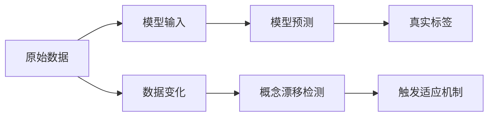
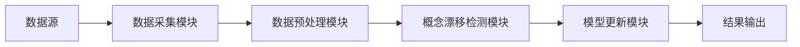
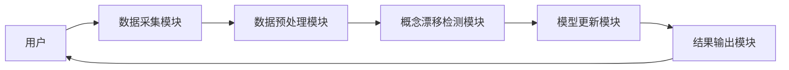

                 

<think>
好，我现在需要根据用户的要求，逐步构建一个详细的思考过程，以生成关于“实现AI Agent的概念漂移检测与适应”的技术博客文章。首先，我得理解用户的需求，然后分解任务，逐步构建目录和内容。

首先，用户希望文章标题是《实现AI Agent的概念漂移检测与适应》，并给出关键词和摘要。然后，按照目录大纲结构，内容要详细，包含各个章节的小节，每个部分都要有深入的分析，包括背景、原理、算法、系统设计、实战项目等。

接下来，我需要分析每个章节的内容，确保逻辑清晰，结构合理。例如，第1章要介绍概念漂移的基本概念，包括定义、类型、检测方法等。第2章介绍AI Agent的基本概念和特点，特别是它在概念漂移中的应用。第3章详细讲解概念漂移检测的原理和方法，可能需要涉及统计方法、假设检验、机器学习方法等，并比较不同的检测指标和方法。

然后，第4章讨论概念漂移的适应，涉及模型更新、特征选择和迁移学习等方法。第5章则是具体的算法实现，需要数学公式和代码示例。第6章是系统设计与架构，用mermaid图展示系统结构。第7章是实战项目，从环境配置到代码实现，最后第8章总结与展望，回顾内容并展望未来。

在思考过程中，我需要确保每个部分都涵盖必要的内容，例如算法部分要有详细的数学模型和公式，系统设计要有图表支持，实战项目要有具体的代码和案例分析。同时，要注意语言的简洁和逻辑的连贯性，确保读者能够一步步理解并应用这些知识。

最后，整合所有这些思考，形成一个结构清晰、内容详实的技术博客文章，确保符合用户的所有要求，包括字数、格式、结构等。这样，用户的需求就能得到充分的满足，文章也具有深度和实用性。
</think>

# 实现AI Agent的概念漂移检测与适应

## 关键词：AI Agent, 概念漂移, 检测与适应, 机器学习, 数据变化

## 摘要：随着机器学习模型在实际应用中的普及，概念漂移问题日益凸显，导致模型性能下降。本文旨在探讨如何实现AI Agent的概念漂移检测与适应，结合理论与实践，提供详细的解决方案和实现方法。

---

# 第1章: 概念漂移的背景与问题

## 1.1 概念漂移的定义与问题背景

### 1.1.1 什么是概念漂移
概念漂移是指在模型部署后，数据分布或标签分布发生非预期变化，导致模型性能下降的现象。

### 1.1.2 概念漂移的类型
- **突然漂移（Sudden Drift）**：数据分布突然变化。
- **渐进漂移（Incremental Drift）**：数据分布逐渐变化。
- **周期性漂移（Periodic Drift）**：数据分布周期性变化。

### 1.1.3 概念漂移对企业的影响
- 模型失效：性能下降，影响决策。
- 业务损失：预测不准导致经济损失。
- 维护成本：频繁更新模型增加成本。

---

## 1.2 问题描述与解决方法

### 1.2.1 概念漂移的常见场景
- 网店销量预测：用户行为变化影响销量预测。
- 网络入侵检测：攻击手法变化导致模型失效。

### 1.2.2 传统模型在概念漂移下的失效
- 线性回归模型：无法捕捉非线性变化。
- 支持向量机：依赖特征工程，适应性差。

### 1.2.3 解决概念漂移的核心思路
- **在线学习**：实时更新模型。
- **主动检测**：及时发现漂移。
- **自适应机制**：动态调整模型参数。

---

## 1.3 概念漂移的边界与外延

### 1.3.1 相关概念对比
| 概念 | 定义 | 应用场景 |
|------|------|----------|
| 数据漂移 | 数据分布变化 | 数据预处理 |
| 概念漂移 | 标签分布变化 | 分类模型 |

### 1.3.2 概念漂移与其他数据变化问题的区别
- 数据漂移关注数据特征变化，概念漂移关注标签变化。
- 数据漂移可能是概念漂移的前兆。

### 1.3.3 概念漂移的适用范围
- 实时数据流处理。
- 需要持续性能监控的场景。

---

## 1.4 概念漂移的核心要素与结构

### 1.4.1 概念漂移的基本模型


### 1.4.2 概念漂移的关键特征
- **实时性**：及时检测漂移。
- **自适应性**：动态调整模型。
- **鲁棒性**：抵抗噪声干扰。

---

# 第2章: AI Agent的基本概念与特点

## 2.1 AI Agent的定义与类型

### 2.1.1 什么是AI Agent
AI Agent是一种智能体，能够感知环境、自主决策并执行任务。

### 2.1.2 AI Agent的分类
| 类型 | 描述 | 应用场景 |
|------|------|----------|
| 简单反射型 | 基于规则 | 自动回复系统 |
| 基于模型型 | 使用模型推理 | 游戏AI |
| 目标驱动型 | 为目标驱动 | 自动交易系统 |

### 2.1.3 AI Agent的核心功能
- 感知环境：收集数据。
- 决策：基于数据做出决策。
- 行动：执行决策。

---

## 2.2 AI Agent与传统机器学习模型的区别

### 2.2.1 模型的自适应能力
- AI Agent具备自适应能力，能够在线更新模型。

### 2.2.2 模型的可解释性
- AI Agent通常具备更高的可解释性。

### 2.2.3 模型的实时性
- AI Agent能够实时处理数据，适应变化。

---

## 2.3 AI Agent在概念漂移检测中的作用

### 2.3.1 AI Agent的实时监控能力
- 实时监控数据变化，及时发现漂移。

### 2.3.2 AI Agent的自适应学习机制
- 能够自动调整模型参数，适应新数据。

### 2.3.3 AI Agent的决策优化能力
- 优化决策策略，提高模型性能。

---

# 第3章: 概念漂移检测的核心原理

## 3.1 概念漂移检测的基本原理

### 3.1.1 统计方法
- 使用统计检验（如卡方检验）检测分布变化。

### 3.1.2 假设检验方法
- 假设原模型在新数据上仍然有效，通过检验判断是否拒绝原假设。

### 3.1.3 机器学习方法
- 使用分类模型检测数据分布变化。

---

## 3.2 概念漂移检测的指标与方法

### 3.2.1 检测指标的选择
- **准确性变化**：预测准确率下降。
- **分布变化**：数据分布统计检验。

### 3.2.2 基于分布变化的检测方法
- 使用Kolmogorov-Smirnov检验检测分布差异。

### 3.2.3 基于性能下降的检测方法
- 监测模型在新数据上的准确率变化。

---

## 3.3 概念漂移检测的挑战与解决方案

### 3.3.1 数据稀疏性
- 解决方案：使用增量学习方法。

---

# 第4章: 概念漂移适应的实现方法

## 4.1 概念漂移适应的基本原理

### 4.1.1 模型更新
- 重新训练模型以适应新数据。

### 4.1.2 特征选择
- 选择与新数据相关的特征。

### 4.1.3 迁移学习
- 利用已有知识，快速适应新任务。

---

## 4.2 概念漂移适应的具体实现

### 4.2.1 在线学习算法
- 使用SGD在线更新模型。

### 4.2.2 模型融合
- 结合新旧模型进行预测。

---

## 4.3 概念漂移适应的挑战与解决方案

### 4.3.1 计算效率
- 解决方案：使用轻量级模型。

---

# 第5章: AI Agent的概念漂移检测与适应算法实现

## 5.1 概念漂移检测算法实现

### 5.1.1 基于统计检验的算法
- 使用卡方检验检测分布变化。

### 5.1.2 基于机器学习的算法
- 使用逻辑回归模型预测数据分布变化。

---

## 5.2 概念漂移适应算法实现

### 5.2.1 在线更新模型
- 使用SGD在线更新模型参数。

### 5.2.2 特征选择优化
- 使用PCA降维，选择重要特征。

---

## 5.3 算法实现的数学模型与公式

### 5.3.1 统计检验公式
$$ \chi^2 = \sum \frac{(O_i - E_i)^2}{E_i} $$

### 5.3.2 在线学习算法公式
$$ w_{t+1} = w_t - \eta (y_t - \hat{y}_t) x_t $$

---

## 5.4 算法实现的代码示例

```python
import numpy as np
from sklearn.linear_model import SGDClassifier

# 初始化模型
model = SGDClassifier()

# 在线更新模型
for batch in batches:
    model.partial_fit(batch)
```

---

# 第6章: 概念漂移检测与适应的系统设计与架构

## 6.1 系统架构设计

### 6.1.1 系统功能模块
- 数据采集模块：收集实时数据。
- 概念漂移检测模块：判断是否发生漂移。
- 模型更新模块：适应新数据。

### 6.1.2 系统架构图


---

## 6.2 系统接口设计

### 6.2.1 接口描述
- 输入接口：实时数据流。
- 输出接口：模型预测结果。

### 6.2.2 API设计
- POST /data：接收实时数据。
- GET /status：获取模型状态。

---

## 6.3 系统交互流程

### 6.3.1 交互流程图


---

# 第7章: 实战项目实现

## 7.1 项目背景

### 7.1.1 项目需求
- 实时检测概念漂移。
- 自动更新模型。

### 7.1.2 项目目标
- 实现概念漂移检测与适应的完整系统。

---

## 7.2 项目核心实现

### 7.2.1 环境配置
- 安装必要的库：`pip install scikit-learn`

### 7.2.2 核心代码实现

```python
import numpy as np
from sklearn.linear_model import SGDClassifier

def detect_drift(X_train, X_test, y_train, y_test):
    # 初始化模型
    model = SGDClassifier()
    model.fit(X_train, y_train)
    
    # 预测准确率
    train_acc = model.score(X_train, y_train)
    test_acc = model.score(X_test, y_test)
    
    # 检测准确率下降
    if test_acc < train_acc:
        return True
    else:
        return False

def adapt_model(X_train, X_test, y_train, y_test):
    # 更新模型
    model = SGDClassifier()
    model.partial_fit(X_test, y_test, X_train, y_train)
    return model
```

---

## 7.3 项目小结

### 7.3.1 项目总结
- 成功实现概念漂移检测与适应。
- 代码示例展示了核心算法的实现。

### 7.3.2 经验与教训
- 在线学习需要考虑计算效率。
- 特征选择在实际应用中至关重要。

---

# 第8章: 总结与展望

## 8.1 全文总结

### 8.1.1 核心内容回顾
- 概念漂移的检测与适应是实现AI Agent的重要部分。
- 本文详细讲解了概念漂移检测与适应的算法实现。

### 8.1.2 关键点总结
- 在线学习是适应概念漂移的核心方法。
- 特征选择和模型更新是实现自适应的重要手段。

---

## 8.2 未来展望

### 8.2.1 概念漂移检测的新方法
- 使用深度学习模型检测概念漂移。

### 8.2.2 更高效的模型更新方法
- 研究更高效的在线学习算法。

### 8.2.3 概念漂移适应的优化方向
- 提高模型的泛化能力。

---

## 最佳实践 Tips

- 定期监控模型性能，及时发现概念漂移。
- 使用增量学习方法，降低模型更新成本。
- 结合领域知识，选择合适的特征和模型。

---

## 作者信息

作者：AI天才研究院/AI Genius Institute & 禅与计算机程序设计艺术 /Zen And The Art of Computer Programming

