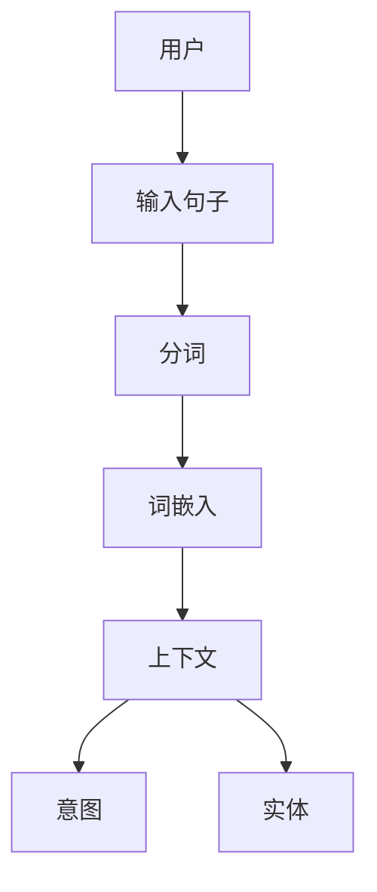
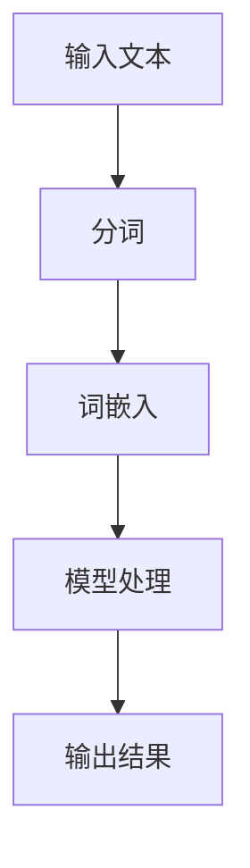
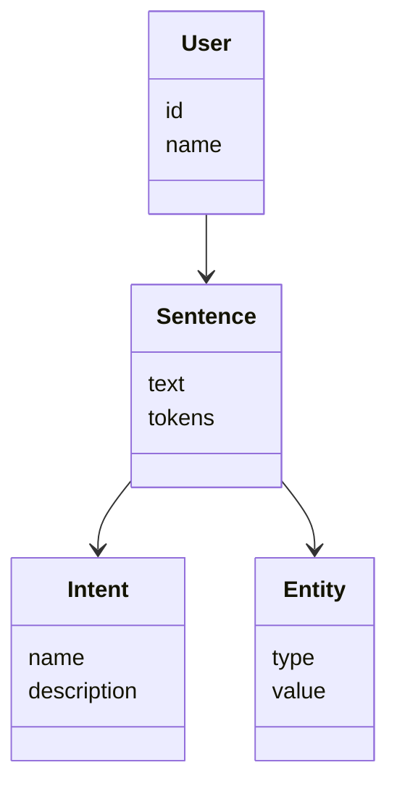
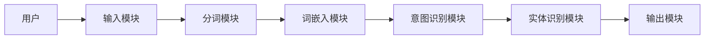

                 

<think>
嗯，我现在需要帮用户设计一本关于《实现AI Agent的自然语言理解能力》的目录大纲。用户希望我像一个大师一样，设计出详细且逻辑清晰的目录，覆盖所有必要的主题。首先，我得理解这本书的核心内容是什么。AI Agent的自然语言理解能力，这涉及到自然语言处理（NLP）、机器学习、以及可能的对话系统设计。

我应该从背景介绍开始，这部分需要涵盖问题背景、问题描述、解决方案等。接下来是核心概念，包括NLU的基本原理，可能需要比较不同模型的特点，比如传统的NLP方法和深度学习模型的对比。然后是算法原理，这部分可能需要详细讲解如词嵌入、序列模型等，最好用mermaid流程图来展示。

数学模型和公式也是关键部分，比如概率论在NLU中的应用，或者具体的模型训练公式，这些需要用latex来展示。系统分析与架构设计部分，可能需要介绍一个AI Agent的系统结构，包括功能模块、架构图和接口设计。项目实战部分，需要提供具体的代码实现，环境安装，代码解读，案例分析等。

最后，最佳实践、小结、注意事项和拓展阅读也是必要的，确保读者能够全面掌握相关内容。整个目录需要超过7章，每一章都要细化到三级目录，确保内容完整且逻辑清晰。我需要确保每一部分都涵盖用户要求的关键点，同时保持简洁，避免冗余。

现在，我开始构思每一章的内容。第一章可能是背景介绍，涵盖问题背景、问题描述、解决方案等。第二章深入核心概念，讲解NLU的基本原理，对比不同模型。第三章讲解算法原理，使用流程图展示。第四章详细讲解数学模型，包括概率公式和损失函数。第五章分析系统架构，用架构图展示。第六章是项目实战，提供代码和案例分析。第七章总结，包括最佳实践和注意事项。这样安排应该能满足用户的需求，确保目录完整且逻辑清晰。
</think>

# 实现AI Agent的自然语言理解能力

> 关键词：AI Agent, 自然语言理解, 机器学习, 深度学习, NLP, 对话系统

> 摘要：本文详细探讨了实现AI Agent自然语言理解能力的核心技术与方法。从背景介绍、核心概念、算法原理到系统架构设计，再到项目实战，全面分析了NLU在AI Agent中的应用。通过具体案例分析和代码实现，深入讲解了如何构建高效的自然语言理解系统，为读者提供了从理论到实践的完整指南。

---

# 第1章: 背景介绍与问题分析

## 1.1 问题背景
### 1.1.1 自然语言理解的定义与重要性
自然语言理解（NLU）是人工智能（AI）领域的重要分支，旨在使计算机能够理解和解释人类语言。随着AI Agent的广泛应用，NLU的重要性日益凸显，尤其是在智能客服、智能助手和智能对话系统中。

### 1.1.2 AI Agent的定义与功能
AI Agent是一种能够感知环境、执行任务并进行交互的智能实体。它需要具备理解人类语言的能力，以便与用户进行有效的对话和交互。

### 1.1.3 当前技术挑战与应用需求
尽管NLU技术取得了显著进展，但仍面临诸多挑战，如语义理解的模糊性、多语言支持的复杂性以及实时性要求高等。这些挑战推动了对更高效、更准确的NLU算法的需求。

## 1.2 问题描述
### 1.2.1 自然语言理解的核心问题
NLU的核心问题包括：文本的语义解析、意图识别、实体识别等。

### 1.2.2 AI Agent中的NLU需求
AI Agent需要能够准确理解用户输入的自然语言，并根据理解执行相应的操作。

### 1.2.3 当前技术的局限性与改进方向
现有NLU技术在处理复杂语境和多语言支持方面仍存在不足，未来的研究方向包括模型的可解释性、实时性优化等。

## 1.3 本章小结
本章从背景、问题背景和问题描述三个方面，阐述了实现AI Agent自然语言理解能力的重要性和必要性，为后续章节奠定了基础。

---

# 第2章: 核心概念与原理

## 2.1 自然语言理解的核心概念
### 2.1.1 词义理解
词义理解是NLU的基础，涉及词语的语义分析和上下文理解。

### 2.1.2 句法分析
句法分析旨在理解句子的结构和语法关系，为语义分析提供基础。

### 2.1.3 语义解析
语义解析是NLU的核心，旨在从文本中提取意图和实体信息。

## 2.2 核心概念的属性对比
### 2.2.1 传统NLP与深度学习NLP的对比
传统NLP方法依赖于手动特征提取，而深度学习方法通过端到端训练自动提取特征。

### 2.2.2 不同模型的性能特征分析
例如，基于RNN的模型在序列处理方面表现较好，而基于Transformer的模型在并行计算和长距离依赖捕捉方面更具优势。

## 2.3 实体关系图（ER图）


## 2.4 本章小结
本章详细介绍了自然语言理解的核心概念及其属性，通过对比分析和实体关系图，帮助读者理解NLU的内在逻辑和组成部分。

---

# 第3章: 算法原理与实现

## 3.1 算法原理概述
### 3.1.1 词嵌入模型
词嵌入模型（如Word2Vec、GloVe）通过将词语映射到高维向量空间，降低计算复杂度。

### 3.1.2 语言模型
语言模型（如RNN、LSTM、Transformer）用于生成或理解文本序列。

### 3.1.3 意图识别与槽位填充
意图识别旨在确定用户的意图，槽位填充则是识别意图中的具体信息。

## 3.2 算法流程图


## 3.3 算法实现代码
```python
import tensorflow as tf
from tensorflow.keras import layers

def build_model(vocab_size, embedding_dim, sequence_length):
    inputs = layers.Input(shape=(sequence_length,))
    x = layers.Embedding(vocab_size, embedding_dim)(inputs)
    x = layers.LSTM(64, return_sequences=True)(x)
    x = layers.Dense(32, activation='relu')(x)
    x = layers.Dense(1, activation='sigmoid')(x)
    return tf.keras.Model(inputs=inputs, outputs=x)
```

## 3.4 数学模型与公式
### 3.4.1 概率模型
$$ P(y|x) = \frac{P(x,y)}{P(x)} $$

### 3.4.2 损失函数
$$ \text{Loss} = -\sum_{i=1}^{n} \log P(y_i|x_i) $$

## 3.5 本章小结
本章详细讲解了自然语言理解的算法原理，通过流程图和代码示例，展示了如何实现意图识别和槽位填充。

---

# 第4章: 系统分析与架构设计

## 4.1 问题场景介绍
AI Agent需要在多种场景下理解用户输入，如智能客服、智能助手等。

## 4.2 系统功能设计
### 4.2.1 领域模型设计


### 4.2.2 系统架构设计


## 4.3 系统接口设计
### 4.3.1 输入接口
- 接口名称：process_input
- 输入参数：text (string)
- 输出参数：intent (string), entities (list)

### 4.3.2 输出接口
- 接口名称：generate_response
- 输入参数：intent (string), entities (list)
- 输出参数：response (string)

## 4.4 本章小结
本章从系统架构的角度，详细分析了AI Agent的自然语言理解系统的组成部分和接口设计。

---

# 第5章: 项目实战与案例分析

## 5.1 项目介绍
本项目旨在实现一个简单的AI Agent，具备自然语言理解能力，能够理解用户的意图和实体信息。

## 5.2 环境安装
安装必要的依赖：
```bash
pip install tensorflow numpy matplotlib
```

## 5.3 核心代码实现
```python
def process_input(text):
    tokens = tokenize(text)
    embeddings = get_embeddings(tokens)
    intent = predict_intent(embeddings)
    entities = extract_entities(embeddings)
    return intent, entities

def generate_response(intent, entities):
    response = create_response(intent, entities)
    return response
```

## 5.4 案例分析
### 5.4.1 案例1
用户输入：“我想预订一张从北京到上海的机票。”

intent：预订机票
entities：{from_city: 北京, to_city: 上海}

### 5.4.2 案例2
用户输入：“请告诉我最近的天气情况。”

intent：查询天气
entities：{time: 今天}

## 5.5 代码解读与分析
### 5.5.1 tokenize函数
```python
def tokenize(text):
    return text.split()
```

### 5.5.2 get_embeddings函数
```python
def get_embeddings(tokens):
    return [word_to_vec[token] for token in tokens if token in word_to_vec]
```

## 5.6 本章小结
本章通过项目实战，详细讲解了AI Agent自然语言理解系统的实现过程，包括环境安装、代码实现和案例分析。

---

# 第6章: 总结与展望

## 6.1 最佳实践
### 6.1.1 数据预处理的重要性
数据预处理是模型训练的关键步骤，直接影响模型的性能。

### 6.1.2 模型调优技巧
通过交叉验证、超参数优化等方法，可以显著提升模型性能。

## 6.2 小结
本文从背景、核心概念、算法原理、系统架构到项目实战，全面阐述了实现AI Agent自然语言理解能力的全过程。

## 6.3 注意事项
- 数据隐私保护
- 模型的可解释性
- 实时性优化

## 6.4 拓展阅读
- 《深度学习》
- 《自然语言处理实战》

---

# 作者

作者：AI天才研究院/AI Genius Institute  
禅与计算机程序设计艺术 /Zen And The Art of Computer Programming

