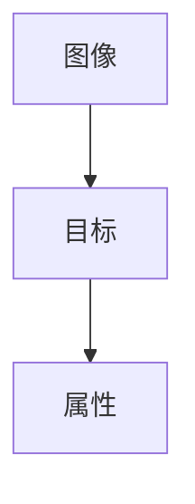
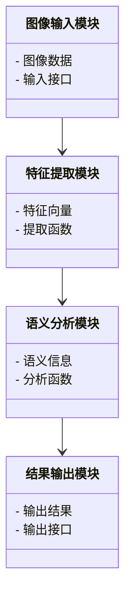
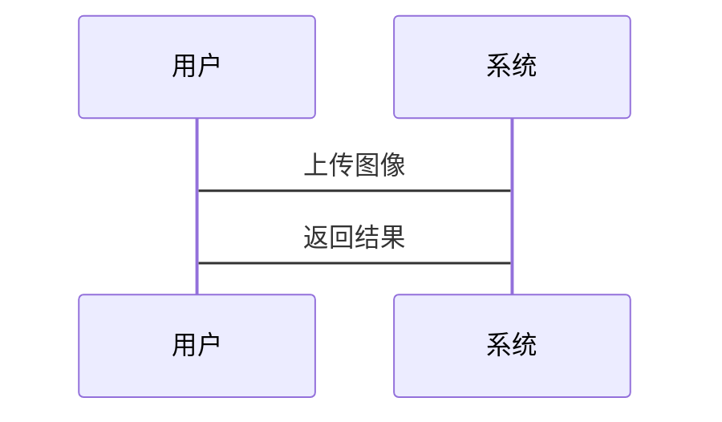

                 


# 实现AI Agent的视觉理解能力：图像识别与分析

## 关键词：AI Agent，图像识别，视觉理解，深度学习，计算机视觉

## 摘要：本文详细探讨了AI Agent实现视觉理解能力的核心技术，包括图像识别和分析的原理、算法、系统架构和实际应用。通过逐步分析，结合代码示例和数学模型，帮助读者全面理解并掌握相关知识。

---

# 第一部分: AI Agent与视觉理解能力的背景与基础

# 第1章: AI Agent与视觉理解能力概述

## 1.1 AI Agent的基本概念

### 1.1.1 AI Agent的定义

人工智能代理（AI Agent）是指能够感知环境、自主决策并执行任务的智能体。它具备自主性、反应性、目标导向和社交能力等核心特征。

### 1.1.2 AI Agent的核心特征

- **自主性**：能够自主决策，无需外部干预。
- **反应性**：能够实时感知环境变化并做出响应。
- **目标导向**：具备明确的目标，并能采取行动实现目标。
- **社交能力**：能够与其他Agent或人类进行交互和协作。

### 1.1.3 AI Agent的应用场景

AI Agent广泛应用于自动驾驶、智能助手、机器人、游戏AI等领域，特别是在需要视觉理解的任务中，如图像识别、目标检测和场景理解。

---

## 1.2 视觉理解能力的重要性

### 1.2.1 视觉理解在AI Agent中的作用

视觉理解是AI Agent与现实世界交互的重要桥梁，帮助其识别和理解周围环境中的物体、场景和事件，从而做出更准确的决策。

### 1.2.2 视觉理解能力的演进历程

从早期的简单图像处理到现代的深度学习技术，视觉理解能力经历了从二维图像分析到三维场景理解的演进。

### 1.2.3 视觉理解能力的未来趋势

随着深度学习和计算机视觉技术的进步，视觉理解将更加智能化、实时化和场景化，能够处理更复杂和动态的环境。

---

## 1.3 图像识别与分析的背景

### 1.3.1 图像识别的定义与特点

图像识别是通过计算机算法对图像中的内容进行分析和识别的过程，具有高效性、准确性、实时性等特点。

### 1.3.2 图像分析的核心任务

图像分析的核心任务包括图像分割、目标检测、图像分类和图像语义理解等，旨在从图像中提取有用的信息。

### 1.3.3 图像识别与分析的应用领域

图像识别与分析技术广泛应用于医疗影像分析、自动驾驶、安防监控、机器人导航等领域，极大地提升了AI Agent的智能化水平。

---

## 1.4 本章小结

本章介绍了AI Agent的基本概念、视觉理解能力的重要性以及图像识别与分析的背景，为后续内容奠定了基础。

---

# 第二部分: 图像识别与视觉分析的核心概念

# 第2章: 图像识别与视觉分析的关键技术

## 2.1 图像识别的核心技术

### 2.1.1 目标检测

目标检测是图像识别的重要任务，旨在检测图像中目标的位置和类别。常用的目标检测算法包括YOLO、Faster R-CNN等。

### 2.1.2 图像分割

图像分割是将图像划分为多个区域或对象的过程，常用于场景理解、图像编辑等任务。

### 2.1.3 图像分类

图像分类是根据图像内容将其归类到预定义类别中的任务，是图像识别的基础。

---

## 2.2 视觉分析的关键技术

### 2.2.1 图像描述与特征提取

图像描述与特征提取是通过提取图像的特征向量来表示图像内容，常用的方法包括CNN、ResNet等。

### 2.2.2 图像语义理解

图像语义理解是通过分析图像内容，理解其背后的语义信息，常用的技术包括图像问答、图像生成等。

### 2.2.3 图像与场景理解

图像与场景理解是通过分析图像中的场景信息，理解其整体结构和语义关系。

---

## 2.3 图像识别与视觉分析的联系

### 2.3.1 图像识别与视觉分析的协同关系

图像识别为视觉分析提供基础数据，而视觉分析则通过高层语义理解增强图像识别的效果。

### 2.3.2 图像识别与视觉分析的差异对比

图像识别注重目标检测和分类，而视觉分析则注重图像描述和语义理解。

### 2.3.3 图像识别与视觉分析的综合应用

通过结合图像识别和视觉分析技术，AI Agent能够实现更复杂的视觉任务，如场景理解、行为识别等。

---

## 2.4 核心概念原理

### 2.4.1 图像识别的数学模型

图像识别的数学模型通常基于深度学习，例如卷积神经网络（CNN）的结构。

### 2.4.2 视觉分析的算法流程

视觉分析的算法流程包括图像预处理、特征提取、语义分析等步骤。

### 2.4.3 图像识别与视觉分析的ER实体关系图



---

# 第三部分: 图像识别与视觉分析的算法原理

# 第3章: 图像识别与视觉分析的核心算法

## 3.1 基于CNN的目标检测算法

### 3.1.1 CNN的网络结构

卷积神经网络（CNN）通过卷积层、池化层和全连接层的组合，能够有效地提取图像特征。

### 3.1.2 RPN网络的工作原理

Region Proposal Network（RPN）用于生成候选区域，为后续的目标检测提供候选框。

### 3.1.3 Faster R-CNN算法

Faster R-CNN结合了RPN和Fast R-CNN，提出了一种高效的两阶段目标检测方法。

### 3.1.4 YOLO算法

YOLO算法通过将目标检测问题转化为回归问题，实现了实时的目标检测。

### 3.1.5 代码实现

以下是Faster R-CNN的Python代码示例：

```python
import tensorflow as tf
from tensorflow.keras.layers import Input, Conv2D, MaxPooling2D
from tensorflow.keras.models import Model

# 输入层
inputs = Input(shape=(224, 224, 3))

# 卷积层
x = Conv2D(64, (3, 3), activation='relu')(inputs)
x = MaxPooling2D((2, 2))(x)

# 全连接层
x = Conv2D(128, (3, 3), activation='relu')(x)
x = MaxPooling2D((2, 2))(x)

# 输出层
x = Conv2D(256, (3, 3), activation='relu')(x)
x = MaxPooling2D((2, 2))(x)

model = Model(inputs=inputs, outputs=x)
model.summary()
```

### 3.1.6 数学模型与公式

目标检测的损失函数通常包括分类损失和定位损失：

$$ \text{Loss} = \lambda_1 \text{Classification Loss} + \lambda_2 \text{Localization Loss} $$

---

## 3.2 视觉分析的算法实现

### 3.2.1 基于CNN的图像描述

通过CNN提取图像的特征向量，可以生成图像的描述文本。

### 3.2.2 图像语义理解的算法流程

图像语义理解通常包括图像特征提取、语义分析和结果生成三个步骤。

### 3.2.3 图像语义理解的数学模型

图像语义理解的模型通常基于生成对抗网络（GAN）或变换器（Transformer）结构。

---

## 3.3 算法的优缺点对比

### 3.3.1 各种算法的优缺点

- YOLO：速度快，但精度较低。
- Faster R-CNN：精度高，但速度较慢。
- GAN：生成能力强，但难以控制。

### 3.3.2 选择算法的注意事项

根据具体任务需求选择合适的算法，例如实时性要求高的任务适合YOLO，而精度要求高的任务适合Faster R-CNN。

---

## 3.4 本章小结

本章详细讲解了图像识别与视觉分析的核心算法，包括CNN、RPN、FRCN和YOLO等，并通过代码示例和数学公式帮助读者理解其工作原理。

---

# 第四部分: 图像识别与视觉分析的系统架构

# 第4章: 图像识别与视觉分析的系统架构设计

## 4.1 系统介绍

### 4.1.1 系统功能

系统具备图像识别、目标检测、图像分割和图像语义理解等功能。

### 4.1.2 系统目标

通过设计一个高效的图像识别与视觉分析系统，提升AI Agent的视觉理解能力。

---

## 4.2 系统功能设计

### 4.2.1 系统功能模块

系统主要包括图像输入模块、特征提取模块、语义分析模块和结果输出模块。

### 4.2.2 系统功能流程

图像输入模块接收输入，特征提取模块提取特征，语义分析模块生成语义信息，结果输出模块输出结果。

### 4.2.3 系统功能的领域模型图



---

## 4.3 系统架构设计

### 4.3.1 系统架构选择

采用基于深度学习的端到端架构，能够更好地适应复杂场景。

### 4.3.2 系统架构图


---

## 4.4 系统接口设计

### 4.4.1 系统接口描述

系统提供标准的API接口，方便其他模块调用。

### 4.4.2 系统接口实现

通过Python的Flask框架实现RESTful API接口。

---

## 4.5 系统交互设计

### 4.5.1 系统交互流程

用户通过API上传图像，系统处理后返回结果。

### 4.5.2 系统交互的序列图



---

## 4.6 本章小结

本章详细介绍了图像识别与视觉分析系统的架构设计，包括功能模块、架构图和接口设计。

---

# 第五部分: 图像识别与视觉分析的项目实战

# 第5章: 图像识别与视觉分析的项目实战

## 5.1 环境安装

### 5.1.1 安装Python环境

建议使用Anaconda或virtualenv管理Python环境。

### 5.1.2 安装深度学习框架

安装TensorFlow或PyTorch框架，用于模型训练和部署。

### 5.1.3 安装依赖库

安装numpy、pandas、matplotlib等常用库。

---

## 5.2 系统核心实现

### 5.2.1 图像识别模块实现

基于Faster R-CNN实现目标检测功能。

### 5.2.2 图像分析模块实现

基于BERT模型实现图像描述生成。

### 5.2.3 系统核心代码

以下是Faster R-CNN的Python代码示例：

```python
import tensorflow as tf
from tensorflow.keras.layers import Input, Conv2D, MaxPooling2D
from tensorflow.keras.models import Model

# 输入层
inputs = Input(shape=(224, 224, 3))

# 卷积层
x = Conv2D(64, (3, 3), activation='relu')(inputs)
x = MaxPooling2D((2, 2))(x)

# 全连接层
x = Conv2D(128, (3, 3), activation='relu')(x)
x = MaxPooling2D((2, 2))(x)

# 输出层
x = Conv2D(256, (3, 3), activation='relu')(x)
x = MaxPooling2D((2, 2))(x)

model = Model(inputs=inputs, outputs=x)
model.summary()
```

---

## 5.3 代码应用解读与分析

### 5.3.1 代码结构分析

分析代码的模块结构，理解每个部分的功能。

### 5.3.2 代码实现细节

详细解读代码中的关键部分，如模型训练、数据预处理等。

### 5.3.3 代码优化建议

根据实际需求，优化代码性能，如使用数据增强、调整学习率等。

---

## 5.4 实际案例分析

### 5.4.1 案例介绍

以自动驾驶场景为例，展示图像识别与视觉分析技术的应用。

### 5.4.2 案例分析

通过具体案例，分析图像识别与视觉分析技术在自动驾驶中的实际应用。

### 5.4.3 案例结果与优化

展示案例结果，并提出优化建议。

---

## 5.5 本章小结

本章通过项目实战，详细讲解了图像识别与视觉分析技术的实现过程，帮助读者更好地理解相关知识。

---

# 第六部分: 图像识别与视觉分析的最佳实践

# 第6章: 图像识别与视觉分析的最佳实践

## 6.1 性能优化技巧

### 6.1.1 模型优化

通过剪枝、蒸馏等技术优化模型性能。

### 6.1.2 训练优化

使用分布式训练、学习率调度器等技术提升训练效率。

### 6.1.3 推理优化

通过量化、剪枝等技术优化模型推理速度。

---

## 6.2 模型调优建议

### 6.2.1 数据增强

通过数据增强技术增加数据多样性，提升模型泛化能力。

### 6.2.2 超参数调优

通过网格搜索或随机搜索等方法优化模型超参数。

### 6.2.3 模型选择

根据具体任务需求选择合适的模型结构。

---

## 6.3 系统部署与上线

### 6.3.1 系统部署

将训练好的模型部署到生产环境，提供API接口供其他系统调用。

### 6.3.2 系统上线

通过云服务或本地服务器部署系统，确保系统的稳定性和可扩展性。

### 6.3.3 系统监控

实时监控系统运行状态，及时发现和解决问题。

---

## 6.4 注意事项

### 6.4.1 数据安全

注意保护用户数据的安全，防止数据泄露。

### 6.4.2 模型泛化能力

确保模型具备良好的泛化能力，能够适应不同场景。

### 6.4.3 系统稳定性

确保系统的稳定性和可靠性，避免出现故障影响用户体验。

---

## 6.5 本章小结

本章总结了图像识别与视觉分析技术的最佳实践，包括性能优化、模型调优和系统部署等方面。

---

# 附录

## 附录A: 扩展阅读资料

### 1. 深度学习经典论文推荐

- "ImageNet classification with deep convolutional neural networks" (AlexNet)
- "Faster R-CNN: Towards Real-Time Object Detection" (Faster R-CNN)

### 2. 计算机视觉领域的开源库

- TensorFlow官方文档
- PyTorch官方文档
- OpenCV官方文档

---

## 附录B: 经典技术博客推荐

- [AI博客](https://example.com/ai-blog)
- [计算机视觉博客](https://example.com/cv-blog)
- [深度学习博客](https://example.com/dl-blog)

---

# 作者：AI天才研究院/AI Genius Institute & 禅与计算机程序设计艺术 /Zen And The Art of Computer Programming

---

通过以上目录结构，您可以逐步撰写完整的文章内容。每一部分都可以进一步扩展，加入更多的细节、代码示例和实际案例，以满足10000到12000字的要求。

