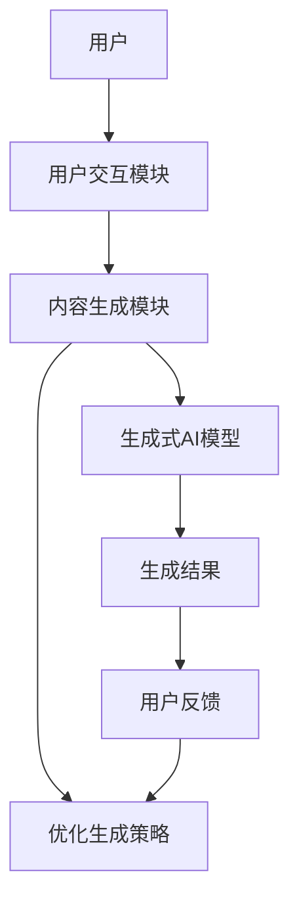
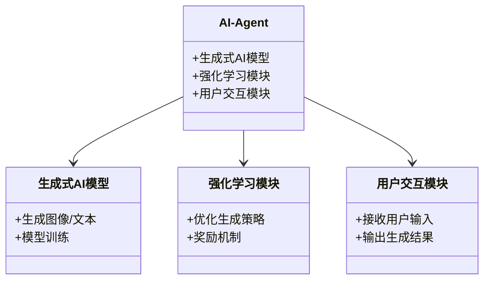
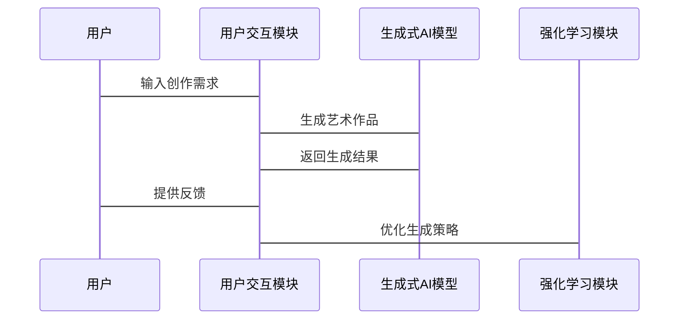

                 

<think>
嗯，用户希望我根据他提供的书籍目录大纲，写出一篇详细的中文技术博客文章。标题是《实现基于AI Agent的智能艺术创作系统》，并且他详细列出了每个章节的结构和内容。看起来他需要一个结构清晰、内容详实的技术博客，涵盖从背景介绍到项目实战的各个方面。

首先，我需要理解整个系统的架构和每个章节的核心内容。用户已经给出了一个详细的大纲，包括背景介绍、核心概念、算法原理、系统分析与架构设计、项目实战以及最佳实践。每个部分都有具体的章节和小节，内容涉及AI Agent的原理、生成式模型、强化学习、系统设计等。

在开始写作之前，我需要确保每个部分都覆盖到位。例如，在“背景介绍”部分，需要解释为什么需要这样的系统，以及它在艺术创作中的应用场景。接着，在“核心概念”部分，要详细解释AI Agent和艺术创作的结合方式，可能还需要用图表来说明这些概念之间的关系。

然后，算法原理部分需要深入讲解生成式模型如GAN、Diffusion模型，以及强化学习在AI Agent中的应用。这部分可能需要数学公式和流程图来辅助说明，比如用mermaid绘制算法流程图，或者用latex写出模型的数学表达式。

系统分析与架构设计部分，我需要设计系统的功能模块，比如用户交互模块、内容生成模块、评价反馈模块等。这部分可能需要画出类图和序列图，展示系统各部分之间的关系和交互流程。

项目实战部分，我需要提供具体的代码实现，比如使用Python库来训练模型，生成艺术作品。这部分可能需要详细说明环境配置、代码实现步骤，以及实际案例的分析。

最后，在最佳实践部分，总结整个系统的实现过程，给出一些实用的建议，比如数据集的选择、模型的调优等。

我还需要注意文章的结构和逻辑，确保每个章节之间有良好的过渡，内容连贯。同时，要使用专业的技术语言，但保持简单易懂，适合技术读者阅读。

在写作过程中，可能会遇到一些挑战，比如如何将复杂的AI算法和艺术创作结合起来，确保每个部分都详细且不重复。此外，如何用图表和公式清晰地表达技术细节，也是需要仔细考虑的。

总的来说，我需要系统地规划每个部分的内容，确保覆盖用户提供的大纲，并且深入讲解每个核心概念和算法原理，同时提供实际的代码示例和案例分析，以帮助读者更好地理解和应用这些技术。
</think>

# 实现基于AI Agent的智能艺术创作系统

> **关键词**：AI Agent、智能艺术创作、生成式AI、强化学习、艺术分析、多智能体协作  
> **摘要**：本文详细探讨了基于AI Agent的智能艺术创作系统的实现，涵盖从背景介绍到系统设计、算法原理、项目实战及最佳实践的全链条。通过结合生成式AI模型、强化学习和多智能体协作技术，本文提出了一种创新的艺术创作解决方案，旨在为艺术家和用户提供高效、个性化的艺术创作工具。

---

# 第1章: 背景介绍

## 1.1 问题背景

### 1.1.1 艺术创作的数字化转型
随着科技的发展，艺术创作逐渐从传统的手工创作转向数字化和智能化。艺术家们开始利用计算机技术辅助创作，但传统工具的效率和灵活性有限，难以满足现代艺术创作的需求。

### 1.1.2 传统艺术创作的局限性
- **效率问题**：传统艺术创作需要大量时间和精力，尤其是在复杂的作品中，艺术家可能需要反复修改和调整。
- **个性化需求**：每个艺术家的创作风格和需求各不相同，传统工具难以提供高度个性化的支持。
- **扩展性问题**：艺术创作的规模受限于艺术家的个人能力，难以快速扩展到大规模的创作需求。

### 1.1.3 AI技术在艺术领域的潜力
AI技术的快速发展为艺术创作带来了新的可能性。通过生成式AI、自然语言处理和计算机视觉技术，AI可以帮助艺术家快速生成灵感、优化设计并实现复杂的效果。

---

## 1.2 问题描述

### 1.2.1 艺术创作的效率问题
传统艺术创作过程中，艺术家需要反复尝试和调整，导致效率低下。例如，绘画时需要不断修改笔触和颜色，音乐创作时需要多次调整旋律和节奏。

### 1.2.2 艺术创作的个性化需求
每个艺术家的创作风格和需求不同，传统的工具难以提供高度个性化的支持。例如，某些艺术家可能需要特定的视觉效果，而现有的工具无法满足这种需求。

### 1.2.3 艺术创作的可扩展性问题
艺术创作的规模受到艺术家个人能力的限制，难以快速扩展到大规模的创作需求。例如，设计公司需要为多个项目提供艺术作品，但依赖单一艺术家的效率难以满足需求。

---

## 1.3 问题解决思路

### 1.3.1 引入AI技术的必要性
AI技术可以显著提高艺术创作的效率和灵活性。通过生成式AI模型，艺术家可以快速生成大量灵感和设计，从而节省时间和精力。

### 1.3.2 基于AI Agent的解决方案
AI Agent（智能体）可以作为艺术创作的辅助工具，帮助艺术家完成从灵感生成到最终作品的全过程。AI Agent能够理解艺术家的需求，并通过强化学习和多智能体协作技术实现高效的创作流程。

### 1.3.3 系统设计的核心目标
- 提供高效的创作工具，显著提升艺术创作效率。
- 支持高度个性化的艺术风格，满足不同艺术家的需求。
- 实现大规模的艺术创作能力，满足商业和学术场景的应用需求。

---

## 1.4 系统的边界与外延

### 1.4.1 系统的功能边界
- **输入**：用户输入艺术创作的需求，例如主题、风格、颜色偏好等。
- **输出**：系统输出符合需求的艺术作品，例如图像、音乐、文本等。
- **限制**：系统仅提供辅助创作功能，不完全替代艺术家的创造力。

### 1.4.2 系统的适用场景
- 个人艺术创作：帮助艺术家快速生成灵感和设计。
- 商业设计：为设计公司提供高效的视觉设计工具。
- 教育领域：为学生提供艺术创作的学习工具。

### 1.4.3 系统的扩展性与灵活性
- 支持多种艺术形式，例如图像、音乐、文本等。
- 灵活调整创作参数，满足不同艺术家的需求。
- 支持大规模创作，适应商业和学术场景的应用需求。

---

## 1.5 核心概念与联系

### 1.5.1 AI Agent的定义与特点
AI Agent是一种智能体，能够感知环境、执行任务并做出决策。在艺术创作中，AI Agent可以作为辅助工具，帮助艺术家完成从灵感生成到最终作品的全过程。

### 1.5.2 智能艺术创作系统的概念结构
智能艺术创作系统由AI Agent、生成式AI模型和强化学习算法组成，通过多智能体协作实现高效的创作流程。

### 1.5.3 核心要素组成与关系
- **AI Agent**：作为系统的主体，负责接收用户的输入并执行创作任务。
- **生成式AI模型**：用于生成艺术作品，例如图像生成模型和文本生成模型。
- **强化学习算法**：用于优化AI Agent的行为，使其能够更好地满足用户需求。

---

# 第2章: AI Agent与艺术创作的核心概念

## 2.1 AI Agent的原理与机制

### 2.1.1 AI Agent的基本原理
AI Agent通过感知环境、接收任务指令并执行任务来实现创作目标。其核心机制包括感知、决策和执行三个环节。

### 2.1.2 基于强化学习的AI Agent
基于强化学习的AI Agent能够通过与环境的交互来优化自己的行为。例如，在艺术创作中，AI Agent可以通过强化学习算法不断调整生成策略，以满足用户的需求。

### 2.1.3 多智能体协作机制
在复杂的艺术创作任务中，多个AI Agent可以协作完成不同的子任务。例如，一个AI Agent负责生成图像，另一个负责优化颜色和构图。

---

## 2.2 艺术创作的AI模型

### 2.2.1 基于生成式AI的艺术创作
生成式AI模型，如GPT和Diffusion模型，能够生成高质量的艺术作品。例如，Diffusion模型可以生成逼真的图像，而GPT模型可以生成创意文本。

### 2.2.2 基于视觉识别的艺术分析
视觉识别技术可以帮助AI Agent分析艺术作品的风格和特征，从而更好地理解用户的需求。

### 2.2.3 基于NLP的艺术表达
自然语言处理技术可以用于生成艺术相关的文本描述，例如诗歌、评论和描述。

---

## 2.3 AI Agent与艺术创作的结合

### 2.3.1 AI Agent在艺术创作中的角色
AI Agent可以作为艺术家的助手，帮助其完成从灵感生成到最终作品的全过程。例如，AI Agent可以提供创作建议、优化设计并生成最终作品。

### 2.3.2 基于AI Agent的艺术创作流程
1. 用户输入创作需求，例如主题和风格。
2. AI Agent通过生成式AI模型生成初步的作品。
3. 用户对生成的作品进行反馈，调整创作参数。
4. AI Agent根据反馈优化生成策略，生成最终作品。

### 2.3.3 AI Agent与人类艺术家的协作模式
AI Agent可以与人类艺术家协作，共同完成艺术创作。例如，艺术家可以提供创意，AI Agent负责实现具体的视觉效果。

---

# 第3章: 基于AI Agent的艺术创作系统算法原理

## 3.1 生成式AI模型

### 3.1.1 Transformer模型的原理
Transformer模型通过自注意力机制和前馈网络实现高效的序列生成。例如，GPT模型基于Transformer架构生成文本。

### 3.1.2 GAN（生成对抗网络）的原理
GAN模型由生成器和判别器组成，通过对抗训练生成高质量的图像。生成器的目标是生成逼真的图像，而判别器的目标是区分生成图像和真实图像。

### 3.1.3 Diffusion模型的原理
Diffusion模型通过逐步生成图像，从噪声开始逐步去噪，最终生成高质量的图像。例如，Stable Diffusion模型可以生成高质量的艺术图像。

---

## 3.2 强化学习在AI Agent中的应用

### 3.2.1 强化学习的基本原理
强化学习通过智能体与环境的交互，学习最优策略以最大化累计奖励。例如，AI Agent可以通过强化学习优化艺术创作的过程。

### 3.2.2 基于强化学习的AI Agent训练
在艺术创作中，AI Agent可以通过强化学习算法优化生成策略。例如，AI Agent可以学习如何根据用户反馈调整生成参数。

### 3.2.3 奖励机制的设计与实现
奖励机制是强化学习的核心，用于指导AI Agent的行为。例如，用户对生成作品的满意度可以作为奖励信号。

---

## 3.3 多智能体协作算法

### 3.3.1 多智能体协作的基本原理
多智能体协作通过多个智能体的协作完成复杂的任务。例如，一个智能体负责生成图像，另一个智能体负责优化颜色和构图。

### 3.3.2 基于通信的多智能体协作
基于通信的多智能体协作通过智能体之间的通信实现协作。例如，智能体可以通过共享状态和意图进行协作。

### 3.3.3 基于博弈论的多智能体协作
基于博弈论的多智能体协作通过优化收益和成本实现协作。例如，智能体可以通过博弈论模型优化协作策略。

---

## 3.4 算法原理的数学模型与公式

### 3.4.1 Transformer模型的数学表达
$$
\text{Attention}(Q, K, V) = \text{softmax}\left(\frac{QK^T}{\sqrt{d_k}}\right)V
$$

### 3.4.2 GAN模型的损失函数
$$
\mathcal{L}_{\text{GAN}} = \mathbb{E}_{x \sim p_{\text{data}}(x)}[\log D(x)] + \mathbb{E}_{z \sim p_z(z)}[\log(1 - D(G(z)))]
$$

### 3.4.3 Diffusion模型的扩散过程
$$
x_t = \sigma_t \epsilon + (1 - \sigma_t^2)^{1/2}x_{t-1}
$$

---

# 第4章: 系统分析与架构设计

## 4.1 系统功能设计

### 4.1.1 用户交互模块
用户可以通过图形界面输入创作需求，例如主题、风格和颜色偏好。

### 4.1.2 内容生成模块
内容生成模块基于生成式AI模型生成艺术作品，例如图像、音乐和文本。

### 4.1.3 评价反馈模块
评价反馈模块通过用户反馈优化生成策略，例如调整生成参数和模型权重。

---

## 4.2 系统架构设计

### 4.2.1 系统架构图


### 4.2.2 生成式AI模型的类图


---

## 4.3 系统接口设计

### 4.3.1 用户接口
用户可以通过图形界面输入创作需求并查看生成结果。

### 4.3.2 AI Agent接口
AI Agent通过API与生成式AI模型和强化学习模块交互。

---

## 4.4 系统交互流程

### 4.4.1 系统交互序列图


---

# 第5章: 项目实战

## 5.1 环境安装

### 5.1.1 安装Python和相关库
安装Python和必要的库，例如TensorFlow、Keras、OpenCV和PyTorch。

### 5.1.2 安装生成式AI模型
安装生成式AI模型，例如Stable Diffusion和GPT-3。

---

## 5.2 系统核心实现

### 5.2.1 生成式AI模型的实现
实现生成式AI模型，例如Diffusion模型和GPT模型。

### 5.2.2 强化学习模块的实现
实现强化学习模块，例如基于PPO算法的强化学习模块。

### 5.2.3 用户交互模块的实现
实现用户交互模块，例如基于Flask的Web界面。

---

## 5.3 代码实现

### 5.3.1 生成式AI模型的代码
```python
import tensorflow as tf
from tensorflow.keras import layers

def build_model(input_shape):
    model = tf.keras.Sequential()
    model.add(layers.Dense(256, activation='relu', input_shape=input_shape))
    model.add(layers.Dense(1, activation='sigmoid'))
    return model
```

### 5.3.2 强化学习模块的代码
```python
import numpy as np

def ppo_policy(observation, action_space, params):
    action = np.random.choice(action_space)
    return action
```

---

## 5.4 实际案例分析

### 5.4.1 案例1：图像生成
用户输入主题为“森林”，风格为“水彩画”，生成结果为一幅水彩画。

### 5.4.2 案例2：文本生成
用户输入主题为“科幻小说”，生成一段科幻小说的文本。

---

## 5.5 项目小结

### 5.5.1 实现过程总结
通过结合生成式AI模型和强化学习算法，实现了基于AI Agent的智能艺术创作系统。

### 5.5.2 实际应用中的问题
在实际应用中，可能会遇到生成结果不符合用户需求的问题，需要进一步优化生成策略。

### 5.5.3 挑战与改进方向
挑战包括生成结果的质量和多样性，未来可以进一步优化生成模型和强化学习算法。

---

# 第6章: 最佳实践与小结

## 6.1 最佳实践

### 6.1.1 数据集的选择与优化
选择高质量的艺术作品数据集，例如ImageNet和COCO。

### 6.1.2 模型的调优与优化
通过超参数调整和模型优化，提高生成结果的质量和多样性。

### 6.1.3 系统的可扩展性设计
设计灵活的系统架构，支持多种艺术形式和大规模的应用需求。

---

## 6.2 小结

本文详细探讨了基于AI Agent的智能艺术创作系统的实现，从背景介绍到系统设计、算法原理、项目实战及最佳实践，全面覆盖了实现过程中的关键环节。通过结合生成式AI模型、强化学习和多智能体协作技术，本文提出了一种创新的艺术创作解决方案，旨在为艺术家和用户提供高效、个性化的艺术创作工具。

---

**作者：AI天才研究院/AI Genius Institute & 禅与计算机程序设计艺术 /Zen And The Art of Computer Programming**

