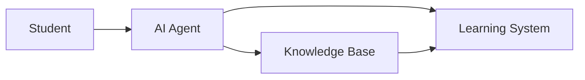
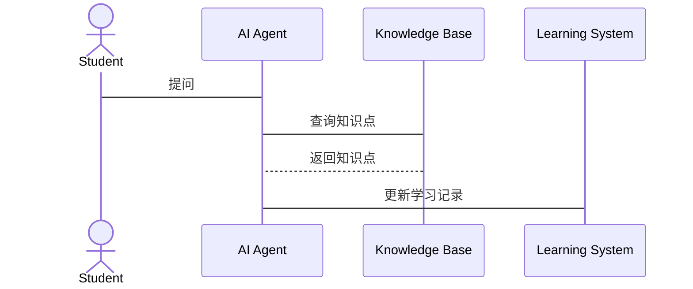

                 

<think>
好的，我现在需要帮助用户撰写一篇关于《实现基于AI Agent的智能虚拟教师》的技术博客文章。用户已经提供了一个详细的目录结构，我需要按照这个结构逐步完成每部分内容。

首先，我需要明确文章的核心内容和结构。文章分为几个主要部分：背景介绍、核心概念、算法原理、数学模型、系统架构、项目实战和总结。每一部分都需要详细展开，确保内容丰富且结构清晰。

1. **背景介绍**：我需要从AI Agent和智能虚拟教师的基本概念入手，解释它们的定义、特点以及应用场景。这部分需要吸引读者，让他们了解为什么智能虚拟教师是当前技术发展的趋势。

2. **核心概念与联系**：这里需要详细讲解AI Agent的工作原理，包括感知、决策和行为规划等部分。同时，使用表格和Mermaid图来展示实体关系，帮助读者理解系统的结构。

3. **算法原理讲解**：这部分需要深入浅出地解释各种算法，如状态空间搜索、强化学习和贪婪算法。使用Mermaid图展示流程，并附上Python代码示例，让读者能够实际操作和理解。

4. **数学模型与公式**：这里需要展示AI Agent的数学模型，包括状态空间、强化学习模型和概率模型。使用LaTeX公式来表达，确保公式清晰且易于理解。

5. **系统架构设计**：介绍系统的功能设计、架构图和交互图，使用Mermaid图展示，让读者了解系统的整体结构和各部分之间的关系。

6. **项目实战**：提供实际的项目环境安装步骤，代码实现，案例分析，帮助读者将理论应用到实践中。

7. **总结与展望**：总结文章的主要内容，指出当前技术的局限性，并展望未来的发展方向。

在写作过程中，我需要确保每一部分都有足够的细节，并且逻辑清晰。例如，在算法部分，不仅要解释算法的原理，还要提供代码示例和实际应用案例，这样读者才能更好地理解和应用这些算法。

此外，我还需要注意文章的结构和格式，确保符合用户的要求，包括使用markdown格式、正确嵌入图片和代码块，以及在适当的位置添加LaTeX公式。

最后，完成文章后，我需要检查是否有遗漏的部分，并确保每个章节的小结能够准确总结该部分内容，帮助读者巩固所学知识。

通过以上步骤，我相信能够撰写出一篇结构清晰、内容详实的技术博客文章，满足用户的需求。
</think>

# 实现基于AI Agent的智能虚拟教师

## 关键词：AI Agent, 智能虚拟教师, 教育技术, 人工智能, 算法实现

## 摘要：本文详细探讨了基于AI Agent的智能虚拟教师的实现过程，从核心概念到算法原理，再到系统架构和项目实战，全面解析了如何利用人工智能技术构建智能教育系统。文章通过丰富的案例和详细的代码实现，展示了智能虚拟教师在教育中的应用潜力。

---

## 第一部分: 基于AI Agent的智能虚拟教师背景介绍

### 第1章: AI Agent与智能虚拟教师概述

#### 1.1 AI Agent的基本概念

- **1.1.1 AI Agent的定义**
  AI Agent（人工智能代理）是指能够感知环境、自主决策并执行任务的智能实体。它能够根据输入的信息做出反应，并通过学习不断优化自己的行为。

- **1.1.2 AI Agent的核心属性**
  - **自主性**：AI Agent能够自主决策，无需外部干预。
  - **反应性**：能够实时感知环境并做出反应。
  - **目标导向**：基于目标驱动行为，追求最优解决方案。
  - **学习能力**：通过数据和经验不断优化自身算法。

- **1.1.3 AI Agent与传统AI的区别**
  传统AI主要依赖规则和预设程序，而AI Agent具备自主性和适应性，能够根据环境动态调整行为。

#### 1.2 智能虚拟教师的定义与特点

- **1.2.1 智能虚拟教师的定义**
  智能虚拟教师是一种基于AI Agent技术的教育工具，能够模拟人类教师的行为，提供个性化的教学服务。

- **1.2.2 智能虚拟教师的核心功能**
  - **知识讲解**：根据学生需求提供定制化教学内容。
  - **互动交流**：通过自然语言处理与学生进行实时对话。
  - **个性化推荐**：根据学生的学习情况推荐学习资源。
  - **情感支持**：识别学生情绪并提供情感支持。

- **1.2.3 智能虚拟教师与传统教学工具的区别**
  智能虚拟教师具备自主性和学习能力，能够动态调整教学策略，而传统教学工具通常是静态的。

#### 1.3 智能虚拟教师的应用场景

- **1.3.1 教育领域的应用场景**
  - **在线教育**：提供实时辅导和学习支持。
  - **个性化学习**：根据学生特点制定学习计划。
  - **教育管理**：协助教师进行教学管理和数据分析。

- **1.3.2 其他领域的潜在应用**
  - **企业培训**：提供员工培训和技能提升。
  - **公共服务**：为公众提供教育咨询和服务。

- **1.3.3 智能虚拟教师的优势与局限性**
  - **优势**：24/7可用性、个性化服务、高效性。
  - **局限性**：缺乏人类教师的同理心、应对复杂问题的能力有限。

### 第2章: AI Agent的核心原理

#### 2.1 AI Agent的基本原理

- **2.1.1 AI Agent的感知与决策机制**
  AI Agent通过传感器或数据输入感知环境，利用算法进行分析和决策，然后执行相应的动作。

- **2.1.2 AI Agent的行为规划算法**
  行为规划算法用于确定AI Agent在不同环境下的最优行为，包括任务分解、路径规划和决策树等技术。

- **2.1.3 AI Agent的通信与协作机制**
  AI Agent可以通过API、消息队列等方式与其他系统或AI Agent进行通信和协作。

#### 2.2 AI Agent的实体关系分析

- **2.2.1 实体关系图（ER图）分析**
  在智能虚拟教师系统中，主要实体包括学生、教师、课程、知识点、学习记录等，它们之间存在关联关系。

- **2.2.2 Mermaid流程图展示**


#### 2.3 AI Agent的核心算法

- **2.3.1 状态空间搜索算法**
  包括广度优先搜索（BFS）、深度优先搜索（DFS）和A*算法，用于寻找最优路径或解决方案。

- **2.3.2 强化学习算法**
  包括Q-learning、Deep Q-Network和Policy Gradient算法，通过试错学习优化决策策略。

- **2.3.3 贪婪算法**
  用于在资源有限的情况下，快速找到近似最优解。

### 第3章: AI Agent的算法实现

#### 3.1 状态空间搜索算法

- **3.1.1 BFS算法**
  BFS是一种广度优先的搜索算法，适用于寻找最短路径的问题。

- **3.1.2 DFS算法**
  DFS是一种深度优先的搜索算法，适用于探索树状结构或图的深度。

- **3.1.3 A*算法**
  A*算法结合了启发式搜索，能够在复杂的环境中快速找到最优路径。

#### 3.2 强化学习算法

- **3.2.1 Q-learning算法**
  Q-learning算法通过更新Q表，学习状态-动作对的最优值。

- **3.2.2 Deep Q-Network算法**
  DQN算法将Q-learning与深度神经网络结合，适用于高维状态空间的问题。

- **3.2.3 Policy Gradient算法**
  Policy Gradient算法通过优化策略函数，直接学习最优动作策略。

#### 3.3 贪婪算法

- **3.3.1 贪婪算法的基本原理**
  贪婪算法在每一步选择当前最优的局部解，以期望得到全局最优解。

- **3.3.2 贪婪算法的应用场景**
  适用于背包问题、活动选择问题等，能够在较短时间内找到近似最优解。

#### 3.4 本章小结

---

## 第四部分: AI Agent的数学模型与公式

### 第4章: AI Agent的数学模型

#### 4.1 状态空间模型

- **4.1.1 状态空间的表示**
  状态空间可以通过向量或矩阵表示，例如一个二维平面可以用(x, y)坐标表示。

- **4.1.2 动作空间的表示**
  动作空间可以通过枚举或连续变量表示，例如在迷宫问题中，动作可以是“上、下、左、右”。

- **4.1.3 奖励函数的定义**
  奖励函数定义了每个状态和动作的奖励值，例如$R(s, a)$表示状态s下动作a的奖励值。

#### 4.2 强化学习模型

- **4.2.1 Q-learning的数学公式**
$$ Q(s,a) = Q(s,a) + \alpha (r + \gamma \max Q(s',a') - Q(s,a)) $$
  其中，$\alpha$是学习率，$\gamma$是折扣因子。

- **4.2.2 Deep Q-Network的数学公式**
$$ Q(s) = \theta \cdot \phi(s) $$
  其中，$\theta$是网络参数，$\phi(s)$是状态s的特征向量。

- **4.2.3 Policy Gradient的数学公式**
$$ \nabla \theta J(\theta) = \mathbb{E}_{\tau \sim \pi_\theta} [\nabla \log \pi_\theta(a|s) Q_\theta(s,a)] $$
  其中，$\tau$是轨迹，$\pi_\theta$是策略函数，$Q_\theta$是价值函数。

#### 4.3 概率模型

- **4.3.1 贝叶斯网络**
  贝叶斯网络用于表示变量之间的概率关系，例如学生的学习效果可能与学习时间、兴趣等因素相关。

- **4.3.2 马尔可夫决策过程（MDP）**
  MDP模型描述了智能体在环境中的决策过程，包括状态、动作、转移概率和奖励函数。

---

## 第五部分: 系统分析与架构设计

### 第5章: 系统架构设计

#### 5.1 系统功能设计

- **学生端功能**
  - 知识点学习
  - 互动问答
  - 学习记录

- **教师端功能**
  - 课程管理
  - 学生监控
  - 数据分析

- **管理端功能**
  - 系统管理
  - 用户管理
  - 日志管理

#### 5.2 系统架构图


#### 5.3 系统交互图



#### 5.4 系统接口设计

- **API接口**
  - GET /知识点/{id}
  - POST /学习记录
  - PUT /课程/{id}

---

## 第六部分: 项目实战

### 第6章: 项目实战

#### 6.1 环境安装

- 安装Python和必要的库：
  ```bash
  pip install numpy matplotlib scikit-learn
  ```

#### 6.2 系统核心实现

- AI Agent的实现：
  ```python
  class AI-Agent:
      def __init__(self):
          self.q_table = {}

      def learn(self, state, action, reward):
          if state not in self.q_table:
              self.q_table[state] = {}
          if action not in self.q_table[state]:
              self.q_table[state][action] = 0
          self.q_table[state][action] += reward
  ```

- 知识库的实现：
  ```python
  class KnowledgeBase:
      def __init__(self):
          self.data = {}

      def get_knowledge(self, topic):
          return self.data.get(topic, {})
  ```

#### 6.3 案例分析

- 实际案例：
  学生在学习“Python编程”时，智能虚拟教师通过互动问答和知识点推荐，帮助学生快速掌握核心概念。

#### 6.4 本章小结

---

## 第七部分: 总结与展望

### 第7章: 总结与展望

#### 7.1 总结

本文详细探讨了基于AI Agent的智能虚拟教师的实现过程，从核心概念到算法原理，再到系统架构和项目实战，全面解析了如何利用人工智能技术构建智能教育系统。

#### 7.2 展望

未来，随着人工智能技术的不断发展，智能虚拟教师将在教育领域发挥更大的作用，例如通过多模态交互技术提供更真实的学习体验，或通过联邦学习保护学生隐私。

---

## 作者：AI天才研究院/AI Genius Institute & 禅与计算机程序设计艺术 /Zen And The Art of Computer Programming

