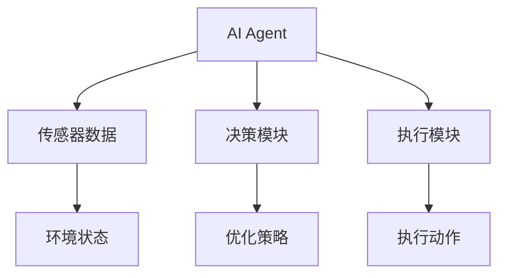
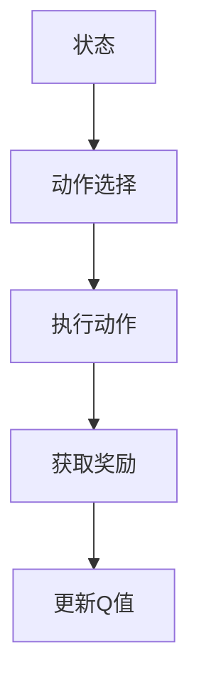
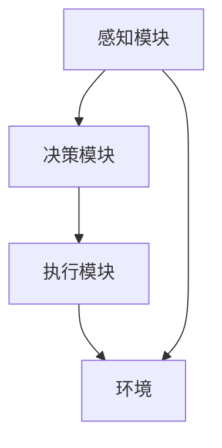
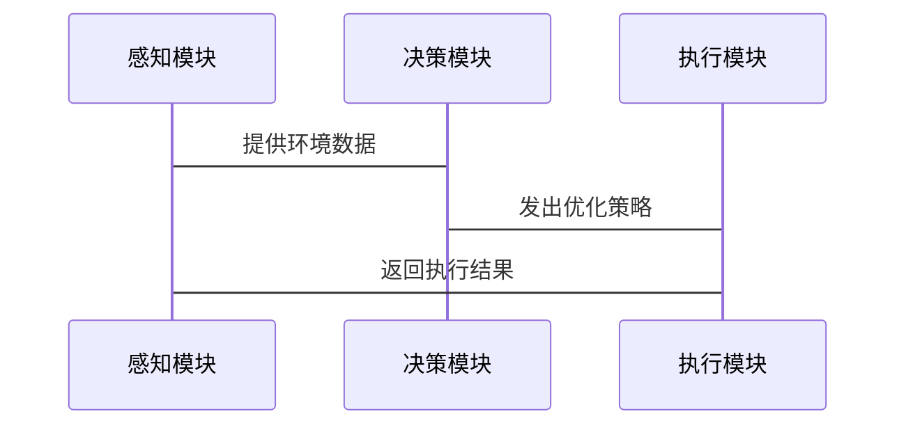

                 


# 实现基于AI Agent的智能质量控制系统

> 关键词：AI Agent，智能质量控制系统，强化学习，算法原理，系统架构

> 摘要：本文详细介绍了如何基于AI Agent技术实现智能质量控制系统。从AI Agent的基本概念到强化学习算法，从系统架构设计到实际项目实现，本文为读者提供了一套完整的解决方案。通过本文，读者可以深入了解AI Agent在质量控制中的应用，掌握其实现方法和最佳实践。

---

# 第一部分: 基于AI Agent的智能质量控制系统背景与概念

## 第1章: 智能质量控制系统的背景与问题背景

### 1.1 传统质量控制方法的局限性
传统质量控制方法依赖于人工检测或固定规则的自动化检测，存在以下问题：
- 人工检测效率低，易受主观因素影响
- 自动化检测规则固定，难以适应复杂场景
- 数据分析能力有限，难以从海量数据中提取有价值的信息

### 1.2 工业4.0与智能化转型的推动
随着工业4.0的推进，智能化转型成为必然趋势。AI技术的快速发展为质量控制带来了新的可能性：
- 数据采集与分析能力的提升
- 智能决策系统的引入
- 实时监控与预测性维护的实现

### 1.3 AI Agent在质量控制中的应用前景
AI Agent（智能代理）是一种能够感知环境、自主决策并执行任务的智能体。在质量控制中，AI Agent可以通过以下方式提升效率：
- 实时感知生产环境和产品质量数据
- 基于强化学习优化检测策略
- 自动执行质量改善任务

---

## 第2章: AI Agent的基本概念与特点

### 2.1 AI Agent的定义与核心属性
AI Agent是一种智能体，具备以下核心属性：
- **自主性**：能够在没有外部干预的情况下自主运行
- **反应性**：能够感知环境并实时调整行为
- **目标导向性**：基于目标进行决策和行动
- **学习能力**：能够通过经验优化自身行为

### 2.2 AI Agent与传统自动化的区别
| 特性 | AI Agent | 传统自动化 |
|------|-----------|-------------|
| 决策能力 | 高 | 低 |
| 灵活性 | 高 | 低 |
| 学习能力 | 高 | 无 |

### 2.3 AI Agent在质量控制中的优势
- **高精度**：基于数据驱动的决策能力
- **高效率**：能够快速处理海量数据
- **自适应性**：能够根据环境变化调整策略

---

## 第3章: 智能质量控制系统的核心问题

### 3.1 质量检测中的关键问题
- 数据采集的准确性
- 检测策略的优化
- 异常情况的实时处理

### 3.2 AI Agent在质量控制中的应用场景
- **实时监控**：持续监测产品质量
- **异常检测**：快速识别并定位问题
- **优化建议**：基于数据提供改进方案

### 3.3 系统边界与外延
- **输入**：传感器数据、生产参数
- **输出**：质量检测结果、优化建议
- **外延**：与生产系统、数据库的集成

---

# 第二部分: AI Agent的原理与核心概念

## 第4章: AI Agent的核心概念与原理

### 4.1 AI Agent的基本原理
AI Agent通过感知、决策和执行三个环节实现质量控制：
1. **感知**：通过传感器获取环境数据
2. **决策**：基于强化学习算法优化策略
3. **执行**：根据决策结果执行相应动作

### 4.2 状态空间与动作空间
- **状态空间**：系统当前的状态，如温度、压力等参数
- **动作空间**：AI Agent可以执行的动作，如调整参数、报警等

### 4.3 强化学习算法
强化学习是一种通过试错优化策略的算法，适用于复杂环境下的决策问题。常用算法包括Q-learning和Deep Q-Network（DQN）。

---

## 第5章: AI Agent的实体关系架构

### 5.1 实体关系图


### 5.2 交互流程
1. AI Agent通过传感器获取环境数据
2. 决策模块基于强化学习算法生成优化策略
3. 执行模块根据策略执行相应动作
4. 环境状态发生变化，反馈给AI Agent

---

# 第三部分: AI Agent算法原理与数学模型

## 第6章: 强化学习算法原理

### 6.1 Q-learning算法的原理
Q-learning是一种基于表格的强化学习算法，适用于离散动作空间。其核心公式为：
$$ Q(s, a) = Q(s, a) + \alpha (r + \gamma \max Q(s', a') - Q(s, a)) $$

### 6.2 Q-learning算法流程


### 6.3 Python实现示例
```python
import numpy as np

class QLearning:
    def __init__(self, state_space, action_space, alpha=0.1, gamma=0.9):
        self.state_space = state_space
        self.action_space = action_space
        self.alpha = alpha
        self.gamma = gamma
        self.q_table = np.zeros((state_space, action_space))

    def choose_action(self, state):
        return np.argmax(self.q_table[state])

    def update_q_table(self, state, action, reward, next_state):
        self.q_table[state, action] += self.alpha * (reward + self.gamma * np.max(self.q_table[next_state]) - self.q_table[state, action])

# 示例用法
ql = QLearning(5, 3)
action = ql.choose_action(2)
ql.update_q_table(2, action, reward, next_state)
```

---

## 第7章: 算法优化与实现

### 7.1 算法优化策略
- **经验回放**：通过存储历史数据减少样本偏差
- **ε-greedy策略**：平衡探索与利用

### 7.2 实验分析
通过实验对比不同算法的性能，验证Q-learning算法的有效性。

---

# 第四部分: 系统分析与架构设计

## 第8章: 系统分析与架构设计

### 8.1 问题场景介绍
- **场景**：某制造企业的生产线质量检测
- **目标**：提升检测效率和准确性

### 8.2 系统功能设计
| 模块 | 功能描述 |
|------|----------|
| 感知模块 | 数据采集与环境感知 |
| 决策模块 | 策略优化与决策 |
| 执行模块 | 策略执行与反馈 |

### 8.3 系统架构图


### 8.4 接口设计
- **输入接口**：传感器数据、生产参数
- **输出接口**：检测结果、优化建议

### 8.5 交互流程


---

## 第9章: 项目实战

### 9.1 环境安装
- 安装Python和相关库（如numpy、matplotlib）
- 安装强化学习框架（如TensorFlow）

### 9.2 核心功能实现
```python
import numpy as np
import matplotlib.pyplot as plt

def main():
    # 初始化环境
    state = 0
    while True:
        # 选择动作
        action = choose_action(state)
        # 执行动作
        next_state, reward = step(state, action)
        # 更新Q表
        update_q_table(state, action, reward, next_state)
        # 绘制结果
        plot_result(state, action, reward)
        state = next_state

if __name__ == "__main__":
    main()
```

### 9.3 实际案例分析
通过具体案例分析，验证系统的有效性和优化空间。

---

## 第10章: 最佳实践与总结

### 10.1 最佳实践
- 数据预处理与特征提取
- 算法调优与模型优化
- 系统集成与扩展

### 10.2 小结
通过本文的介绍，读者可以掌握基于AI Agent的智能质量控制系统的实现方法，从理论到实践，全面理解其设计与优化的关键点。

---

## 第11章: 注意事项与拓展阅读

### 11.1 注意事项
- 数据质量和样本数量对算法性能的影响
- 算法的收敛速度与稳定性
- 系统的可扩展性和可维护性

### 11.2 拓展阅读
- 《强化学习：原理与实现》
- 《机器学习在工业质量控制中的应用》
- 《复杂系统架构设计》

---

# 作者：AI天才研究院/AI Genius Institute & 禅与计算机程序设计艺术 /Zen And The Art of Computer Programming

