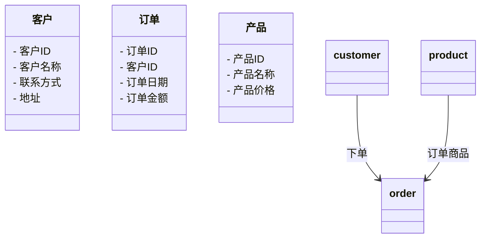
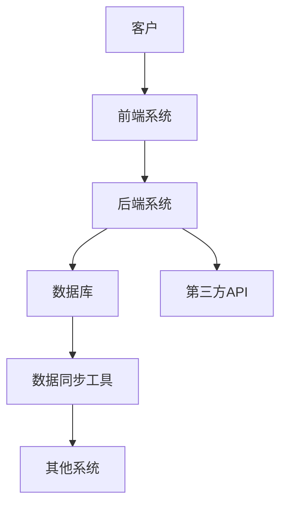

                 


# 客户关系管理集成

> 关键词：客户关系管理，系统集成，数据标准化，API接口，数据同步，异构系统，数字化转型

> 摘要：本文将深入探讨客户关系管理集成的核心概念、技术实现和系统架构，结合实际案例分析，详细讲解如何通过集成优化企业客户关系管理流程，实现数据的高效利用和业务的协同运作。

---

# 第1章: 客户关系管理集成的背景与现状

## 1.1 客户关系管理的定义与核心要素

### 1.1.1 客户关系管理的定义
客户关系管理（Customer Relationship Management，CRM）是指通过系统化的方法和工具，对企业与客户之间的关系进行管理、分析和优化的过程。其目标是提升客户满意度、忠诚度，从而实现企业业务目标。

### 1.1.2 客户关系管理的核心要素
- **客户数据**：包括客户的基本信息、交易记录、互动历史等。
- **业务流程**：包括客户获取、客户维护、客户流失管理等。
- **技术工具**：包括CRM系统、数据分析工具、自动化流程工具等。

### 1.1.3 客户关系管理的演进历程
从早期的手工记录到现代的数字化管理，CRM经历了从简单信息管理到复杂系统集成的演变。

---

## 1.2 客户关系管理集成的定义与特点

### 1.2.1 集成的定义
CRM集成是指将多个分散的CRM系统、数据源和业务流程进行整合，形成一个统一的客户关系管理系统。

### 1.2.2 集成的核心特点
- **统一性**：整合多个系统，形成统一的客户视图。
- **协同性**：实现系统之间的数据共享和业务协同。
- **灵活性**：适应不同业务场景和需求的变化。

### 1.2.3 集成与传统CRM的区别
传统CRM通常是一个独立的系统，而集成CRM则强调多个系统之间的协作和数据共享。

---

## 1.3 客户关系管理集成的现状与趋势

### 1.3.1 当前集成的主要方式
- **API集成**：通过API接口实现系统之间的数据交互。
- **数据同步**：通过数据同步工具实现数据的实时更新。
- **定制开发**：针对特定需求进行系统集成的定制开发。

### 1.3.2 集成技术的发展趋势
- **智能化**：利用AI技术进行数据清洗、预测和分析。
- **平台化**：基于云平台的CRM集成解决方案。
- **实时化**：实现数据的实时同步和业务流程的实时协同。

### 1.3.3 集成在企业数字化转型中的地位
CRM集成是企业数字化转型的重要组成部分，能够帮助企业实现数据的高效利用和业务的协同运作。

---

## 1.4 本章小结
本章介绍了客户关系管理的基本概念、核心要素以及集成的定义、特点和现状。通过分析CRM集成的背景和趋势，为后续的技术实现和系统设计奠定了基础。

---

# 第2章: 客户关系管理集成的核心概念

## 2.1 客户关系管理集成的框架与模型

### 2.1.1 集成框架的构成
CRM集成框架通常包括以下几个部分：
- 数据源：包括客户数据库、交易系统、社交媒体等。
- 数据处理：包括数据清洗、标准化、转换等。
- 数据存储：包括数据库、数据仓库等。
- 应用系统：包括CRM系统、业务系统等。

### 2.1.2 集成模型的分类
- **数据集成模型**：基于数据的集成方式。
- **系统集成模型**：基于系统的集成方式。
- **业务流程集成模型**：基于业务流程的集成方式。

### 2.1.3 集成框架与模型的关系
集成框架是模型的实现基础，模型是框架的具体应用形式。

---

## 2.2 数据标准化与数据清洗

### 2.2.1 数据标准化的定义与作用
数据标准化是指将不同来源的数据转换为统一格式的过程。其作用包括数据的一致性、准确性和可比性。

### 2.2.2 数据清洗的步骤与方法
- **数据清洗步骤**：数据采集、数据检查、数据转换、数据验证。
- **数据清洗方法**：去除重复数据、处理缺失值、纠正错误数据、统一数据格式。

### 2.2.3 数据标准化与清洗的工具
常用的工具包括Excel、Python（Pandas库）、数据清洗工具（如DataCleaner）等。

---

## 2.3 API接口与系统集成

### 2.3.1 API接口的定义与作用
API（Application Programming Interface）是系统之间的通信接口，用于实现数据的交互和功能的调用。

### 2.3.2 系统集成的实现方式
- **REST API**：基于HTTP协议的API接口。
- **SOAP API**：基于XML的API接口。
- **数据库API**：直接访问数据库的API接口。

### 2.3.3 API接口设计的注意事项
- **接口规范**：明确接口的输入、输出和调用方式。
- **权限管理**：确保API的安全性。
- **性能优化**：减少API的调用延迟。

---

## 2.4 数据同步与异构系统集成

### 2.4.1 数据同步的定义与实现
数据同步是指在多个系统之间保持数据一致性的过程。其实现方式包括实时同步和批量同步。

### 2.4.2 异构系统集成的挑战
- **数据格式差异**：不同系统之间的数据格式不统一。
- **接口兼容性**：不同系统的API接口可能存在兼容性问题。
- **数据一致性**：如何保证数据在不同系统之间的同步一致性。

### 2.4.3 异构系统集成的解决方案
- **数据转换层**：通过数据转换层实现数据格式的统一。
- **API网关**：通过API网关实现系统的统一接入和管理。
- **数据同步工具**：使用专门的数据同步工具实现数据的高效同步。

---

## 2.5 本章小结
本章详细讲解了CRM集成的核心概念，包括集成框架、数据标准化、API接口和异构系统集成等内容。通过这些概念的分析，为后续的技术实现奠定了理论基础。

---

# 第3章: 客户关系管理集成的技术实现

## 3.1 数据集成技术

### 3.1.1 数据抽取技术
数据抽取是从多个数据源中提取数据的过程。常用的技术包括数据库查询、文件解析等。

### 3.1.2 数据转换技术
数据转换是指将数据从一种格式转换为另一种格式的过程。常用的技术包括数据映射、数据转换规则等。

### 3.1.3 数据加载技术
数据加载是指将处理后的数据加载到目标系统中。常用的技术包括批量导入、增量加载等。

---

## 3.2 系统集成技术

### 3.2.1 系统集成的实现方式
- **API集成**：通过API接口实现系统之间的数据交互。
- **消息队列**：通过消息队列实现系统的异步通信。
- **中间件**：通过中间件实现系统的统一管理。

### 3.2.2 系统集成的工具与框架
- **Eclipse ETL**：数据集成工具。
- **Apache Kafka**：消息队列工具。
- **Spring Boot**：系统集成框架。

### 3.2.3 系统集成的注意事项
- **性能优化**：确保系统的高效运行。
- **安全性**：确保系统的数据安全。
- **可维护性**：确保系统的可维护性和可扩展性。

---

## 3.3 业务流程集成

### 3.3.1 业务流程的定义与优化
业务流程是指企业为实现特定目标而设计的一系列步骤。优化业务流程是提高企业效率的关键。

### 3.3.2 业务流程集成的实现步骤
- **流程建模**：使用BPMN（业务流程建模与标注）进行流程建模。
- **流程自动化**：通过自动化工具实现流程的自动化。
- **流程监控**：通过监控工具实现流程的实时监控。

### 3.3.3 业务流程集成的案例分析
以电商企业的客户订单处理流程为例，详细分析业务流程集成的实现过程。

---

## 3.4 本章小结
本章详细讲解了CRM集成的技术实现，包括数据集成、系统集成和业务流程集成等方面的内容。通过这些技术的实现，可以有效提升企业的客户关系管理水平。

---

# 第4章: 客户关系管理集成的系统架构设计

## 4.1 问题场景介绍
以一家中型电商企业的CRM集成需求为例，分析如何通过系统架构设计实现客户的统一管理和业务流程的协同运作。

---

## 4.2 系统功能设计

### 4.2.1 领域模型设计
使用Mermaid语法绘制领域模型类图，展示系统的功能模块及其关系。



---

## 4.3 系统架构设计

### 4.3.1 架构设计概述
使用Mermaid语法绘制系统架构图，展示系统的各个模块及其之间的关系。



---

## 4.4 系统接口设计

### 4.4.1 API接口设计
设计RESTful API接口，实现客户信息的查询、添加、修改和删除功能。

### 4.4.2 接口交互设计
使用Mermaid语法绘制接口交互序列图，展示系统之间的调用流程。

```mermaid
sequenceDiagram
    客户发起请求 --> 前端系统
    前端系统 --> 后端系统: 查询客户信息
    后端系统 --> 数据库: 查询客户数据
    数据库 --> 后端系统: 返回客户数据
    后端系统 --> 前端系统: 返回客户数据
    前端系统 --> 客户: 显示客户信息
```

---

## 4.5 本章小结
本章通过实际案例分析，详细讲解了CRM集成的系统架构设计，包括领域模型设计、架构设计和接口设计等内容。

---

# 第5章: 客户关系管理集成的项目实战

## 5.1 环境安装与配置

### 5.1.1 开发环境的安装
- 安装JDK、Python、Git等开发工具。
- 安装Eclipse、IntelliJ IDEA等IDE。

### 5.1.2 数据库的安装
- 安装MySQL、PostgreSQL等关系型数据库。
- 配置数据库连接信息。

### 5.1.3 第三方API的接入
- 注册第三方API（如支付宝API、微信API）。
- 配置API密钥和调用权限。

---

## 5.2 系统核心实现

### 5.2.1 数据处理模块的实现
使用Python编写数据处理脚本，实现数据的清洗、转换和加载功能。

```python
import pandas as pd

# 读取数据
df = pd.read_csv('input.csv')

# 数据清洗
df.drop_duplicates(inplace=True)
df.fillna(0, inplace=True)

# 数据转换
df['日期'] = pd.to_datetime(df['日期'])

# 数据保存
df.to_csv('output.csv', index=False)
```

### 5.2.2 系统集成模块的实现
使用Spring Boot框架编写API接口，实现系统的集成和数据同步功能。

```java
@RestController
@RequestMapping("/api")
class ApiController {
    @GetMapping("/test")
    public String test() {
        return "Hello, World!";
    }
}
```

---

## 5.3 系统测试与优化

### 5.3.1 系统测试
- 功能测试：测试系统的核心功能。
- 性能测试：测试系统的处理能力。
- 安全测试：测试系统的安全性。

### 5.3.2 系统优化
- 数据库优化：优化SQL查询，使用索引等。
- 网络优化：优化API接口的调用延迟。
- 代码优化：优化代码的可读性和可维护性。

---

## 5.4 本章小结
本章通过实际项目案例，详细讲解了CRM集成的实现过程，包括环境安装、系统核心实现和测试优化等内容。

---

# 第6章: 客户关系管理集成的最佳实践与总结

## 6.1 最佳实践

### 6.1.1 数据安全
- 数据加密：确保数据的安全性。
- 访问控制：控制数据的访问权限。

### 6.1.2 性能优化
- 数据库优化：优化数据库查询和存储。
- 系统优化：优化系统的响应时间和资源利用率。

### 6.1.3 用户体验
- 界面优化：提升用户体验。
- 操作优化：简化用户的操作流程。

---

## 6.2 本章小结
通过总结CRM集成的最佳实践，为企业的CRM集成提供了宝贵的参考和指导。

---

# 作者：AI天才研究院/AI Genius Institute & 禅与计算机程序设计艺术 /Zen And The Art of Computer Programming

---

以上是关于《客户关系管理集成》的技术博客文章的完整目录大纲和内容框架。希望这篇文章能够帮助读者深入了解CRM集成的核心概念、技术实现和系统架构，并通过实际案例分析，掌握CRM集成的实战技巧。

