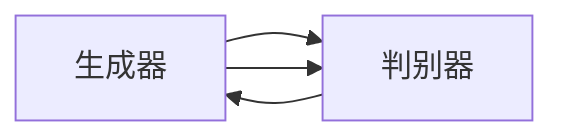
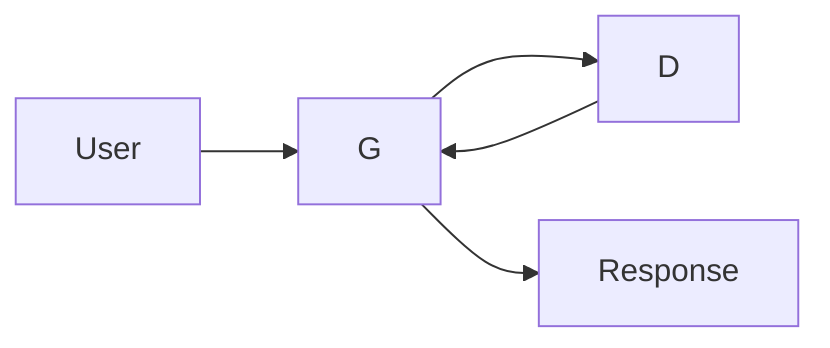
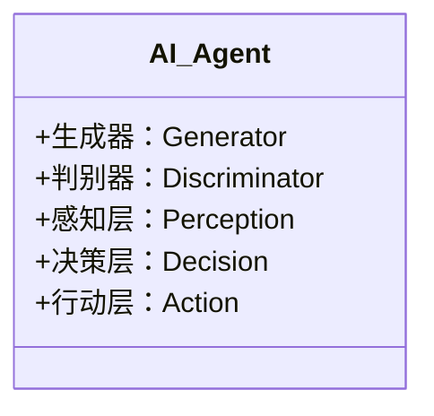
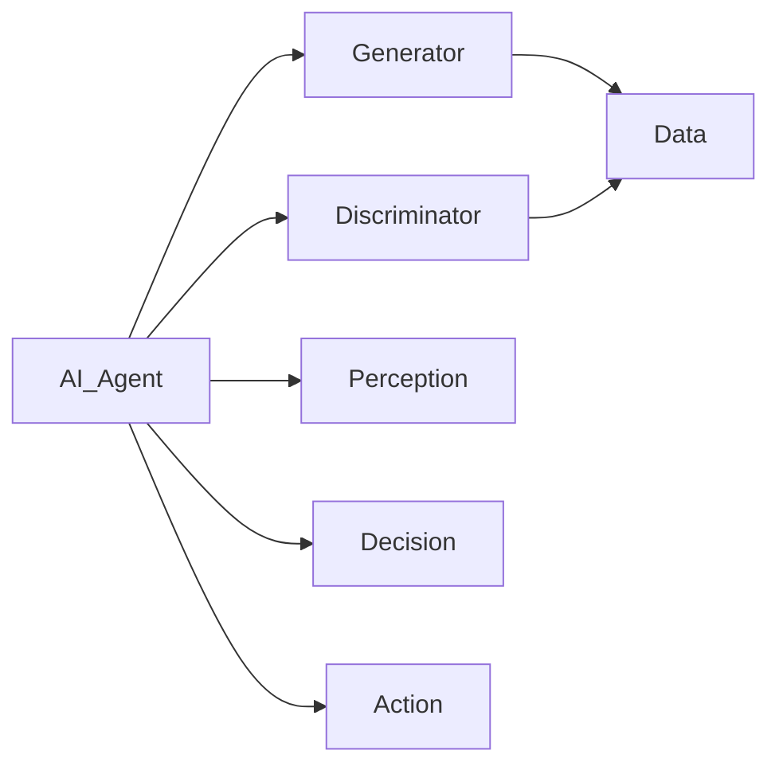
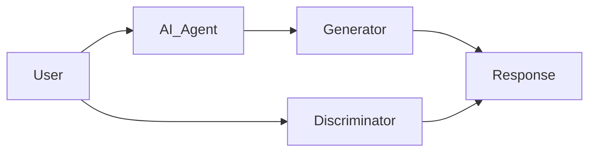

                 


# 对抗生成网络在AI Agent开发中的应用

## 关键词
对抗生成网络（GANs），AI Agent，生成式AI，深度学习，强化学习，对话系统

## 摘要
本文探讨了对抗生成网络（GANs）在AI Agent开发中的应用，从理论基础到实际案例，详细分析了GANs如何助力AI Agent的数据生成、对话系统和决策优化。文章涵盖GANs的核心原理、AI Agent的体系结构、系统设计及实战项目，提供深入的技术解析和代码实现，帮助读者掌握GANs在AI Agent中的应用。

---

# 第一部分: 对抗生成网络与AI Agent概述

## 第1章: 对抗生成网络与AI Agent的基本概念

### 1.1 对抗生成网络（GANs）的定义与特点

#### 1.1.1 什么是对抗生成网络
对抗生成网络（GANs）是一种深度学习模型，由生成器（Generator）和判别器（Discriminator）组成。生成器负责生成数据，判别器则辨别数据是否为真实数据。两者的竞争优化使生成器逐渐生成逼真的数据。

图1.1展示了GANs的基本结构：



GANs的核心目标是通过交替优化生成器和判别器，使生成器生成的数据能够欺骗判别器。生成器的损失函数为：

$$ L_G = \log(1 - D(G(x))) $$

判别器的损失函数为：

$$ L_D = \log(D(x)) + \log(1 - D(G(x))) $$

#### 1.1.2 GANs的核心特点
- **对抗性训练**：生成器和判别器通过对抗优化，生成器生成的数据逐渐接近真实数据分布。
- **无监督学习**：GANs可以在无标签数据的情况下进行训练。
- **多样性生成**：通过对抗训练，GANs能够生成多样化的数据。

#### 1.1.3 GANs与传统生成模型的区别
传统生成模型如马尔可夫链通常依赖特定的生成规则，而GANs通过神经网络学习数据分布，生成更逼真的数据。

### 1.2 AI Agent的基本概念与体系结构

#### 1.2.1 什么是AI Agent
AI Agent是一种智能体，能够感知环境、做出决策并执行动作。AI Agent广泛应用于自动驾驶、智能助手等领域。

AI Agent的体系结构通常包括感知层、决策层和行动层。感知层负责数据处理，决策层进行策略选择，行动层执行操作。

#### 1.2.2 AI Agent的体系结构
AI Agent的体系结构分为三大部分：
1. **感知层**：处理输入数据，提取特征。
2. **决策层**：基于特征进行决策。
3. **行动层**：执行决策动作。

#### 1.2.3 AI Agent的核心功能与应用场景
AI Agent的核心功能包括数据处理、智能决策和人机交互。应用场景包括智能助手、自动驾驶和游戏AI。

## 第2章: 对抗生成网络在AI Agent中的应用背景

### 2.1 AI Agent开发中的挑战

#### 2.1.1 数据生成的难点
AI Agent需要处理大量数据，数据生成的多样性和真实性是关键挑战。

#### 2.1.2 智能交互中的生成需求
在对话系统中，生成自然的回复是关键，但传统方法难以达到人类水平。

#### 2.1.3 对抗生成网络的优势
GANs能够生成高质量的数据，提升AI Agent的性能。

### 2.2 对抗生成网络在AI Agent中的应用潜力

#### 2.2.1 数据生成与增强
GANs可以生成多样化的数据，增强AI Agent的数据处理能力。

#### 2.2.2 生成对话与交互
GANs能够生成自然的对话，提升AI Agent的交互能力。

#### 2.2.3 智能决策支持
GANs辅助生成决策方案，增强AI Agent的决策能力。

## 第3章: 对抗生成网络的核心原理

### 3.1 GANs的基本结构

#### 3.1.1 生成器（Generator）
生成器通过卷积层和全连接层生成数据，通常采用双曲正切函数作为激活函数。

#### 3.1.2 判别器（Discriminator）
判别器负责辨别数据是否真实，通常采用sigmoid函数作为输出层。

#### 3.1.3 损失函数与优化目标
生成器和判别器的损失函数相互关联，共同优化。

### 3.2 GANs的训练过程

#### 3.2.1 交替训练策略
生成器和判别器交替训练，逐步优化模型参数。

#### 3.2.2 梯度消失问题与解决方案
为解决梯度消失问题，采用Wasserstein GAN（WGAN）等改进算法。

#### 3.2.3 坍缩问题与模式崩溃
为缓解模式崩溃，引入标签对抗训练等方法。

### 3.3 改进的GANs算法

#### 3.3.1 WGAN-GP
WGAN-GP通过 Wasserstein距离和梯度惩罚，稳定训练过程。

#### 3.3.2 StyleGAN
StyleGAN通过风格映射提升生成图像的质量和多样性。

#### 3.3.3 CycleGAN
CycleGAN无需成对数据，用于图像到图像的转换任务。

## 第4章: 对抗生成网络在AI Agent中的系统架构

### 4.1 AI Agent的整体架构

#### 4.1.1 感知层
感知层处理输入数据，提取特征。

#### 4.1.2 决策层
决策层基于特征进行决策，生成多种可能的方案。

#### 4.1.3 行动层
行动层执行决策，与环境交互。

### 4.2 GANs在AI Agent中的集成方式

#### 4.2.1 数据生成模块
GANs生成多样化数据，增强训练数据集。

#### 4.2.2 生成式对话模块
GANs生成自然对话，提升交互体验。

#### 4.2.3 智能决策辅助模块
GANs辅助生成多种决策方案，优化决策质量。

---

# 第二部分: 对抗生成网络在AI Agent中的具体应用

## 第5章: 智能对话系统的生成优化

### 5.1 智能对话系统的挑战

#### 5.1.1 对话生成的难点
对话生成需要考虑上下文、情感等因素，传统方法难以生成自然对话。

### 5.2 GANs在对话生成中的应用

#### 5.2.1 对话生成模型
基于GANs的对话生成模型通过生成器生成回复，判别器评估回复质量。

图5.1展示了对话生成模型的流程图：



#### 5.2.2 案例分析
案例分析：生成式对话系统在智能助手中的应用。

## 第6章: 数据增强与模拟生成

### 6.1 数据增强的必要性

#### 6.1.1 数据多样性的需求
AI Agent需要处理多样化的数据，提升模型鲁棒性。

### 6.2 GANs在数据生成中的应用

#### 6.2.1 图像生成
使用GANs生成图像数据，增强训练数据集。

### 6.3 案例分析：图像生成

#### 6.3.1 使用GANs生成图像
案例分析：使用GANs生成高质量图像，提升AI Agent的数据处理能力。

## 第7章: 智能决策与策略优化

### 7.1 决策生成的需求

#### 7.1.1 智能决策的挑战
AI Agent需要生成多样化的决策方案，提升决策质量。

### 7.2 GANs在决策生成中的应用

#### 7.2.1 决策生成模型
基于GANs的决策生成模型生成多种决策方案，优化决策质量。

### 7.3 案例分析：游戏AI

#### 7.3.1 GANs在游戏AI中的应用
案例分析：使用GANs生成游戏AI的策略，提升游戏体验。

---

# 第三部分: 项目实战与代码实现

## 第8章: 项目实战与代码实现

### 8.1 环境安装

#### 8.1.1 安装Python和相关库
安装Python 3.6及以上版本，安装TensorFlow、Keras、PyTorch等深度学习库。

### 8.2 系统核心实现源代码

#### 8.2.1 生成器代码
生成器代码示例：

```python
import tensorflow as tf
from tensorflow.keras.layers import Dense, LeakyReLU

generator = tf.keras.Sequential([
    Dense(256, input_dim=100),
    LeakyReLU(0.2),
    Dense(128),
    LeakyReLU(0.2),
    Dense(64),
    LeakyReLU(0.2),
    Dense(1),
    tf.nn.sigmoid()
])
```

#### 8.2.2 判别器代码
判别器代码示例：

```python
discriminator = tf.keras.Sequential([
    Dense(64, input_dim=1),
    LeakyReLU(0.2),
    Dense(32),
    LeakyReLU(0.2),
    Dense(1),
    tf.nn.sigmoid()
])
```

#### 8.2.3 GANs训练代码
GANs训练代码示例：

```python
# 定义损失函数
cross_entropy = tf.keras.losses.BinaryCrossentropy()

# 定义生成器和判别器的损失函数
def generator_loss(generated_output):
    return cross_entropy(tf.ones_like(generated_output), generated_output)

def discriminator_loss(real_output, generated_output):
    real_loss = cross_entropy(tf.ones_like(real_output), real_output)
    generated_loss = cross_entropy(tf.zeros_like(generated_output), generated_output)
    total_loss = real_loss + generated_loss
    return total_loss

# 定义优化器
generator_optimizer = tf.keras.optimizers.Adam(1e-4)
discriminator_optimizer = tf.keras.optimizers.Adam(1e-4)

# 训练过程
for epoch in range(num_epochs):
    for batch in dataset:
        noise = tf.random.normal([batch_size, 100])
        generated_images = generator(noise, training=True)
        real_images = next(iter(dataset))
        
        # 判别器训练
        with tf.GradientTape() as d_tape:
            d_loss = discriminator_loss(real_images, generated_images)
            gradients = d_tape.gradient(d_loss, discriminator.trainable_weights)
            discriminator_optimizer.apply_gradients(zip(gradients, discriminator.trainable_weights))
        
        # 生成器训练
        with tf.GradientTape() as g_tape:
            g_loss = generator_loss(generated_images)
            gradients = g_tape.gradient(g_loss, generator.trainable_weights)
            generator_optimizer.apply_gradients(zip(gradients, generator.trainable_weights))
```

#### 8.2.4 项目实战：生成对话系统
案例分析：使用GANs生成对话系统，提升交互体验。

## 第9章: 项目小结与优化

### 9.1 项目小结

#### 9.1.1 项目成果
通过GANs实现了高质量的数据生成和对话生成，提升了AI Agent的性能。

### 9.1.2 项目优化
优化训练过程，提升生成质量，降低训练时间。

---

# 第四部分: 系统分析与架构设计方案

## 第10章: 系统分析与架构设计方案

### 10.1 问题场景介绍

#### 10.1.1 项目背景
项目背景：开发一个基于GANs的AI Agent，提升其数据生成和对话生成能力。

### 10.2 项目介绍

#### 10.2.1 项目目标
项目目标：实现高质量的数据生成和对话生成，提升AI Agent的性能。

### 10.3 系统功能设计

#### 10.3.1 领域模型（类图）



#### 10.3.2 系统架构设计



### 10.4 系统接口设计

#### 10.4.1 系统接口
系统接口包括数据输入接口、生成接口和输出接口。

### 10.5 系统交互设计

#### 10.5.1 交互流程图



---

# 第五部分: 最佳实践、小结与展望

## 第11章: 最佳实践、小结与展望

### 11.1 最佳实践

#### 11.1.1 模型优化
选择合适的GANs变体，优化模型结构和训练参数。

#### 11.1.2 数据预处理
预处理数据，提升生成质量。

### 11.2 项目小结

#### 11.2.1 项目成果
通过GANs实现了高质量的数据生成和对话生成，提升了AI Agent的性能。

### 11.2.2 项目经验
GANs在AI Agent中的应用需要结合具体场景，优化模型结构和训练过程。

### 11.3 项目展望

#### 11.3.1 技术改进
探索更先进的GANs算法，提升生成质量。

#### 11.3.2 应用扩展
将GANs应用于更多AI Agent场景，如图像生成和决策优化。

---

# 作者：AI天才研究院 & 禅与计算机程序设计艺术

---

以上是一个详细的目录结构，涵盖了从理论到实践的各个方面，确保内容详实，结构清晰。每个章节都详细展开了相关内容，并提供了必要的代码示例和图表，帮助读者全面理解对抗生成网络在AI Agent中的应用。

