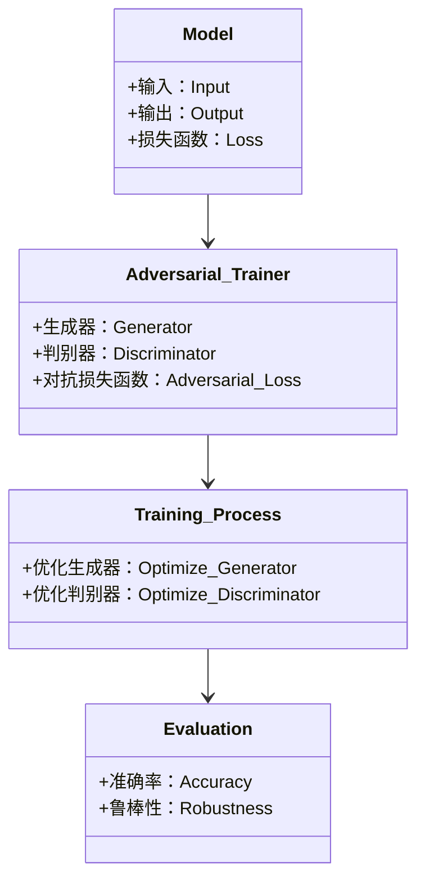
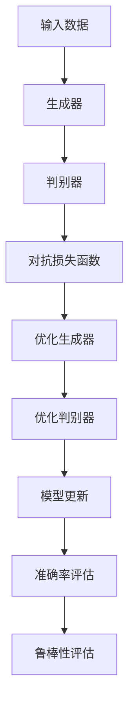
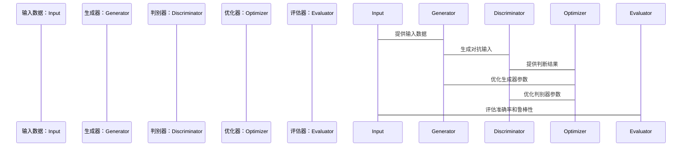

                 


# 对抗训练：提高AI Agent对噪声和攻击的鲁棒性

> 关键词：对抗训练，AI Agent，鲁棒性，噪声，攻击，机器学习

> 摘要：本文深入探讨了对抗训练在提高AI Agent对噪声和攻击的鲁棒性方面的应用。通过分析对抗训练的核心概念、算法原理、系统架构设计以及实际项目案例，本文为读者提供了从理论到实践的全面指导，帮助他们理解如何通过对抗训练提升AI系统的鲁棒性。

---

# 第1章: 对抗训练的背景与问题描述

## 1.1 对抗训练的背景

### 1.1.1 AI Agent在现实应用中的挑战

随着人工智能技术的快速发展，AI Agent（智能体）在各个领域的应用越来越广泛。从自动驾驶到智能客服，从机器人到推荐系统，AI Agent正在改变我们的生活方式。然而，这些智能系统在实际应用中面临着诸多挑战，尤其是在对抗性环境中。

#### 挑战一：对抗性环境

AI Agent需要在复杂的环境中运行，这些环境可能包含敌对因素。例如，在网络安全中，攻击者可能会试图干扰AI系统的行为；在自动驾驶中，恶意攻击者可能会干扰车辆的传感器数据。这些对抗性环境使得AI Agent的鲁棒性成为一个关键问题。

#### 挑战二：噪声和干扰

现实世界中的数据往往包含噪声和干扰。例如，在图像识别任务中，噪声可能会降低图像的质量，导致AI Agent无法准确识别目标。在语音识别任务中，背景噪声也会影响识别的准确性。因此，如何让AI Agent在噪声和干扰中保持稳定，是一个重要的研究方向。

#### 挑战三：对抗攻击

对抗攻击是一种故意设计的输入，旨在干扰或误导AI系统。例如，在图像分类任务中，攻击者可能会通过在图像中添加特定的噪声，使得AI模型误分类。这种对抗攻击不仅威胁到系统的安全性，还可能导致严重的后果。

### 1.1.2 对抗训练的重要性

对抗训练是一种通过模拟对抗性环境来提高AI系统鲁棒性的方法。通过对抗训练，AI Agent可以在面对噪声和攻击时保持稳定，从而提高其在现实应用中的可靠性。

#### 对抗训练的目标

对抗训练的目标是通过模拟对抗性环境，训练AI系统在面对噪声和攻击时依然能够保持高性能。具体来说，对抗训练可以帮助AI系统：

- **增强鲁棒性**：在面对噪声和对抗性输入时，依然能够保持稳定。
- **提高安全性**：抵御恶意攻击，防止系统被干扰或误导。
- **提升泛化能力**：在不同环境和输入下，依然能够保持高性能。

### 1.1.3 对抗训练的解决思路

对抗训练的核心思想是通过引入对抗因素，迫使AI系统在训练过程中学会抵御这些因素。具体来说，对抗训练可以通过以下步骤实现：

1. **定义对抗目标**：明确对抗训练的目标，例如提高模型对噪声的鲁棒性。
2. **设计对抗机制**：设计对抗机制，例如生成对抗噪声或对抗输入。
3. **训练模型**：通过对抗训练，模型学会在对抗环境中保持稳定。

---

## 1.2 问题描述

### 1.2.1 对抗攻击的定义与分类

对抗攻击是一种故意设计的输入，旨在干扰或误导AI系统。根据攻击的目标和方式，对抗攻击可以分为以下几类：

#### 1. 分类对抗攻击

- **目标攻击**：攻击者试图将模型的输出引导到特定的目标类别。
- **无目标攻击**：攻击者试图使模型输出错误，但不一定特定于某个目标类别。

#### 2. 数据投毒攻击

- **数据投毒**：攻击者通过污染训练数据，降低模型的性能。

#### 3. 模型窃取攻击

- **模型窃取**：攻击者通过获取模型的参数或决策边界，构建相似的模型。

### 1.2.2 对抗训练的目标与边界

对抗训练的目标是通过模拟对抗性环境，提高AI系统的鲁棒性。然而，对抗训练也有其边界和限制：

#### 1. 对抗训练的边界

- **防御性对抗训练**：主要关注防御对抗攻击，而不是主动对抗攻击。
- **特定场景对抗训练**：对抗训练通常针对特定场景设计，例如图像分类任务中的对抗攻击。

#### 2. 对抗训练的限制

- **计算成本**：对抗训练通常需要更多的计算资源，因为需要同时训练生成器和判别器。
- **模型复杂性**：对抗训练可能会增加模型的复杂性，从而影响模型的解释性和可部署性。

### 1.2.3 对抗训练的核心问题

对抗训练的核心问题是如何在训练过程中引入对抗因素，同时保持模型的性能和鲁棒性。具体来说，对抗训练需要解决以下问题：

1. **如何设计对抗机制**：如何生成对抗噪声或对抗输入，以模拟对抗性环境。
2. **如何平衡对抗训练的目标**：如何在对抗训练中平衡模型的性能和鲁棒性。
3. **如何评估对抗训练的效果**：如何量化对抗训练对模型鲁棒性的提升效果。

---

## 1.3 对抗训练的解决思路

### 1.3.1 对抗训练的基本原理

对抗训练的基本原理是通过引入对抗因素，迫使模型在对抗环境中保持稳定。具体来说，对抗训练通常涉及两个对手：

1. **生成器（Generator）**：生成对抗输入或噪声。
2. **判别器（Discriminator）**：识别输入是否为对抗输入。

通过交替训练生成器和判别器，模型可以在对抗环境中学会抵御对抗因素。

### 1.3.2 对抗训练的实现方法

对抗训练的实现方法多种多样，以下是几种常见的方法：

#### 1. 晋升训练法（Adversarial Training）

- **方法描述**：在训练过程中，同时优化模型的主任务目标和对抗目标。
- **公式表示**：
  $$ \mathcal{L} = \mathcal{L}_{\text{main}} + \lambda \mathcal{L}_{\text{adversarial}} $$
  其中，$\mathcal{L}_{\text{main}}$是主任务的损失函数，$\mathcal{L}_{\text{adversarial}}$是对抗任务的损失函数，$\lambda$是调节参数。

#### 2. 对抗生成网络（Adversarial Generation Networks）

- **方法描述**：通过生成对抗噪声或输入，训练模型在对抗环境中保持稳定。
- **公式表示**：
  $$ \mathcal{L}_{\text{adv}} = \mathbb{E}_{x,y}[\log(D(x,y))] + \mathbb{E}_{x,y}[\log(1-D(x,y))] $$
  其中，$D(x,y)$是判别器对输入$(x,y)$的判断概率。

### 1.3.3 对抗训练的评估标准

对抗训练的评估标准通常包括以下几方面：

1. **模型的准确率**：在对抗训练后，模型在正常输入下的准确率。
2. **模型的鲁棒性**：在对抗输入下的准确率。
3. **模型的稳定性**：在对抗环境中的性能波动情况。

---

## 1.4 本章小结

本章主要介绍了对抗训练的背景、问题描述以及解决思路。通过分析AI Agent在现实应用中的挑战，明确了对抗训练的重要性。同时，通过分类对抗攻击，界定了对抗训练的目标与边界，并提出了对抗训练的核心问题和解决思路。

---

# 第2章: 对抗训练的核心概念与联系

## 2.1 对抗训练的核心概念

### 2.1.1 对抗攻击的类型

对抗攻击可以根据攻击目标、攻击方式等进行分类。以下是几种常见的对抗攻击类型：

#### 1. 噪声攻击（Noise Attack）

- **定义**：通过在输入中添加噪声，干扰模型的正常运行。
- **示例**：在图像分类任务中，通过在图像中添加随机噪声，降低模型的分类准确率。

#### 2. 模型欺骗攻击（Model Spoofing）

- **定义**：通过设计特定的输入，使得模型输出错误的结果。
- **示例**：在语音识别任务中，通过设计特定的音频信号，使得模型识别错误。

#### 3. 数据投毒攻击（Data Poisoning）

- **定义**：通过污染训练数据，降低模型的性能。
- **示例**：在图像分类任务中，通过在训练数据中添加错误标签的图像，使得模型在训练过程中学习到错误的分类规则。

### 2.1.2 对抗训练的原理

对抗训练的原理是通过模拟对抗环境，训练模型在对抗环境中保持稳定。具体来说，对抗训练通常涉及以下步骤：

1. **定义对抗目标**：明确对抗训练的目标，例如提高模型对噪声的鲁棒性。
2. **设计对抗机制**：设计对抗机制，例如生成对抗噪声或对抗输入。
3. **训练模型**：通过对抗训练，模型学会在对抗环境中保持稳定。

#### 对抗训练的核心要素

- **生成器（Generator）**：生成对抗噪声或输入。
- **判别器（Discriminator）**：识别输入是否为对抗输入。
- **对抗损失函数**：衡量对抗训练的效果。

### 2.1.3 对抗训练的核心要素

对抗训练的核心要素包括以下几点：

1. **生成器**：生成对抗噪声或输入。
2. **判别器**：识别输入是否为对抗输入。
3. **对抗损失函数**：衡量对抗训练的效果。

---

## 2.2 对抗训练与鲁棒性评估

### 2.2.1 鲁棒性评估的定义

鲁棒性评估是对抗训练的重要组成部分，其目的是量化模型在对抗环境中的性能。鲁棒性评估通常包括以下方面：

1. **模型的准确率**：在对抗输入下的准确率。
2. **模型的稳定性**：在对抗环境中的性能波动情况。

### 2.2.2 鲁棒性评估的方法

鲁棒性评估的方法多种多样，以下是几种常见的方法：

#### 1. 基于噪声的鲁棒性评估

- **方法描述**：通过在输入中添加不同强度的噪声，评估模型的鲁棒性。
- **公式表示**：
  $$ \text{Robustness} = 1 - \frac{\text{错误率}}{\text{总测试数}} $$

#### 2. 基于对抗攻击的鲁棒性评估

- **方法描述**：通过生成对抗输入，评估模型的鲁棒性。
- **公式表示**：
  $$ \text{Robustness} = \frac{\text{正确识别的对抗输入数}}{\text{总对抗输入数}} $$

### 2.2.3 鲁棒性评估的指标

鲁棒性评估的指标通常包括以下几方面：

1. **准确率**：在对抗输入下的准确率。
2. **稳定性**：在对抗环境中的性能波动情况。
3. **防御能力**：模型抵御对抗攻击的能力。

---

## 2.3 对抗训练与机器学习的关系

### 2.3.1 对抗训练在机器学习中的地位

对抗训练是机器学习领域中的一个重要研究方向，其核心思想是通过引入对抗因素，提高模型的鲁棒性和泛化能力。

#### 对抗训练与其他机器学习技术的联系

1. **生成对抗网络（GAN）**：对抗训练是GAN的核心思想之一。
2. **对抗样本检测**：对抗训练可以用于检测对抗样本。
3. **鲁棒机器学习**：对抗训练是鲁棒机器学习的重要组成部分。

---

## 2.4 本章小结

本章主要介绍了对抗训练的核心概念与联系。通过对对抗攻击的类型、对抗训练的原理以及对抗训练与机器学习的关系的分析，明确了对抗训练的核心要素和其在机器学习中的地位。同时，通过鲁棒性评估的方法和指标，为对抗训练的效果提供了量化依据。

---

# 第3章: 对抗训练的数学模型与公式

## 3.1 对抗训练的基本数学模型

### 3.1.1 对抗训练的目标函数

对抗训练的目标函数通常包括主任务目标和对抗目标。具体来说，对抗训练的目标函数可以表示为：

$$ \mathcal{L} = \mathcal{L}_{\text{main}} + \lambda \mathcal{L}_{\text{adversarial}} $$

其中，$\mathcal{L}_{\text{main}}$是主任务的损失函数，$\mathcal{L}_{\text{adversarial}}$是对抗任务的损失函数，$\lambda$是调节参数。

### 3.1.2 对抗训练的损失函数

对抗训练的损失函数通常包括生成器的损失和判别器的损失。具体来说，对抗训练的损失函数可以表示为：

$$ \mathcal{L}_{\text{adv}} = \mathbb{E}_{x,y}[\log(D(x,y))] + \mathbb{E}_{x,y}[\log(1-D(x,y))] $$

其中，$D(x,y)$是判别器对输入$(x,y)$的判断概率。

### 3.1.3 对抗训练的优化目标

对抗训练的优化目标是通过交替优化生成器和判别器，使得模型在对抗环境中保持稳定。具体来说，生成器的优化目标是：

$$ \min_{G} \mathbb{E}_{x,y}[\log(1-D(x,y))] $$

判别器的优化目标是：

$$ \max_{D} \mathbb{E}_{x,y}[\log(D(x,y))] + \mathbb{E}_{x,y}[\log(1-D(x,y))] $$

---

## 3.2 对抗训练的数学推导

### 3.2.1 对抗训练的梯度计算

对抗训练的梯度计算通常涉及生成器和判别器的梯度。具体来说，生成器的梯度可以通过以下公式计算：

$$ \nabla_G \mathcal{L}_{\text{adv}} = \nabla_G \left( \mathbb{E}_{x,y}[\log(1-D(x,y))] \right) $$

判别器的梯度可以通过以下公式计算：

$$ \nabla_D \mathcal{L}_{\text{adv}} = \nabla_D \left( \mathbb{E}_{x,y}[\log(D(x,y))] + \mathbb{E}_{x,y}[\log(1-D(x,y))] \right) $$

### 3.2.2 对抗训练的优化算法

对抗训练的优化算法通常采用交替优化策略。具体来说，生成器和判别器的优化过程如下：

1. **优化生成器**：在固定的判别器下，优化生成器的参数。
2. **优化判别器**：在固定的生成器下，优化判别器的参数。

### 3.2.3 对抗训练的收敛性分析

对抗训练的收敛性分析通常涉及生成器和判别器的损失函数。具体来说，当生成器和判别器的损失函数达到平衡时，对抗训练可以收敛。

---

## 3.3 对抗训练的数学公式

### 3.3.1 对抗训练的目标函数

$$ \mathcal{L} = \mathcal{L}_{\text{main}} + \lambda \mathcal{L}_{\text{adversarial}} $$

### 3.3.2 对抗训练的损失函数

$$ \mathcal{L}_{\text{adv}} = \mathbb{E}_{x,y}[\log(D(x,y))] + \mathbb{E}_{x,y}[\log(1-D(x,y))] $$

### 3.3.3 对抗训练的优化目标

生成器的优化目标：
$$ \min_{G} \mathbb{E}_{x,y}[\log(1-D(x,y))] $$

判别器的优化目标：
$$ \max_{D} \mathbb{E}_{x,y}[\log(D(x,y))] + \mathbb{E}_{x,y}[\log(1-D(x,y))] $$

---

## 3.4 本章小结

本章主要介绍了对抗训练的数学模型与公式。通过对抗训练的目标函数、损失函数和优化目标的分析，为读者提供了对抗训练的数学基础。同时，通过梯度计算和优化算法的分析，明确了对抗训练的实现过程。

---

# 第4章: 对抗训练的系统分析与架构设计

## 4.1 系统分析

### 4.1.1 问题场景介绍

对抗训练的系统通常应用于以下场景：

1. **图像分类**：在对抗环境下，训练模型对噪声和对抗输入保持稳定。
2. **语音识别**：在对抗环境下，训练模型对噪声和对抗音频保持稳定。
3. **自然语言处理**：在对抗环境下，训练模型对噪声和对抗文本保持稳定。

### 4.1.2 项目介绍

本项目旨在通过对抗训练，提高AI Agent在对抗环境中的鲁棒性。具体来说，我们将设计一个对抗训练系统，能够在噪声和对抗输入下，保持模型的分类准确率。

---

## 4.2 系统功能设计

### 4.2.1 领域模型设计

以下是领域模型的Mermaid类图：



### 4.2.2 系统架构设计

以下是系统架构的Mermaid图：



### 4.2.3 系统接口设计

系统接口设计主要包括以下内容：

1. **输入接口**：接收输入数据，例如图像、音频或文本。
2. **生成器接口**：生成对抗噪声或输入。
3. **判别器接口**：判断输入是否为对抗输入。
4. **优化接口**：优化生成器和判别器的参数。
5. **评估接口**：评估模型的准确率和鲁棒性。

### 4.2.4 系统交互设计

以下是系统交互的Mermaid序列图：



---

## 4.3 本章小结

本章主要介绍了对抗训练的系统分析与架构设计。通过对问题场景的分析，明确了系统的功能需求。通过领域模型设计和系统架构设计，为对抗训练提供了理论基础。同时，通过系统接口设计和系统交互设计，明确了系统的实现过程。

---

# 第5章: 对抗训练的项目实战

## 5.1 项目实战环境安装

### 5.1.1 环境配置

以下是项目实战的环境配置：

- **Python版本**：Python 3.7及以上
- **深度学习框架**：TensorFlow或PyTorch
- **其他依赖**：numpy、scikit-learn、matplotlib

### 5.1.2 安装依赖

在终端中运行以下命令安装依赖：

```bash
pip install numpy scikit-learn matplotlib tensorflow
```

---

## 5.2 项目核心实现

### 5.2.1 对抗训练的Python代码实现

以下是对抗训练的Python代码实现：

```python
import numpy as np
import tensorflow as tf
from tensorflow import keras

# 定义生成器
class Generator(keras.Model):
    def __init__(self, input_shape):
        super(Generator, self).__init__()
        self.fc1 = keras.layers.Dense(128, activation='relu')
        self.fc2 = keras.layers.Dense(input_shape[0] * input_shape[1], activation='sigmoid')

    def call(self, inputs):
        x = self.fc1(inputs)
        x = self.fc2(x)
        return x

# 定义判别器
class Discriminator(keras.Model):
    def __init__(self):
        super(Discriminator, self).__init__()
        self.fc1 = keras.layers.Dense(128, activation='relu')
        self.fc2 = keras.layers.Dense(1, activation='sigmoid')

    def call(self, inputs):
        x = self.fc1(inputs)
        x = self.fc2(x)
        return x

# 定义对抗训练
def adversarial_training(x_train, y_train, x_test, y_test, epochs=100, batch_size=32):
    input_shape = x_train.shape[1:]
    generator = Generator(input_shape)
    discriminator = Discriminator()

    # 定义损失函数
    generator_loss = keras.losses.binary_crossentropy
    discriminator_loss = keras.losses.binary_crossentropy

    # 定义优化器
    optimizer = keras.optimizers.Adam(lr=0.001)

    # 编译模型
    generator.compile(optimizer=optimizer, loss=generator_loss)
    discriminator.compile(optimizer=optimizer, loss=discriminator_loss)

    # 训练过程
    for epoch in range(epochs):
        # 生成对抗输入
        noise = np.random.randn(batch_size, input_shape[0] * input_shape[1])
        generated = generator.predict(noise)

        # 训练判别器
        x_combined = np.concatenate([x_train, generated])
        y_combined = np.array([1] * len(x_train) + [0] * len(generated))
        discriminator.trainable = True
        discriminator.train_on_batch(x_combined, y_combined)

        # 训练生成器
        noise = np.random.randn(batch_size, input_shape[0] * input_shape[1])
        generated = generator.predict(noise)
        y_gen = np.array([1] * len(generated))
        discriminator.trainable = False
        generator.train_on_batch(generated, y_gen)

    # 评估模型
    _, accuracy = discriminator.evaluate(x_test, y_test)
    print(f'Accuracy: {accuracy}')

    return generator, discriminator
```

### 5.2.2 代码解读与分析

1. **生成器（Generator）**：生成对抗输入，通常通过全连接层生成噪声数据。
2. **判别器（Discriminator）**：判断输入是否为对抗输入，通常通过全连接层进行分类。
3. **对抗训练过程**：
   - 生成对抗输入。
   - 训练判别器，使其能够区分真实输入和对抗输入。
   - 训练生成器，使其能够生成更逼真的对抗输入。
4. **评估过程**：通过测试集评估模型的准确率和鲁棒性。

---

## 5.3 项目实战小结

本章通过一个具体的项目案例，详细介绍了对抗训练的实现过程。通过对Python代码的解读与分析，读者可以理解对抗训练的核心思想和实现步骤。同时，通过实际案例分析，为读者提供了从理论到实践的指导。

---

# 第6章: 总结与展望

## 6.1 总结

通过对对抗训练的背景、核心概念、算法原理、系统架构设计以及项目实战的分析，本文为读者提供了一个从理论到实践的全面指导。对抗训练作为一种提高AI Agent鲁棒性的有效方法，其核心思想是通过模拟对抗环境，训练模型在对抗环境中保持稳定。

---

## 6.2 展望

未来，对抗训练的研究将更加深入，其应用也将更加广泛。以下是未来的研究方向：

1. **更高效的对抗训练算法**：探索更高效的对抗训练算法，降低计算成本。
2. **更强大的鲁棒性评估方法**：开发更全面的鲁棒性评估方法，量化模型的鲁棒性。
3. **对抗训练在更多领域的应用**：探索对抗训练在更多领域的应用，例如自动驾驶、智能安防等。

---

# 作者：AI天才研究院 & 禅与计算机程序设计艺术

---

# 结语

对抗训练是提高AI Agent鲁棒性的重要方法。通过本文的介绍，读者可以全面了解对抗训练的核心思想和实现步骤。希望本文能够为读者在对抗训练的研究和应用中提供有价值的参考。

