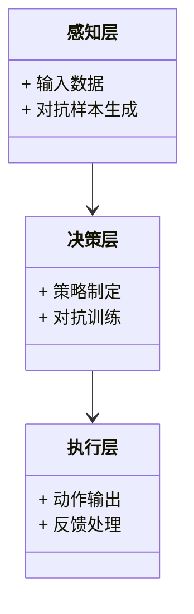

                 


# 对抗训练：提高AI Agent的鲁棒性

> 关键词：对抗训练，AI Agent，鲁棒性，生成对抗网络，深度学习

> 摘要：本文深入探讨对抗训练在提升AI Agent鲁棒性中的应用，从理论基础到算法实现，再到系统设计和项目实战，全面解析对抗训练的核心概念和实际价值。通过详细分析，读者将掌握如何利用对抗训练来增强AI Agent的稳定性和适应性，应对复杂多变的真实世界挑战。

---

# 第一部分：对抗训练基础

## 第1章：对抗训练的背景与概念

### 1.1 对抗训练的起源与背景

#### 1.1.1 机器学习的局限性
- 数据分布偏移问题
- 对抗攻击的威胁
- 现实世界中的不确定性

#### 1.1.2 对抗训练的提出与目标
- 提出背景：深度学习的脆弱性
- 核心目标：提升模型鲁棒性
- 对抗训练的核心理念：通过模拟对抗场景增强模型的稳健性

#### 1.1.3 对抗训练在AI Agent中的应用前景
- AI Agent在复杂环境中的应用
- 对抗训练提升AI Agent的适应能力
- 未来发展趋势：结合强化学习和对抗训练

### 1.2 AI Agent的基本概念

#### 1.2.1 AI Agent的定义与分类
- 定义：AI Agent是能够感知环境并采取行动以实现目标的智能实体
- 分类：基于智能水平和环境交互方式的分类
- 核心功能：感知、决策、行动

#### 1.2.2 AI Agent的核心功能与特点
- 感知层：数据采集与处理
- 决策层：策略制定与优化
- 执行层：动作输出与反馈

#### 1.2.3 AI Agent的应用场景与挑战
- 场景：自动驾驶、智能助手、机器人控制
- 挑战：复杂环境中的决策鲁棒性、实时性、安全性

### 1.3 对抗训练的核心概念

#### 1.3.1 对抗训练的基本原理
- 模拟对抗场景：生成对抗样本
- 模型的对抗训练过程：防御和攻击的双重优化
- 对抗训练的目标：提升模型的鲁棒性

#### 1.3.2 对抗训练与传统训练方法的对比
| 特性 | 传统训练 | 对抗训练 |
|------|----------|----------|
| 数据需求 | 需要干净数据 | 需要对抗样本 |
| 训练目标 | 最小化损失函数 | 最小化最大损失 |
| 应用场景 | 稳定性要求低 | 高风险场景 |

---

## 第2章：对抗训练的核心概念与联系

### 2.1 对抗训练的原理

#### 2.1.1 生成对抗网络（GAN）简介

- GAN的基本结构：生成器和判别器的对抗
- GAN的目标函数：最大化判别器的准确性和生成器的欺骗性

#### 2.1.2 对抗训练的数学模型
- 损失函数：$$L = \min_{G} \max_{D} E_{p_{data}}[\log D(x)] + E_{p_{z}}[\log (1-D(G(z)))]$$
- 优化目标：$$\min_{G} \max_{D} L$$

#### 2.1.3 对抗训练的核心机制
- 生成器生成对抗样本
- 判别器识别真实与对抗样本
- 双方通过博弈过程逐步优化

### 2.2 对抗样本与对抗攻击

#### 2.2.1 对抗样本的定义与特点
- 定义：通过微小扰动生成的对抗样本
- 特点：分类错误、鲁棒性低、对抗性强

#### 2.2.2 常见的对抗攻击方法
- FGSM（Fast Gradient Sign Method）
- PGD（Projected Gradient Descent）
- CW攻击（Carlini-Wagner）

#### 2.2.3 对抗样本对AI Agent的影响
- 分类错误导致决策失误
- 感知错误影响执行层
- 系统整体鲁棒性下降

### 2.3 对抗训练与鲁棒性的关系

#### 2.3.1 鲁棒性的定义与衡量标准
- 定义：模型在面对干扰和噪声时的稳定性能
- 衡量标准：最大错误率、平均误差率

#### 2.3.2 对抗训练如何提高鲁棒性
- 生成对抗样本：覆盖更多可能的输入空间
- 提升模型的泛化能力：通过对抗训练增强模型的鲁棒性

#### 2.3.3 鲁棒性与模型性能的平衡
- 鲁棒性过强可能导致模型性能下降
- 需要平衡模型的准确性和鲁棒性

---

## 第3章：对抗训练的算法原理

### 3.1 生成对抗网络（GAN）的算法流程

#### 3.1.1 GAN的基本结构
- 生成器：将噪声转化为数据
- 判别器：区分真实数据和生成数据

#### 3.1.2 GAN的损失函数
- 判别器的损失：$$L_D = -E_{x \sim p_{data}}[\log D(x)] - E_{z}[ \log(1 - D(G(z)))]$$
- 生成器的损失：$$L_G = -E_{z}[ \log D(G(z))]$$

#### 3.1.3 GAN的训练过程
- 交替优化生成器和判别器
- 使用梯度下降法优化参数

### 3.2 基于梯度的对抗训练方法

#### 3.2.1 FGM方法
- 快速生成对抗样本：$$x' = x + \epsilon \cdot \text{sign}(\nabla_x J(x,y))$$

#### 3.2.2 PGD方法
- 迭代优化对抗样本：$$x^{(t+1)} = \arg \min_{x} J(x,y) + \lambda ||x - x^{(t)}||_2$$

#### 3.2.3 梯度下降的对抗训练流程
- 对抗样本生成：FGM或PGD方法
- 模型训练：使用对抗样本进行优化

### 3.3 对抗训练的数学模型

#### 3.3.1 损失函数的数学表达
- 对抗训练的联合优化目标：$$\min_{\theta} \max_{\phi} \mathbb{E}_{x}[ \log D(x)] + \mathbb{E}_{z}[ \log(1 - D(G(z)))]$$

#### 3.3.2 梯度计算的公式
- 判别器梯度：$$\nabla_{\theta} L_D$$
- 生成器梯度：$$\nabla_{\phi} L_G$$

#### 3.3.3 对抗训练的优化目标
- 最小化判别器的损失
- 最大化生成器的损失

---

## 第4章：系统分析与架构设计

### 4.1 对抗训练在AI Agent中的系统架构

#### 4.1.1 系统整体架构
- 分层架构：感知层、决策层、执行层

#### 4.1.2 各模块的功能与交互
- 感知层：数据采集与对抗样本生成
- 决策层：策略制定与对抗训练
- 执行层：动作输出与反馈

#### 4.1.3 系统的灵活性与可扩展性
- 模块化设计
- 支持多种对抗训练方法

### 4.2 系统功能设计

#### 4.2.1 领域模型设计


#### 4.2.2 系统架构设计


---

## 第5章：项目实战

### 5.1 环境安装

#### 5.1.1 安装Python环境
- 安装Anaconda
- 配置Python版本

#### 5.1.2 安装依赖库
- TensorFlow
- Keras
- Matplotlib

### 5.2 系统核心实现源代码

#### 5.2.1 对抗训练代码
```python
import tensorflow as tf
from tensorflow.keras import layers

def make_generator_model():
    model = tf.keras.Sequential()
    model.add(layers.Dense(256, activation='relu', input_shape=(100,)))
    model.add(layers.Dense(512, activation='relu'))
    model.add(layers.Dense(784, activation='sigmoid'))
    return model

def make_discriminator_model():
    model = tf.keras.Sequential()
    model.add(layers.Dense(784, activation='relu', input_shape=(784,)))
    model.add(layers.Dense(256, activation='relu'))
    model.add(layers.Dense(1, activation='sigmoid'))
    return model

generator = make_generator_model()
discriminator = make_discriminator_model()

cross_entropy = tf.keras.losses.BinaryCrossentropy()

def loss(generator_loss, discriminator_loss):
    return generator_loss + discriminator_loss

generator_optimizer = tf.keras.optimizers.Adam(0.0002)
discriminator_optimizer = tf.keras.optimizers.Adam(0.0002)

# 训练过程
for epoch in range(100):
    for _ in range(100):
        noise = tf.random.normal([batch_size, 100])
        generated_images = generator(noise)
        real_images = next_batch()
        with tf.GradientTape() as gen_tape, tf.GradientTape() as disc_tape:
            generated_output = discriminator(generated_images)
            real_output = discriminator(real_images)
            gen_loss = cross_entropy(tf.ones_like(generated_output), generated_output)
            disc_loss = cross_entropy(tf.ones_like(real_output), real_output) + cross_entropy(tf.zeros_like(generated_output), generated_output)
            total_loss = loss(gen_loss, disc_loss)
        gradients_of_gen = gen_tape.gradient(total_loss, generator.trainable_weights)
        gradients_of_disc = disc_tape.gradient(total_loss, discriminator.trainable_weights)
        generator_optimizer.apply_gradients(zip(gradients_of_gen, generator.trainable_weights))
        discriminator_optimizer.apply_gradients(zip(gradients_of_disc, discriminator.trainable_weights))
```

#### 5.2.2 对抗样本生成代码
```python
import numpy as np
from tensorflow.keras import models

def generate_adversarial_example(model, x, y, eps=0.1):
    loss = tf.keras.losses.CategoricalCrossentropy()
    with tf.GradientTape() as tape:
        tape.watch(x)
        y_pred = model(x)
        loss_value = loss(y, y_pred)
    gradient = tape.gradient(loss_value, x)
    adversarial_x = x + eps * np.sign(gradient.numpy())
    return adversarial_x
```

### 5.3 代码应用解读与分析

#### 5.3.1 对抗训练代码解读
- 生成器和判别器的定义
- 损失函数和优化器的设置
- 训练循环中的生成与判别过程

#### 5.3.2 对抗样本生成代码解读
- 生成对抗样本的步骤
- 使用梯度上升方法
- 对抗样本的应用

### 5.4 实际案例分析和详细讲解剖析

#### 5.4.1 应用场景：图像分类对抗训练
- 使用MNIST数据集进行对抗训练
- 生成对抗样本并测试分类器的鲁棒性

#### 5.4.2 对抗训练对模型性能的影响
- 准确率的变化
- 鲁棒性的提升
- 对抗训练的收敛速度

### 5.5 项目小结

#### 5.5.1 项目总结
- 对抗训练的有效性
- 系统设计的合理性

#### 5.5.2 项目中的问题与改进
- 训练中的不稳定问题
- 模型收敛速度慢
- 鲁棒性提升的效果评估

---

## 第6章：总结与展望

### 6.1 对抗训练的重要性

#### 6.1.1 对抗训练的核心价值
- 提升模型的鲁棒性
- 增强模型的适应性
- 提高模型的安全性

#### 6.1.2 对抗训练在AI Agent中的应用前景
- 智能驾驶中的对抗训练
- 人机交互中的鲁棒性提升
- 多智能体系统中的协同对抗训练

### 6.2 未来研究方向

#### 6.2.1 更高效的对抗训练算法
- 智能化对抗训练方法
- 自适应对抗训练策略

#### 6.2.2 对抗训练与强化学习的结合
- 多智能体系统中的协同对抗
- 强化学习框架下的对抗训练

#### 6.2.3 对抗训练的可解释性研究
- 提高对抗训练的可解释性
- 对抗样本的可解释性分析

### 6.3 最佳实践 tips

#### 6.3.1 对抗训练的实施建议
- 选择合适的对抗训练方法
- 调整超参数以获得最佳效果
- 定期评估模型的鲁棒性

#### 6.3.2 对抗训练的注意事项
- 避免过度拟合对抗样本
- 保持模型的泛化能力
- 注意计算资源消耗

### 6.4 小结

- 对抗训练是提升AI Agent鲁棒性的有效方法
- 未来的研究方向和应用场景广阔
- 实践中需注意平衡模型性能与鲁棒性

---

# 作者：AI天才研究院/AI Genius Institute & 禅与计算机程序设计艺术 /Zen And The Art of Computer Programming

