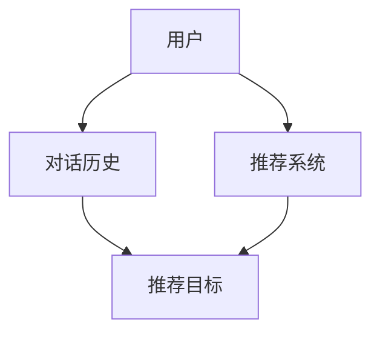
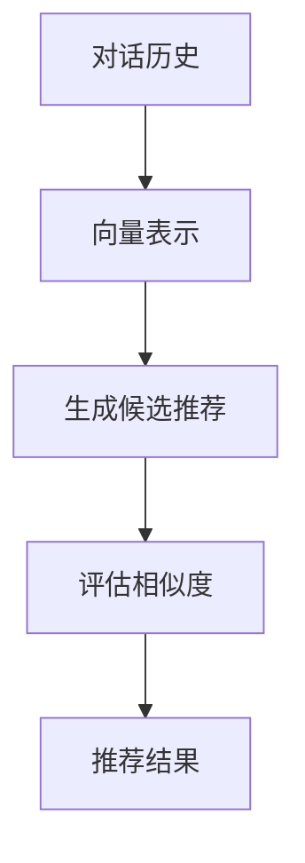
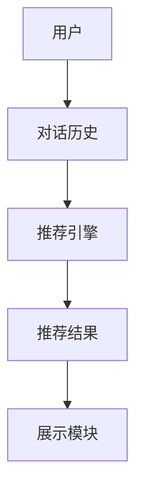
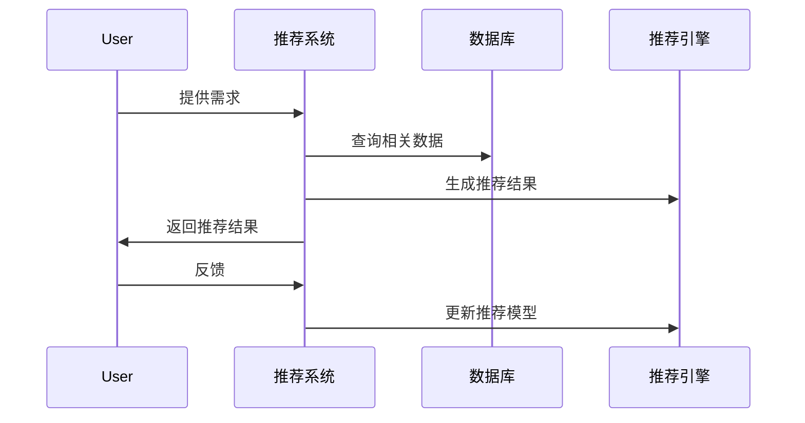

                 

<think>
嗯，用户希望我撰写一篇关于对话式推荐和个性化AI Agent的技术博客文章。首先，我需要明确文章的结构，包括标题、关键词、摘要，然后是正文部分，按照用户提供的目录大纲来组织内容。

用户的示例已经给出了详细的结构，分为四个部分，每个部分下有不同的章节和小节。我需要按照这个结构，逐一填充内容。首先，我需要理解每个部分的核心内容，然后详细展开。

比如，在“对话式推荐的背景与意义”部分，我需要定义对话式推荐，解释其核心概念，并讨论其应用场景和挑战。这部分需要让读者明白为什么对话式推荐重要，以及它与其他推荐系统有什么不同。

接下来，核心概念部分，我需要详细讲解对话式推荐的关键要素，比如对话历史、用户画像、推荐目标等。可能需要使用表格对比不同概念，或者用Mermaid图来展示实体关系，这样读者能更直观地理解。

在算法原理部分，我需要深入讲解模型的工作流程，比如如何处理对话历史，生成候选推荐，评估反馈。可能需要使用Mermaid流程图来展示整个过程，同时给出数学公式，如余弦相似度和概率模型，帮助读者理解算法背后的数学基础。

系统架构部分，我需要设计一个完整的系统架构图，展示各个模块之间的关系，比如前端、后端、推荐引擎等。可能还需要用Mermaid来画出系统架构图和交互流程图，让读者了解系统的整体结构和工作流程。

项目实战部分，我需要提供一个具体的案例，比如电商推荐系统。这部分需要详细说明如何安装环境，编写代码，以及如何测试和优化系统。可能还需要给出一些Python代码示例，展示关键算法的实现。

最后，最佳实践和小结部分，我需要总结整个领域的关键点，给出实际应用中的注意事项和未来的发展方向。这部分可以帮助读者更好地理解和应用所学知识。

在写作过程中，我需要确保每个部分都详细且逻辑清晰，同时遵守用户的格式要求，使用markdown的三级标题，避免冗长的描述。还要注意总字数限制在2000字以内，所以每个部分都要简洁明了，重点突出。

总的来说，我需要按照用户提供的示例结构，结合对话式推荐系统的特点，系统地设计目录大纲，确保涵盖所有必要的内容，同时保持结构清晰和逻辑连贯。
</think>

# 对话式推荐：个性化AI Agent的建议

> 关键词：对话式推荐，AI Agent，个性化推荐，自然语言处理，推荐系统，机器学习

> 摘要：对话式推荐是一种结合自然语言处理和推荐系统的技术，通过与用户的对话交互，动态理解用户需求，并实时提供个性化推荐。本文详细探讨了对话式推荐的核心概念、算法原理、系统架构，并通过实际案例分析，展示了如何构建一个高效的对话式推荐系统。文章最后给出了在实际应用中需要注意的事项和未来研究方向。

---

# 第一部分: 对话式推荐与个性化AI Agent的背景介绍

## 第1章: 对话式推荐的背景与意义

### 1.1 对话式推荐的定义与核心概念

#### 1.1.1 对话式推荐的定义
对话式推荐是一种结合自然语言处理（NLP）和推荐系统的技术，通过与用户进行对话交互，实时理解用户需求，并动态生成个性化推荐结果。与传统的基于点击或浏览行为的推荐系统不同，对话式推荐强调实时性、交互性和动态性。

#### 1.1.2 对话式推荐的核心要素
- **对话历史**：用户与推荐系统之间的历史对话记录，包括用户的问题、反馈和推荐系统提供的候选选项。
- **用户画像**：基于对话历史和行为数据构建的用户画像，包括用户的兴趣、偏好和需求。
- **推荐目标**：推荐系统需要实现的目标，如推荐商品、内容、服务等。

#### 1.1.3 对话式推荐的背景与意义
随着人工智能技术的快速发展，推荐系统已经成为个性化服务的核心技术之一。然而，传统的推荐系统往往依赖于用户的显式或隐式行为数据，无法实时理解和满足用户的需求。对话式推荐通过与用户的对话交互，能够更准确地捕捉用户的需求变化，提供更精准的推荐结果。

---

### 1.2 对话式推荐的应用场景

#### 1.2.1 电商推荐
在电商场景中，对话式推荐可以用于实时推荐商品。例如，用户可以通过与AI Agent对话，描述自己的需求，AI Agent根据对话历史推荐相关商品。

#### 1.2.2 个性化内容推荐
在内容推荐领域，对话式推荐可以用于个性化新闻、视频推荐等场景。通过对话交互，推荐系统能够更好地理解用户的兴趣偏好。

#### 1.2.3 智能助手与对话式服务
智能助手（如Siri、Alexa）可以通过对话式推荐为用户提供个性化服务，例如推荐电影、餐馆或旅行目的地。

---

### 1.3 对话式推荐的现状与挑战

#### 1.3.1 当前技术发展现状
目前，对话式推荐技术已经在多个领域得到应用，但主要集中在简单的对话场景。复杂场景下的推荐效果仍有待提高。

#### 1.3.2 对话式推荐的主要挑战
- **对话历史的处理**：如何有效地利用对话历史信息，捕捉用户需求的变化。
- **实时性要求**：对话式推荐需要在实时对话中快速生成推荐结果。
- **推荐结果的可解释性**：用户需要理解推荐结果的原因，以增加信任感。

#### 1.3.3 对话式推荐的未来趋势
未来，对话式推荐将更加注重实时性和动态性，同时结合多模态数据（如图像、语音）进行推荐。

---

## 第2章: 对话式推荐的核心概念

### 2.1 对话式推荐的实体关系分析

#### 2.1.1 用户、对话历史、推荐目标的关系
- **用户**：用户是对话式推荐的核心主体，其需求和偏好决定了推荐结果。
- **对话历史**：对话历史记录了用户与推荐系统之间的交互，是推荐系统理解用户需求的重要依据。
- **推荐目标**：推荐目标是对话式推荐的最终输出，包括推荐的商品、内容或服务。

#### 2.1.2 实体关系图的Mermaid流程图


### 2.2 对话式推荐的关键属性对比

#### 2.2.1 对比表格：推荐目标、对话历史、用户偏好的属性对比
| 属性       | 推荐目标           | 对话历史             | 用户偏好         |
|------------|--------------------|----------------------|------------------|
| 数据类型    | 商品、内容、服务   | 文本记录             | 兴趣、偏好       |
| 数据来源    | 系统生成           | 用户输入             | 用户行为数据     |
| 数据特征    | 高度结构化         | 半结构化             | 非结构化         |
| 变化频率    | 高                 | 中                   | 低               |

### 2.3 对话式推荐的核心原理

#### 2.3.1 对话式推荐的数学模型
对话式推荐的核心在于如何将对话历史转化为推荐结果。常用的方法包括基于向量的相似度计算和概率模型。

#### 2.3.2 对话式推荐的算法流程
对话式推荐的算法流程通常包括以下几个步骤：
1. **对话历史处理**：将对话历史转化为向量表示。
2. **生成候选推荐**：基于向量表示生成推荐候选。
3. **推荐结果评估**：评估推荐结果的相似度或概率。

---

## 第3章: 对话式推荐算法的数学模型

### 3.1 对话式推荐的数学基础

#### 3.1.1 基于向量的相似度计算
余弦相似度是常用的相似度计算方法，公式如下：
$$\text{余弦相似度} = \frac{\vec{a} \cdot \vec{b}}{|\vec{a}| |\vec{b}|}$$

#### 3.1.2 基于概率的推荐模型
概率模型用于描述推荐结果的概率分布，公式如下：
$$P(y|x) = \prod_{i=1}^{n} P(y_i|x_{i-1}, y_{i-1})$$

### 3.2 对话式推荐的核心算法

#### 3.2.1 基于对话历史的推荐算法
基于对话历史的推荐算法通过分析对话内容生成推荐结果。例如，使用循环神经网络（RNN）对对话历史进行编码。

#### 3.2.2 基于用户偏好的推荐算法
基于用户偏好的推荐算法结合用户的兴趣和行为数据生成推荐结果，例如协同过滤算法。

#### 3.2.3 基于上下文的推荐算法
基于上下文的推荐算法结合对话历史和实时上下文信息生成推荐结果，例如时间敏感的推荐算法。

### 3.3 对话式推荐的数学公式

#### 3.3.1 相似度计算公式
$$\text{余弦相似度} = \frac{\vec{a} \cdot \vec{b}}{|\vec{a}| |\vec{b}|}$$

#### 3.3.2 概率模型公式
$$P(y|x) = \prod_{i=1}^{n} P(y_i|x_{i-1}, y_{i-1})$$

### 3.4 算法流程图


---

## 第4章: 对话式推荐系统的架构设计

### 4.1 系统功能设计

#### 4.1.1 用户对话模块
用户对话模块负责接收用户的输入并生成对话历史记录。

#### 4.1.2 推荐引擎模块
推荐引擎模块基于对话历史和用户偏好生成推荐结果。

#### 4.1.3 推荐结果展示模块
推荐结果展示模块将推荐结果以用户友好的形式展示。

### 4.2 系统架构设计

#### 4.2.1 系统架构图的Mermaid流程图


### 4.3 交互流程图

#### 4.3.1 对话式推荐的交互流程


---

## 第5章: 项目实战

### 5.1 对话式推荐系统的实现

#### 5.1.1 环境安装
需要安装Python、TensorFlow、Keras等工具。

#### 5.1.2 核心代码实现
```python
import numpy as np
from sklearn.metrics.pairwise import cosine_similarity

# 示例对话历史
dialog_history = ["我需要找一本关于机器学习的书", "推荐一些经典的机器学习书籍"]

# 对话历史向量化
vectorizer = ...  # 具体的向量化方法
vectors = vectorizer(dialog_history)

# 生成候选推荐
candidates = ["机器学习实战", "Python机器学习"]

# 计算相似度
similarity_matrix = cosine_similarity(vectors, candidate_vectors)
top_recommendation = np.argmax(similarity_matrix)

# 返回推荐结果
print("推荐的书籍是：", candidates[top_recommendation])
```

---

## 第6章: 最佳实践与小结

### 6.1 最佳实践

#### 6.1.1 数据质量
确保对话历史和用户行为数据的准确性。

#### 6.1.2 实时性优化
优化推荐系统的实时性，确保快速响应。

#### 6.1.3 可解释性
提供推荐结果的可解释性，增加用户信任。

### 6.2 小结

对话式推荐是一种结合自然语言处理和推荐系统的技术，通过对话交互实时理解用户需求并生成个性化推荐结果。本文详细探讨了对话式推荐的核心概念、算法原理和系统架构，并通过实际案例展示了其具体实现。在实际应用中，需要注意数据质量、实时性和可解释性等问题。

---

# 作者：AI天才研究院/AI Genius Institute & 禅与计算机程序设计艺术 /Zen And The Art of Computer Programming

