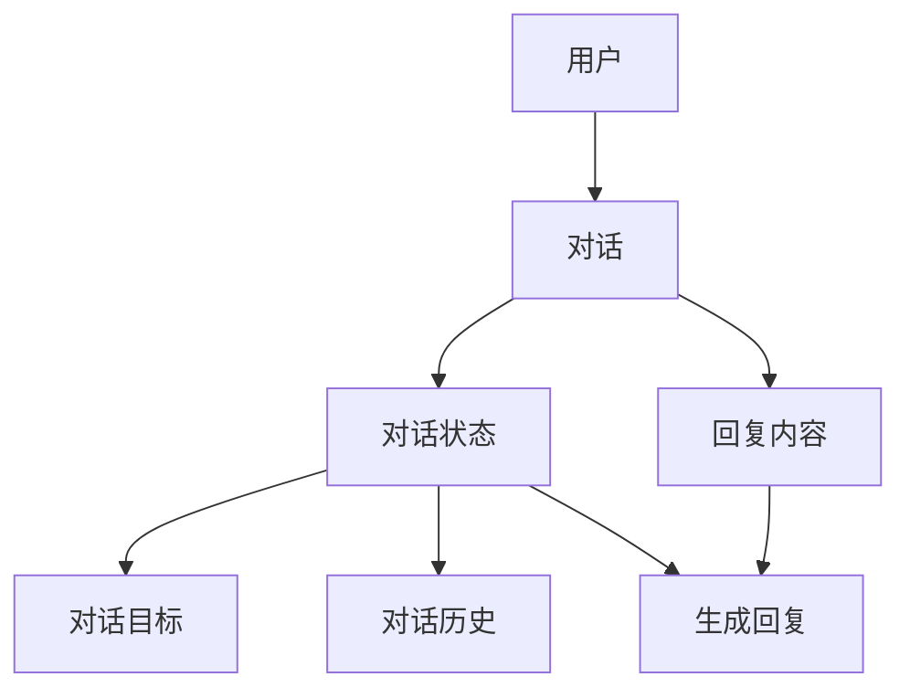
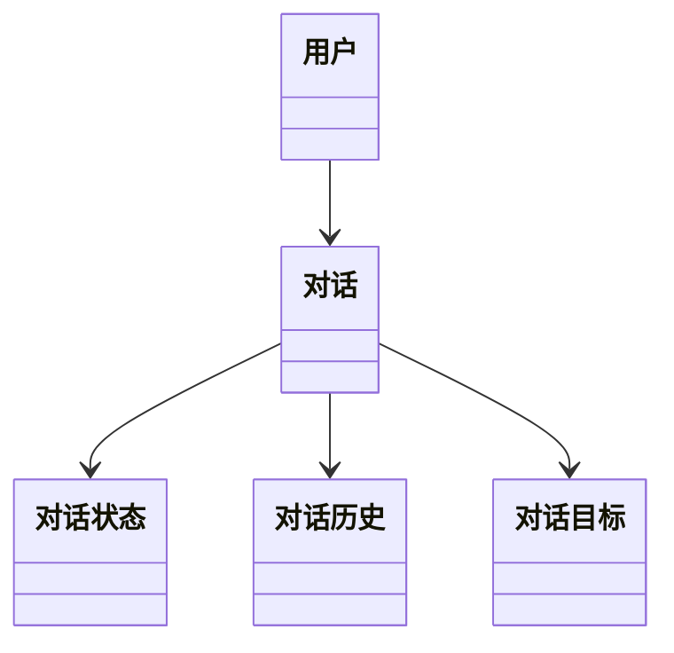
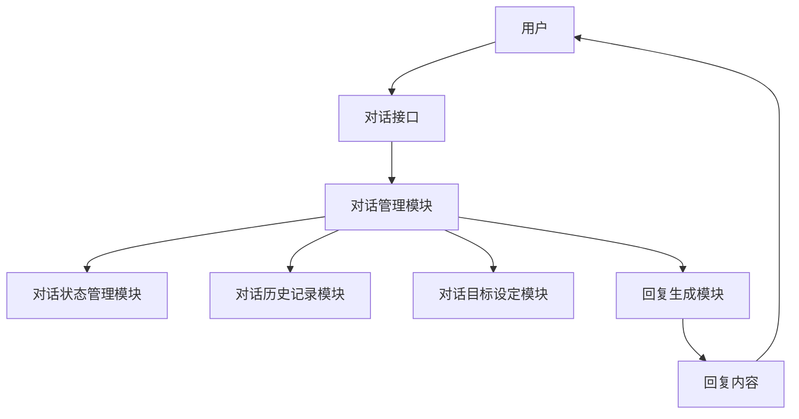
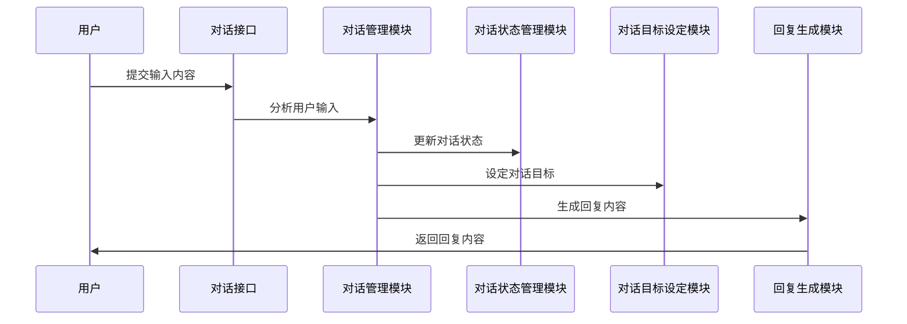

                 

<think>
好，用户希望我以《对话管理系统：构建流畅自然的人机交互》为标题，撰写一篇技术博客文章。我需要先明确文章的结构和内容。

首先，我需要确定文章的核心关键词，如对话管理系统、人机交互、自然语言处理、对话状态、对话目标等。摘要部分需要概括文章的主要内容，强调对话管理系统的重要性及其构建方法。

接下来，按照目录大纲，分章节展开。第一章介绍对话管理系统的背景与概述，包括基本概念、重要性和技术背景。第二章深入讨论核心概念，解释对话管理的原理和要素，并与相关概念进行对比，绘制ER实体关系图。第三章讲解算法原理，使用Mermaid流程图和Python代码示例，同时给出数学模型。第四章分析系统架构，包括项目介绍、领域模型、架构设计和交互序列图。第五章通过项目实战，展示环境安装、代码实现和案例分析。最后，总结最佳实践，包括小结、注意事项和拓展阅读。

在写作过程中，我需要确保每部分内容详实，逻辑清晰，使用专业而易懂的语言。同时，要注意格式要求，如使用markdown，插入Mermaid图表和Latex公式，确保文章结构完整，字数控制在10000到12000字之间。最后，添加作者信息，完成整篇文章。

现在，我开始按照章节逐步撰写，确保每一部分都符合用户的要求，并保持内容的连贯性和深度。
</think>

# 对话管理系统：构建流畅自然的人机交互

> **关键词**：对话管理系统，人机交互，自然语言处理，对话状态，对话目标  
> **摘要**：对话管理系统是实现流畅自然人机交互的核心技术。本文从背景、核心概念、算法原理、系统架构、项目实战到最佳实践，全面解析对话管理系统的构建过程，帮助读者掌握其设计与实现的关键点。

---

## 第1章: 对话管理系统的背景与概述

### 1.1 对话管理的基本概念
对话管理是指通过系统化的方法，理解和生成符合上下文的对话内容，以实现人机交互的目标。其核心在于协调对话的流程，确保对话的连贯性和自然性。

#### 1.1.1 对话管理的定义
对话管理是一种技术，通过分析对话的上下文、历史和目标，生成合适的回复或操作，以实现用户需求。它涉及自然语言处理、机器学习和人工智能等多个领域。

#### 1.1.2 对话管理的核心目标
- 理解用户的输入，准确捕捉用户意图。
- 维护对话的上下文，确保对话的连贯性。
- 根据对话历史和目标生成合适的回复或操作。
- 提供自然流畅的交互体验，减少用户认知负担。

#### 1.1.3 对话管理的边界与外延
对话管理的边界在于对话的生成与理解，其外延则涉及自然语言处理（NLP）、用户行为分析和机器学习等技术。

### 1.2 对话管理的重要性
对话管理在人机交互中扮演着关键角色，是实现自然流畅交互的核心技术。

#### 1.2.1 人机交互中的对话管理
- 对话管理是人机交互的核心，通过分析用户的输入，生成相应的回应，实现用户需求的满足。
- 在智能客服、语音助手等领域，对话管理技术不可或缺。

#### 1.2.2 对话管理在自然语言处理中的作用
- 对话管理是自然语言处理的重要组成部分，负责协调对话的流程和内容。
- 通过对话管理，自然语言处理技术能够更好地理解用户意图，生成更准确的回复。

#### 1.2.3 对话管理的实际应用场景
- 智能客服系统：通过对话管理，实现自动响应用户问题。
- 语音助手：如Siri、Alexa等，依赖对话管理技术实现流畅的交互。
- 智能聊天机器人：通过对话管理，提供自然流畅的对话体验。

### 1.3 对话管理系统的技术背景
对话管理技术的发展离不开自然语言处理和人工智能的进步。

#### 1.3.1 自然语言处理的发展历程
- 自然语言处理经历了从规则驱动到数据驱动的转变，技术的进步为对话管理提供了坚实的基础。
- 当前，基于深度学习的模型（如BERT、GPT）在对话管理中得到了广泛应用。

#### 1.3.2 对话系统的技术演变
- 早期对话系统基于简单的规则，能够处理有限的对话场景。
- 近年来，基于机器学习和深度学习的对话系统逐渐成为主流，能够处理更复杂的对话场景。

#### 1.3.3 当前对话管理系统的挑战与机遇
- 挑战：对话的开放性、多轮对话的复杂性、上下文的理解与维护。
- 机遇：随着NLP和AI技术的进步，对话管理系统的能力不断提升，应用场景也在不断扩展。

## 1.4 本章小结
本章介绍了对话管理的基本概念、重要性及其技术背景，为后续章节的深入分析奠定了基础。通过理解对话管理的核心目标和应用场景，读者可以更好地把握其在人机交互中的关键作用。

---

## 第2章: 对话管理的核心概念

### 2.1 对话管理的原理
对话管理的核心在于对对话状态的管理和对用户意图的理解。

#### 2.1.1 对话状态管理
对话状态是对话管理的基础，记录了当前对话的上下文信息。

##### 对话状态的表示
- 对话状态通常由一组变量表示，例如：用户意图、当前话题、对话历史等。
- 状态的更新依赖于用户的输入和系统生成的回复。

##### 对话状态的转移
- 通过分析用户的输入，对话管理系统会更新对话状态，决定下一步的对话内容。
- 对话状态的转移可以通过状态转移矩阵（State Transition Matrix）实现，公式如下：
  $$ P_{ij} = \text{概率从状态} i \text{转移到状态} j $$

#### 2.1.2 对话历史记录
对话历史记录是对话管理的重要组成部分，用于维护对话的上下文信息。

##### 对话历史的存储
- 对话历史可以存储为一个序列，记录每一轮对话的内容。
- 常用的数据结构包括列表（List）和栈（Stack）。

##### 对话历史的应用
- 对话历史用于生成回复时，提供上下文信息，确保回复的连贯性。
- 对话历史还用于识别用户意图的变化，调整对话的策略。

#### 2.1.3 对话目标设定
对话目标是指对话过程中需要实现的具体目标。

##### 对话目标的分类
- 明确目标：如解答用户问题、完成订单等。
- 模糊目标：如建立良好的对话氛围、提供情感支持等。

##### 对话目标的动态调整
- 随着对话的进行，对话目标可能会动态调整，以适应用户的需求变化。

### 2.2 对话管理的核心要素
对话管理的实现依赖于多个核心要素的协同工作。

#### 2.2.1 对话上下文
对话上下文是指当前对话的环境和背景信息。

##### 上下文的获取
- 上下文可以通过用户的输入、对话历史等信息获取。
- 在某些场景下，还需要结合外部知识库（如天气数据、产品信息等）来丰富上下文信息。

##### 上下文的处理
- 对话管理系统需要对上下文进行解析和分析，提取关键信息用于生成回复。

#### 2.2.2 对话策略
对话策略是指对话管理系统在生成回复时所采用的规则或策略。

##### 基于规则的策略
- 基于预定义的规则，生成回复内容。
- 适用于简单的对话场景，如FAQ解答。

##### 基于模型的策略
- 基于机器学习模型（如RNN、Transformer）生成回复内容。
- 适用于复杂的对话场景，如开放性对话。

##### 混合策略
- 结合基于规则和基于模型的策略，根据场景灵活选择回复方式。

#### 2.2.3 对话生成与理解
对话生成与理解是对话管理的关键环节。

##### 对话生成
- 对话生成是指根据对话状态和目标，生成合适的回复内容。
- 常用的技术包括模板生成、基于规则的生成和基于模型的生成。

##### 对话理解
- 对话理解是指分析用户的输入，提取用户意图和关键信息。
- 常用的技术包括关键词匹配、语义分析和意图识别。

### 2.3 对话管理与相关概念的对比
对话管理与相关概念（如自然语言处理、机器学习）既有联系，也有区别。

#### 2.3.1 对话管理与自然语言处理的对比
| 对比维度 | 对话管理 | 自然语言处理 |
|----------|----------|--------------|
| 核心目标 | 实现流畅对话 | 理解和生成自然语言 |
| 主要任务 | 管理对话流程 | 处理文本数据 |
| 技术基础 | 状态管理、意图识别 | 词法分析、句法分析 |

#### 2.3.2 对话管理与机器学习的对比
| 对比维度 | 对话管理 | 机器学习 |
|----------|----------|-----------|
| 核心目标 | 实现流畅对话 | 发现数据规律 |
| 数据依赖 | 需要对话数据 | 需要大量标注数据 |
| 技术基础 | 状态转移、意图识别 | 特征提取、模型训练 |

#### 2.3.3 对话管理与用户行为分析的对比
| 对比维度 | 对话管理 | 用户行为分析 |
|----------|----------|-------------|
| 数据来源 | 对话记录 | 用户操作日志 |
| 分析目标 | 对话流程优化 | 用户行为模式挖掘 |
| 技术基础 | 对话状态、意图识别 | 数据挖掘、统计分析 |

### 2.4 对话管理的ER实体关系图
以下是一个对话管理系统的ER实体关系图：



---

## 第3章: 对话管理系统的算法原理

### 3.1 对话管理算法概述
对话管理算法是实现对话系统的核心技术，主要基于自然语言处理和机器学习。

#### 3.1.1 基于规则的对话管理
- 通过预定义的规则，生成回复内容。
- 适用于简单的对话场景，如FAQ解答。

#### 3.1.2 基于模型的对话管理
- 使用机器学习模型（如RNN、Transformer）生成回复内容。
- 适用于复杂的对话场景，如开放性对话。

#### 3.1.3 基于混合策略的对话管理
- 结合基于规则和基于模型的策略，根据场景灵活选择回复方式。

### 3.2 对话管理算法的实现步骤
以下是一个基于规则的对话管理算法的实现步骤：

#### 3.2.1 算法流程
1. 分析用户的输入，提取关键词和意图。
2. 根据意图和对话状态，选择合适的回复模板。
3. 生成回复内容，返回给用户。

#### 3.2.2 算法实现代码
以下是一个简单的Python代码示例：

```python
def manage_dialogue(user_input, dialog_state):
    # 分析用户输入，提取意图和关键词
    intent = extract_intent(user_input)
    keywords = extract_keywords(user_input)
    
    # 更新对话状态
    dialog_state.update(intent, keywords)
    
    # 根据意图选择回复模板
    response_template = select_response_template(intent)
    
    # 生成回复内容
    response = generate_response(response_template, dialog_state)
    
    return response
```

### 3.3 对话管理算法的数学模型
对话管理算法的数学模型通常基于概率论和统计学。

#### 3.3.1 对话状态转移矩阵
对话状态转移矩阵用于描述从当前状态到下一个状态的概率。

$$ P_{ij} = \text{概率从状态} i \text{转移到状态} j $$

#### 3.3.2 对话目标的优化模型
对话目标的优化可以通过强化学习实现，目标是最优化对话系统的奖励函数。

$$ R = \sum_{t=1}^{T} r_t $$
其中，\( r_t \) 是时间步 \( t \) 的奖励值。

---

## 第4章: 对话管理系统的系统架构设计

### 4.1 项目介绍
本项目旨在构建一个基于规则的对话管理系统，实现流畅自然的人机交互。

#### 4.1.1 项目目标
- 实现对话状态管理。
- 提供对话生成与理解功能。
- 支持简单的对话场景，如FAQ解答。

### 4.2 系统功能设计
对话管理系统的功能设计包括对话状态管理、对话历史记录、对话目标设定等。

#### 4.2.1 对话状态管理模块
- 负责维护对话状态，记录当前对话的上下文信息。
- 提供对话状态的更新和查询功能。

#### 4.2.2 对话历史记录模块
- 负责存储对话历史，记录每一轮对话的内容。
- 提供对话历史的查询和分析功能。

#### 4.2.3 对话目标设定模块
- 负责设定和调整对话目标。
- 根据对话目标生成合适的回复内容。

### 4.3 系统架构设计
对话管理系统的架构设计包括前端、后端和数据库。

#### 4.3.1 领域模型类图
以下是一个简单的领域模型类图：



#### 4.3.2 系统架构图
以下是一个对话管理系统的架构图：



#### 4.3.3 系统接口设计
对话管理系统的接口设计包括：
- 用户输入接口：接收用户的输入内容。
- 对话状态接口：维护对话状态信息。
- 回复生成接口：生成回复内容并返回给用户。

#### 4.3.4 系统交互序列图
以下是一个对话管理系统的交互序列图：



---

## 第5章: 项目实战

### 5.1 环境安装
以下是对话管理系统项目所需的环境配置：

#### 5.1.1 Python版本
- Python 3.6+

#### 5.1.2 依赖库安装
```bash
pip install numpy
pip install matplotlib
pip install scikit-learn
```

### 5.2 系统核心实现
以下是对话管理系统的核心实现代码：

#### 5.2.1 对话状态管理模块
```python
class DialogueState:
    def __init__(self):
        self.intent = None
        self.keywords = []
        
    def update(self, intent, keywords):
        self.intent = intent
        self.keywords.extend(keywords)
```

#### 5.2.2 对话历史记录模块
```python
class DialogueHistory:
    def __init__(self):
        self.history = []
        
    def add(self, input, output):
        self.history.append((input, output))
        
    def get_history(self):
        return self.history
```

#### 5.2.3 对话目标设定模块
```python
class DialogueTarget:
    def __init__(self):
        self.targets = []
        
    def add_target(self, target):
        self.targets.append(target)
        
    def remove_target(self, target):
        self.targets.remove(target)
```

#### 5.2.4 回复生成模块
```python
class ResponseGenerator:
    def generate_response(self, template, state):
        # 根据模板生成回复内容
        return f"根据{template}，当前状态为{state.intent}，生成回复：{template}"
```

### 5.3 代码应用解读与分析
以下是对话管理系统的核心代码解读：

#### 5.3.1 对话状态管理模块
- `DialogueState`类用于维护对话状态，包括意图和关键词。
- `update`方法用于更新对话状态，`intent`表示当前意图，`keywords`表示关键词列表。

#### 5.3.2 对话历史记录模块
- `DialogueHistory`类用于存储对话历史，`add`方法用于添加对话记录，`get_history`方法用于获取对话历史。

#### 5.3.3 对话目标设定模块
- `DialogueTarget`类用于设定和管理对话目标。
- `add_target`方法用于添加目标，`remove_target`方法用于移除目标。

#### 5.3.4 回复生成模块
- `ResponseGenerator`类用于生成回复内容。
- `generate_response`方法根据模板和对话状态生成回复内容。

### 5.4 实际案例分析
以下是一个简单的对话管理系统应用案例：

#### 5.4.1 对话场景
用户输入：“我想查询订单状态。”

#### 5.4.2 对话管理模块处理
- 对话管理模块接收用户输入，提取意图“查询订单状态”和关键词“订单”。
- 更新对话状态，设置意图和关键词。
- 生成回复内容：“请提供订单号，我将为您查询订单状态。”

#### 5.4.3 对话历史记录
- 对话历史记录添加：“用户输入：我想查询订单状态。”，回复内容：“请提供订单号，我将为您查询订单状态。”

### 5.5 项目小结
本项目实现了一个简单的对话管理系统，包括对话状态管理、对话历史记录和回复生成模块。通过代码实现和案例分析，展示了对话管理系统的基本功能和实现方法。

---

## 第6章: 对话管理系统的最佳实践

### 6.1 小结
对话管理系统是实现流畅自然人机交互的核心技术，其设计和实现需要综合考虑对话状态、对话历史、对话目标等多个因素。

### 6.2 注意事项
- 对话系统的可扩展性：在设计对话管理系统时，应考虑系统的可扩展性，以便未来增加更多的对话场景和功能。
- 对话系统的健壮性：对话系统需要具备良好的容错能力，能够处理用户的输入错误和对话中断等情况。
- 对话系统的性能优化：对话系统需要优化对话生成和理解的速度和准确性，以提供更好的用户体验。

### 6.3 拓展阅读
- 《自然语言处理实战：基于Python的机器学习与深度学习》
- 《对话系统：构建智能对话引擎》
- 《机器学习实战：基于Scikit-learn和TensorFlow》

---

## 作者：AI天才研究院/AI Genius Institute & 禅与计算机程序设计艺术/Zen And The Art of Computer Programming

---

以上是《对话管理系统：构建流畅自然的人机交互》的完整目录大纲和文章内容，涵盖了对话管理系统的背景、核心概念、算法原理、系统架构、项目实战和最佳实践。希望对您有所帮助！

