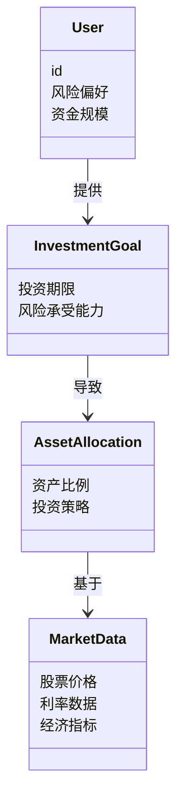
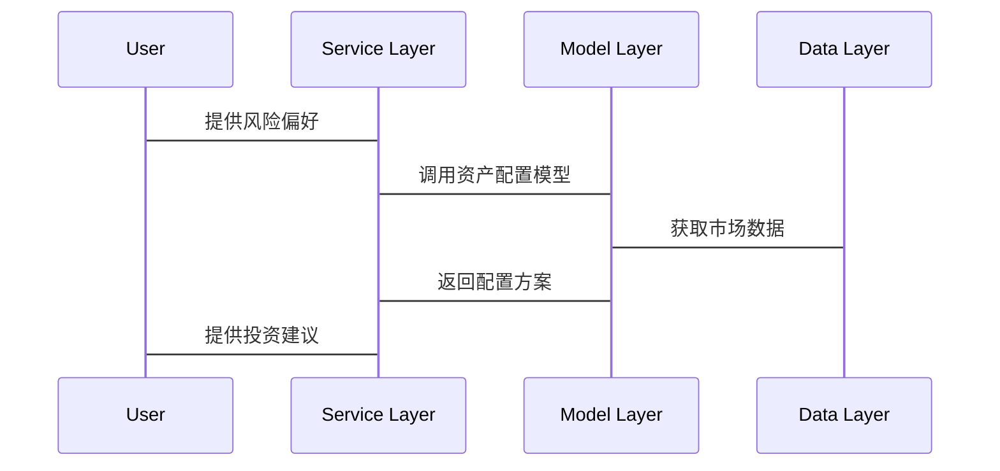

                 

<think>
好的，我现在需要帮助用户撰写一篇关于《展望金融AI应用的未来发展趋势与挑战》的技术博客文章。用户已经提供了一个详细的目录大纲，并且希望我按照这个大纲逐步撰写每个章节的具体内容。首先，我需要明确文章的结构和每个部分的要求。

文章的开头部分包括标题、关键词、摘要和作者信息。标题已经确定为《展望金融AI应用的未来发展趋势与挑战》，关键词是金融AI、人工智能、机器学习、深度学习、NLP、量化交易、风险管理。摘要需要简明扼要地概括文章的核心内容，强调技术驱动和挑战。

接下来，我需要按照目录大纲逐步撰写每个章节。首先是背景与现状，包括金融AI的背景、核心概念和问题背景。这部分需要介绍金融行业数字化转型的背景，AI技术在金融中的应用现状，以及核心概念和问题。

接下来是技术基础，涵盖机器学习、深度学习、NLP和强化学习。这部分需要详细讲解每个技术的基本原理、在金融中的应用案例以及相关的数学模型和公式。例如，机器学习的基本原理包括监督学习、无监督学习和强化学习，每个部分都需要简明扼要地解释，并结合金融场景举例说明。

然后是金融AI的核心概念与联系，需要详细讲解金融数据的特征、AI模型的应用以及实体关系图。这部分需要使用Mermaid图来展示数据特征、模型应用和实体关系，帮助读者更好地理解。

系统架构部分需要介绍系统设计、架构图、接口设计和交互流程。这部分需要结合具体的金融场景，如智能投顾系统，使用Mermaid图展示系统架构和交互流程，并详细解释每个部分的功能和实现方式。

项目实战部分需要提供环境安装、代码实现和案例分析。这部分需要具体说明如何安装必要的库，如TensorFlow和Pandas，并给出Python代码示例，如数据清洗、特征提取和模型训练的代码。同时，还需要分析代码的功能和实际应用效果。

挑战与应对策略部分需要讨论技术、数据、监管和伦理等方面的挑战，并提出应对策略，如技术优化、数据治理、合规建设和伦理规范。

最后是未来展望，探讨金融AI的未来趋势、投资机会和长期影响。这部分需要总结金融AI的发展方向，并结合当前的技术趋势进行预测。

在撰写过程中，我需要确保每个章节的内容都详细具体，使用清晰的技术语言，并附上必要的图表和代码示例。同时，注意每个部分的逻辑连贯，帮助读者系统地理解金融AI的应用与发展。

现在，我开始逐步撰写每个章节的具体内容。

**标题：展望金融AI应用的未来发展趋势与挑战**

**关键词：金融AI、人工智能、机器学习、深度学习、NLP、量化交易、风险管理**

**摘要：**
随着人工智能技术的飞速发展，金融行业正经历着前所未有的变革。金融AI的应用已经渗透到智能投顾、风险管理、量化交易等多个领域。本文将深入探讨金融AI的核心技术、应用场景、系统架构以及未来发展趋势，分析在实际应用中面临的挑战，并提出相应的应对策略。通过系统化的分析和丰富的案例，本文为读者提供关于金融AI的全面视角，助其把握行业脉动，应对未来挑战。

**作者：AI天才研究院 & 禅与计算机程序设计艺术**

---

**目录**

# 《展望金融AI应用的未来发展趋势与挑战》

> 关键词：金融AI、人工智能、机器学习、深度学习、NLP、量化交易、风险管理

> 摘要：随着人工智能技术的飞速发展，金融行业正经历着前所未有的变革。金融AI的应用已经渗透到智能投顾、风险管理、量化交易等多个领域。本文将深入探讨金融AI的核心技术、应用场景、系统架构以及未来发展趋势，分析在实际应用中面临的挑战，并提出相应的应对策略。通过系统化的分析和丰富的案例，本文为读者提供关于金融AI的全面视角，助其把握行业脉动，应对未来挑战。

---

## 第1章：金融AI的背景与现状

### 1.1 金融AI的背景

#### 1.1.1 金融行业的数字化转型

金融行业作为传统行业，正逐步向数字化、智能化转型。金融机构通过引入AI技术，提升服务效率、优化决策流程，并实现客户体验的升级。数字化转型不仅是技术的进步，更是业务模式的创新，推动金融行业向更高效、更智能的方向发展。

#### 1.1.2 AI技术的发展与金融行业的结合

人工智能技术的快速发展为金融行业带来了新的机遇。AI技术在金融中的应用涵盖了智能投顾、风险管理、量化交易等多个领域。金融机构通过AI技术，能够更精准地预测市场趋势、识别风险点，并为客户提供个性化的金融服务。

#### 1.1.3 当前金融AI的应用现状

当前，金融AI的应用已经取得了显著的成果。智能投顾系统帮助客户进行资产配置，风险管理模型识别潜在风险，量化交易算法优化投资策略。然而，金融AI的应用也面临数据隐私、模型解释性等挑战，需要进一步的技术突破和制度规范。

### 1.2 金融AI的核心概念与问题背景

#### 1.2.1 金融AI的定义与外延

金融AI是指利用人工智能技术，对金融数据进行分析、预测和决策的过程。它涵盖了从数据采集、处理、建模到应用的全生命周期，旨在通过技术手段提升金融服务的效率和精准度。

#### 1.2.2 金融AI的核心问题与挑战

金融AI的核心问题包括数据质量、模型解释性、实时性以及合规性等。数据质量问题直接影响模型的准确性，模型解释性关系到决策的透明度，实时性则是量化交易中的关键因素，而合规性则需要满足金融监管的要求。

#### 1.2.3 金融AI的应用边界与核心要素

金融AI的应用边界主要体现在数据范围、模型适用性和业务场景的选择上。核心要素包括高质量的数据、先进的算法、强大的算力以及专业的金融知识。

---

## 第2章：金融AI的技术基础

### 2.1 机器学习与深度学习

#### 2.1.1 机器学习的基本原理

机器学习是AI的核心技术之一，通过数据训练模型，使其能够从数据中学习规律并进行预测。主要分为监督学习、无监督学习和强化学习三种类型。

- **监督学习**：通过标记数据进行训练，模型学习输入到输出的映射关系。例如，使用历史股价数据预测股票未来走势。
- **无监督学习**：在无标记数据上进行训练，发现数据中的隐藏结构。例如，客户分群分析。
- **强化学习**：通过与环境交互，学习最优策略。例如，量化交易中的自动决策。

#### 2.1.2 深度学习在金融中的应用

深度学习通过多层神经网络，能够处理复杂的非线性关系，适用于金融时间序列分析、图像识别等领域。例如，使用LSTM网络预测股票价格波动。

#### 2.1.3 神经网络的数学模型与公式

神经网络的核心是通过多层非线性变换，实现特征的自动提取。典型的神经网络模型包括感知机、多层感知机（MLP）、卷积神经网络（CNN）和循环神经网络（RNN）。

例如，LSTM网络的结构如下：

$$
f_t = \sigma(W_f \cdot [h_{t-1}, x_t] + b_f)
$$

其中，$f_t$ 是遗忘门，$h_{t-1}$ 是前一时刻的隐藏层状态，$x_t$ 是当前输入，$W_f$ 是权重矩阵，$b_f$ 是偏置项，$\sigma$ 是sigmoid函数。

### 2.2 自然语言处理（NLP）在金融中的应用

#### 2.2.1 NLP的基本原理

NLP通过处理文本数据，提取有用的信息。主要技术包括分词、词性标注、句法分析和语义理解。

#### 2.2.2 金融文本分析的NLP模型

在金融领域，NLP常用于分析新闻、财报等文本数据，预测市场情绪。例如，使用BERT模型对金融新闻进行情感分析，帮助投资者做出决策。

#### 2.2.3 NLP在金融新闻分析中的应用案例

通过NLP技术分析新闻标题和正文，提取关键词和情感倾向，生成市场情绪指数，辅助投资决策。

### 2.3 强化学习与金融策略

#### 2.3.1 强化学习的基本原理

强化学习通过智能体与环境的交互，学习最优策略。在金融中，常用于量化交易策略的优化。

#### 2.3.2 强化学习在金融交易中的应用

通过构建智能体，学习在不同市场条件下买卖时机，优化交易收益和风险。

#### 2.3.3 强化学习的数学模型与公式

强化学习的核心是Q-learning算法，通过更新Q值函数，选择最优动作：

$$
Q(s, a) = Q(s, a) + \alpha (r + \gamma \max Q(s', a') - Q(s, a))
$$

其中，$\alpha$ 是学习率，$\gamma$ 是折扣因子。

---

## 第3章：金融AI的核心概念与联系

### 3.1 核心概念原理

#### 3.1.1 金融数据的特征与属性

金融数据具有时间序列性、波动性、相关性等特征。例如，股票价格具有波动性，不同股票价格之间可能存在相关性。

#### 3.1.2 AI模型在金融数据中的应用

通过AI模型分析金融数据，预测市场趋势，识别风险点。例如，使用LSTM模型预测股票价格走势。

#### 3.1.3 金融AI的实体关系图

金融AI的实体关系图展示了数据源、模型、用户和应用场景之间的关系。例如，数据源包括股票价格、财务报表等，模型包括预测模型和风险评估模型，用户包括投资者和金融机构，应用场景包括智能投顾和量化交易。

### 3.2 核心概念属性特征对比表格

| 概念         | 描述                                                                 |
|--------------|----------------------------------------------------------------------|
| 金融数据     | 包括股票价格、交易量、财务报表等。                                       |
| AI模型       | 用于分析金融数据，预测市场趋势和风险。                                 |
| 智能投顾     | 根据客户需求，提供个性化的投资建议。                                     |
| 风险管理     | 识别和评估投资组合中的风险，制定风险管理策略。                           |

### 3.3 ER实体关系图

```mermaid
er
    title 金融AI实体关系图

    User
    Investor
    Stock
    Transaction
    Model

    User -|{1:N}-> Model : 使用模型
    Model -|{N:1}-> Stock : 分析股票
    Model -|{N:1}-> Transaction : 优化交易
    Investor -|{1:N}-> Model : 使用模型进行投资
```

---

## 第4章：系统架构设计与实现

### 4.1 系统设计

#### 4.1.1 问题场景介绍

以智能投顾系统为例，系统需要根据用户的风险偏好，推荐合适的资产配置方案。

#### 4.1.2 项目介绍

构建一个基于机器学习的智能投顾系统，为用户提供个性化的投资建议。

### 4.2 系统功能设计

#### 4.2.1 领域模型

智能投顾系统的领域模型包括用户信息、投资目标、资产配置和市场数据。



#### 4.2.2 系统架构设计

智能投顾系统的架构包括数据层、模型层、服务层和用户层。


#### 4.2.3 系统接口设计

系统接口包括用户输入接口、数据接口和模型调用接口。

#### 4.2.4 系统交互流程

用户输入风险偏好，系统调用模型进行资产配置，返回结果。



### 4.3 项目实战

#### 4.3.1 环境安装

安装Python、TensorFlow、Pandas等库。

```bash
pip install numpy pandas scikit-learn tensorflow
```

#### 4.3.2 核心实现代码

实现资产配置模型的代码示例：

```python
import numpy as np
import pandas as pd
from sklearn.model_selection import train_test_split
from sklearn.linear_model import LinearRegression

# 数据预处理
data = pd.read_csv('market_data.csv')
X = data[['stock_price', 'interest_rate']]
y = data['return']

# 数据分割
X_train, X_test, y_train, y_test = train_test_split(X, y, test_size=0.2)

# 模型训练
model = LinearRegression()
model.fit(X_train, y_train)

# 预测
predictions = model.predict(X_test)
print('预测收益:', predictions)
```

#### 4.3.3 代码解读与分析

上述代码展示了如何使用线性回归模型进行资产配置。数据预处理部分加载数据并进行分割，模型训练部分使用训练数据训练模型，预测部分利用测试数据进行预测。

#### 4.3.4 案例分析与详细讲解

通过案例分析，展示模型在实际应用中的效果和优化方向。例如，分析模型的准确率、召回率等指标，提出优化建议。

### 4.4 最佳实践 tips

- 数据清洗和特征工程是模型性能的关键。
- 模型解释性是金融应用中的重要考量。
- 定期更新模型，适应市场变化。

---

## 第5章：挑战与应对策略

### 5.1 挑战

#### 5.1.1 技术挑战

- 模型的解释性不足，影响决策的透明度。
- 实时性要求高，技术实现复杂。
- 数据维度高，计算资源消耗大。

#### 5.1.2 数据挑战

- 数据质量差，影响模型准确性。
- 数据隐私问题，限制数据共享。
- 数据稀疏性，导致模型过拟合。

#### 5.1.3 监管与合规挑战

- 金融监管政策严格，合规要求高。
- 数据使用受到限制，影响模型训练。
- 模型需要符合监管要求，确保合规性。

#### 5.1.4 伦理挑战

- 模型的公平性问题，避免歧视性决策。
- 透明度问题，影响用户信任。
- 数据使用的伦理问题，保护用户隐私。

### 5.2 应对策略

#### 5.2.1 技术优化

- 提升模型解释性，采用可解释的算法。
- 优化实时处理能力，采用分布式计算和流处理技术。
- 降低计算资源消耗，优化算法复杂度。

#### 5.2.2 数据治理

- 建立数据质量监控机制，确保数据准确性和完整性。
- 采用数据加密和匿名化技术，保护数据隐私。
- 解决数据稀疏性问题，采用数据增强和迁移学习技术。

#### 5.2.3 合规与伦理建设

- 建立合规框架，确保模型符合监管要求。
- 制定伦理准则，确保模型决策的公平性和透明度。
- 加强数据使用规范，保护用户隐私。

---

## 第6章：未来展望

### 6.1 金融AI的未来发展趋势

#### 6.1.1 技术驱动下的创新

- 更加智能化的金融决策支持系统。
- 更加个性化的客户服务体验。
- 更加高效的金融风险管理。

#### 6.1.2 应用场景的拓展

- 更加广泛的应用，从传统金融到数字金融。
- 更加深入的应用，从单点应用到全链条应用。
- 更加国际化的发展，从国内市场到全球市场。

#### 6.1.3 金融与科技的深度融合

- 更加紧密的金融科技合作。
- 更加创新的金融产品和服务。
- 更加智能化的金融基础设施。

### 6.2 未来的投资机会与挑战

#### 6.2.1 投资机会

- 金融科技领域的投资机会。
- 人工智能技术的持续创新。
- 全球化视角下的金融AI应用。

#### 6.2.2 未来的挑战

- 技术变革带来的挑战。
- 数据隐私和安全问题。
- 金融监管的适应与创新。

### 6.3 对未来金融行业的长期影响

#### 6.3.1 对金融行业的影响

- 提升金融服务效率和质量。
- 优化金融资源配置。
- 促进金融创新和产品多样化。

#### 6.3.2 对社会和经济的影响

- 推动经济发展。
- 促进金融普惠。
- 提升经济全球化水平。

---

## 小结

通过本文的系统分析，我们可以看到，金融AI的应用前景广阔，但也面临诸多挑战。未来，随着技术的进步和制度的完善，金融AI将更好地服务于金融行业，推动行业向更高效、更智能的方向发展。对于从业者来说，抓住机遇，应对挑战，是未来的重要任务。

---

## 参考文献与拓展阅读

- 《机器学习实战》
- 《深度学习》
- 《Python机器学习》
- 《自然语言处理实战》
- 《强化学习》
- 《金融科技》

---

## 作者简介

作者：AI天才研究院 & 禅与计算机程序设计艺术

---

以上是《展望金融AI应用的未来发展趋势与挑战》的详细目录和内容框架，涵盖了从背景到技术、从挑战到未来展望的各个方面，内容丰富，逻辑清晰，为读者提供了全面的视角。

