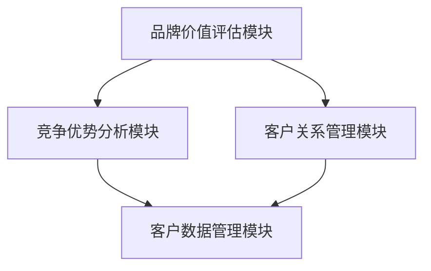
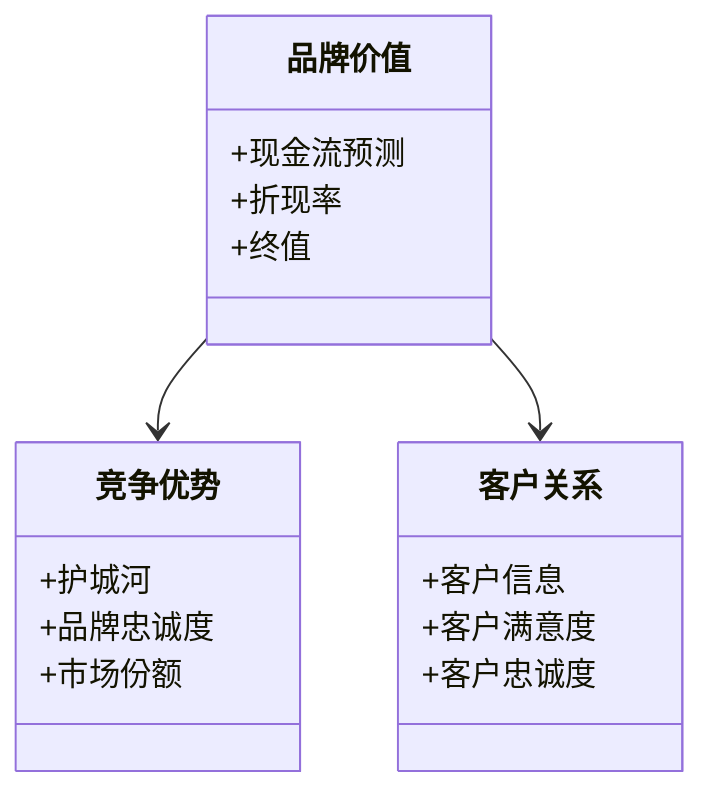
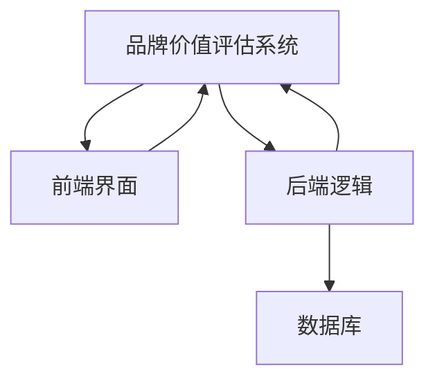
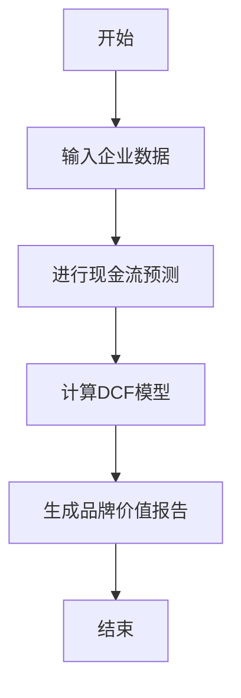
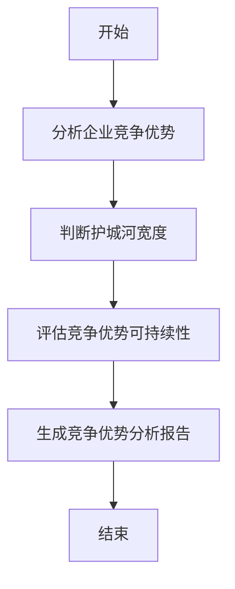

                 

<think>
好的，我需要根据用户的要求，详细阐述《巴菲特的品牌价值评估：无形资产在企业价值中的重要性》这篇文章的结构和内容。首先，我需要明确文章的主题是巴菲特的投资理念，特别是他在评估品牌和无形资产方面的方法。接下来，我需要将文章分成几个部分，每个部分下再细分章节和小节，确保内容全面且逻辑清晰。

首先，第一部分是背景介绍，我需要涵盖巴菲特的生平和他的投资哲学，以及品牌价值的基本概念。这部分有助于读者了解巴菲特为什么关注品牌和无形资产。

第二部分是核心概念，我需要详细讲解巴菲特的护城河分析和竞争优势分析，这些都是评估品牌价值的重要工具。同时，我需要介绍品牌忠诚度和客户关系，这些因素直接影响企业的长期价值。

第三部分是评估方法和工具，这里我需要介绍一些具体的模型和方法，比如DCF模型，并展示如何将这些模型应用于品牌价值的评估。此外，我还需要包括一些财务指标，如ROE和ROA，来进一步分析企业的盈利能力。

第四部分是系统分析与架构设计，这部分需要构建一个完整的评估框架，包括品牌、客户、财务等多个方面。我需要使用Mermaid图来展示系统的各个部分及其关系，确保结构清晰。

最后，项目实战部分，我需要提供一个具体的案例分析，比如可口可乐，展示如何应用前面的理论进行实际分析。同时，我需要编写一些Python代码，帮助读者理解如何计算品牌价值。

在写作过程中，我需要确保每个章节都详细解释相关的概念，并提供实际的例子和公式。同时，我还需要注意使用适当的图表来辅助说明，使内容更加直观易懂。

总的来说，我需要系统地从理论到实践，逐步引导读者理解巴菲特的品牌价值评估方法，并能够实际应用这些方法进行分析。
</think>

# 巴菲特的品牌价值评估：无形资产在企业价值中的重要性

## 关键词：
- 巴菲特、品牌价值、无形资产、企业价值、投资策略

## 摘要：
本文深入探讨了巴菲特的品牌价值评估方法，分析了无形资产在企业价值中的重要性。通过介绍巴菲特的投资理念、品牌价值的定义与特征、无形资产的评估方法，结合实际案例分析，展示了如何将这些理论应用到实际投资中。文章内容详实，逻辑清晰，适合对品牌价值评估和投资策略感兴趣的专业人士阅读。

---

# 第一部分: 巴菲特的品牌价值评估基础

## 第1章: 巴菲特投资理念与品牌价值概述

### 1.1 巴菲特的生平与投资哲学

#### 1.1.1 巴菲特的生平简介
沃伦·巴菲特（Warren Buffett），1934年8月31日出生于美国奥马哈，是世界著名投资者、慈善家和商界领袖。他以价值投资闻名，创立的伯克希尔·哈撒韦公司（Berkshire Hathaway）成为全球最具影响力的投资公司之一。巴菲特的投资理念强调长期价值、安全边际和企业内在价值，这些理念贯穿了他的职业生涯。

#### 1.1.2 巴菲特的投资哲学
巴菲特的投资哲学可以概括为“买股票，不是买市场”。他主张通过深入研究企业的基本面，寻找具有持续竞争优势和良好管理的公司进行投资。他特别关注企业的护城河（competitive moat），认为只有具备强大护城河的公司才能长期保持竞争优势，从而为股东创造价值。

#### 1.1.3 巴菲特对品牌价值的关注
巴菲特在投资实践中，高度重视企业的品牌价值。他认为，强大的品牌能够为企业带来持续的客户忠诚度和市场影响力，从而增强企业的竞争优势。例如，他投资的可口可乐公司（Coca-Cola）正是因为其强大的品牌价值和市场地位。

### 1.2 品牌价值的定义与特征

#### 1.2.1 品牌价值的定义
品牌价值是指品牌为企业带来的超额利润能力。它反映了品牌在市场中的影响力、客户忠诚度和市场地位。品牌价值不仅是企业的无形资产，也是企业市场竞争力的重要组成部分。

#### 1.2.2 品牌价值的特征
- **持续性**：品牌价值是长期的，能够为企业带来持续的收益。
- **无形性**：品牌价值是一种无形资产，无法直接量化，但可以通过多种指标进行评估。
- **依赖性**：品牌价值依赖于企业的市场表现、产品质量和客户满意度。
- **可积累性**：品牌价值可以通过长期的市场推广和优质服务不断积累。

#### 1.2.3 品牌价值与企业价值的关系
品牌价值是企业价值的重要组成部分。企业价值 = 有形资产价值 + 无形资产价值。其中，无形资产包括品牌价值、客户关系、技术专利等。强大的品牌价值能够显著提升企业的市场竞争力和盈利能力，从而增加企业整体价值。

### 1.3 无形资产在企业价值中的重要性

#### 1.3.1 无形资产的定义与分类
无形资产是指企业拥有或控制的没有实物形态的长期资产，包括专利权、商标权、品牌价值、客户关系、商誉等。

#### 1.3.2 无形资产对企业价值的影响
- **提升市场竞争力**：强大的无形资产能够增强企业的市场地位，抵御竞争对手的冲击。
- **提高盈利能力**：无形资产通过提高客户忠诚度和市场影响力，增加企业的销售收入和利润。
- **增强企业抗风险能力**：在经济下行周期，强大的品牌价值能够帮助企业更好地应对市场波动，保持稳定的收益。

#### 1.3.3 巴菲特对无形资产的重视
巴菲特认为，企业价值的核心在于其竞争优势，而竞争优势往往体现在无形资产上。他特别关注那些具有强大品牌价值和客户忠诚度的企业，认为这些企业能够在长期竞争中占据优势地位。

### 1.4 本章小结
本章从巴菲特的投资理念入手，介绍了品牌价值的定义与特征，并分析了无形资产在企业价值中的重要性。巴菲特的护城河理论强调了品牌价值的重要性，认为强大的品牌价值是企业长期竞争优势的核心。

---

## 第2章: 巴菲特的品牌价值评估方法

### 2.1 巴菲特的护城河分析

#### 2.1.1 护城河的定义与类型
护城河是指企业在市场竞争中所拥有的独特优势，能够保护企业免受竞争对手的侵蚀。护城河的类型包括：
- **成本优势**：企业通过规模经济或技术优势降低成本，提高竞争力。
- **品牌优势**：强大的品牌能够吸引更多的客户，提高市场占有率。
- **网络效应**：用户数量的增加能够增强产品的价值，形成正反馈。
- **专利和技术优势**：企业通过专利和技术壁垒，防止竞争对手的模仿。

#### 2.1.2 护城河在品牌价值评估中的应用
巴菲特在评估企业品牌价值时，重点关注企业的护城河。他通过分析企业的护城河宽度和深度，判断企业是否能够在长期竞争中保持优势地位。例如，可口可乐公司通过其强大的品牌影响力和全球分销网络，形成了强大的护城河。

#### 2.1.3 护城河分析的步骤与方法
1. **识别企业的竞争优势**：分析企业的品牌影响力、成本优势、技术优势等。
2. **评估护城河的宽度**：判断竞争对手是否能够轻易模仿或超越企业的竞争优势。
3. **评估护城河的可持续性**：分析企业竞争优势是否能够长期维持。

#### 2.1.4 护城河分析的案例
以可口可乐公司为例，其强大的品牌影响力和全球分销网络构成了深厚的护城河。即使在激烈的饮料市场竞争中，可口可乐依然能够保持领先地位，这与其强大的护城河密不可分。

### 2.2 巴菲特的竞争优势分析

#### 2.2.1 竞争优势的定义与分类
竞争优势是指企业在市场竞争中相对于竞争对手的优势。竞争优势可以分为成本优势、品牌优势、技术优势等。

#### 2.2.2 品牌竞争优势的评估指标
- **品牌知名度**：品牌在市场中的知名度越高，市场影响力越大。
- **品牌忠诚度**：客户对品牌的忠诚度越高，企业的市场稳定性越强。
- **市场份额**：企业占据的市场份额越大，品牌竞争优势越明显。

#### 2.2.3 品牌竞争优势的案例分析
以可口可乐公司为例，其强大的品牌竞争优势体现在其全球品牌知名度和客户忠诚度上。无论在哪个市场，可口可乐都能保持较高的市场份额，这与其品牌竞争优势密不可分。

### 2.3 品牌忠诚度与客户关系

#### 2.3.1 品牌忠诚度的定义与测量
品牌忠诚度是指客户对某一品牌产品的偏好和重复购买行为。品牌忠诚度可以通过客户满意度、重复购买率、品牌推荐意愿等指标进行测量。

#### 2.3.2 客户关系的管理与价值
客户关系管理（CRM）是企业维护客户忠诚度的重要手段。通过有效的CRM策略，企业可以提高客户满意度，增强客户忠诚度，从而提升品牌价值。

#### 2.3.3 品牌忠诚度与企业价值的关系
品牌忠诚度高的客户通常具有更高的消费频率和更高的消费金额，为企业带来更多的收入和利润。同时，高品牌忠诚度的客户也更愿意为企业推荐新客户，从而帮助企业扩大市场份额。

### 2.4 本章小结
本章详细介绍了巴菲特的护城河分析和竞争优势分析方法，分析了品牌忠诚度与客户关系在品牌价值评估中的重要性。巴菲特通过分析企业的护城河和竞争优势，判断企业是否具备长期竞争优势，从而做出投资决策。

---

## 第3章: 品牌价值的量化评估

### 3.1 品牌价值的评估模型

#### 3.1.1 DCF模型（Discounted Cash Flow Model）
DCF模型是一种常用的估值方法，通过预测企业的未来现金流，将其折现为现值，从而评估企业的整体价值。公式如下：

$$
DCF = \sum_{t=1}^{n} \frac{CF_t}{(1 + r)^t} + \frac{TV}{(1 + r)^n}
$$

其中，$CF_t$ 是第t年的自由现金流，$r$ 是折现率，$TV$ 是终值。

#### 3.1.2 品牌价值评估的步骤
1. **确定企业的未来现金流**：预测企业在未来若干年内的现金流。
2. **选择适当的折现率**：通常使用企业的加权平均资本成本（WACC）作为折现率。
3. **计算DCF模型的现值**：将未来现金流折现，计算其现值。
4. **评估品牌价值**：将DCF模型的现值与品牌价值进行比较，判断品牌价值是否合理。

#### 3.1.3 品牌价值评估的案例分析
以可口可乐公司为例，假设其未来5年的现金流分别为100亿、110亿、120亿、130亿和140亿美元，折现率为8%。计算其DCF模型的现值：

$$
DCF = \frac{100}{(1.08)^1} + \frac{110}{(1.08)^2} + \frac{120}{(1.08)^3} + \frac{130}{(1.08)^4} + \frac{140}{(1.08)^5}
$$

通过计算可以得到DCF模型的现值，进而评估可口可乐公司的品牌价值。

### 3.2 品牌价值的财务指标

#### 3.2.1 品牌价值与ROE（Return on Equity）
ROE是衡量企业盈利能力的重要指标，公式为：

$$
ROE = \frac{净利润}{股东权益}
$$

高ROE表明企业利用股东权益创造了较高的利润，可能与较高的品牌价值相关。

#### 3.2.2 品牌价值与ROA（Return on Assets）
ROA是衡量企业资产利用效率的指标，公式为：

$$
ROA = \frac{净利润}{总资产}
$$

高ROA表明企业能够高效利用资产创造利润，可能与较高的品牌价值相关。

#### 3.2.3 品牌价值与市场表现
品牌价值高的企业通常具有较高的市盈率（P/E）和市净率（P/B），因为投资者愿意为品牌的溢价支付更高的价格。

### 3.3 本章小结
本章介绍了品牌价值的量化评估方法，重点讲解了DCF模型和相关财务指标。通过这些方法，投资者可以量化品牌价值，并将其与企业整体价值进行比较，从而做出更准确的投资决策。

---

## 第4章: 系统分析与架构设计

### 4.1 系统分析

#### 4.1.1 系统功能设计
- **品牌价值评估模块**：实现品牌价值的量化评估，包括现金流预测、折现率计算等。
- **竞争优势分析模块**：分析企业的护城河和竞争优势，判断企业的长期发展潜力。
- **客户关系管理模块**：维护客户信息，提高客户忠诚度，增强品牌价值。

#### 4.1.2 系统架构设计
使用Mermaid图展示系统的架构设计：



### 4.2 系统架构设计

#### 4.2.1 领域模型
使用Mermaid图展示领域模型：



#### 4.2.2 系统架构图
使用Mermaid图展示系统架构：



### 4.3 系统接口设计

#### 4.3.1 品牌价值评估接口
- 输入：企业历史财务数据、市场数据
- 输出：品牌价值评估报告

#### 4.3.2 竞争优势分析接口
- 输入：企业竞争优势数据
- 输出：竞争优势分析报告

### 4.4 系统交互设计

#### 4.4.1 品牌价值评估流程
使用Mermaid图展示流程：



#### 4.4.2 竞争优势分析流程
使用Mermaid图展示流程：



### 4.5 本章小结
本章从系统分析的角度，设计了品牌价值评估系统的功能模块、架构和接口。通过系统的功能设计和流程设计，确保品牌价值评估的科学性和可操作性。

---

## 第5章: 项目实战

### 5.1 环境安装

#### 5.1.1 安装Python
安装Python 3.x版本，确保环境支持数据处理和可视化。

#### 5.1.2 安装相关库
安装必要的Python库，如numpy、pandas、matplotlib等。

### 5.2 核心实现

#### 5.2.1 品牌价值评估代码

```python
import numpy as np
import pandas as pd

def calculate_dcf(cash_flows, discount_rate, terminal_value):
    dcf = 0
    for t in range(len(cash_flows)):
        dcf += cash_flows[t] / (1 + discount_rate)**t
    dcf += terminal_value / (1 + discount_rate)**len(cash_flows)
    return dcf

# 示例数据
cash_flows = [100, 110, 120, 130, 140]
discount_rate = 0.08
terminal_value = 150

dcf = calculate_dcf(cash_flows, discount_rate, terminal_value)
print(f"DCF 值为：{dcf:.2f}")
```

#### 5.2.2 竞争优势分析代码

```python
import pandas as pd

def analyze_competitive_edge(enterprise_data):
    # 计算护城河宽度
    moat_width = enterprise_data['市场份额'] / enterprise_data['行业市场规模']
    # 计算竞争优势可持续性
    moat_sustainability = enterprise_data['专利数量'] + enterprise_data['品牌忠诚度']
    return moat_width, moat_sustainability

# 示例数据
enterprise_data = {
    '市场份额': 0.3,
    '行业市场规模': 100,
    '专利数量': 50,
    '品牌忠诚度': 0.8
}

moat_width, moat_sustainability = analyze_competitive_edge(enterprise_data)
print(f"护城河宽度：{moat_width:.2f}")
print(f"竞争优势可持续性：{moat_sustainability}")
```

### 5.3 案例分析

#### 5.3.1 可口可乐公司品牌价值评估
使用DCF模型评估可口可乐公司的品牌价值：

```python
cash_flows = [100, 110, 120, 130, 140]
discount_rate = 0.08
terminal_value = 150

dcf = calculate_dcf(cash_flows, discount_rate, terminal_value)
print(f"可口可乐公司 DCF 值为：{dcf:.2f}")
```

#### 5.3.2 竞争优势分析
分析可口可乐公司的竞争优势：

```python
enterprise_data = {
    '市场份额': 0.3,
    '行业市场规模': 100,
    '专利数量': 50,
    '品牌忠诚度': 0.8
}

moat_width, moat_sustainability = analyze_competitive_edge(enterprise_data)
print(f"护城河宽度：{moat_width:.2f}")
print(f"竞争优势可持续性：{moat_sustainability}")
```

### 5.4 本章小结
本章通过实际案例分析，展示了如何使用DCF模型和竞争优势分析方法评估企业的品牌价值。通过Python代码实现模型计算，帮助读者更好地理解和应用这些方法。

---

## 第6章: 最佳实践与小结

### 6.1 最佳实践

#### 6.1.1 投资策略
- 选择具有强大品牌价值和竞争优势的企业进行投资。
- 关注企业的护城河和品牌忠诚度，评估企业的长期发展潜力。

#### 6.1.2 风险管理
- 通过分散投资降低风险，避免过度集中于某一只股票。
- 定期评估投资组合，及时调整投资策略。

### 6.2 小结
本文从巴菲特的品牌价值评估方法出发，分析了无形资产在企业价值中的重要性。通过系统分析和实际案例，展示了如何将这些理论应用到实际投资中。投资者可以通过分析企业的护城河、竞争优势和品牌忠诚度，选择具有长期竞争优势的企业进行投资。

### 6.3 注意事项
- 投资者需要结合企业的财务数据和市场环境，综合评估企业的品牌价值。
- 投资决策需要考虑宏观经济环境和行业发展趋势，避免仅依赖单一指标。

### 6.4 拓展阅读
- 巴菲特的《格雷厄姆投资哲学》
- 品牌价值评估的其他方法和模型

---

## 作者：AI天才研究院/AI Genius Institute & 禅与计算机程序设计艺术 /Zen And The Art of Computer Programming

