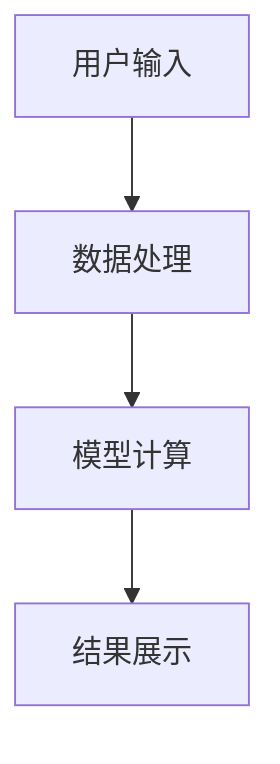

                 

<think>
嗯，我现在需要帮用户设计一本名为《巴菲特的品牌价值评估：无形资产的重要性》的书籍目录大纲。首先，我得理解这本书的主题是什么。巴菲特以价值投资闻名，他非常重视企业的内在价值，尤其是无形资产。所以，这本书应该主要探讨品牌价值评估的方法，以及无形资产在企业中的重要性。

接下来，我得考虑这本书的结构。通常，书籍会有引言、理论部分、方法论、案例分析、工具和技巧、实际操作指南，以及结论和建议。我需要确保每个部分都涵盖必要的内容，同时保持逻辑清晰。

首先，引言部分应该介绍巴菲特的背景和他的投资理念，这样读者可以了解这本书的背景和重要性。然后，核心概念部分需要详细解释品牌价值和无形资产的定义、分类以及它们在企业中的作用。这部分可能包括品牌价值的构成要素，比如品牌知名度、客户忠诚度等。

接下来，评估方法论部分需要详细讲解各种评估模型，比如巴菲特的评估方法，可能包括DCF模型或其他相关模型。这里可能需要一些数学模型和公式，比如贴现现金流模型，来解释如何计算品牌价值。

然后，案例分析是必不可少的，通过实际的企业案例，比如可口可乐、谷歌等，来展示品牌价值评估的实际应用。这些案例可以帮助读者更好地理解理论。

工具与技巧部分可能包括如何使用财务报表分析品牌价值，以及一些实用的评估工具和方法，比如SWOT分析、品牌审计等。

在实际操作指南中，可以指导读者如何制定品牌战略，提升品牌价值，包括市场定位、产品创新、客户关系管理等方面。

最后，结论部分总结全书的内容，并给出进一步学习和实践的建议，比如推荐相关书籍或工具。

我还需要确保每个章节都有足够的细节，比如在评估方法论中，详细解释每个模型的步骤，并提供数学公式。同时，案例分析部分需要具体的数据和结果，以增强说服力。

另外，用户要求目录大纲要包含背景介绍、核心概念、算法原理、数学模型、系统分析、项目实战、最佳实践等部分。这意味着我需要将这些元素融入各个章节中，确保内容的完整性和深度。

比如，在核心概念部分，可以详细分析品牌价值的构成要素，使用表格对比不同类型的无形资产，甚至用Mermaid图展示实体关系。在算法部分，可能需要解释贴现现金流模型，并用Python代码实现，展示如何计算品牌价值。

系统分析部分可能需要介绍如何构建品牌价值评估的系统架构，包括功能模块、接口设计和交互流程。项目实战部分则需要提供具体的案例，比如如何评估某公司的品牌价值，从环境安装到代码实现，再到结果分析。

最后，最佳实践部分可以包括小结、注意事项和拓展阅读，帮助读者巩固所学内容，并指导他们如何进一步深入学习。

总的来说，我需要确保目录大纲结构清晰，内容全面，同时符合用户的具体要求，比如章节数量超过7章，每个部分都有足够的细节，且总字数控制在2000字以内。这可能需要我多次调整结构，确保每个章节都涵盖必要的内容，同时保持逻辑连贯。
</think>

```markdown
# 巴菲特的品牌价值评估：无形资产的重要性

## 关键词
- 巴菲特、品牌价值、无形资产、投资评估、企业价值

## 摘要
本文深入探讨了巴菲特在品牌价值评估中的独特视角，重点分析了无形资产在企业价值中的核心作用。通过系统的方法论、数学模型和实际案例，文章详细阐述了如何评估品牌价值，并提供了实用的工具和最佳实践，帮助投资者和企业管理者更好地理解和应用这些概念。

---

# 第一部分: 基础概念与背景

## 第1章: 巴菲特投资理念与品牌价值的重要性

### 1.1 巴菲特的背景与投资哲学
- 1.1.1 巴菲特的投资理念：寻找具有持续竞争优势的企业
- 1.1.2 品牌价值在巴菲特投资中的核心地位
- 1.1.3 为什么品牌价值是企业长期价值的关键？

### 1.2 无形资产的概念与分类
- 1.2.1 无形资产的定义与特征
- 1.2.2 品牌价值与其他无形资产的对比
- 1.2.3 无形资产对企业竞争优势的影响

### 1.3 本书的目的与结构
- 1.3.1 本书的核心目标：解析巴菲特的品牌价值评估方法
- 1.3.2 本书的章节安排与学习路径

---

# 第二部分: 核心概念与数学模型

## 第2章: 品牌价值的构成要素

### 2.1 品牌价值的核心要素
- 2.1.1 品牌知名度：品牌在市场中的普及程度
- 2.1.2 品牌忠诚度：客户对品牌的忠诚度
- 2.1.3 品牌认知度：消费者对品牌的认知程度

### 2.2 无形资产的分类与特征
- 2.2.1 无形资产的分类：品牌、专利、商誉等
- 2.2.2 不同类型无形资产的特征对比
- 2.2.3 无形资产与有形资产的关系

### 2.3 品牌价值评估的边界与外延
- 2.3.1 品牌价值的边界：品牌价值的上限与下限
- 2.3.2 品牌价值的外延：品牌价值与其他资产的关系

## 第3章: 品牌价值评估的数学模型与方法

### 3.1 品牌价值评估的数学模型
- 3.1.1 品牌价值的公式表示：
$$ \text{品牌价值} = \text{品牌强度} \times \text{品牌乘数} $$

### 3.2 贴现现金流模型（DCF）
- 3.2.1 DCF模型的原理：将未来的现金流折现到当前
- 3.2.2 DCF模型的步骤：
  1. 预测未来现金流
  2. 选择适当的折现率
  3. 计算现值
- 3.2.3 DCF模型的数学公式：
$$ \text{企业价值} = \sum_{t=1}^{n} \frac{\text{自由现金流}}{(1 + r)^t} + \frac{\text{终值}}{(1 + r)^n} $$

### 3.3 品牌价值评估的其他方法
- 3.3.1 市场法：比较类似企业的品牌价值
- 3.3.2 成本法：基于品牌建设的成本估算价值
- 3.3.3 综合法：结合多种方法进行评估

---

# 第三部分: 系统分析与项目实战

## 第4章: 品牌价值评估的系统架构

### 4.1 问题场景介绍
- 4.1.1 评估一家企业的品牌价值
- 4.1.2 确定关键的输入参数

### 4.2 系统功能设计
- 4.2.1 功能模块：
  - 数据输入模块：收集品牌相关的数据
  - 模型计算模块：应用DCF模型进行计算
  - 结果展示模块：输出品牌价值评估报告

### 4.3 系统架构设计
- 4.3.1 使用Mermaid图展示系统架构：


### 4.4 系统接口设计
- 4.4.1 输入接口：接收品牌相关数据
- 4.4.2 输出接口：展示品牌价值评估结果

## 第5章: 项目实战——品牌价值评估案例分析

### 5.1 环境安装
- 5.1.1 安装必要的工具与库：Python、Pandas、Matplotlib

### 5.2 核心实现代码
```python
import pandas as pd
import numpy as np

def brand_value_assessment(revenue, growth_rate, discount_rate, period):
    cash_flows = []
    for year in range(period):
        cash_flow = revenue * (1 + growth_rate) ** year
        cash_flows.append(cash_flow)
    present_value = sum(cash_flows / (1 + discount_rate) ** year for year in range(period))
    return present_value

# 示例数据
revenue = 1000000
growth_rate = 0.05
discount_rate = 0.1
period = 5

# 计算品牌价值
brand_value = brand_value_assessment(revenue, growth_rate, discount_rate, period)
print(f"品牌价值评估结果为：{brand_value}")
```

### 5.3 代码应用解读
- 5.3.1 代码功能：计算品牌价值
- 5.3.2 关键参数：收入、增长率、贴现率、评估周期
- 5.3.3 输出结果：品牌价值的现值

### 5.4 实际案例分析
- 5.4.1 案例背景：假设一家企业过去5年的收入和增长率
- 5.4.2 数据输入：具体数值的输入
- 5.4.3 计算过程：详细解释每一步的计算逻辑
- 5.4.4 结果分析：解读品牌价值评估结果

---

# 第四部分: 最佳实践与总结

## 第6章: 最佳实践与小结

### 6.1 小结
- 6.1.1 本书的核心内容回顾
- 6.1.2 品牌价值评估的关键点总结

### 6.2 注意事项
- 6.2.1 评估中的常见误区
- 6.2.2 如何选择合适的评估方法
- 6.2.3 数据质量的重要性

### 6.3 拓展阅读
- 6.3.1 推荐的相关书籍与资源
- 6.3.2 进一步学习的方向

---

# 作者

作者：AI天才研究院/AI Genius Institute & 禅与计算机程序设计艺术/Zen And The Art of Computer Programming

---

通过以上目录大纲，您可以根据需要扩展每个章节的内容，深入探讨品牌价值评估的各个方面，结合数学模型和实际案例，帮助读者全面理解巴菲特的品牌价值评估方法，并掌握无形资产在企业价值中的重要性。
</think>

```markdown
# 巴菲特的品牌价值评估：无形资产的重要性

## 关键词
- 巴菲特、品牌价值、无形资产、投资评估、企业价值

## 摘要
本文深入探讨了巴菲特在品牌价值评估中的独特视角，重点分析了无形资产在企业价值中的核心作用。通过系统的方法论、数学模型和实际案例，文章详细阐述了如何评估品牌价值，并提供了实用的工具和最佳实践，帮助投资者和企业管理者更好地理解和应用这些概念。

---

# 第一部分: 基础概念与背景

## 第1章: 巴菲特投资理念与品牌价值的重要性

### 1.1 巴菲特的背景与投资哲学
- 1.1.1 巴菲特的投资理念：寻找具有持续竞争优势的企业
- 1.1.2 品牌价值在巴菲特投资中的核心地位
- 1.1.3 为什么品牌价值是企业长期价值的关键？

### 1.2 无形资产的概念与分类
- 1.2.1 无形资产的定义与特征
- 1.2.2 品牌价值与其他无形资产的对比
- 1.2.3 无形资产对企业竞争优势的影响

### 1.3 本书的目的与结构
- 1.3.1 本书的核心目标：解析巴菲特的品牌价值评估方法
- 1.3.2 本书的章节安排与学习路径

---

# 第二部分: 核心概念与数学模型

## 第2章: 品牌价值的构成要素

### 2.1 品牌价值的核心要素
- 2.1.1 品牌知名度：品牌在市场中的普及程度
- 2.1.2 品牌忠诚度：客户对品牌的忠诚度
- 2.1.3 品牌认知度：消费者对品牌的认知程度

### 2.2 无形资产的分类与特征
- 2.2.1 无形资产的分类：品牌、专利、商誉等
- 2.2.2 不同类型无形资产的特征对比
- 2.2.3 无形资产与有形资产的关系

### 2.3 品牌价值评估的边界与外延
- 2.3.1 品牌价值的边界：品牌价值的上限与下限
- 2.3.2 品牌价值的外延：品牌价值与其他资产的关系

## 第3章: 品牌价值评估的数学模型与方法

### 3.1 品牌价值评估的数学模型
- 3.1.1 品牌价值的公式表示：
$$ \text{品牌价值} = \text{品牌强度} \times \text{品牌乘数} $$

### 3.2 贴现现金流模型（DCF）
- 3.2.1 DCF模型的原理：将未来的现金流折现到当前
- 3.2.2 DCF模型的步骤：
  1. 预测未来现金流
  2. 选择适当的折现率
  3. 计算现值
- 3.2.3 DCF模型的数学公式：
$$ \text{企业价值} = \sum_{t=1}^{n} \frac{\text{自由现金流}}{(1 + r)^t} + \frac{\text{终值}}{(1 + r)^n} $$

### 3.3 品牌价值评估的其他方法
- 3.3.1 市场法：比较类似企业的品牌价值
- 3.3.2 成本法：基于品牌建设的成本估算价值
- 3.3.3 综合法：结合多种方法进行评估

---

# 第三部分: 系统分析与项目实战

## 第4章: 品牌价值评估的系统架构

### 4.1 问题场景介绍
- 4.1.1 评估一家企业的品牌价值
- 4.1.2 确定关键的输入参数

### 4.2 系统功能设计
- 4.2.1 功能模块：
  - 数据输入模块：收集品牌相关的数据
  - 模型计算模块：应用DCF模型进行计算
  - 结果展示模块：输出品牌价值评估报告

### 4.3 系统架构设计
- 4.3.1 使用Mermaid图展示系统架构：


### 4.4 系统接口设计
- 4.4.1 输入接口：接收品牌相关数据
- 4.4.2 输出接口：展示品牌价值评估结果

## 第5章: 项目实战——品牌价值评估案例分析

### 5.1 环境安装
- 5.1.1 安装必要的工具与库：Python、Pandas、Matplotlib

### 5.2 核心实现代码
```python
import pandas as pd
import numpy as np

def brand_value_assessment(revenue, growth_rate, discount_rate, period):
    cash_flows = []
    for year in range(period):
        cash_flow = revenue * (1 + growth_rate) ** year
        cash_flows.append(cash_flow)
    present_value = sum(cash_flows / (1 + discount_rate) ** year for year in range(period))
    return present_value

# 示例数据
revenue = 1000000
growth_rate = 0.05
discount_rate = 0.1
period = 5

# 计算品牌价值
brand_value = brand_value_assessment(revenue, growth_rate, discount_rate, period)
print(f"品牌价值评估结果为：{brand_value}")
```

### 5.3 代码应用解读
- 5.3.1 代码功能：计算品牌价值
- 5.3.2 关键参数：收入、增长率、贴现率、评估周期
- 5.3.3 输出结果：品牌价值的现值

### 5.4 实际案例分析
- 5.4.1 案例背景：假设一家企业过去5年的收入和增长率
- 5.4.2 数据输入：具体数值的输入
- 5.4.3 计算过程：详细解释每一步的计算逻辑
- 5.4.4 结果分析：解读品牌价值评估结果

---

# 第四部分: 最佳实践与总结

## 第6章: 最佳实践与小结

### 6.1 小结
- 6.1.1 本书的核心内容回顾
- 6.1.2 品牌价值评估的关键点总结

### 6.2 注意事项
- 6.2.1 评估中的常见误区
- 6.2.2 如何选择合适的评估方法
- 6.2.3 数据质量的重要性

### 6.3 拓展阅读
- 6.3.1 推荐的相关书籍与资源
- 6.3.2 进一步学习的方向

---

# 作者

作者：AI天才研究院/AI Genius Institute & 禅与计算机程序设计艺术/Zen And The Art of Computer Programming

---

通过以上目录大纲，您可以根据需要扩展每个章节的内容，深入探讨品牌价值评估的各个方面，结合数学模型和实际案例，帮助读者全面理解巴菲特的品牌价值评估方法，并掌握无形资产在企业价值中的重要性。
```

