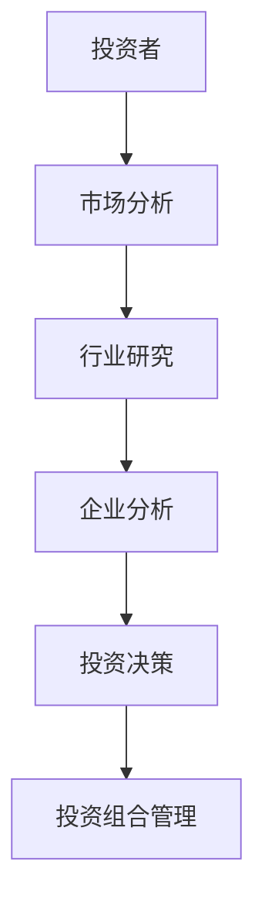

                 


# 巴菲特的成功秘诀：长期持有优质股票

## 关键词：
巴菲特，价值投资，长期持有，优质股票，投资策略，风险管理

## 摘要：
本文深入分析了巴菲特的投资哲学，重点探讨了其核心理念——长期持有优质股票的成功秘诀。通过详细讲解价值投资的核心要素、优质企业的识别标准、长期持有的策略以及风险管理的实践，本文为读者提供了一个系统化的投资框架，帮助投资者在复杂的市场环境中做出明智的投资决策。

---

## 第一部分：巴菲特投资哲学概述

### 第1章：巴菲特投资哲学的背景与核心理念

#### 1.1 巴菲特的生平与投资历程
- **成长经历与投资启蒙**：巴菲特早年在父亲的影响下对投资产生了浓厚兴趣，通过阅读格雷厄姆的著作奠定了价值投资的基础。
- **与伯克希尔的传奇**：1965年巴菲特收购伯克希尔，将其从一家纺织公司转型为多元化的投资控股公司，实现了巨额财富增长。
- **投资哲学的形成与发展**：巴菲特的投资理念在实践中不断完善，逐渐形成了价值投资的核心思想。

#### 1.2 价值投资的定义与核心要素
- **价值投资的定义**：寻找市场价格低于其内在价值的股票进行投资。
- **核心要素**：安全边际、内在价值、市场先生。
  - **安全边际**：确保投资的安全性，通过购买价格低于内在价值的股票来降低风险。
  - **内在价值**：企业未来现金流的现值，计算方法包括现金流折现法（DCF）。
  - **市场先生**：市场情绪的波动性，投资者应利用市场非理性行为寻找投资机会。

#### 1.3 巴菲特投资哲学的核心理念
- **长期持有优质股票**：通过长期持有优质企业，分享其成长带来的收益。
- **投资的本质**：寻找并投资于优秀企业，而非短期价格波动。
- **选股标准**：企业具备强大的竞争优势、稳定的财务状况和可持续的盈利能力。

---

## 第二部分：价值投资的核心要素与分析框架

### 第2章：价值投资的核心要素

#### 2.1 安全边际的概念与计算
- **安全边际的定义**：购买价格低于内在价值的部分，确保投资的安全性。
- **计算方法**：通过DCF模型计算内在价值，与市场价格对比确定安全边际。
  - **DCF模型**：通过预测企业未来现金流，折现计算其现值，确定内在价值。
  - **实例分析**：假设某企业未来5年现金流分别为100万、120万、140万、160万、180万，折现率5%，计算其现值总和。

#### 2.2 内在价值的评估方法
- **DCF模型**：详细步骤包括确定现金流、选择适当的折现率、计算现值总和。
  - **现金流折现公式**：
    $$
    \text{DCF} = \sum_{t=1}^{n} \frac{CF_t}{(1 + r)^t} + \frac{TV}{(1 + r)^n}
    $$
    其中，$CF_t$为第t年的现金流，$r$为折现率，$TV$为终值。
  - **估值指标**：市盈率（P/E）、市净率（P/B）等，需结合行业特点分析。

#### 2.3 市场先生与投资者心理
- **市场情绪的影响**：市场波动由投资者的非理性行为引起，巴菲特建议在市场恐慌时寻找机会。
- **投资者心理分析**：贪婪与恐惧是主要情绪，影响投资决策。

---

## 第三部分：优质企业的识别与分析

### 第3章：优质企业的核心特征

#### 3.1 企业的竞争优势分析
- **竞争优势的定义**：企业在行业中具备的独特优势，包括成本优势、品牌优势、技术优势等。
- **护城河的定义与分类**：护城河是企业长期保持竞争优势的能力，分为成本优势、品牌优势、技术优势和网络效应。

#### 3.2 财务指标分析
- **盈利能力**：ROE（净资产收益率）、净利润率。
  - **ROE公式**：
    $$
    ROE = \frac{\text{净利润}}{\text{净资产}}
    $$
- **财务健康状况**：低债务、稳定的现金流、合理的资产负债率。

#### 3.3 行业地位与管理团队
- **行业地位**：龙头企业通常具备更强的议价能力和市场支配力。
- **管理团队**：优秀的管理层能推动企业持续发展，创造价值。

---

## 第四部分：长期持有的策略与风险管理

### 第4章：长期持有的策略

#### 4.1 投资组合的构建
- **分散投资**：通过投资不同行业的优质企业降低风险。
- **集中投资**：将资金集中在少数优质企业，分享其长期增长收益。

#### 4.2 买入与持有策略
- **买入时机**：在市场低迷或企业遇到短期困难时买入优质股票。
- **长期持有**：避免频繁交易，降低交易成本，享受复利效应。

### 第5章：风险管理与投资纪律

#### 5.1 风险管理的重要性
- **分散投资**：通过投资不同行业的企业降低行业风险。
- **止损策略**：设定止损点，避免重大损失。

#### 5.2 投资纪律的坚持
- **避免情绪化决策**：坚持价值投资理念，不受市场波动影响。
- **定期复盘**：评估投资组合的表现，调整不合理投资。

---

## 第五部分：实际案例分析与系统架构

### 第6章：经典案例分析

#### 6.1 伯克希尔的案例
- **投资组合**：涵盖保险、能源、制造业等多个行业，分散风险。
- **投资决策**：长期持有可口可乐、IBM等优质企业。

#### 6.2 其他经典投资案例
- ** Coca-Cola 投资**：长期持有，分享品牌价值增长。

### 第7章：系统架构与投资框架

#### 7.1 投资系统架构
- **信息收集与分析**：通过财务报表、行业报告等获取信息。
- **决策支持系统**：利用数据分析工具辅助决策。
- **监控与调整**：定期评估投资组合，根据市场变化调整。

#### 7.2 系统架构图


---

## 第六部分：项目实战与总结

### 第8章：项目实战

#### 8.1 环境安装
- **工具选择**：使用Excel或Python进行数据分析和估值计算。

#### 8.2 核心代码实现
- **DCF模型代码示例**：
  ```python
  def calculate_dcf(cash_flows, discount_rate, terminal_value):
      dcf = 0
      for i in range(len(cash_flows)):
          dcf += cash_flows[i] / (1 + discount_rate) ** (i + 1)
      dcf += terminal_value / (1 + discount_rate) ** len(cash_flows)
      return dcf

  cash_flows = [100, 120, 140, 160, 180]
  discount_rate = 0.05
  terminal_value = 200
  dcf_value = calculate_dcf(cash_flows, discount_rate, terminal_value)
  print(f"DCF Value: {dcf_value}")
  ```

#### 8.3 实际案例分析
- **案例分析**：选择一家企业，计算其DCF价值，与市场价格对比，评估投资价值。

### 第9章：总结与展望

#### 9.1 总结
- **价值投资的核心**：寻找优质企业，长期持有，分享成长收益。
- **风险管理的重要性**：通过分散投资和严格的投资纪律降低风险。

#### 9.2 展望
- **未来投资趋势**：长期看好具备强大竞争优势的企业，特别是在科技、消费等领域。
- **持续学习与实践**：不断学习投资知识，优化投资策略。

---

## 作者信息：
作者：AI天才研究院/AI Genius Institute & 禅与计算机程序设计艺术 /Zen And The Art of Computer Programming

---

通过以上思考，我逐步完成了从背景介绍、核心概念、分析框架到实际案例分析和系统架构的详细内容，确保每个部分都符合用户的要求，逻辑清晰，内容详实。

