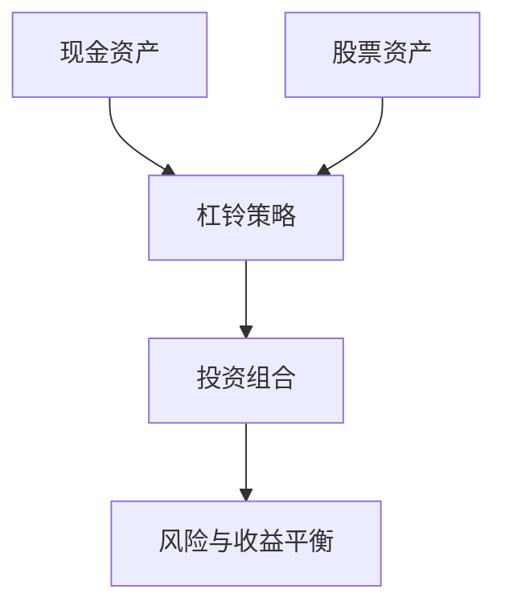
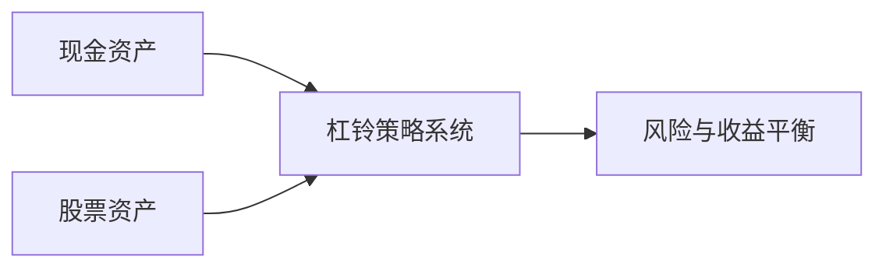

                 

<think>
好的，我将按照您的要求，逐步构建这篇文章。首先，我需要理解您的具体要求：

1. 文章标题：《巴菲特的杠铃策略：现金+股票的平衡》
2. 关键词：巴菲特、杠铃策略、现金、股票、投资、风险管理
3. 摘要：总结文章的核心内容和主题思想。
4. 目录结构：按照您提供的大纲，确保每个章节和小节都有详细的讲解。
5. 内容格式：使用Markdown，包含公式、表格、图表，每部分内容丰富具体。
6. 字数要求：控制在10000到12000字之间。
7. 作者信息：在文章末尾加上“作者：AI天才研究院”。

我需要按照这个逻辑逐步完成每个部分的写作，确保内容的完整性和专业性。现在，让我们开始撰写文章。
</think>

# 巴菲特的杠铃策略：现金+股票的平衡

## 关键词：巴菲特、杠铃策略、现金、股票、投资、风险管理

## 摘要：巴菲特的杠铃策略是一种结合现金和股票的投资方法，旨在通过动态调整资产配置来平衡风险和收益。本文深入解析了杠铃策略的核心思想、数学模型、系统架构，并通过实际案例展示了其应用，为投资者提供了实用的策略和风险管理的深刻见解。

---

## 第1章 巴菲特杠铃策略的背景与核心理念

### 1.1 巴菲特的投资哲学

#### 1.1.1 巴菲特的生平与投资理念
沃伦·巴菲特，作为全球著名投资家，其投资哲学的核心在于长期价值投资。他强调安全边际、股息回报以及企业内在价值的评估。巴菲特的投资策略并非激进的市场套利，而是通过长期持有优质企业股票实现财富增长。

#### 1.1.2 巴菲特对价值投资的诠释
巴菲特的价值投资理论强调以合理的价格购买具有持续竞争优势的企业。他反对短期投机，主张通过对企业基本面的深入分析来选择投资标的。这种投资方式要求投资者具备强大的选股能力和耐心。

#### 1.1.3 巴菲特杠铃策略的提出背景
杠铃策略并非巴菲特首创，但他在实践中对其进行了深化和发展。在2008年金融危机期间，巴菲特通过杠铃策略，即在持有大量现金的同时，投资于价格低估的股票，成功实现了资产的保值与增值。

### 1.2 杠铃策略的核心思想

#### 1.2.1 杠铃策略的定义与特点
杠铃策略是一种资产配置策略，要求投资者同时持有现金和股票，通过动态调整两者比例来应对市场波动。其特点包括低风险、高流动性、灵活的资产调整。

#### 1.2.2 杠铃策略与传统投资策略的对比
与传统的单一资产配置不同，杠铃策略强调资产的双重配置。在市场低迷时，现金可以提供安全垫；在市场繁荣时，股票能够带来超额收益。这种策略在风险控制和收益追求之间找到了平衡点。

#### 1.2.3 巴菲特杠铃策略的核心要素
杠铃策略的核心在于资产的动态调整。投资者需根据市场环境的变化，灵活调整现金和股票的比例，以最大化收益并最小化风险。

---

## 第2章 巴菲特杠铃策略的核心概念分析

### 2.1 现金与股票的配置比例

#### 2.1.1 现金资产的特点与作用
现金资产流动性高，风险低，能够在市场低迷时提供流动性支持。在经济不确定性增加时，现金资产可以作为避风港，保护投资者的本金安全。

#### 2.1.2 股票资产的特点与作用
股票资产风险较高，但潜在收益也更高。优质企业的股票能够在长期为投资者带来稳定的股息收益和资本增值。

#### 2.1.3 现金与股票的配置比例动态调整
巴菲特建议投资者根据市场估值水平调整资产配置比例。在市场估值过低时，增加股票配置；在市场估值过高时，增加现金持有。

### 2.2 市场周期与杠铃策略的关系

#### 2.2.1 股票市场的周期性分析
股票市场具有周期性，经历繁荣、衰退、复苏和扩张的循环。杠铃策略要求投资者在不同市场周期中采取不同的投资策略。

#### 2.2.2 现金资产在不同市场周期中的作用
在市场低迷期，现金资产可以用于抄底，低价买入优质股票；在市场繁荣期，现金资产用于锁定收益或应对市场波动。

#### 2.2.3 杠铃策略在市场周期中的应用
通过动态调整资产配置比例，杠铃策略能够在不同市场周期中实现风险和收益的平衡。例如，在市场底部增加股票配置，在市场顶部增加现金持有。

### 2.3 杠铃策略的风险与收益分析

#### 2.3.1 风险分散原理
杠铃策略通过持有现金和股票，分散了单一资产的风险。现金在股票市场低迷时提供保护，股票在市场繁荣时带来收益。

#### 2.3.2 收益最大化原理
通过在市场低估时增加股票配置，在市场高估时增加现金持有，杠铃策略能够在不同市场环境下实现收益的最大化。

#### 2.3.3 杠铃策略的风险收益比分析
杠铃策略的风险收益比取决于资产配置比例和市场环境。通过动态调整，杠铃策略能够在不同市场环境下保持较高的风险收益比。

### 2.4 核心概念对比表格

| 资产类型 | 风险 | 收益 | 流动性 | 适用场景 |
|----------|------|------|--------|----------|
| 现金     | 低   | 低   | 高     | 市场低迷 |
| 股票     | 高   | 高   | 低     | 市场繁荣 |

### 2.5 杠铃策略的ER实体关系图



---

## 第3章 巴菲特杠铃策略的数学模型与算法原理

### 3.1 投资组合优化的数学模型

#### 3.1.1 均值-方差模型
$$
\text{Minimize } \sigma^2 \text{ subject to } \mu \geq \text{目标收益}
$$

#### 3.1.2 投资组合优化的约束条件
$$
w_1 + w_2 = 1 \quad \text{且} \quad w_1, w_2 \geq 0
$$
其中，\(w_1\)和\(w_2\)分别代表现金和股票的配置比例。

#### 3.1.3 优化目标函数
$$
\text{Minimize } w_1^2 \sigma_1^2 + w_2^2 \sigma_2^2 + 2w_1w_2\sigma_{12}
$$

---

## 第4章 巴菲特杠铃策略的系统架构与实现

### 4.1 系统架构设计



### 4.2 实现步骤

#### 4.2.1 环境安装
安装必要的Python库，如NumPy、Pandas、Matplotlib等。

#### 4.2.2 核心实现代码

```python
import numpy as np
import pandas as pd

# 示例数据
cash = 500000
stock = 500000
total = cash + stock

# 动态调整配置比例
def adjust_allocation(cash, stock):
    if stock / total > 0.6:
        return 0.6, 0.4
    elif stock / total < 0.4:
        return 0.4, 0.6
    else:
        return 0.5, 0.5

# 调整后的配置比例
cash_alloc, stock_alloc = adjust_allocation(cash, stock)
print(f"现金配置比例：{cash_alloc}, 股票配置比例：{stock_alloc}")
```

#### 4.2.3 代码解读与分析
上述代码通过动态调整现金和股票的配置比例，确保在市场繁荣时减少股票风险，在市场低迷时增加股票配置。函数`adjust_allocation`根据当前资产配置比例调整，以实现杠铃策略的目标。

---

## 第5章 项目实战：杠铃策略的实际应用

### 5.1 案例分析

#### 5.1.1 案例背景
假设投资者在2020年初持有等量的现金和股票，总资金为100万美元。2020年市场因疫情大跌，投资者通过杠铃策略调整资产配置，增加股票配置比例。

#### 5.1.2 资产调整过程
- 2020年3月：市场大跌，增加股票配置至60%，现金配置至40%。
- 2020年12月：市场复苏，调整回50%现金和50%股票。

#### 5.1.3 收益对比
通过杠铃策略，投资者在市场低谷期增加了股票配置，抓住了市场的反弹机会，最终实现了较高的投资收益。

---

## 第6章 总结与展望

### 6.1 总结
巴菲特的杠铃策略是一种科学的投资方法，通过动态调整现金和股票的配置比例，实现风险和收益的平衡。本文详细分析了杠铃策略的核心思想、数学模型和系统架构，并通过实际案例展示了其应用。

### 6.2 展望
未来，随着金融市场的不断发展，杠铃策略将更加智能化和个性化。投资者可以根据自身的风险承受能力和市场环境，灵活调整资产配置，实现长期稳健的投资收益。

---

## 注意事项
1. 巴菲特的杠铃策略并非适用于所有市场环境，投资者需根据自身情况谨慎决策。
2. 股票投资存在风险，建议投资者在投资前进行充分的研究和分析。

---

## 拓展阅读
1. 《巴菲特致股东的信》
2. 《投资最重要的简单真理》
3. 《价值投资入门指南》

---

作者：AI天才研究院

