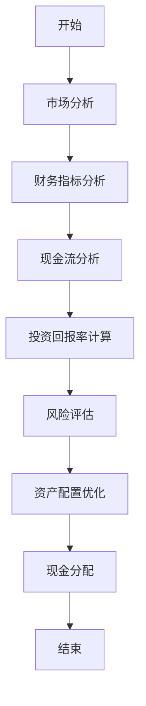

                 

<think>
好的，我需要根据用户的要求，编写一篇关于巴菲特现金管理哲学的文章，特别是机会资金的重要性。文章需要有详细的目录结构，涵盖引言、现金管理的重要性、巴菲特的现金管理哲学、机会资金的管理策略、数学模型与算法、系统架构设计、项目实战以及总结等部分。此外，文章需要使用专业的技术语言，结构紧凑，逻辑清晰，并包含必要的图表和公式。

首先，我需要明确文章的核心主题：巴菲特的现金管理哲学，特别是机会资金的重要性。这涉及到投资策略、资金管理、风险管理等多个方面。我需要从背景介绍开始，逐步深入探讨相关概念、策略、数学模型和系统设计，最后通过实际案例来验证这些理论。

在结构上，文章将分为以下几个部分：

1. **引言**：介绍现金管理的重要性，巴菲特的背景，机会资金的定义和作用。
2. **现金管理的重要性**：详细阐述现金管理的核心概念，包括机会资金的识别、评估和管理策略。
3. **巴菲特的现金管理哲学**：探讨巴菲特的投资理念、价值投资策略以及长期视角在现金管理中的应用。
4. **数学模型与算法**：引入相关的数学公式和算法，如投资回报率（ROI）、净现值（NPV）和风险调整后的收益（RAR）模型。
5. **系统架构设计**：描述机会资金管理系统的组成部分，包括数据采集、分析模块、决策支持模块，并用图表展示系统架构。
6. **项目实战**：通过实际案例分析，展示如何应用巴菲特的现金管理策略，包括环境安装、核心代码实现、案例分析和项目小结。
7. **总结与展望**：回顾全文，强调机会资金的重要性，并提出未来的研究方向和最佳实践建议。

在写作过程中，我需要确保每一部分内容详实，逻辑连贯，并且符合用户的要求。特别是在数学模型和系统架构部分，我需要使用专业的术语和图表来解释复杂的概念，帮助读者更好地理解和应用这些策略。

最后，我需要检查整个文章的结构，确保每个部分都覆盖了用户指定的内容，没有遗漏重要的信息。同时，保持语言的专业性和流畅性，使整篇文章既有深度又易于理解。
</think>

# 巴菲特的现金管理哲学：机会资金的重要性

> 关键词：现金管理，巴菲特，机会资金，投资策略，风险管理，数学模型，系统架构

> 摘要：本文深入探讨了巴菲特的现金管理哲学，特别是机会资金的重要性。通过分析现金管理的核心概念、巴菲特的投资策略、机会资金的管理策略、数学模型与算法、系统架构设计以及项目实战，本文为读者提供了全面的理解和实践指南。

---

## 第一部分：引言

### 第1章：现金管理的重要性

#### 1.1 现金管理的核心概念

- **1.1.1 现金管理的定义与作用**
  - 现金管理是指对现金的流入和流出进行计划、控制和优化，以实现资金的最大化利用和最小化风险。
  - 现金管理在个人和企业中都至关重要，因为它直接影响到财务健康和投资回报。

- **1.1.2 现金管理在个人与企业中的重要性**
  - 对个人来说，良好的现金管理可以帮助实现财务自由，避免突发情况下的资金短缺。
  - 对企业而言，现金管理是维持运营和扩张的关键，直接影响企业的生存和发展。

- **1.1.3 机会资金的定义与特点**
  - 机会资金是指可用于抓住投资机会的资金，其特点是灵活性高、风险可控、回报潜力大。
  - 机会资金的管理需要精准的识别和评估，确保资金能够有效支持高价值的投资。

#### 1.2 巴菲特的现金管理哲学

- **1.2.1 巴菲特的投资理念与现金管理**
  - 巴菲特强调长期投资和价值投资，认为现金是企业的“血液”，必须合理分配和管理。
  - 现金管理在巴菲特的投资策略中占据重要地位，他注重保持一定的现金储备以应对市场变化。

- **1.2.2 巴菲特的“机会资金”概念**
  - 机会资金是巴菲特投资哲学中的核心概念，指用于抓住市场机会的资金。
  - 机会资金的管理需要结合市场趋势、企业基本面和风险管理因素。

- **1.2.3 现金管理与风险管理的结合**
  - 巴菲特注重将现金管理与风险管理相结合，通过合理分配资金降低投资风险。
  - 现金管理的灵活性和稳定性是巴菲特投资成功的关键因素之一。

#### 1.3 机会资金的重要性

- **1.3.1 机会资金的来源与分配**
  - 机会资金可以通过多种渠道获得，包括企业盈利、债务融资和外部投资。
  - 现金分配需要根据市场环境和企业战略进行动态调整。

- **1.3.2 机会资金在投资决策中的作用**
  - 机会资金是抓住投资机会的关键，能够快速响应市场变化。
  - 机会资金的合理分配可以提高投资回报率，降低风险。

- **1.3.3 机会资金与长期收益的关系**
  - 长期收益与机会资金的管理密切相关，合理分配资金能够实现长期稳定的回报。
  - 机会资金的管理需要平衡短期和长期目标，确保资金的有效利用。

#### 1.4 本章小结

- 本章介绍了现金管理的核心概念和巴菲特的现金管理哲学，强调了机会资金在投资中的重要性。机会资金的合理管理能够提高投资回报率，降低风险，是实现长期收益的关键。

---

## 第二部分：巴菲特的现金管理哲学

### 第2章：巴菲特的投资策略与现金管理

#### 2.1 巴菲特的价值投资理念

- **2.1.1 价值投资的核心原则**
  - 价值投资强调购买低于市场价值的股票，长期持有，等待市场回归其真实价值。
  - 巴菲特认为，市场波动性和短期价格波动不应影响长期投资决策。

- **2.1.2 现金管理在价值投资中的作用**
  - 现金管理是价值投资的重要组成部分，巴菲特强调保持一定的现金储备以抓住投资机会。
  - 现金管理的灵活性和稳定性是实现价值投资成功的关键。

- **2.1.3 巴菲特的价值投资策略与现金管理**
  - 巴菲特通过分析企业基本面，评估其内在价值，决定是否进行投资。
  - 现金管理需要根据企业内在价值和市场环境进行动态调整。

#### 2.2 巴菲特的分散投资策略

- **2.2.1 分散投资的原理**
  - 分散投资可以降低风险，避免将所有资金投入单一资产或行业。
  - 巴菲特通过分散投资降低市场波动带来的影响，实现风险可控。

- **2.2.2 现金分配与资产配置**
  - 现金分配需要根据分散投资的原则，合理配置不同资产类别。
  - 资产配置需要考虑市场环境、企业基本面和风险承受能力。

- **2.2.3 巴菲特的分散投资策略与现金管理**
  - 巴菲特通过分散投资降低风险，同时保持足够的现金储备以抓住投资机会。
  - 现金分配需要根据分散投资的原则进行动态调整，确保资金的有效利用。

#### 2.3 巴菲特的长期视角

- **2.3.1 长期投资与现金储备**
  - 巴菲特强调长期投资，认为短期市场波动不应影响长期投资决策。
  - 现金储备是应对市场变化和抓住投资机会的重要保障。

- **2.3.2 现金管理的灵活性与稳定性**
  - 现金管理需要在灵活性和稳定性之间找到平衡，既要能够快速响应市场变化，又要确保资金的稳定性。
  - 长期视角下的现金管理需要考虑企业的长期发展和市场趋势。

#### 2.4 本章小结

- 本章探讨了巴菲特的价值投资理念、分散投资策略和长期视角下的现金管理。巴菲特的现金管理哲学强调灵活性与稳定性的结合，通过分散投资和长期视角实现投资成功。

---

## 第三部分：机会资金的管理策略

### 第3章：机会资金的识别与评估

#### 3.1 机会资金的识别方法

- **3.1.1 市场分析与机会识别**
  - 市场分析是识别机会资金的关键，需要关注行业趋势、市场波动和经济环境。
  - 机会识别需要结合市场分析和企业基本面，找到高潜力的投资机会。

- **3.1.2 财务指标与资金流动分析**
  - 财务指标分析是识别机会资金的重要手段，包括盈利能力、偿债能力和发展能力。
  - 资金流动分析可以帮助识别资金的来源和用途，评估企业的财务健康状况。

#### 3.2 机会资金的评估模型

- **3.2.1 现金流分析**
  - 现金流分析是评估机会资金的重要工具，包括经营活动、投资活动和筹资活动的现金流。
  - 通过现金流分析可以评估企业的财务健康状况和资金流动性。

- **3.2.2 投资回报率（ROI）的计算**
  - 投资回报率（ROI）是评估投资机会的重要指标，计算公式为：
    $$ ROI = \frac{投资收益 - 投资成本}{投资成本} \times 100\% $$
  - ROI越高，投资机会的吸引力越大。

- **3.2.3 风险评估与概率分析**
  - 风险评估是机会资金管理的重要环节，需要评估投资机会的风险程度。
  - 概率分析可以帮助评估不同风险情景下的投资回报率，制定合理的投资决策。

#### 3.3 机会资金的分配策略

- **3.3.1 资产配置的优化**
  - 资产配置需要根据市场环境和投资目标进行优化，合理分配不同资产类别。
  - 机会资金的分配需要结合资产配置策略，确保资金的有效利用。

- **3.3.2 现金分配的动态调整**
  - 现金分配需要根据市场变化和企业战略进行动态调整，确保资金的灵活性和稳定性。
  - 动态调整现金分配可以提高投资回报率，降低风险。

#### 3.4 本章小结

- 本章探讨了机会资金的识别与评估策略，包括市场分析、财务指标分析、现金流分析、投资回报率计算和风险评估。机会资金的合理分配需要结合资产配置和动态调整，确保资金的有效利用。

---

## 第四部分：数学模型与算法

### 第4章：巴菲特现金管理的数学模型

#### 4.1 现金管理的核心数学公式

- **4.1.1 投资回报率（ROI）公式**
  $$ ROI = \frac{投资收益 - 投资成本}{投资成本} \times 100\% $$

- **4.1.2 现金流的净现值（NPV）计算**
  $$ NPV = \sum_{t=0}^{n} \frac{CF_t}{(1 + r)^t} $$
  其中，$CF_t$是第$t$年的现金流，$r$是贴现率。

- **4.1.3 风险调整后的收益（RAR）模型**
  $$ RAR = \frac{投资回报率 - 无风险利率}{风险系数} $$

#### 4.2 机会资金的数学模型

- **4.2.1 机会资金的识别与评估**
  - 机会识别模型：通过市场分析和财务指标分析，识别高潜力的投资机会。
  - 机会评估模型：通过现金流分析和投资回报率计算，评估投资机会的吸引力。

- **4.2.2 机会资金的分配策略**
  - 资产配置模型：根据市场环境和投资目标，优化资产配置。
  - 现金分配模型：根据动态调整策略，合理分配资金。

#### 4.3 算法流程图



#### 4.4 本章小结

- 本章通过数学公式和算法流程图，详细介绍了机会资金的识别与评估过程。通过投资回报率、净现值和风险调整后的收益模型，可以有效评估投资机会并制定合理的现金分配策略。

---

## 第五部分：系统架构设计

### 第5章：机会资金管理系统的架构设计

#### 5.1 系统功能设计

- **5.1.1 数据采集模块**
  - 从市场数据、财务报表等来源采集数据。
  - 数据预处理和清洗，确保数据的准确性和完整性。

- **5.1.2 分析模块**
  - 通过市场分析和财务指标分析，识别高潜力的投资机会。
  - 使用数学模型评估投资机会的吸引力，制定现金分配策略。

- **5.1.3 决策支持模块**
  - 根据分析结果，制定投资决策和现金分配计划。
  - 提供风险评估和概率分析，优化资产配置。

#### 5.2 系统架构设计


#### 5.3 系统接口设计

- **5.3.1 数据接口**
  - 数据输入接口：接收市场数据和财务报表。
  - 数据输出接口：输出分析结果和投资决策。

- **5.3.2 用户接口**
  - 用户输入接口：接收用户的投资目标和风险偏好。
  - 用户输出接口：显示分析结果和投资建议。

#### 5.4 系统交互流程图


#### 5.5 本章小结

- 本章通过系统架构设计，详细介绍了机会资金管理系统的组成部分和交互流程。通过数据采集、分析和决策支持模块，可以实现机会资金的科学管理和动态调整。

---

## 第六部分：项目实战

### 第6章：机会资金管理系统的实现

#### 6.1 环境安装

- **6.1.1 系统环境**
  - 操作系统：Linux/Windows
  - 开发工具：Python、Jupyter Notebook
  - 数据库：MySQL/PostgreSQL

- **6.1.2 安装依赖**
  - 安装Python库：pandas、numpy、matplotlib、scipy
  - 安装可视化工具：Graphviz

#### 6.2 核心代码实现

- **6.2.1 数据采集模块**
  ```python
  import pandas as pd
  import requests

  def get_market_data(ticker):
      url = f"https://api.example.com/stock/{ticker}"
      response = requests.get(url)
      data = response.json()
      df = pd.DataFrame(data)
      return df
  ```

- **6.2.2 分析模块**
  ```python
  def assess_opportunity(ticker, data):
      # 计算投资回报率
      roi = (data['投资收益'][ticker] - data['投资成本'][ticker]) / data['投资成本'][ticker]
      # 计算净现值
      npv = sum(data['现金流'][ticker] / (1 + data['贴现率'][ticker]) ** t for t in range(len(data['现金流'][ticker])))
      return roi, npv
  ```

- **6.2.3 决策支持模块**
  ```python
  def optimize_allocation(rois, npvs):
      # 使用优化算法选择最佳资产配置
      import numpy as np
      from scipy.optimize import minimize

      def objective(x):
          return -sum(x * rois)

      constraints = [
          ('sum', x.sum() == 1),
          ('>=', x >= 0)
      ]

      result = minimize(objective, np.zeros(len(rois)), constraints)
      return result.x
  ```

#### 6.3 案例分析

- **6.3.1 案例背景**
  - 假设我们有一个包含多个股票的投资组合，需要评估每个股票的投资回报率和净现值，制定最佳资产配置。

- **6.3.2 数据分析与结果展示**
  ```python
  import matplotlib.pyplot as plt

  def plot_results(allocation):
      plt.bar(range(len(allocation)), allocation)
      plt.title('资产配置')
      plt.xlabel('资产编号')
      plt.ylabel('配置比例')
      plt.show()
  ```

- **6.3.3 投资决策**
  - 根据优化后的资产配置，制定投资计划，动态调整现金分配，确保资金的有效利用。

#### 6.4 项目小结

- 本章通过实际案例分析，展示了机会资金管理系统的实现过程。通过环境安装、核心代码实现和案例分析，读者可以掌握机会资金管理的科学方法和实际操作技巧。

---

## 第七部分：总结与展望

### 第7章：总结与展望

#### 7.1 总结

- 本文深入探讨了巴菲特的现金管理哲学，特别是机会资金的重要性。通过分析现金管理的核心概念、巴菲特的投资策略、机会资金的管理策略、数学模型与算法、系统架构设计以及项目实战，本文为读者提供了全面的理解和实践指南。

#### 7.2 展望

- 未来的研究可以进一步探讨机会资金管理在不同市场环境下的应用，优化数学模型和算法，提升系统的智能化水平。
- 结合人工智能和大数据技术，开发更加智能化的机会资金管理系统，为投资者提供更精准的投资决策支持。

#### 7.3 最佳实践 Tips

- 投资者应保持长期视角，注重价值投资和分散投资，合理分配资金，降低风险。
- 系统化的资金管理是实现投资成功的关键，需要结合市场环境和企业战略进行动态调整。

#### 7.4 小结

- 机会资金的重要性不容忽视，投资者需要科学管理资金，抓住投资机会，实现长期收益。

---

## 作者信息

作者：AI天才研究院/AI Genius Institute & 禅与计算机程序设计艺术/Zen And The Art of Computer Programming

---

本文通过系统的分析和实际案例，全面介绍了巴菲特的现金管理哲学，特别是机会资金的重要性。希望读者能够通过本文掌握机会资金管理的核心概念和策略，实现投资成功。

