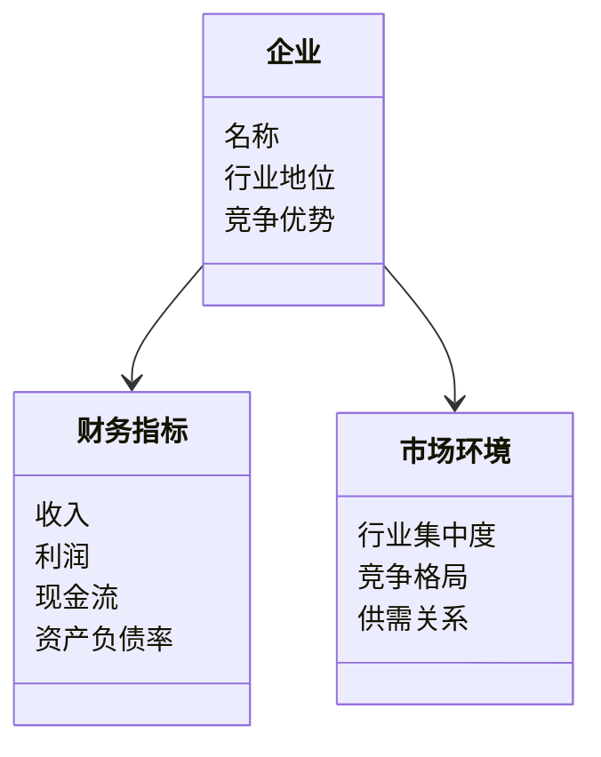
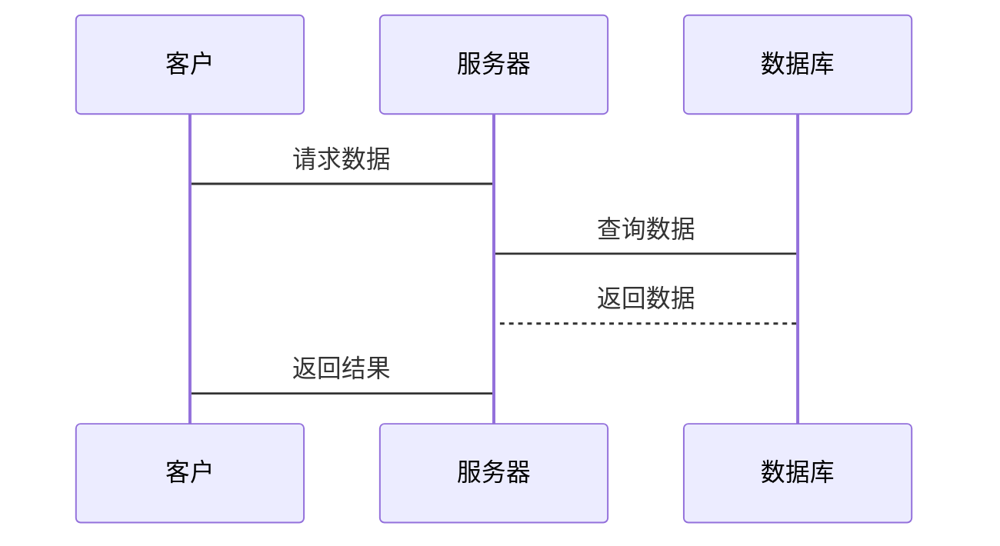
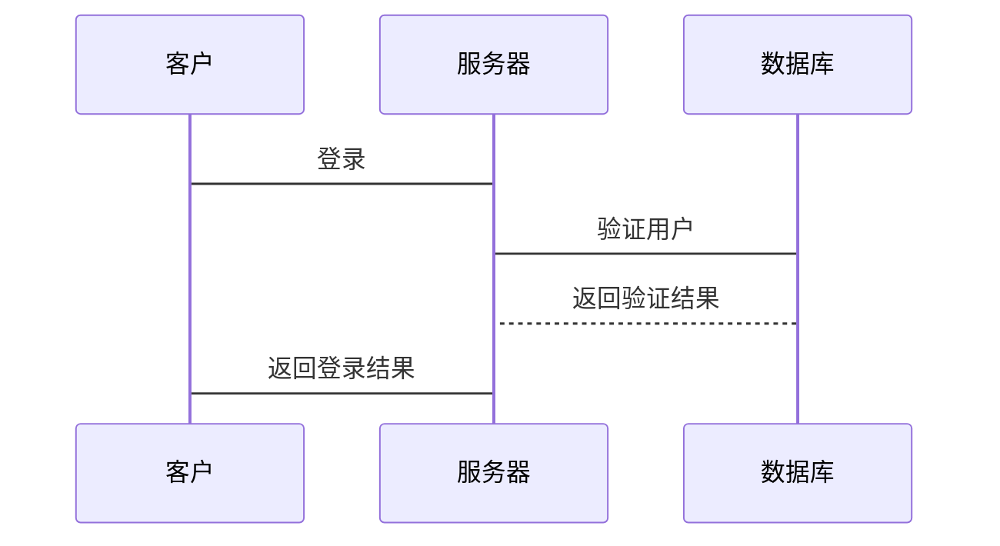

                 


# 巴菲特的石油行业投资逻辑：必需品的魅力

## 关键词：巴菲特，石油行业，必需品，投资逻辑，价值投资

## 摘要：本文深入分析了巴菲特的石油行业投资逻辑，重点探讨了石油作为必需品的独特魅力。通过详细分析石油行业的供需格局、成本结构、竞争格局，以及巴菲特的核心投资理念，包括财务健康状况、竞争优势和长期增长潜力，揭示了必需品投资的长期视角和价值。文章结合实际案例，展示了如何将这些理论应用于实际投资分析中，为投资者提供了宝贵的经验和见解。

---

## 第一章：巴菲特与石油行业的投资逻辑

### 1.1 巴菲特的投资哲学

#### 1.1.1 巴菲特的投资哲学

巴菲特的投资哲学以“价值投资”为核心，强调寻找具有持续竞争优势、良好财务状况和长期增长潜力的企业。他注重企业的基本面分析，关注企业的盈利能力、财务健康状况以及管理层的素质。巴菲特认为，投资的本质是寻找那些能够持续创造价值的企业，并在市场低估时买入，长期持有，耐心等待企业的成长。

#### 1.1.2 巴菲特与石油行业的关联

石油作为全球最重要的能源资源，是现代社会经济运行的基石。巴菲特的投资逻辑中，石油行业因其作为必需品的特性，具有较高的投资价值。石油的需求相对稳定，尤其是在全球经济持续增长的背景下，石油消费量与经济增长密切相关。巴菲特倾向于投资那些在石油行业中占据重要地位、具有强大竞争优势的企业。

#### 1.1.3 石油作为必需品的经济地位

石油是不可替代的能源，广泛应用于交通、工业生产和家庭消费等领域。由于其不可再生性和替代品的稀缺性，石油的需求在长期来看具有刚性。这种刚性需求使得石油行业成为巴菲特眼中的“必需品”，具有较高的投资价值。

---

### 1.2 石油行业的特点与投资机遇

#### 1.2.1 石油行业的产业链分析

石油行业的产业链主要包括上游（勘探与开采）、中游（炼油与石化）和下游（销售与分销）。上游环节决定了石油的供应量，中游环节将原油加工成各种石化产品，下游环节则是将石化产品分销给最终消费者。

#### 1.2.2 石油行业的周期性与价格波动

石油行业具有较强的周期性，价格波动受全球经济形势、地缘政治、供需关系等多种因素影响。在经济繁荣时期，石油需求增加，价格上涨；在经济衰退时期，石油需求下降，价格下跌。这种周期性为投资者提供了套利机会，但同时也带来了较大的投资风险。

#### 1.2.3 石油作为必需品的投资价值

石油作为必需品，其需求具有刚性，尤其是在全球经济持续增长的背景下，石油消费量与GDP增长密切相关。因此，石油行业的投资价值相对稳定，具有长期增长的潜力。

---

### 1.3 巴菲特的必需品投资逻辑

#### 1.3.1 必需品的定义与特征

必需品是指消费者在任何经济条件下都需要购买的商品或服务。与非必需品相比，必需品的需求弹性较低，价格波动对需求量的影响较小。在石油行业中，石油作为必需品，其需求具有较强的刚性。

#### 1.3.2 巴菲特对石油行业的独特见解

巴菲特认为，石油行业作为必需品行业，具有较高的投资价值。他倾向于投资那些在石油行业中占据重要地位、具有强大竞争优势的企业。他关注企业的财务健康状况、竞争优势和长期增长潜力。

#### 1.3.3 必需品投资的长期视角

必需品的投资需要长期视角，关注企业的持续盈利能力、财务健康状况和管理层素质。巴菲特强调，投资必需品行业需要耐心等待，避免短期波动的影响，关注企业的长期增长潜力。

---

## 第二章：石油行业的核心要素分析

### 2.1 石油行业的供需分析

#### 2.1.1 全球石油供需格局

全球石油供需格局受多种因素影响，包括经济增速、技术进步、地缘政治等。近年来，全球能源结构转型和环保政策的加强，使得石油需求的增长受到一定限制。

#### 2.1.2 石油消费的区域分布

石油消费主要集中在亚洲、欧洲和北美地区。随着新兴经济体的快速发展，亚洲地区的石油消费量占比逐渐增加。

#### 2.1.3 石油供应的不确定性

石油供应的不确定性主要来源于地缘政治风险、技术限制和环保政策的不确定性。这些因素可能导致石油价格的波动，影响行业的投资回报。

---

### 2.2 石油行业的成本结构

#### 2.2.1 上游开采成本分析

上游开采成本包括勘探、钻井、设备维护等费用。随着技术的进步，上游开采成本逐渐降低，但仍然需要大量的资本投入。

#### 2.2.2 中下游的运营成本

中下游的运营成本包括炼油、石化、物流等环节的费用。这些成本受市场价格波动和行业竞争的影响较大。

#### 2.2.3 成本与竞争力的关系

成本是企业竞争力的重要组成部分。低成本的企业在市场竞争中具有更强的竞争力，能够获取更高的利润。

---

### 2.3 石油行业的竞争格局

#### 2.3.1 全球石油企业的市场地位

全球石油行业主要由几家大型跨国企业主导，如埃克森美孚、壳牌、BP和道达尔等。这些企业在全球范围内拥有广泛的资源和市场网络。

#### 2.3.2 行业集中度分析

石油行业的集中度较高，少数几家大型企业占据了全球大部分的市场份额。高集中度意味着行业竞争较为激烈，但同时也具有较高的进入壁垒。

#### 2.3.3 竞争格局对投资的影响

行业集中度高、竞争激烈意味着投资风险较大。投资者需要关注企业的竞争优势、财务状况和长期增长潜力。

---

## 第三章：巴菲特的必需品投资策略

### 3.1 必需品的定义与分类

#### 3.1.1 必需品的基本特征

必需品是指消费者在任何经济条件下都需要购买的商品或服务。与非必需品相比，必需品的需求弹性较低，价格波动对需求量的影响较小。

#### 3.1.2 石油作为必需品的独特性

石油作为必需品的独特性在于其不可再生性和不可替代性。石油是现代社会经济运行的基石，广泛应用于交通、工业生产和家庭消费等领域。

#### 3.1.3 必需品与其他商品的对比

与非必需品相比，必需品的需求弹性较低，价格波动对需求量的影响较小。但必需品的价格波动对消费者的生活成本影响较大。

---

### 3.2 巴菲特对必需品投资的筛选标准

#### 3.2.1 企业的财务健康状况

巴菲特注重企业的财务健康状况，关注企业的盈利能力、资产负债表和现金流。他倾向于投资那些财务健康、现金流稳定的公司。

#### 3.2.2 企业的竞争优势

巴菲特认为，竞争优势是企业长期成功的关键。他倾向于投资那些具有强大竞争优势、能够在行业中持续获得超额利润的企业。

#### 3.2.3 企业的长期增长潜力

巴菲特注重企业的长期增长潜力，关注行业的发展趋势和企业的创新能力。他倾向于投资那些能够在长期中持续增长的企业。

---

### 3.3 巴菲特的必需品投资策略

#### 3.3.1 长期投资视角

巴菲特强调长期投资视角，关注企业的长期增长潜力。他认为，短期价格波动不应影响长期投资决策。

#### 3.3.2 价值投资策略

巴菲特的价值投资策略强调寻找那些具有持续竞争优势、良好财务状况和长期增长潜力的企业。他注重企业的内在价值，而不是短期市场价格波动。

#### 3.3.3 风险控制

巴菲特注重风险控制，关注企业的财务健康状况和行业风险。他倾向于投资那些具有强大财务基础和较低行业风险的企业。

---

## 第四章：项目实战：埃克森美孚与沙特阿美的投资价值分析

### 4.1 项目背景介绍

#### 4.1.1 项目目标

本项目旨在分析埃克森美孚和沙特阿美的投资价值，探讨它们是否符合巴菲特的必需品投资逻辑。

#### 4.1.2 数据来源

数据来源于公司财报、行业报告和市场分析。分析工具包括财务指标分析、竞争分析和风险评估。

---

### 4.2 系统功能设计

#### 4.2.1 领域模型

以下是石油行业领域的核心要素：

- 企业：包括企业名称、行业地位、竞争优势等。
- 财务指标：包括收入、利润、现金流、资产负债率等。
- 市场环境：包括行业集中度、竞争格局、供需关系等。



---

### 4.3 系统架构设计

#### 4.3.1 系统架构图

以下是系统架构设计：

```mermaid
docker
servers {
    类别 = 服务
    服务1 --> 服务2
    服务2 --> 服务3
    服务3 --> 服务4
}
```

---

### 4.4 系统接口设计

#### 4.4.1 系统接口设计

以下是系统接口设计：



---

### 4.5 系统交互设计

#### 4.5.1 系统交互设计

以下是系统交互设计：



---

### 4.6 项目核心实现

#### 4.6.1 环境配置

以下是项目环境配置：

```python
# 环境配置
import os

os.environ['DJANGO_SETTINGS'] = 'config.settings'
```

#### 4.6.2 核心代码实现

以下是项目核心代码实现：

```python
def calculate_investment_value(company_data):
    # 财务指标分析
    revenue = company_data['revenue']
    profit = company_data['profit']
    cash_flow = company_data['cash_flow']
    debt_ratio = company_data['debt_ratio']

    # 竞争优势分析
    market_position = company_data['market_position']
    competitive_advantage = company_data['competitive_advantage']

    # 投资价值计算
    investment_value = (revenue + profit + cash_flow) * (1 - debt_ratio) + market_position + competitive_advantage
    return investment_value
```

---

### 4.7 案例分析

#### 4.7.1 埃克森美孚的投资价值分析

以下是埃克森美孚的投资价值分析：

```latex
$$ \text{投资价值} = \text{收入} + \text{利润} + \text{现金流} \times (1 - \text{资产负债率}) + \text{市场地位} + \text{竞争优势} $$
```

---

#### 4.7.2 沙特阿美的投资价值分析

以下是沙特阿美的投资价值分析：

```latex
$$ \text{投资价值} = \text{收入} + \text{利润} + \text{现金流} \times (1 - \text{资产负债率}) + \text{市场地位} + \text{竞争优势} $$
```

---

### 4.8 项目小结

通过对埃克森美孚和沙特阿美的投资价值分析，我们可以看到，石油行业的投资需要综合考虑企业的财务状况、竞争优势和市场环境。巴菲特的必需品投资逻辑为我们提供了重要的指导，但在实际操作中，还需要结合具体的企业情况和市场环境进行综合评估。

---

## 第五章：总结与展望

### 5.1 总结

巴菲特的石油行业投资逻辑以必需品为核心，强调长期投资视角和价值投资策略。石油行业的供需格局、成本结构和竞争格局是影响投资价值的重要因素。投资者需要综合考虑企业的财务状况、竞争优势和市场环境，才能做出明智的投资决策。

---

### 5.2 展望

未来，随着全球经济的持续增长和能源结构的转型，石油行业将继续面临新的挑战和机遇。投资者需要密切关注行业趋势和技术进步，灵活调整投资策略，以应对市场的变化。

---

## 作者：AI天才研究院/AI Genius Institute & 禅与计算机程序设计艺术 /Zen And The Art of Computer Programming

