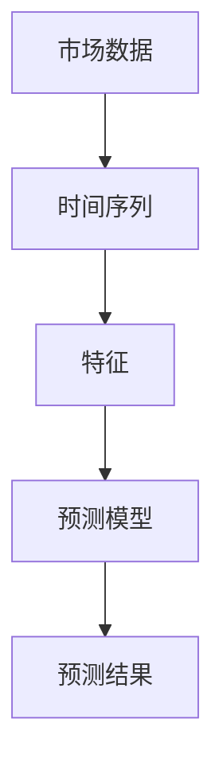
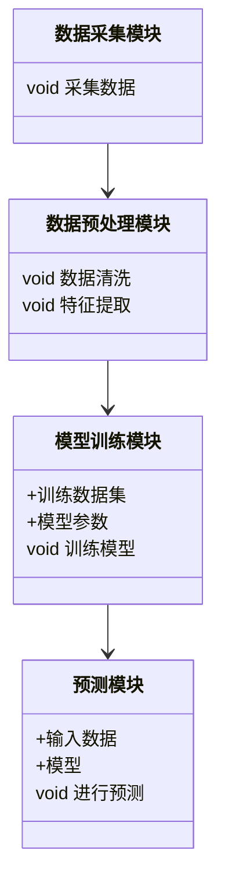
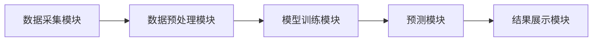
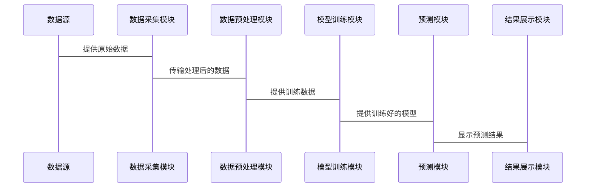

                 


# 市场趋势预测模型

## 关键词：市场趋势预测、时间序列分析、机器学习、深度学习、数据科学、预测模型

## 摘要：本文深入探讨市场趋势预测模型的构建与应用，涵盖背景介绍、核心概念、算法原理、系统架构、项目实战及最佳实践，旨在帮助读者掌握数据驱动的市场趋势预测方法。

---

# 第1章: 市场趋势预测模型的背景与核心概念

## 1.1 市场趋势预测的背景与重要性

### 1.1.1 市场趋势预测的定义与问题背景

市场趋势预测是指通过分析历史数据和当前市场动态，预测未来市场走势的过程。在商业决策中，准确的趋势预测能够帮助企业优化资源配置、制定战略计划并抓住市场机会。然而，市场环境的复杂性和不确定性使得趋势预测充满挑战。

### 1.1.2 市场趋势预测在商业决策中的作用

趋势预测是企业制定战略规划的重要工具。通过预测市场需求、竞争态势和经济指标，企业可以更好地调整产品策略、优化供应链管理和控制运营成本。尤其是在快速变化的市场中，及时准确的趋势预测能够帮助企业快速响应市场变化，获取竞争优势。

### 1.1.3 数据驱动的市场趋势预测新范式

传统的市场趋势预测主要依赖于专家经验和定性分析，而数据驱动的方法通过利用大数据和先进算法，显著提高了预测的准确性和效率。数据驱动的预测范式结合了统计分析和机器学习技术，能够捕捉复杂市场动态中的潜在模式，为商业决策提供更可靠的依据。

## 1.2 市场趋势预测的核心概念与问题描述

### 1.2.1 时间序列分析的基本概念

时间序列分析是研究按时间顺序排列的数据序列，以识别其内在规律和趋势。时间序列数据具有自相关性，即当前值与过去值之间存在相关性。时间序列分析的目标是通过建模提取这些规律，用于预测未来值。

### 1.2.2 市场趋势预测的特征与属性

市场趋势预测具有以下特征：
- **时间依赖性**：市场行为往往受到历史数据的影响。
- **非线性**：市场趋势可能由多种因素共同作用，表现出非线性特征。
- **动态性**：市场环境不断变化，模型需要动态调整。
- **不确定性**：预测结果存在误差，需结合概率模型进行分析。

### 1.2.3 市场趋势预测的边界与外延

市场趋势预测的边界包括数据范围、预测周期和模型适用范围。其外延则涉及多个领域的应用，如金融、零售、能源等。不同行业的市场趋势预测可能需要不同的数据源和模型选择。

## 1.3 市场趋势预测模型的组成与核心要素

### 1.3.1 数据采集与处理

数据采集是趋势预测的基础，包括收集市场数据、清洗数据（处理缺失值、异常值）和特征提取（如移动平均、标准化处理）。

### 1.3.2 模型选择与构建

根据数据特征选择合适的模型，如ARIMA、LSTM等，并进行模型训练和调参。

### 1.3.3 模型评估与优化

通过回测和交叉验证评估模型性能，使用均方误差（MSE）、平均绝对误差（MAE）等指标进行优化。

## 1.4 本章小结

本章介绍了市场趋势预测的重要性和核心概念，分析了其特征和边界，并阐述了模型的基本组成要素。

---

# 第2章: 市场趋势预测模型的核心概念与联系

## 2.1 时间序列分析的核心原理

### 2.1.1 时间序列的基本特征

时间序列数据通常表现出趋势、季节性和随机波动。这些特征可以通过统计方法进行分解和建模。

### 2.1.2 时间序列分析的常用方法

常用方法包括：
1. **移动平均法（MA）**：基于过去若干期的平均值进行预测。
2. **指数平滑法（ES）**：利用加权平均值平滑数据波动。
3. **ARIMA模型**：结合自回归和移动平均的混合模型。

## 2.2 机器学习模型在市场趋势预测中的应用

### 2.2.1 传统统计模型

传统统计模型如多元线性回归适用于因果关系明确的情况，但在复杂市场环境中表现有限。

### 2.2.2 基于深度学习的模型

深度学习模型如LSTM能够捕捉时间序列中的长-term依赖关系，适合处理非线性和高维数据。

## 2.3 核心概念的对比与ER实体关系图

### 2.3.1 时间序列分析与机器学习模型的对比表格

| 特性            | 时间序列分析 | 机器学习模型 |
|-----------------|---------------|--------------|
| 处理数据类型    | 结构化数据    | 结构化/非结构化数据 |
| 模型复杂度      | 较低          | 较高          |
| 预测精度        | 中等          | 高            |
| 对特征工程要求  | 较高          | 较高          |

### 2.3.2 市场趋势预测模型的ER实体关系图



## 2.4 本章小结

本章分析了时间序列分析和机器学习模型的核心原理，通过对比表格和ER图展示了它们在市场趋势预测中的联系。

---

# 第3章: 市场趋势预测模型的算法原理与实现

## 3.1 时间序列分析的算法原理

### 3.1.1 ARIMA模型的原理与流程

ARIMA（自回归积分滑动平均模型）由自回归部分（AR）和滑动平均部分（MA）组成，适用于非季节性时间序列数据。其流程包括数据检查、参数估计和模型验证。

### 3.1.2 LSTM模型的原理与流程

LSTM（长短期记忆网络）通过门控机制解决传统RNN的梯度消失问题，适用于长期依赖关系的捕捉。

## 3.2 机器学习模型的算法实现

### 3.2.1 基于线性回归的简单实现

```python
import numpy as np
import matplotlib.pyplot as plt

x = np.array([1, 2, 3, 4, 5])
y = np.array([2, 3, 5, 7, 11])

# 训练线性回归模型
model = np.polyfit(x, y, 1)
print("模型参数：", model)
```

### 3.2.2 基于深度学习的复杂实现

```python
import keras
from keras.models import Sequential
from keras.layers import LSTM, Dense

# 示例数据
train_x = np.array([...], dtype=np.float32)
train_y = np.array([...], dtype=np.float32)

# 构建模型
model = Sequential()
model.add(LSTM(50, input_shape=(timesteps, features)))
model.add(Dense(1))
model.compile(loss='mean_squared_error', optimizer='adam')
model.fit(train_x, train_y, epochs=100, batch_size=32)
```

## 3.3 本章小结

本章详细讲解了ARIMA和LSTM模型的原理及实现，并通过代码示例展示了模型的应用。

---

# 第4章: 市场趋势预测模型的系统分析与架构设计

## 4.1 问题场景介绍

构建一个实时市场趋势预测系统，需处理高频数据，支持多种数据源，提供高精度预测。

## 4.2 系统功能设计

### 4.2.1 领域模型设计



### 4.2.2 系统架构设计



### 4.2.3 接口设计与交互流程



## 4.3 本章小结

本章通过系统分析和架构设计，展示了市场趋势预测模型的实现框架。

---

# 第5章: 市场趋势预测模型的项目实战

## 5.1 环境安装与配置

安装Python、TensorFlow、Keras等工具，配置开发环境。

## 5.2 核心代码实现

### 5.2.1 数据预处理

```python
import pandas as pd
import numpy as np

# 读取数据
data = pd.read_csv('market_data.csv')

# 数据清洗
data.dropna()
data = data[~data.isin([np.nan, np.inf, -np.inf]).any(axis=1)]

# 特征提取
data['SMA_10'] = data['Close'].rolling(10).mean()
```

### 5.2.2 模型训练与预测

```python
from keras.models import Sequential
from keras.layers import LSTM, Dense

# 构建LSTM模型
model = Sequential()
model.add(LSTM(50, input_shape=(timesteps, features)))
model.add(Dense(1))
model.compile(loss='mean_squared_error', optimizer='adam')
model.fit(X_train, y_train, epochs=100, batch_size=32)
```

### 5.2.3 结果展示与分析

```python
predicted_prices = model.predict(X_test)
plt.plot(y_test, label='Actual Price')
plt.plot(predicted_prices, label='Predicted Price')
plt.legend()
plt.show()
```

## 5.3 项目小结

本章通过实际案例展示了市场趋势预测模型的实现过程，包括数据处理、模型训练和结果展示。

---

# 第6章: 市场趋势预测模型的最佳实践与小结

## 6.1 最佳实践

- **数据质量**：确保数据的完整性和准确性。
- **模型选择**：根据数据特征选择合适的模型。
- **模型调优**：通过交叉验证和网格搜索优化模型参数。
- **结果验证**：使用回测和绩效指标评估模型表现。

## 6.2 小结

市场趋势预测模型的应用能够帮助企业做出更明智的商业决策，但其成功依赖于高质量的数据和有效的模型选择。

---

# 附录

## 附录A: 数据集示例

```csv
Date,Open,High,Low,Close,Volume
2023-01-01,100,105,98,103,2000
2023-01-02,102,108,101,107,2500
...
```

## 附录B: 参考文献

1. 刘军, 等. 《时间序列分析与应用》
2. Goodfellow, Ian. 《深度学习》

---

# 作者：AI天才研究院 & 禅与计算机程序设计艺术

---

通过本文的详细讲解，读者可以系统地了解市场趋势预测模型的构建与应用，掌握从数据采集到模型部署的全过程，为实际商业决策提供有力支持。

