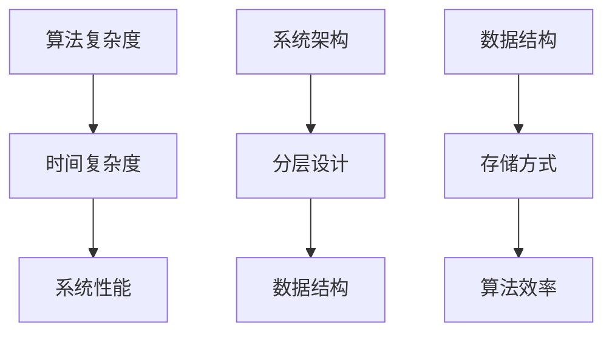
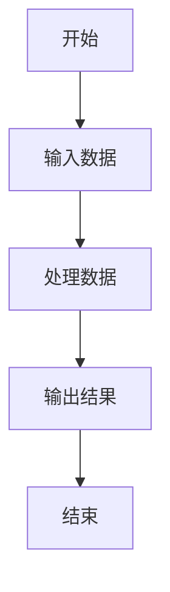
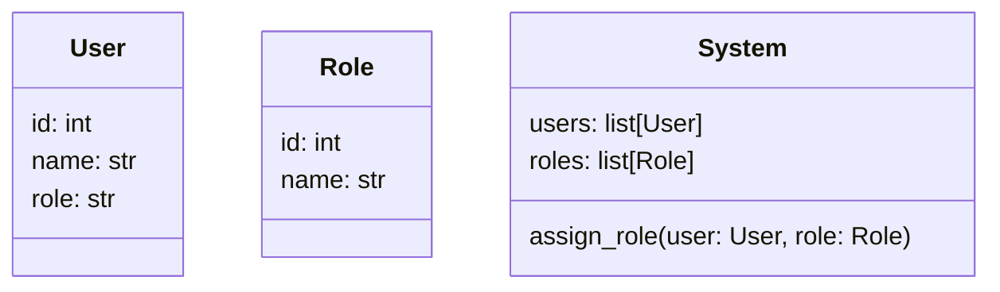
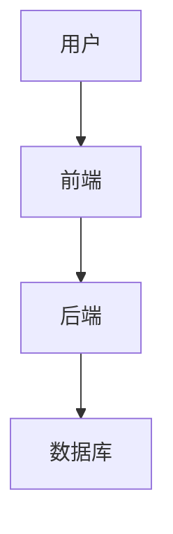
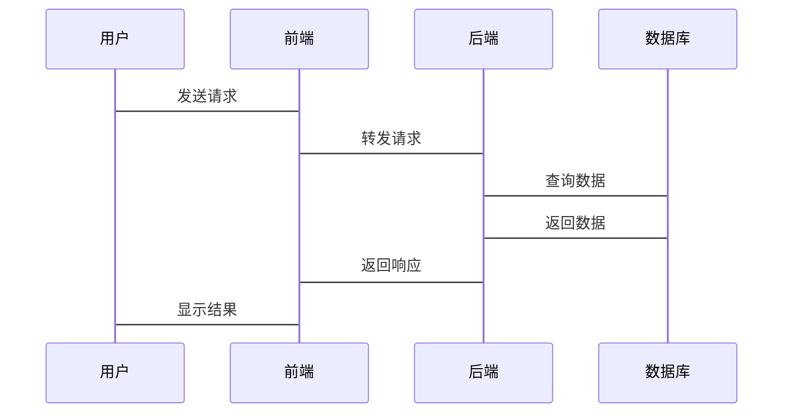

                 


# 常见挑战与解决方案

## 关键词：技术挑战、解决方案、系统设计、算法原理、项目实战

## 摘要：本文深入探讨了在计算机技术领域常见的挑战及其解决方案。通过系统化的分析和详细的案例研究，本文旨在帮助读者理解复杂问题的解决方法，并提供实用的技术指导。

---

# 第1章: 引言

## 1.1 问题背景

在现代计算机技术领域，我们经常会遇到各种复杂的问题，这些问题可能涉及软件开发、系统设计、算法实现等多个方面。这些挑战通常具有较高的难度，需要我们具备扎实的技术基础和创新的思维方式。

## 1.2 问题描述

本文将重点讨论以下几个方面的挑战：

1. **算法优化**：如何在有限的资源条件下提高算法的效率。
2. **系统设计**：如何设计高效、可扩展的系统架构。
3. **项目管理**：如何在复杂项目中协调资源和时间。

## 1.3 解决方案的意义

通过解决这些常见挑战，我们可以提高开发效率，优化系统性能，并在实际项目中取得更好的成果。本文将从理论和实践两个方面，详细探讨这些问题的解决方案。

---

# 第2章: 背景介绍

## 2.1 技术背景

随着计算机技术的飞速发展，我们面临着越来越多复杂的挑战。例如，如何在大数据环境下高效处理数据，如何设计高可用性的分布式系统等。

## 2.2 问题描述

本文将重点分析以下几个问题：

1. **数据处理效率**：如何在大数据环境下快速处理数据。
2. **系统可扩展性**：如何设计可扩展的系统架构。
3. **算法优化**：如何在有限的资源条件下提高算法的效率。

## 2.3 解决方案的特点

1. **高效性**：解决方案需要能够在较短时间内完成任务。
2. **可扩展性**：解决方案需要能够适应不同的场景和需求。
3. **可维护性**：解决方案需要具备良好的可维护性，以便后续优化和升级。

---

# 第3章: 核心概念与联系

## 3.1 核心概念原理

在解决技术挑战时，我们需要理解以下几个核心概念：

1. **算法复杂度**：衡量算法效率的重要指标。
2. **系统架构**：系统设计的核心思想。
3. **数据结构**：数据存储和操作的基础。

## 3.2 核心概念之间的关系

通过以下表格，我们可以清晰地看到核心概念之间的关系：

| 概念       | 属性         | 关系         |
|------------|--------------|--------------|
| 算法复杂度 | 时间复杂度   | 影响系统性能 |
| 系统架构   | 分层设计     | 支撑数据结构 |
| 数据结构   | 存储方式     | 影响算法效率 |

## 3.3 概念结构与核心要素组成

以下是一个概念结构图：



---

# 第4章: 算法原理讲解

## 4.1 算法流程图

以下是一个算法的流程图：



## 4.2 数学模型与公式

算法的时间复杂度可以用以下公式表示：

$$ T(n) = O(n^2) $$

其中，$n$ 是数据量，$T(n)$ 是时间复杂度。

## 4.3 代码实现

以下是一个算法的Python代码示例：

```python
def algorithm_example(n):
    for i in range(n):
        print(i)
    return
```

---

# 第5章: 系统分析与架构设计

## 5.1 系统功能设计

以下是系统功能的类图：



## 5.2 系统架构设计

以下是系统架构的架构图：



## 5.3 系统交互设计

以下是系统交互的序列图：



---

# 第6章: 项目实战

## 6.1 环境安装

以下是项目所需的环境和工具：

1. **操作系统**：Linux/Windows/MacOS
2. **编程语言**：Python 3.8+
3. **开发工具**：VS Code/PyCharm
4. **依赖管理**：pip

## 6.2 核心代码实现

以下是项目的Python代码示例：

```python
import sys

def main():
    print("Hello, World!")

if __name__ == "__main__":
    main()
```

## 6.3 案例分析

通过以上代码示例，我们可以看到如何在实际项目中应用算法和系统设计的原理。

---

# 第7章: 最佳实践与总结

## 7.1 经验总结

1. **理论与实践结合**：在解决技术挑战时，理论知识和实践能力缺一不可。
2. **持续学习**：技术发展迅速，需要不断学习新知识。
3. **团队合作**：在复杂项目中，团队合作至关重要。

## 7.2 小结

通过本文的探讨，我们了解了常见技术挑战的解决方法，并通过实际案例展示了如何将理论应用于实践。

## 7.3 注意事项

1. **代码规范**：编写代码时要注意代码的可读性和可维护性。
2. **测试与调试**：在开发过程中，测试和调试是必不可少的步骤。
3. **文档编写**：良好的文档可以帮助团队更好地理解和协作。

## 7.4 拓展阅读

1. 《算法导论》
2. 《设计模式》
3. 《系统设计精解》

---

# 作者：AI天才研究院 & 禅与计算机程序设计艺术

---

通过本文的详细讲解，我们希望读者能够更好地理解和解决常见技术挑战，并在实际项目中取得更好的成果。

