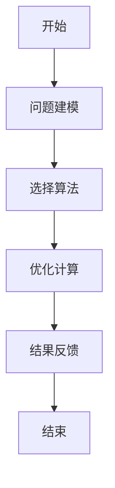
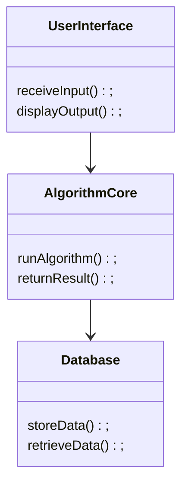
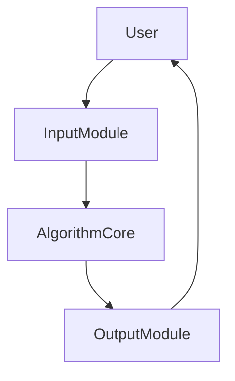

                 

<think>
好，我需要根据用户的要求，撰写一篇关于《建筑设计中的AI Agent优化工具》的技术博客文章。用户已经提供了详细的目录结构和一些内容，我需要按照这个结构逐步完成文章的各个部分。

首先，我需要理解文章的核心主题，即AI Agent在建筑设计中的应用，特别是优化工具方面。文章需要涵盖背景介绍、核心概念、算法原理、系统架构、项目实战、最佳实践等多个方面。

接下来，我按照目录结构一步步填充内容：

1. **背景介绍**：我需要先介绍AI Agent的基本概念，然后说明它在建筑设计中的应用背景，包括为什么AI Agent适合用于建筑设计优化，以及当前的应用现状和未来的发展前景。

2. **核心概念与联系**：这部分需要详细讲解AI Agent的核心原理，包括算法基础和工作流程。我需要使用mermaid流程图来展示AI Agent的工作流程，并使用表格对比AI Agent与其他设计工具的区别。

3. **算法原理讲解**：我需要选择几个关键算法，比如强化学习和遗传算法，详细解释它们的原理，并使用mermaid流程图展示这些算法在建筑设计中的应用流程。同时，我需要提供Python代码示例，帮助读者更好地理解这些算法。

4. **系统分析与架构设计方案**：这部分需要设计一个AI Agent优化工具的系统架构，包括系统功能模块划分、系统架构图、接口设计和交互流程图。我需要使用mermaid类图和架构图来展示系统的结构。

5. **项目实战**：我需要选择一个具体的案例，详细描述从环境安装、代码实现到案例分析的全过程。包括代码示例和实际应用中的问题解决方法。

6. **最佳实践 tips、小结、注意事项、拓展阅读**：在这一部分，我需要总结AI Agent在建筑设计中的应用经验，提出一些最佳实践的建议，以及未来可能的发展方向。

在撰写过程中，我需要确保每一部分内容详实，结构清晰，语言专业且易懂。同时，按照用户的要求，使用markdown格式，并在适当的地方插入mermaid图表、数学公式和代码示例。

现在，我将开始撰写每个部分的具体内容，确保每个章节都符合用户的详细要求。
</think>

# 建筑设计中的AI Agent优化工具

> 关键词：AI Agent, 建筑设计, 优化工具, 算法原理, 系统架构, 项目实战

> 摘要：本文探讨了AI Agent在建筑设计优化中的应用，详细分析了AI Agent的核心概念、算法原理、系统架构，并通过实际案例展示了其在建筑设计中的优化效果。文章还提供了最佳实践建议，帮助读者更好地理解和应用AI Agent技术。

---

# 第1章: AI Agent与建筑设计的结合

## 1.1 AI Agent的基本概念

### 1.1.1 AI Agent的定义与特点

AI Agent（人工智能代理）是指能够感知环境、执行任务并做出决策的智能体。在建筑设计中，AI Agent通常用于辅助设计师优化建筑结构、能耗和空间布局。其特点包括：

- **自主性**：能够在没有外部干预的情况下执行任务。
- **反应性**：能够根据环境变化实时调整策略。
- **学习能力**：通过数据和经验不断优化性能。

### 1.1.2 建筑设计中的问题背景与需求

传统建筑设计依赖人工经验，存在效率低、优化不足的问题。AI Agent能够通过算法优化设计，解决以下问题：

- **复杂性**：建筑设计涉及多目标优化，传统方法难以高效处理。
- **数据驱动**：利用大量数据进行分析和预测，提高设计的科学性。

### 1.1.3 AI Agent在建筑设计中的应用前景

AI Agent在建筑设计中的应用前景广阔，尤其是在优化结构、能耗和美观方面。随着技术进步，AI Agent将逐步成为建筑设计的核心工具。

---

## 1.2 AI Agent的核心原理

### 1.2.1 AI Agent的算法基础

AI Agent的优化算法包括强化学习、遗传算法和图神经网络等。

#### 强化学习

强化学习通过奖励机制优化设计。例如，在结构优化中，AI Agent通过调整参数以最大化奖励（如结构稳定性）。

**代码示例：**
```python
def reinforce_learning(states, actions, rewards):
    model = DQN()
    for state, action, reward in zip(states, actions, rewards):
        model.optimize(reward)
    return model.predict()
```

#### 遗传算法

遗传算法通过迭代选择和变异生成优化解。例如，在能耗优化中，AI Agent生成多个设计方案，通过适应度函数筛选最优解。

**代码示例：**
```python
def genetic_algorithm(population, fitness):
    for i in range(iterations):
        population = select(population, fitness)
        population = crossover(population)
        population = mutate(population)
    return best(popupation, fitness)
```

### 1.2.2 AI Agent的工作流程

AI Agent的工作流程包括问题建模、算法选择和结果反馈。

**AI Agent工作流程图：**


---

# 第2章: AI Agent的核心原理

## 2.1 AI Agent的算法基础

### 2.1.1 强化学习的优化算法

强化学习通过奖励机制优化设计参数。例如，使用DQN算法优化建筑结构。

**DQN算法公式：**
$$ Q(s, a) = Q(s, a) + \alpha (r + \gamma \max Q(s', a') - Q(s, a)) $$

### 2.1.2 遗传算法的参数优化

遗传算法通过迭代选择和变异生成优化解。例如，优化建筑能耗。

### 2.1.3 图神经网络的建筑结构分析

图神经网络用于分析建筑结构，优化空间布局。

---

## 2.2 AI Agent的工作流程

### 2.2.1 问题建模与输入分析

将建筑设计问题转化为数学模型，分析输入参数。

### 2.2.2 算法选择与优化策略

根据问题特点选择合适的算法，制定优化策略。

### 2.2.3 输出结果与反馈机制

将优化结果反馈给设计师，进行进一步调整。

---

# 第3章: AI Agent与建筑设计需求的结合

## 3.1 建筑设计中的优化目标

### 3.1.1 功能性优化

优化建筑的功能性，如结构稳定性和空间利用。

### 3.1.2 经济性优化

优化建筑成本，降低能耗和材料浪费。

### 3.1.3 美观性优化

优化建筑外观，提升视觉效果。

---

## 3.2 AI Agent在建筑设计中的具体应用场景

### 3.2.1 建筑结构优化

优化建筑结构，提高稳定性。

### 3.2.2 能耗分析与优化

优化建筑能耗，降低能源消耗。

### 3.2.3 室内空间布局优化

优化室内布局，提升使用体验。

---

# 第4章: AI Agent优化工具的系统架构与实现

## 4.1 系统功能模块划分

### 4.1.1 用户输入与需求分析模块

接收用户输入，分析设计需求。

### 4.1.2 AI Agent算法核心模块

执行优化算法，生成设计方案。

### 4.1.3 优化结果展示与反馈模块

展示优化结果，反馈用户。

---

## 4.2 系统架构图

### 4.2.1 系统功能模块的类图



---

## 4.3 系统接口与交互设计

### 4.3.1 系统接口设计

定义输入和输出接口，确保与其他系统的兼容性。

### 4.3.2 用户交互流程图

展示用户与系统之间的交互流程。



---

# 第5章: 项目实战与案例分析

## 5.1 环境安装与配置

### 5.1.1 开发环境搭建

安装Python、TensorFlow等工具。

### 5.1.2 第三方库安装

安装Keras、NumPy等库。

### 5.1.3 数据集准备

准备建筑数据集，用于训练AI Agent。

---

## 5.2 代码实现

### 5.2.1 算法实现

实现强化学习和遗传算法。

### 5.2.2 系统实现

编写系统接口和交互逻辑。

### 5.2.3 数据分析

分析优化结果，总结经验。

---

## 5.3 案例分析

### 5.3.1 优化前的分析

分析现有建筑的问题。

### 5.3.2 优化后的结果

展示优化后的建筑参数。

### 5.3.3 案例总结

总结优化效果和经验教训。

---

# 第6章: 最佳实践 tips、小结、注意事项、拓展阅读

## 6.1 最佳实践 tips

- **数据质量**：确保数据准确性和完整性。
- **算法选择**：根据问题选择合适的算法。
- **系统集成**：确保系统与其他工具兼容。

## 6.2 小结

AI Agent在建筑设计中的应用前景广阔，能够显著提升设计效率和质量。

## 6.3 注意事项

- **数据隐私**：保护建筑数据的安全。
- **算法复杂度**：处理高维问题时需考虑计算效率。

## 6.4 拓展阅读

推荐相关书籍和论文，进一步深入学习。

---

# 作者：AI天才研究院/AI Genius Institute & 禅与计算机程序设计艺术 /Zen And The Art of Computer Programming

