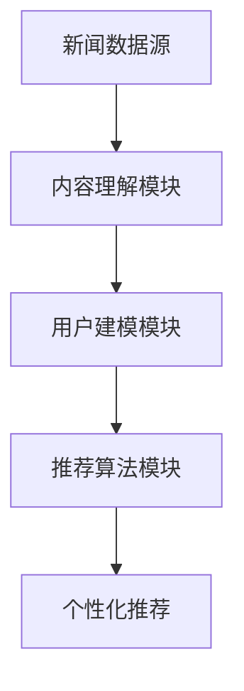
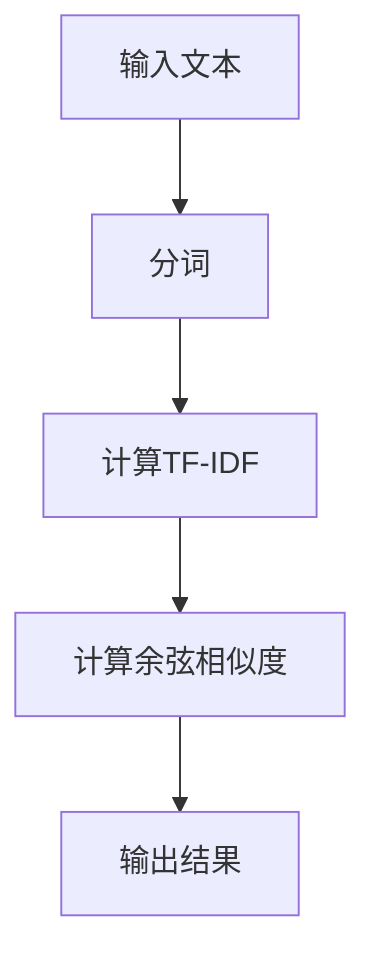
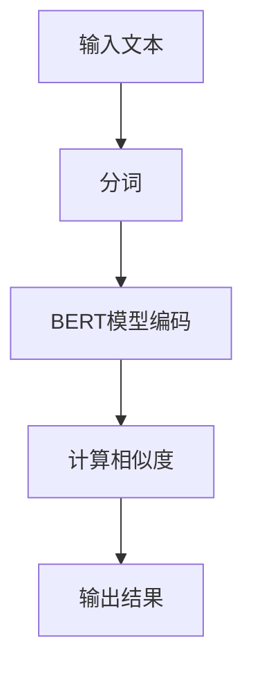
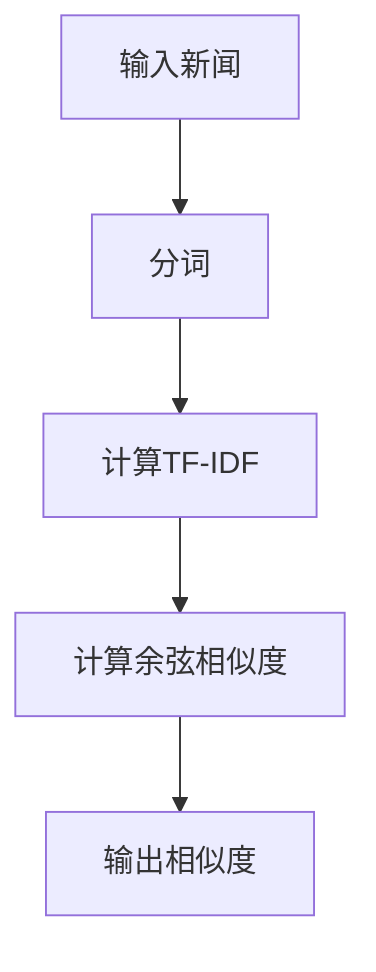
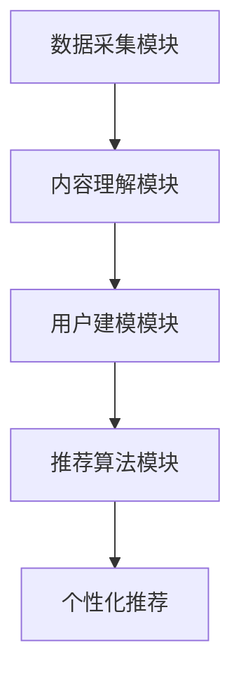
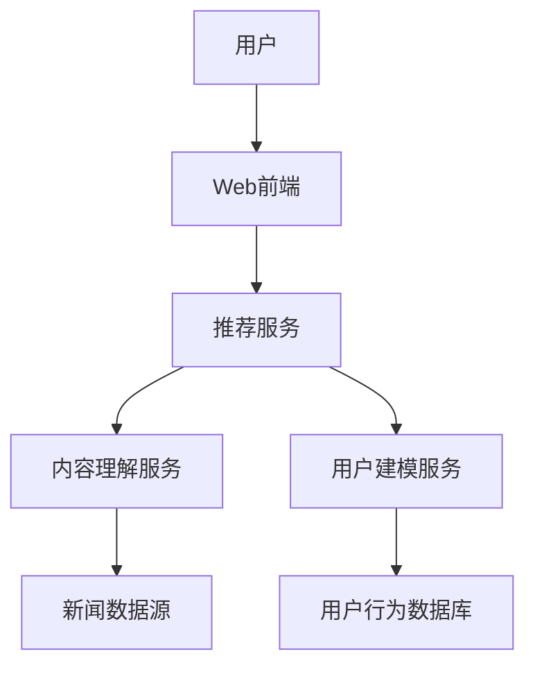
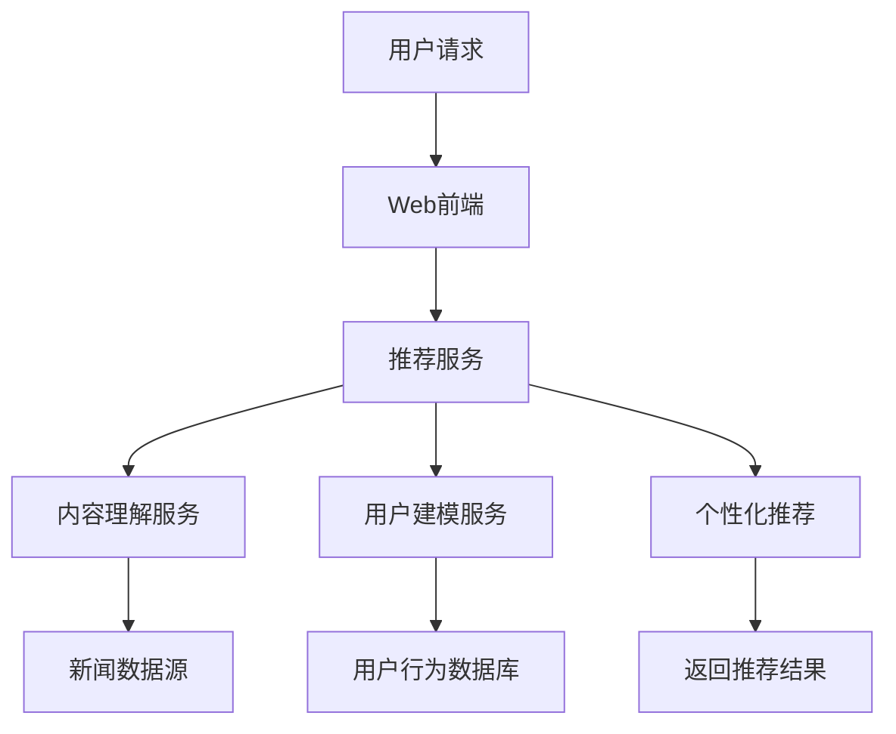
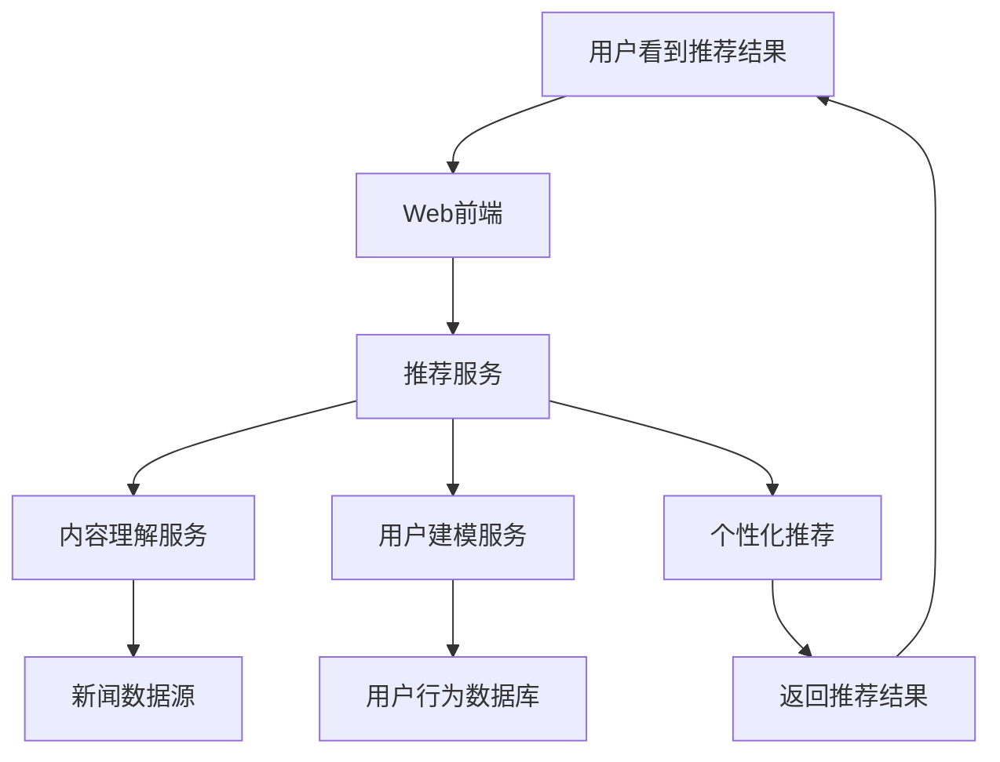

                 


# 开发AI Agent支持的智能新闻聚合系统

> 关键词：AI Agent，智能新闻聚合，文本相似度，推荐算法，系统架构，深度学习

> 摘要：本文将详细探讨如何开发一个由AI Agent支持的智能新闻聚合系统。文章从问题背景、AI Agent的核心原理、算法实现、系统架构设计到项目实战，全面分析了系统开发的各个方面。通过结合理论与实践，展示了如何利用先进的AI技术实现高效的新闻聚合和推荐。

---

# 第一章: AI Agent与智能新闻聚合系统概述

## 1.1 问题背景与目标

### 1.1.1 传统新闻聚合系统的局限性

传统新闻聚合系统主要依赖于简单的关键词匹配和基于热度的推荐算法。这种推荐方式存在以下问题：
- **信息过载**：用户面对海量信息，难以快速找到感兴趣的内容。
- **推荐质量低**：基于关键词匹配的推荐容易出现“标题党”或不相关的内容。
- **个性化不足**：无法根据用户的深度需求进行精准推荐。

### 1.1.2 引入AI Agent的必要性

AI Agent（人工智能代理）是一种能够感知环境、执行任务并优化决策的智能实体。引入AI Agent可以显著提升新闻聚合系统的性能：
- **精准理解内容**：通过自然语言处理技术，AI Agent能够深入理解新闻内容的语义。
- **个性化推荐**：基于用户行为和偏好，AI Agent可以提供高度个性化的新闻推荐。
- **动态优化**：AI Agent能够实时调整推荐策略，提升推荐的准确性和用户的满意度。

### 1.1.3 智能新闻聚合系统的定义与目标

智能新闻聚合系统是一种结合了AI Agent技术的新闻推荐系统。其目标是通过智能化的分析和推荐算法，为用户提供高质量、个性化的新闻内容。系统的核心目标包括：
1. 提供精准的新闻推荐。
2. 实现高效的用户需求匹配。
3. 动态优化推荐策略。

## 1.2 问题描述与解决思路

### 1.2.1 新闻聚合的核心问题

新闻聚合的核心问题是如何在海量信息中快速筛选出符合用户需求的内容。传统方法依赖于简单的关键词匹配，而这种方法存在以下问题：
- **无法理解语义**：关键词匹配无法理解新闻内容的深层含义。
- **推荐结果不相关**：基于热度的推荐容易导致推荐内容与用户实际需求不符。

### 1.2.2 AI Agent在新闻聚合中的角色

AI Agent在新闻聚合系统中的角色可以总结为：
1. **内容理解**：AI Agent通过自然语言处理技术，理解新闻内容的语义。
2. **用户建模**：AI Agent根据用户的行为数据，构建用户画像，分析用户的兴趣和需求。
3. **推荐决策**：AI Agent基于内容理解和用户建模结果，生成个性化推荐。

### 1.2.3 解决方案的初步构想

初步解决方案包括以下步骤：
1. **数据采集**：收集新闻数据和用户行为数据。
2. **内容理解**：使用NLP技术对新闻内容进行语义分析。
3. **用户建模**：基于用户行为数据构建用户画像。
4. **推荐生成**：结合内容理解和用户建模结果，生成个性化推荐。

## 1.3 系统边界与外延

### 1.3.1 系统功能边界

智能新闻聚合系统的主要功能包括：
1. **新闻内容聚合**：从多个来源采集新闻数据。
2. **内容理解**：对新闻内容进行语义分析。
3. **用户建模**：根据用户行为数据构建用户画像。
4. **个性化推荐**：基于内容理解和用户建模结果，生成个性化推荐。

### 1.3.2 与相关系统的区别与联系

与传统新闻聚合系统相比，智能新闻聚合系统的区别在于：
- **引入AI Agent技术**：能够实现更精准的内容理解和个性化推荐。
- **动态优化能力**：AI Agent能够实时调整推荐策略，提升推荐质量。

### 1.3.3 系统的可扩展性与灵活性

智能新闻聚合系统具有以下特点：
- **模块化设计**：系统各个模块相对独立，便于扩展和维护。
- **高度可定制性**：可以根据具体需求定制推荐算法和内容聚合策略。

## 1.4 核心概念与组成要素

### 1.4.1 AI Agent的核心要素

AI Agent的核心要素包括：
1. **感知能力**：能够感知环境和用户需求。
2. **决策能力**：能够基于感知信息做出决策。
3. **执行能力**：能够执行决策并输出结果。

### 1.4.2 智能新闻聚合系统的组成要素

智能新闻聚合系统的组成要素包括：
1. **新闻数据源**：多个新闻网站和API接口。
2. **NLP处理模块**：用于新闻内容的理解和分析。
3. **用户行为分析模块**：用于用户画像的构建。
4. **推荐算法模块**：用于个性化推荐的生成。

### 1.4.3 系统整体架构的初步框架

系统整体架构的初步框架包括以下模块：
1. **数据采集模块**：负责采集新闻数据和用户行为数据。
2. **内容理解模块**：对新闻内容进行语义分析。
3. **用户建模模块**：根据用户行为数据构建用户画像。
4. **推荐算法模块**：生成个性化推荐。

---

# 第二章: AI Agent的核心原理

## 2.1 AI Agent的基本原理

### 2.1.1 AI Agent的定义与分类

AI Agent可以分为以下几类：
1. **基于规则的AI Agent**：通过预定义的规则进行决策。
2. **基于学习的AI Agent**：通过机器学习算法进行决策。
3. **基于强化学习的AI Agent**：通过强化学习优化决策策略。

### 2.1.2 基于强化学习的AI Agent

基于强化学习的AI Agent通过与环境的交互，不断优化决策策略。其核心思想是通过试错的方式找到最优的决策路径。

### 2.1.3 AI Agent的决策机制

AI Agent的决策机制包括以下步骤：
1. **感知环境**：通过传感器或数据接口获取环境信息。
2. **分析信息**：对获取的信息进行分析和处理。
3. **制定决策**：基于分析结果制定决策。
4. **执行决策**：将决策转化为具体的行动。

## 2.2 智能新闻聚合系统的原理

### 2.2.1 新闻内容的理解与分析

新闻内容的理解与分析是智能新闻聚合系统的核心任务之一。主要方法包括：
1. **关键词提取**：提取新闻内容中的关键词。
2. **情感分析**：分析新闻内容的情感倾向。
3. **主题分类**：对新闻内容进行主题分类。

### 2.2.2 用户需求的识别与建模

用户需求的识别与建模是个性化推荐的关键步骤。主要方法包括：
1. **用户画像构建**：根据用户行为数据构建用户画像。
2. **兴趣分析**：分析用户的兴趣和偏好。
3. **需求预测**：预测用户的潜在需求。

### 2.2.3 新闻推荐的生成与优化

新闻推荐的生成与优化需要结合内容理解和用户建模的结果。主要方法包括：
1. **协同过滤**：基于用户行为数据进行协同过滤推荐。
2. **内容推荐**：基于新闻内容的语义分析进行推荐。
3. **混合推荐**：结合协同过滤和内容推荐生成混合推荐。

## 2.3 核心概念的联系与对比

### 2.3.1 AI Agent与传统新闻聚合系统的对比

| 对比维度 | AI Agent支持的智能新闻聚合系统 | 传统新闻聚合系统 |
|----------|---------------------------------|------------------|
| 内容理解 | 基于语义分析，理解新闻内容深度 | 基于关键词匹配，理解浅层 |
| 用户建模 | 基于用户行为数据，构建用户画像 | 无用户建模 |
| 推荐策略 | 动态优化推荐策略 | 固定推荐策略 |

### 2.3.2 不同AI Agent算法的性能对比

| 算法类型       | 基于规则的AI Agent | 基于学习的AI Agent | 基于强化学习的AI Agent |
|----------------|--------------------|---------------------|--------------------------|
| 适应性         | 低                 | 高                 | 高                      |
| 决策能力       | 简单               | 复杂               | 更加灵活               |
| 算法复杂度     | 低                 | 中                 | 高                      |
| 适用场景       | 简单场景           | 中等场景           | 复杂场景               |

### 2.3.3 系统模块之间的关系与依赖

以下是一个简单的系统模块关系图：



---

# 第三章: 算法原理与数学模型

## 3.1 基于向量空间模型的文本相似度

### 3.1.1 TF-IDF向量化方法

TF-IDF（Term Frequency-Inverse Document Frequency）是一种常用的文本向量化方法。其计算公式如下：

$$ \text{TF-IDF}(t, d) = \text{TF}(t, d) \times \text{IDF}(t, d) $$

其中：
- $\text{TF}(t, d)$ 表示词 $t$ 在文档 $d$ 中的词频。
- $\text{IDF}(t, d)$ 表示词 $t$ 的逆文档频率。

### 3.1.2 余弦相似度的计算公式

余弦相似度是衡量两个向量之间相似性的常用方法。其计算公式如下：

$$ \text{相似度} = \frac{\vec{A} \cdot \vec{B}}{|\vec{A}| |\vec{B}|} $$

其中：
- $\vec{A}$ 和 $\vec{B}$ 分别表示两个文本的向量表示。

### 3.1.3 算法流程图

以下是一个基于TF-IDF和余弦相似度的文本相似度计算流程图：



## 3.2 基于深度学习的文本相似度

### 3.2.1 BERT模型的应用

BERT（Bidirectional Encoder Representations from Transformers）是一种基于Transformer的预训练语言模型，广泛应用于文本相似度计算。

### 3.2.2 Sentence-BERT的原理

Sentence-BERT是一种基于BERT模型的文本相似度计算方法。其主要步骤包括：
1. 对文本进行分词处理。
2. 使用BERT模型生成文本的向量表示。
3. 计算两个文本向量之间的余弦相似度。

### 3.2.3 使用预训练模型的相似度计算

以下是一个基于BERT的文本相似度计算流程图：



---

## 3.3 算法流程图

以下是一个完整的新闻相似度计算流程图：



---

## 3.4 算法实现代码

以下是一个基于TF-IDF和余弦相似度的Python实现代码：

```python
from sklearn.feature_extraction.text import TfidfVectorizer
from sklearn.metrics.pairwise import cosine_similarity

def compute_tfidf_cosine_similarity(documents):
    vectorizer = TfidfVectorizer()
    tfidf_matrix = vectorizer.fit_transform(documents)
    cosine_sim = cosine_similarity(tfidf_matrix)
    return cosine_sim
```

---

## 3.5 代码应用解读与分析

上述代码实现了一个基于TF-IDF和余弦相似度的文本相似度计算功能。主要步骤包括：
1. 使用 `TfidfVectorizer` 对文本进行TF-IDF向量化。
2. 使用 `cosine_similarity` 计算文本之间的余弦相似度。

---

# 第四章: 系统分析与架构设计方案

## 4.1 系统功能设计

### 4.1.1 系统功能模块

系统功能模块包括：
1. **数据采集模块**：负责采集新闻数据和用户行为数据。
2. **内容理解模块**：对新闻内容进行语义分析。
3. **用户建模模块**：根据用户行为数据构建用户画像。
4. **推荐算法模块**：生成个性化推荐。

### 4.1.2 功能模块之间的交互流程

以下是一个功能模块交互流程图：



## 4.2 系统架构设计

### 4.2.1 系统架构图

以下是一个系统架构图：



---

## 4.3 系统接口设计

### 4.3.1 系统接口定义

系统接口包括：
1. **新闻数据接口**：从新闻网站或API获取新闻数据。
2. **用户行为接口**：从数据库获取用户行为数据。
3. **推荐接口**：向用户推荐新闻内容。

### 4.3.2 接口交互流程

以下是一个接口交互流程图：



## 4.4 系统交互设计

### 4.4.1 用户与系统的交互流程

以下是一个用户与系统交互流程图：



---

## 4.5 系统交互流程图

以下是一个完整的系统交互流程图：


---

# 第五章: 项目实战

## 5.1 环境安装

### 5.1.1 安装Python环境

安装Python 3.8及以上版本。

### 5.1.2 安装依赖库

安装以下依赖库：

```bash
pip install numpy pandas scikit-learn transformers
```

---

## 5.2 系统核心实现

### 5.2.1 新闻数据采集

以下是一个新闻数据采集的Python代码示例：

```python
import requests
from bs4 import BeautifulSoup

def fetch_news(url):
    response = requests.get(url)
    soup = BeautifulSoup(response.text, 'html.parser')
    news_list = []
    for article in soup.find_all('article'):
        title = article.find('h2').text
        content = article.find('p').text
        news_list.append({'title': title, 'content': content})
    return news_list
```

---

### 5.2.2 内容理解模块

以下是一个内容理解模块的Python代码示例：

```python
from sklearn.feature_extraction.text import TfidfVectorizer

def compute_tfidf(documents):
    vectorizer = TfidfVectorizer()
    tfidf_matrix = vectorizer.fit_transform(documents)
    return tfidf_matrix
```

---

### 5.2.3 推荐算法实现

以下是一个推荐算法的Python代码示例：

```python
from sklearn.metrics.pairwise import cosine_similarity

def compute_recommendations(tfidf_matrix, top_k=5):
    similarity_matrix = cosine_similarity(tfidf_matrix)
    recommendations = []
    for i in range(len(similarity_matrix)):
        top_indices = similarity_matrix[i].argsort()[-top_k:][::-1]
        recommendations.append([(j, similarity_matrix[i][j]) for j in top_indices])
    return recommendations
```

---

## 5.3 代码应用解读与分析

上述代码实现了一个简单的新闻推荐系统。主要步骤包括：
1. 从新闻网站采集新闻数据。
2. 使用TF-IDF模型对新闻内容进行向量化。
3. 计算文本之间的余弦相似度。
4. 基于相似度生成推荐结果。

---

## 5.4 案例分析与详细讲解

以下是一个具体的案例分析：

**案例背景**：
假设我们有一个新闻数据集，包含多篇关于“人工智能”的新闻文章。我们需要为用户推荐与他们兴趣相关的新闻。

**案例分析**：
1. **数据采集**：从新闻网站采集关于“人工智能”的新闻文章。
2. **内容理解**：使用TF-IDF模型对新闻内容进行向量化。
3. **用户建模**：根据用户的兴趣和行为数据构建用户画像。
4. **推荐生成**：基于内容理解和用户建模结果，生成个性化推荐。

---

## 5.5 项目小结

通过以上步骤，我们可以实现一个简单的智能新闻聚合系统。系统的主要功能包括新闻数据采集、内容理解、用户建模和个性化推荐。通过不断优化算法和调整系统参数，可以进一步提升推荐的准确性和用户体验。

---

# 第六章: 最佳实践 tips

## 6.1 开发中的注意事项

1. **数据质量**：确保新闻数据的准确性和相关性。
2. **算法优化**：不断优化推荐算法，提升推荐质量。
3. **系统维护**：定期更新系统和模型，保持系统的稳定性和高效性。

## 6.2 实践中的常见问题

1. **数据过载**：如何处理海量数据？
2. **推荐不准确**：如何提高推荐算法的准确率？
3. **系统性能**：如何优化系统的运行效率？

## 6.3 小结

通过本文的详细讲解，我们了解了开发AI Agent支持的智能新闻聚合系统的各个方面。从理论到实践，我们逐步探讨了系统的开发过程，并提供了一些实用的建议和最佳实践。

---

# 第七章: 结语与拓展阅读

## 7.1 作者介绍

作者：AI天才研究院/AI Genius Institute & 禅与计算机程序设计艺术/Zen And The Art of Computer Programming

---

## 7.2 拓展阅读

1. **《深度学习入门：基于Python和TensorFlow》**
2. **《自然语言处理实战：基于Python和深度学习》**
3. **《强化学习：理论与实践》**

---

# 结语

通过本文的详细讲解，我们了解了开发AI Agent支持的智能新闻聚合系统的各个方面。从理论到实践，我们逐步探讨了系统的开发过程，并提供了一些实用的建议和最佳实践。希望本文能为读者在开发智能新闻聚合系统方面提供有价值的参考和指导。

---

