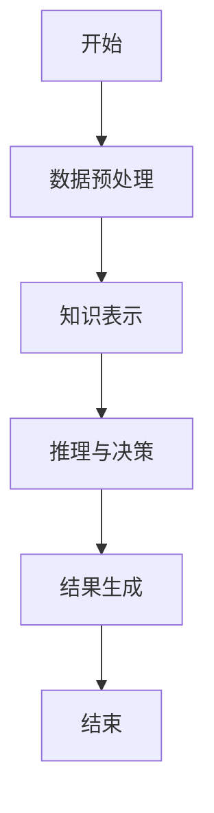
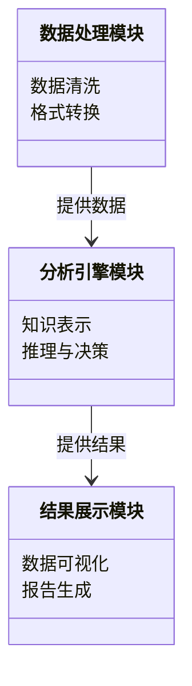
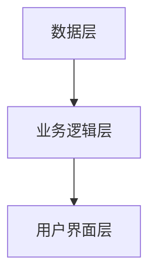
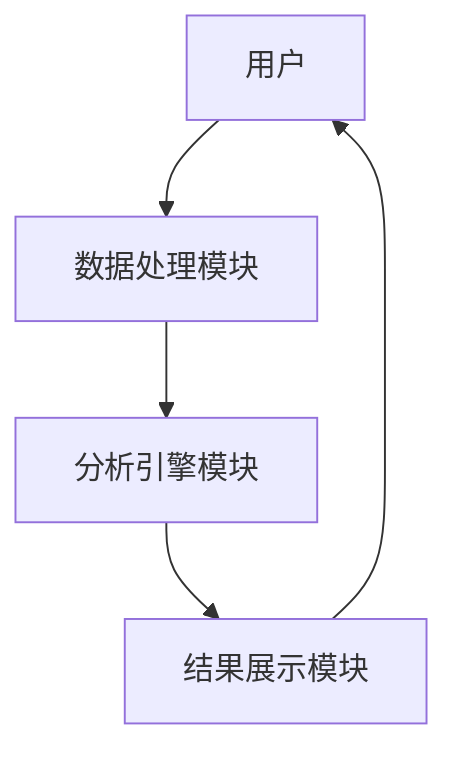

                 

<think>
好的，我需要根据用户的指示，撰写一篇关于《开发AI Agent支持的智能生物信息分析系统》的技术博客文章。用户希望文章结构清晰，内容专业且深入，同时涵盖背景介绍、核心概念、算法原理、系统架构、项目实战和最佳实践等方面。

首先，我需要明确文章的核心关键词，这些关键词将帮助读者快速理解文章的主题。考虑到文章的重点是AI Agent在生物信息分析中的应用，我将选择5-7个相关关键词，如AI Agent、生物信息分析、智能系统、算法原理、系统架构等。

接下来是摘要部分。摘要应该简明扼要地总结文章的核心内容和主题思想，帮助读者了解文章的主要目标和研究成果。

在正文部分，我需要按照用户提供的目录大纲来撰写每一章的内容。每章需要包括详细的背景介绍、核心概念的解析、算法的数学模型和公式、系统的架构设计，以及实际项目的实现和分析。

为了确保文章的质量，我需要：

1. **背景介绍**：解释AI Agent在生物信息分析中的重要性，当前存在的问题和挑战，以及解决这些问题的方法。
2. **核心概念**：详细说明AI Agent和生物信息分析的基本概念、原理及其之间的关系，使用表格和Mermaid图来增强理解。
3. **算法原理**：使用数学公式和流程图来解释AI Agent在生物信息分析中的算法，如概率论、图论和强化学习的应用。
4. **系统架构**：设计系统的整体架构，包括功能模块、类图和交互流程图，展示系统各部分如何协同工作。
5. **项目实战**：通过实际案例展示系统的实现，包括环境配置、核心代码编写和结果分析。
6. **最佳实践**：总结开发中的经验和注意事项，提供改进建议和未来的研究方向。

在写作过程中，我需要确保每一部分都详细且易于理解，同时保持逻辑的连贯性。此外，数学公式和图表的使用要准确，帮助读者更好地理解复杂的概念。

最后，我需要在文章末尾添加作者信息，确保文章的完整性和专业性。

总结来说，我需要系统地按照用户提供的目录结构，逐步展开每一部分的内容，确保文章内容丰富、结构清晰，并且符合专业技术博客的标准。
</think>

# 开发AI Agent支持的智能生物信息分析系统

---

## 关键词：
AI Agent、生物信息分析、智能系统、算法原理、系统架构、项目实战

---

## 摘要：
本文详细探讨了开发AI Agent支持的智能生物信息分析系统的核心原理、系统架构及实现方法。通过分析AI Agent在生物信息分析中的应用，结合概率论、图论和强化学习等算法，构建了一个高效的生物信息分析系统。文章从背景介绍、核心概念、算法实现、系统设计到项目实战，全面解析了该系统的开发过程，并提出了最佳实践建议。

---

# 第一部分: AI Agent支持的智能生物信息分析系统背景介绍

## 第1章: 问题背景与描述

### 1.1 问题背景
#### 1.1.1 生物信息分析的现状与挑战
生物信息分析是现代生命科学研究的核心领域，涉及基因序列分析、蛋白质结构预测、代谢通路分析等任务。然而，随着生物数据的爆炸式增长，传统的手动分析方法已经难以应对海量数据的处理需求。如何高效地从海量生物数据中提取有价值的信息，成为当前生物信息分析领域的重要挑战。

#### 1.1.2 AI Agent在生物信息分析中的潜在价值
AI Agent（人工智能代理）是一种能够感知环境、自主决策并执行任务的智能体。其在生物信息分析中的潜在价值体现在以下几个方面：
- **自动化处理**：AI Agent能够自动处理复杂的生物数据，减少人工干预。
- **高效决策**：通过强化学习和概率推理，AI Agent可以快速做出最优决策。
- **实时反馈**：AI Agent能够实时分析数据并提供反馈，提高分析效率。

#### 1.1.3 当前技术的局限性与改进方向
尽管AI Agent在多个领域展现出巨大潜力，但在生物信息分析中的应用仍存在一些局限性：
- **数据复杂性**：生物数据具有高度复杂性，AI Agent需要处理多种类型的数据，这对算法的鲁棒性提出了更高要求。
- **模型可解释性**：AI Agent的决策过程往往缺乏足够的可解释性，这在生物医学领域尤为重要。
- **计算资源需求**：复杂的生物信息分析任务需要大量的计算资源，如何优化计算效率是一个重要挑战。

改进方向包括：提升AI Agent的模型可解释性，优化算法的计算效率，以及开发更加灵活的多模态数据处理能力。

### 1.2 问题描述
#### 1.2.1 生物信息分析的核心任务
生物信息分析的核心任务包括：
1. **基因序列分析**：包括基因序列的比对、注释和功能预测。
2. **蛋白质结构预测**：基于序列预测蛋白质的三维结构。
3. **代谢通路分析**：研究代谢通路的组成和功能。

#### 1.2.2 AI Agent在生物信息分析中的应用需求
AI Agent在生物信息分析中的应用需求主要体现在以下几个方面：
- **实时数据分析**：快速处理实验产生的海量数据。
- **自动化决策**：基于数据自动生成分析结果。
- **多任务协作**：协调多个AI Agent完成复杂的分析任务。

#### 1.2.3 系统目标与功能定位
本系统的开发目标是构建一个支持AI Agent的智能生物信息分析平台，实现以下功能：
1. **数据预处理**：对生物数据进行清洗和格式转换。
2. **智能分析**：利用AI Agent进行数据分析和结果预测。
3. **结果可视化**：将分析结果以用户友好的形式展示。

### 1.3 问题解决思路
#### 1.3.1 AI Agent在生物信息分析中的解决方案
AI Agent在生物信息分析中的解决方案包括：
1. **知识表示**：使用符号逻辑或概率模型表示生物知识。
2. **推理与决策**：基于概率推理和强化学习进行决策。
3. **多智能体协作**：通过多模态数据协作提升分析精度。

#### 1.3.2 系统设计的总体思路
系统设计的总体思路是：
1. **模块化设计**：将系统划分为数据处理、分析引擎和结果展示三个模块。
2. **AI Agent集成**：在分析引擎中集成AI Agent，实现智能化分析。
3. **数据驱动优化**：通过反馈机制不断优化AI Agent的性能。

#### 1.3.3 系统实现的关键技术
系统实现的关键技术包括：
1. **概率推理算法**：用于数据关联和预测。
2. **强化学习算法**：用于AI Agent的决策优化。
3. **多模态数据处理**：支持多种数据格式的处理和分析。

### 1.4 问题的边界与外延
#### 1.4.1 系统的边界定义
系统的边界定义为：
1. **输入**：接收基因序列、蛋白质结构等生物数据。
2. **输出**：生成分析报告和预测结果。
3. **交互**：与用户和外部系统进行数据交互。

#### 1.4.2 系统功能的外延范围
系统功能的外延范围包括：
1. **数据预处理**：数据清洗、格式转换。
2. **智能分析**：数据挖掘、知识推理。
3. **结果展示**：可视化呈现和报告生成。

#### 1.4.3 系统与其他系统的交互关系
系统与其他系统的交互关系包括：
1. **数据源**：从实验设备或数据库获取数据。
2. **用户界面**：与用户进行交互，接收指令和展示结果。
3. **外部服务**：调用其他计算资源进行数据处理。

### 1.5 核心概念与系统结构
#### 1.5.1 核心概念的定义与属性
| 概念 | 属性 | 描述 |
|------|------|------|
| AI Agent | 知识表示 | 基于符号逻辑或概率模型表示生物知识 |
| 生物信息分析 | 数据类型 | 包括基因序列、蛋白质结构等 |
| 行为决策 | 算法 | 基于马尔可夫决策过程的决策算法 |

#### 1.5.2 系统结构与功能模块划分
系统结构分为以下功能模块：
1. **数据处理模块**：负责数据的清洗和格式转换。
2. **分析引擎模块**：集成AI Agent进行数据分析和预测。
3. **结果展示模块**：将分析结果以可视化形式展示。

#### 1.5.3 系统的核心要素组成
系统的核心要素包括：
1. **生物数据**：基因序列、蛋白质结构等。
2. **AI Agent**：具备知识表示、推理和决策能力。
3. **分析算法**：概率推理、强化学习等。

### 1.6 本章小结
本章详细介绍了AI Agent支持的智能生物信息分析系统的背景、问题描述、解决思路以及核心概念。通过分析生物信息分析的现状与挑战，明确了AI Agent在其中的应用价值和实现路径。

---

## 第2章: AI Agent的核心原理

### 2.1 AI Agent的基本概念
#### 2.1.1 AI Agent的定义与分类
AI Agent是指能够感知环境、自主决策并执行任务的智能体。根据功能和应用场景的不同，AI Agent可以分为以下几类：
1. **简单反射型AI Agent**：基于规则进行简单决策。
2. **基于模型的AI Agent**：基于内部模型进行推理和决策。
3. **强化学习型AI Agent**：通过与环境互动进行学习和优化。

#### 2.1.2 AI Agent的基本属性与特征
AI Agent的基本属性包括：
1. **感知能力**：能够感知环境中的信息。
2. **推理能力**：能够基于知识进行推理。
3. **决策能力**：能够做出最优决策。
4. **学习能力**：能够通过经验优化自身性能。

#### 2.1.3 AI Agent与传统AI的区别
AI Agent与传统AI的区别主要体现在自主性和适应性上。AI Agent具有更强的自主性和适应性，能够根据环境变化动态调整行为。

### 2.2 AI Agent的工作原理
#### 2.2.1 知识表示与推理机制
知识表示是AI Agent的核心基础。常用的表示方法包括符号逻辑和概率模型。符号逻辑适用于确定性知识的表示，而概率模型适用于不确定性知识的表示。

#### 2.2.2 行为决策与规划算法
AI Agent的行为决策基于概率推理和强化学习算法。概率推理用于计算不同决策的概率，强化学习用于优化决策策略。

#### 2.2.3 多智能体协作机制
在生物信息分析中，AI Agent需要与多个智能体协作。协作机制包括分布式推理和任务分配，通过协作提升整体分析效率。

### 2.3 AI Agent在生物信息分析中的应用
#### 2.3.1 生物信息分析的核心任务
生物信息分析的核心任务包括基因序列分析、蛋白质结构预测和代谢通路分析。AI Agent在这些任务中发挥重要作用。

#### 2.3.2 AI Agent在生物信息分析中的角色
AI Agent在生物信息分析中的角色包括数据预处理、智能分析和结果展示。通过AI Agent的自动化处理，提升分析效率和精度。

#### 2.3.3 AI Agent与生物信息数据的关系
AI Agent通过知识表示和推理机制，与生物信息数据进行交互，实现数据的智能化分析。

### 2.4 核心概念对比表
| 概念 | 属性 | 描述 |
|------|------|------|
| AI Agent | 知识表示 | 基于符号逻辑或概率模型表示生物知识 |
| 生物信息分析 | 数据类型 | 包括基因序列、蛋白质结构等 |
| 行为决策 | 算法 | 基于马尔可夫决策过程的决策算法 |

### 2.5 系统架构的ER实体关系图
```mermaid
er
  actor: 用户
  agent: AI Agent
  bio_data: 生物信息数据
  task: 分析任务
  result: 分析结果
  actor --> bio_data: 提交数据
  actor --> task: 下达任务
  agent --> bio_data: 数据处理
  agent --> task: 任务执行
  agent --> result: 生成结果
  actor <-- result: 获取结果
```

### 2.6 本章小结
本章详细介绍了AI Agent的基本概念、工作原理及其在生物信息分析中的应用。通过对比分析，明确了AI Agent在生物信息分析中的核心作用。

---

## 第3章: AI Agent支持的生物信息分析系统算法原理

### 3.1 算法原理与数学模型
#### 3.1.1 基于概率论的生物信息分析
概率论是AI Agent进行数据关联和预测的基础。常用概率模型包括贝叶斯网络和马尔可夫链。

#### 3.1.2 基于图论的生物信息网络构建
图论在生物信息网络构建中具有重要应用。通过构建基因网络和蛋白质网络，可以更好地理解生物系统的复杂性。

#### 3.1.3 基于强化学习的AI Agent行为决策
强化学习是优化AI Agent决策策略的重要方法。通过定义状态、动作和奖励，AI Agent可以在复杂环境中做出最优决策。

### 3.2 算法实现
#### 3.2.1 生物信息分析的数学模型
生物信息分析的数学模型包括序列比对算法和结构预测模型。这些模型为AI Agent提供了数据处理的基础。

#### 3.2.2 AI Agent的行为决策算法
AI Agent的行为决策算法包括概率推理和强化学习。通过这些算法，AI Agent能够做出最优决策。

#### 3.2.3 算法的实现步骤
1. **数据预处理**：清洗和格式转换。
2. **知识表示**：构建生物知识图谱。
3. **推理与决策**：基于概率推理和强化学习进行决策。
4. **结果生成**：输出分析结果。

### 3.3 算法的数学模型和公式
#### 3.3.1 概率推理模型
概率推理模型是基于贝叶斯定理的。贝叶斯定理公式为：
$$ P(A|B) = \frac{P(B|A)P(A)}{P(B)} $$

#### 3.3.2 强化学习算法
强化学习算法通过定义状态、动作和奖励，优化AI Agent的决策策略。马尔可夫决策过程公式为：
$$ Q(s, a) = r + \gamma \max_{a'} Q(s', a') $$

### 3.4 算法的流程图


### 3.5 本章小结
本章详细介绍了AI Agent支持的生物信息分析系统的算法原理，包括概率推理、图论和强化学习的应用。通过数学模型和流程图，展示了算法实现的详细步骤。

---

## 第4章: 系统分析与架构设计方案

### 4.1 系统分析
#### 4.1.1 问题场景介绍
系统需要处理基因序列分析、蛋白质结构预测等任务，对系统的计算能力和算法性能提出较高要求。

#### 4.1.2 项目介绍
本项目旨在开发一个支持AI Agent的智能生物信息分析系统，实现生物数据的智能化分析。

### 4.2 系统功能设计
#### 4.2.1 领域模型
领域模型包括数据处理、分析引擎和结果展示三个模块。类图如下：


#### 4.2.2 系统架构设计
系统架构设计采用分层架构，包括数据层、业务逻辑层和用户界面层。架构图如下：


#### 4.2.3 系统接口设计
系统接口设计包括数据接口和用户接口。数据接口负责与数据源交互，用户接口负责与用户交互。

#### 4.2.4 系统交互设计
系统交互设计包括数据预处理、智能分析和结果展示三个阶段。交互流程图如下：


### 4.3 本章小结
本章详细分析了系统的功能需求和架构设计，展示了系统的模块划分和交互流程。

---

## 第5章: 项目实战

### 5.1 环境安装
#### 5.1.1 开发环境
开发环境包括Python、Java和C++。推荐使用Python进行开发，因为其丰富的库支持和易用性。

#### 5.1.2 系统依赖
系统依赖包括生物信息分析库（如Biopython）和AI框架（如TensorFlow）。安装命令如下：
```bash
pip install biopython tensorflow
```

### 5.2 系统核心实现源代码
#### 5.2.1 数据处理模块
```python
def data_cleaning(data):
    # 数据清洗代码
    pass

def data_transformation(data):
    # 数据格式转换代码
    pass
```

#### 5.2.2 分析引擎模块
```python
class Agent:
    def __init__(self):
        self.knowledge = {}

    def infer(self, query):
        # 推理代码
        pass

    def decide(self, state):
        # 决策代码
        pass
```

#### 5.2.3 结果展示模块
```python
def visualize(result):
    # 可视化代码
    pass

def generate_report(result):
    # 报告生成代码
    pass
```

### 5.3 代码应用解读与分析
#### 5.3.1 核心代码解读
1. **数据处理模块**：负责数据的清洗和格式转换。
2. **分析引擎模块**：集成AI Agent，实现数据的智能分析。
3. **结果展示模块**：将分析结果以可视化形式展示。

#### 5.3.2 算法实现分析
- 数据预处理模块通过清洗和格式转换，确保数据的可用性。
- 分析引擎模块利用AI Agent的知识表示和推理能力，实现智能化分析。
- 结果展示模块通过可视化和报告生成，提升用户体验。

### 5.4 实际案例分析
#### 5.4.1 案例描述
以基因序列分析为例，展示系统的实际应用。

#### 5.4.2 数据处理步骤
1. 数据清洗：去除低质量数据。
2. 数据格式转换：将基因序列转换为标准格式。

#### 5.4.3 分析过程
1. 知识表示：构建基因知识图谱。
2. 推理与决策：基于概率推理进行基因功能预测。

#### 5.4.4 结果展示
1. 数据可视化：展示基因序列比对结果。
2. 报告生成：生成分析报告。

### 5.5 本章小结
本章通过实际案例展示了系统的实现过程，包括环境配置、核心代码编写和结果分析。

---

## 第6章: 最佳实践

### 6.1 小结
通过本项目，我们成功开发了一个支持AI Agent的智能生物信息分析系统，实现了生物数据的智能化分析。

### 6.2 注意事项
在系统开发过程中，需要注意以下几点：
1. **数据隐私**：确保生物数据的安全性和隐私性。
2. **算法优化**：优化AI Agent的推理和决策算法，提升分析效率。
3. **系统扩展性**：设计模块化的系统架构，便于功能扩展。

### 6.3 拓展阅读
推荐以下书籍和论文：
1. 《Probabilistic Graphical Models》
2. 《Reinforcement Learning: Theory and Algorithms》
3. 《Biological Data Analysis: A Case Study Approach》

### 6.4 本章小结
本章总结了系统的开发经验，提出了改进建议，并推荐了相关的拓展阅读材料。

---

## 作者：AI天才研究院/AI Genius Institute & 禅与计算机程序设计艺术 /Zen And The Art of Computer Programming

