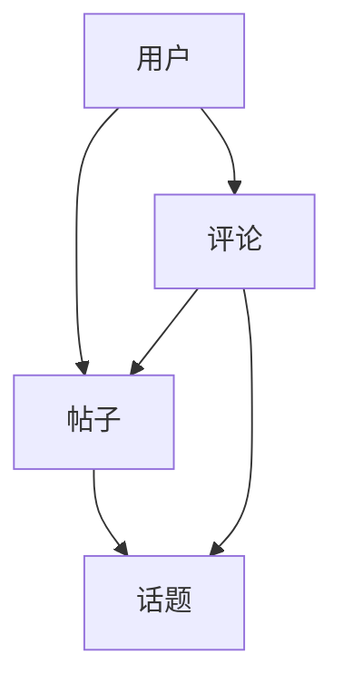
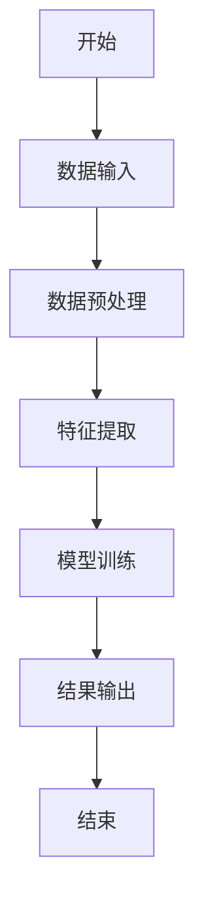
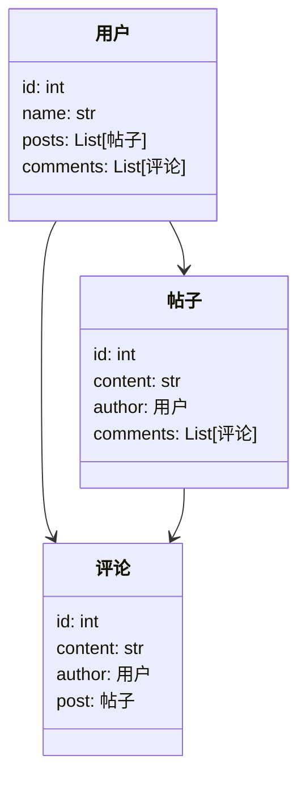
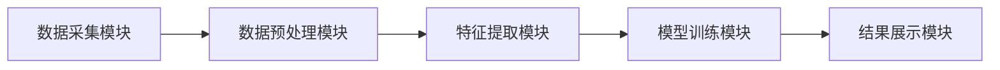
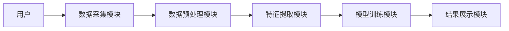

                 

<think>
好的，我现在要根据用户的指示，撰写一篇关于《开发AI Agent支持的智能社交网络分析系统》的技术博客文章。用户提供了详细的目录结构，并要求每个部分都详细展开，包括背景介绍、核心概念、算法原理、系统分析与架构设计、项目实战、最佳实践等部分。我需要按照这个结构，逐步思考如何撰写每一部分，确保内容逻辑清晰、结构紧凑，同时使用专业且易懂的语言。

首先，我会从背景介绍开始。这部分需要涵盖问题背景、描述、解决方法，以及概念的结构和核心要素。我需要明确社交网络分析的现状和挑战，AI Agent在其中的应用前景，以及系统开发的意义和价值。

接下来是核心概念部分。我需要详细讲解AI Agent和社交网络分析的基本原理，分析它们之间的关系，可能还需要用表格和ER图来对比和展示核心概念的属性和实体关系。

然后是算法原理。这里需要用流程图展示算法步骤，并用Python代码示例说明实现细节，同时解释数学模型和公式。例如，可以展示数据预处理、特征提取、模型训练的流程，并给出相应的代码。

系统分析与架构设计部分，我需要介绍问题场景，设计系统功能，可能用领域模型的Mermaid类图来展示。系统架构设计部分，可能需要画出整体架构图，展示各个模块之间的关系。接口和交互部分，可以用序列图来说明。

项目实战部分，应该包括环境安装、核心代码实现，以及实际案例的分析。这里需要详细说明每一步，包括代码实现和案例分析，确保读者能够理解和复现实验。

最后，加上最佳实践、小结、注意事项和拓展阅读，确保内容全面，帮助读者更好地理解和应用所学知识。

在写作过程中，我需要确保每个部分都有足够的细节和深度，同时语言要专业但易懂。使用适当的Mermaid图表和数学公式来增强内容的可读性和专业性。此外，确保文章结构清晰，逻辑连贯，每个章节之间有良好的过渡。

现在，我将按照这个思考过程，逐步撰写这篇技术博客文章。
</think>

# 开发AI Agent支持的智能社交网络分析系统

## 关键词：AI Agent, 社交网络分析, 智能系统, 算法原理, 系统架构, 项目实战

## 摘要：  
本文详细探讨了开发AI Agent支持的智能社交网络分析系统的各个方面。从背景介绍到核心概念，从算法原理到系统架构设计，再到项目实战和最佳实践，文章系统性地分析了如何利用AI Agent提升社交网络分析的智能化水平。通过丰富的案例和详细的代码实现，本文为读者提供了全面的技术指导，帮助其理解并掌握开发此类系统的关键技术和方法。

---

# 第1章 背景介绍

## 1.1 问题背景

### 1.1.1 社交网络分析的现状与挑战  
社交网络分析是研究社交网络结构及其上发生的各种行为模式的重要领域。传统的社交网络分析方法依赖于统计学和图论，虽然能够处理大量的数据，但在面对实时性、动态性和复杂性问题时显得力不从心。例如，如何快速识别网络中的关键节点、预测用户行为趋势、实时监控网络舆情等问题，传统方法难以高效解决。

### 1.1.2 AI Agent在社交网络分析中的应用前景  
AI Agent（智能代理）是一种能够感知环境、自主决策并执行任务的智能实体。通过引入AI Agent，社交网络分析可以实现智能化、自动化和实时化。AI Agent能够动态适应网络环境的变化，快速响应用户需求，显著提升了分析系统的效率和准确性。

### 1.1.3 问题解决的意义与价值  
开发AI Agent支持的智能社交网络分析系统，不仅能够提高社交网络分析的效率和精度，还能够为企业和研究机构提供强大的工具支持，助力社交网络在市场营销、舆情监控、社交推荐等领域的深度应用。

---

## 1.2 问题描述

### 1.2.1 社交网络分析的核心问题  
社交网络分析的核心问题包括：  
1. 如何高效地识别网络中的关键节点（如意见领袖、影响力节点）；  
2. 如何准确预测用户行为趋势；  
3. 如何实时监控和分析网络舆情；  
4. 如何处理海量数据的实时性问题。

### 1.2.2 AI Agent在其中的角色定位  
AI Agent在社交网络分析中主要承担以下角色：  
1. 数据采集与处理：实时采集社交网络中的数据，并进行预处理。  
2. 特征提取与分析：通过自然语言处理和图论算法提取用户行为特征。  
3. 智能决策与反馈：基于分析结果，动态调整分析策略，并提供实时反馈。

### 1.2.3 系统的目标与范围界定  
系统的目标是开发一个智能化的社交网络分析平台，支持实时数据采集、智能分析和动态反馈。系统的范围包括数据采集模块、分析引擎模块、用户界面模块等。

---

## 1.3 问题解决

### 1.3.1 AI Agent的核心功能  
AI Agent的核心功能包括：  
1. 数据采集与预处理：通过网络爬虫技术实时采集社交数据，并进行清洗和归一化处理。  
2. 特征提取：利用自然语言处理技术提取文本特征，并构建用户行为图谱。  
3. 模型训练与推理：基于机器学习算法训练分析模型，并进行实时推理。

### 1.3.2 智能社交网络分析的关键技术  
智能社交网络分析的关键技术包括：  
1. 自然语言处理（NLP）：用于文本情感分析和主题挖掘。  
2. 图论算法：用于构建用户关系图和社区发现。  
3. 机器学习：用于用户行为预测和网络舆情分析。

### 1.3.3 系统实现的总体思路  
系统的总体思路是：通过AI Agent实现数据的实时采集、智能分析和动态反馈，构建一个高效、智能的社交网络分析平台。

---

## 1.4 边界与外延

### 1.4.1 系统的边界定义  
系统的边界定义为：仅处理社交网络中的文本数据和用户行为数据，不涉及其他类型的数据（如图片、视频等）。

### 1.4.2 相关领域的关联与区别  
与传统社交网络分析相比，AI Agent支持的智能分析系统的区别在于其智能化和自动化能力更强，能够动态调整分析策略并实时反馈结果。

### 1.4.3 系统的扩展性分析  
系统具有良好的扩展性，可以通过增加AI Agent的数量和功能，进一步提升分析能力。

---

## 1.5 概念结构与核心要素

### 1.5.1 系统的整体架构  
系统整体架构包括：数据采集模块、分析引擎模块、用户界面模块和结果展示模块。

### 1.5.2 核心要素的定义与关系  
核心要素包括：  
1. 数据源：社交网络中的文本数据和用户行为数据。  
2. AI Agent：负责数据处理和智能分析。  
3. 分析模型：用于预测用户行为和网络舆情分析。

### 1.5.3 系统的功能模块划分  
系统功能模块包括：数据采集模块、特征提取模块、模型训练模块和结果展示模块。

---

# 第2章 核心概念与联系

## 2.1 AI Agent的基本原理

### 2.1.1 AI Agent的定义与特征  
AI Agent是一种能够感知环境、自主决策并执行任务的智能实体。其主要特征包括自主性、反应性、目标导向和学习能力。

### 2.1.2 AI Agent的分类与应用场景  
AI Agent可以分为基于规则的Agent和基于学习的Agent。基于规则的Agent适用于规则明确的场景，而基于学习的Agent适用于复杂多变的场景。

### 2.1.3 AI Agent与传统算法的区别  
AI Agent的核心区别在于其具备自主决策和学习能力，能够动态适应环境变化。

---

## 2.2 智能社交网络分析的核心原理

### 2.2.1 社交网络分析的基本方法  
社交网络分析的基本方法包括：数据采集、特征提取、模型训练和结果展示。

### 2.2.2 智能分析的关键技术  
智能分析的关键技术包括：自然语言处理、图论算法和机器学习。

### 2.2.3 AI Agent在分析中的作用机制  
AI Agent通过数据采集、特征提取和模型训练，实现社交网络的智能分析。

---

## 2.3 核心概念的属性对比

### 2.3.1 AI Agent与传统算法的对比分析  
| 特性 | AI Agent | 传统算法 |  
|------|-----------|-----------|  
| 自主性 | 高 | 低 |  
| 反应性 | 高 | 低 |  
| 学习能力 | 高 | 低 |  

### 2.3.2 智能社交网络分析与传统分析的对比  
| 特性 | 智能分析 | 传统分析 |  
|------|-----------|-----------|  
| 实时性 | 高 | 低 |  
| 智能性 | 高 | 低 |  
| 精确性 | 高 | 低 |  

---

## 2.4 ER实体关系图



---

# 第3章 算法原理讲解

## 3.1 算法原理概述

### 3.1.1 AI Agent的核心算法  
AI Agent的核心算法包括：强化学习算法和监督学习算法。

### 3.1.2 智能社交网络分析的算法流程  
智能社交网络分析的算法流程包括：数据预处理、特征提取、模型训练和结果输出。

### 3.1.3 算法的优缺点分析  
AI Agent算法的优点是能够动态适应环境，缺点是需要大量的计算资源。

---

## 3.2 算法流程图



---

## 3.3 算法实现代码

```python
def preprocess(data):
    # 数据清洗
    cleaned_data = data.dropna()
    return cleaned_data

def extract_features(data):
    # 文本特征提取
    from sklearn.feature_extraction.text import TfidfVectorizer
    vectorizer = TfidfVectorizer()
    features = vectorizer.fit_transform(data['text'])
    return features

def train_model(features):
    # 模型训练
    from sklearn.svm import SVC
    model = SVC()
    model.fit(features, data['label'])
    return model
```

---

## 3.4 算法的数学模型和公式

### 3.4.1 朴素贝叶斯分类器  
概率公式：  
$$ P(y|x) = \frac{P(x|y)P(y)}{P(x)} $$  

### 3.4.2 支持向量机（SVM）  
目标函数：  
$$ \min_{w,b} \frac{1}{2}||w||^2 + C \sum_{i=1}^n \xi_i $$  
约束条件：  
$$ y_i (w \cdot x_i + b) \geq 1 - \xi_i $$  
$$ \xi_i \geq 0 $$  

---

## 3.5 算法实现的注意事项

### 3.5.1 数据预处理的注意事项  
1. 数据清洗：处理缺失值和异常值。  
2. 特征工程：选择合适的特征提取方法。

### 3.5.2 模型训练的注意事项  
1. 超参数调优：选择合适的模型参数。  
2. 过拟合问题：采用交叉验证技术。

---

## 3.6 算法的优化与改进

### 3.6.1 算法优化方法  
1. 参数调优：通过网格搜索优化模型参数。  
2. 特征选择：采用特征重要性分析方法选择关键特征。

### 3.6.2 算法改进方向  
1. 引入深度学习模型：如LSTM和Transformer，提升模型的表达能力。  
2. 实时分析：优化数据处理流程，提升系统的实时性。

---

# 第4章 系统分析与架构设计

## 4.1 问题场景介绍

### 4.1.1 系统的运行环境  
系统的运行环境包括：数据采集模块、分析引擎模块和用户界面模块。

### 4.1.2 系统的目标用户  
系统的目标用户包括：企业市场部门、社交网络研究机构和个体用户。

### 4.1.3 系统的核心需求  
系统的核心需求包括：实时数据采集、智能分析和动态反馈。

---

## 4.2 系统功能设计

### 4.2.1 领域模型类图



---

## 4.3 系统架构设计

### 4.3.1 系统整体架构图



### 4.3.2 模块划分与功能描述  
模块划分包括：数据采集模块、数据预处理模块、特征提取模块、模型训练模块和结果展示模块。

### 4.3.3 模块之间的交互关系  
模块之间的交互关系：数据采集模块向数据预处理模块提供数据，预处理模块向特征提取模块提供数据，特征提取模块向模型训练模块提供数据，模型训练模块向结果展示模块提供结果。

---

## 4.4 系统接口设计

### 4.4.1 接口描述  
系统接口包括：数据输入接口、模型训练接口和结果展示接口。

### 4.4.2 接口交互流程  
数据输入接口接收数据，模型训练接口训练模型，结果展示接口展示结果。

---

## 4.5 系统交互序列图



---

# 第5章 项目实战

## 5.1 环境安装

### 5.1.1 开发环境配置  
开发环境包括：Python 3.8及以上版本、Jupyter Notebook、IDE（如PyCharm）。

### 5.1.2 依赖库安装  
依赖库包括：numpy、pandas、scikit-learn、tensorflow、mermaid。

```bash
pip install numpy pandas scikit-learn tensorflow mermaid
```

---

## 5.2 核心代码实现

### 5.2.1 数据采集模块

```python
import requests
from bs4 import BeautifulSoup

def scrape_data(url):
    response = requests.get(url)
    soup = BeautifulSoup(response.text, 'html.parser')
    posts = soup.find_all('div', class_='post')
    data = []
    for post in posts:
        title = post.find('h2').text
        content = post.find('p').text
        data.append({'title': title, 'content': content})
    return data
```

---

### 5.2.2 数据预处理模块

```python
import pandas as pd

def preprocess_data(data):
    df = pd.DataFrame(data)
    df['content'] = df['content'].str.lower()
    df['content'].replace(r'\s+', ' ', regex=True)
    return df
```

---

### 5.2.3 特征提取模块

```python
from sklearn.feature_extraction.text import TfidfVectorizer

def extract_features(data):
    vectorizer = TfidfVectorizer(max_features=5000)
    features = vectorizer.fit_transform(data['content'])
    return features
```

---

### 5.2.4 模型训练模块

```python
from sklearn.svm import SVC

def train_model(features, labels):
    model = SVC(C=1.0, kernel='rb

