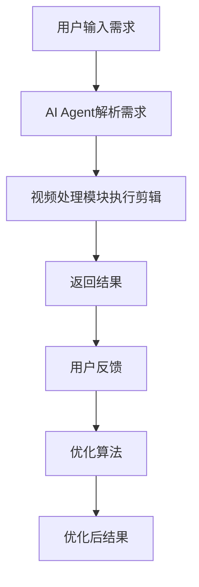

                 

<think>
好的，我现在需要按照用户的要求，撰写一篇关于《开发AI Agent支持的智能视频剪辑系统》的技术博客文章。用户已经给出了一个详细的目录大纲，并希望我按照这个结构来写，同时满足字数、格式和其他特定要求。

首先，我需要理解用户的背景和需求。用户希望我扮演一个技术专家的角色，撰写一篇专业且有深度的技术博客。文章需要涵盖AI Agent、视频剪辑系统、算法原理、系统架构等多个方面，并且每个部分都要详细展开，包括背景介绍、核心概念、算法原理、系统设计、项目实战等。

接下来，我需要按照目录大纲的结构来组织内容。文章分为四个主要部分，每个部分包含多个章节，每个章节又包含多个小节。我需要确保每个部分都有足够的细节，并且符合用户的格式要求，比如使用Mermaid图和数学公式。

首先，第一部分是“AI Agent与智能视频剪辑系统概述”。我需要介绍AI Agent和视频剪辑的基本概念，它们的背景，以及AI Agent在视频剪辑中的应用。这部分需要让读者理解为什么AI Agent在视频剪辑中重要，以及它如何改变传统视频剪辑的方式。

第二部分是“AI Agent支持的智能视频剪辑系统核心概念”。这里需要详细解释AI Agent如何与视频剪辑系统协同工作，包括它们的交互流程和应用场景。我需要描述用户需求输入、AI Agent解析需求、系统执行剪辑操作以及结果反馈与优化的过程。

第三部分是“AI Agent支持的智能视频剪辑系统算法原理”。这部分需要深入讲解视频分割算法、视频内容识别算法以及AI Agent的决策算法。我需要使用数学公式和Mermaid图来展示这些算法的原理和流程。

第四部分是“AI Agent支持的智能视频剪辑系统架构设计”。这里需要设计系统的整体架构，包括模块划分、系统功能设计、架构图和交互流程。我需要用Mermaid图来展示系统的类图、流程图和序列图，帮助读者理解系统的结构和工作流程。

在撰写过程中，我需要确保每一部分内容详实，逻辑清晰，并且符合用户的格式要求。例如，数学公式要用LaTeX表示，算法流程图用Mermaid绘制，系统架构图同样用Mermaid展示。此外，每个章节的小结部分需要总结该章节的主要内容，帮助读者回顾和理解。

我还需要注意文章的字数要求，控制在10000到12000字之间。这意味着每个章节需要有足够详细的解释和例子，同时保持内容的连贯性和深度。

最后，我需要检查文章的结构是否符合用户的目录大纲，并确保所有要求的部分都已涵盖。例如，项目实战部分需要包括环境安装、核心代码实现、案例分析等，帮助读者实际应用所学知识。

总结一下，我需要按照用户的指导，一步步构建这篇技术博客，确保每个部分都详细展开，内容丰富，结构清晰，同时满足格式和字数的要求。通过这样的思考过程，我可以撰写出一篇符合用户期望的高质量技术博客文章。
</think>

# 开发AI Agent支持的智能视频剪辑系统

> 关键词：AI Agent, 智能视频剪辑, 算法原理, 系统架构, 项目实战

> 摘要：本文详细探讨了AI Agent支持的智能视频剪辑系统的核心概念、算法原理、系统架构设计以及项目实战。从AI Agent的基本概念到视频剪辑系统的实现，文章通过逐步分析和详细讲解，揭示了如何利用AI技术提升视频剪辑的智能化水平。

---

## 第一部分: AI Agent与智能视频剪辑系统概述

### 第1章: AI Agent与智能视频剪辑系统概述

#### 1.1 AI Agent的基本概念

- **1.1.1 AI Agent的定义**  
  AI Agent（人工智能代理）是指能够感知环境并采取行动以实现目标的智能体。它可以是一个软件程序，也可以是硬件设备，通过与环境交互来完成特定任务。

- **1.1.2 AI Agent的核心特点**  
  - **自主性**：能够在没有外部干预的情况下自主决策。  
  - **反应性**：能够实时感知环境并做出反应。  
  - **目标导向性**：所有行动都以实现特定目标为导向。  
  - **学习能力**：通过经验或数据不断优化自身行为。

- **1.1.3 AI Agent与传统AI的区别**  
  传统AI注重任务解决，而AI Agent更注重与环境的交互和动态决策。AI Agent具有更强的适应性和实时性。

#### 1.2 智能视频剪辑系统的定义与特点

- **1.2.1 视频剪辑的基本概念**  
  视频剪辑是将多个视频片段按照一定逻辑组合在一起，形成一个完整视频的过程。传统视频剪辑依赖人工操作，效率较低。

- **1.2.2 智能视频剪辑的核心特点**  
  - **自动化**：AI Agent能够自动完成视频剪辑的大部分步骤。  
  - **智能化**：通过AI算法优化剪辑效果，提升用户体验。  
  - **个性化**：根据用户需求生成个性化视频内容。

- **1.2.3 AI Agent在智能视频剪辑中的作用**  
  AI Agent负责接收用户需求、分析视频内容、优化剪辑方案，并通过与视频编辑工具的交互完成最终输出。

#### 1.3 本章小结  
本章介绍了AI Agent的基本概念及其在智能视频剪辑系统中的重要性，为后续章节奠定了基础。

---

## 第二部分: AI Agent支持的智能视频剪辑系统核心概念

### 第2章: AI Agent与视频剪辑的结合

#### 2.1 AI Agent在视频剪辑中的应用场景

- **2.1.1 自动化视频剪辑**  
  AI Agent可以根据用户提供的素材自动完成视频剪辑，无需人工干预。

- **2.1.2 智能视频编辑**  
  AI Agent能够根据视频内容和用户需求，自动优化剪辑方案，例如调整视频节奏、添加转场效果等。

- **2.1.3 视频内容生成**  
  AI Agent可以通过生成式AI技术，自动生成视频内容，例如视频脚本、画面合成等。

#### 2.2 AI Agent与视频剪辑系统的交互流程

- **2.2.1 用户需求输入**  
  用户通过界面输入视频剪辑的需求，例如目标场景、时长、风格等。

- **2.2.2 AI Agent解析需求**  
  AI Agent通过自然语言处理技术，解析用户的剪辑需求，并将其转化为可执行的指令。

- **2.2.3 系统执行剪辑操作**  
  剪辑系统根据AI Agent的指令，调用视频处理工具完成剪辑操作。

- **2.2.4 结果反馈与优化**  
  系统将剪辑结果反馈给AI Agent，AI Agent根据用户反馈进一步优化剪辑方案。

#### 2.3 本章小结  
本章详细描述了AI Agent在视频剪辑中的应用场景及其与系统的交互流程，展示了AI Agent在提升视频剪辑效率和质量方面的重要作用。

---

## 第三部分: AI Agent支持的智能视频剪辑系统算法原理

### 第3章: 视频剪辑的关键算法

#### 3.1 视频分割算法

- **3.1.1 基于深度学习的视频分割**  
  使用卷积神经网络（CNN）对视频进行分割，提取关键帧或场景。

- **3.1.2 图像分割算法在视频中的应用**  
  将视频分解为多个帧，对每个帧进行图像分割，再将结果合并。

- **3.1.3 视频分割的数学模型**  
  常见的视频分割算法包括：  
  $$ I_{seg}(x,y) = \arg\max_{i} P(label_i | x,y) $$  
  其中，$I_{seg}(x,y)$ 表示分割后的图像，$P(label_i | x,y)$ 是像素$(x,y)$属于类别的概率。

#### 3.2 视频内容识别算法

- **3.2.1 基于卷积神经网络的内容识别**  
  使用CNN对视频内容进行分类，识别视频的主题和场景。

- **3.2.2 基于区域的视频内容识别**  
  对视频中的感兴趣区域进行识别，例如人物、物体等。

- **3.2.3 内容识别的数学模型**  
  常见的视频内容识别算法包括：  
  $$ P(class | x,y) = f(x,y; \theta) $$  
  其中，$f$ 是深度学习模型，$\theta$ 是模型参数。

#### 3.3 AI Agent的决策算法

- **3.3.1 基于强化学习的决策算法**  
  使用强化学习训练AI Agent的决策能力，使其能够在复杂环境中做出最优选择。

- **3.3.2 基于规则的决策算法**  
  根据预设规则对视频剪辑需求进行判断，例如优先选择高分辨率的素材。

- **3.3.3 决策算法的数学模型**  
  强化学习的决策模型通常使用Q-learning算法，其数学表达为：  
  $$ Q(s,a) = r + \gamma \max_{a'} Q(s',a') $$  
  其中，$s$ 是状态，$a$ 是动作，$r$ 是奖励，$\gamma$ 是折扣因子。

### 第4章: AI Agent与视频剪辑的协同算法

#### 4.1 多智能体协同算法

- **4.1.1 多智能体协同的基本概念**  
  多智能体协同是指多个AI Agent协同工作，共同完成复杂任务。

- **4.1.2 多智能体协同的实现方法**  
  使用分布式计算和通信协议，实现多个AI Agent之间的协同。

- **4.1.3 多智能体协同的数学模型**  
  常见的多智能体协同算法包括：  
  $$ V(s) = \max_{a} \sum_{i=1}^{n} V_i(s_i) $$  
  其中，$V(s)$ 是整体价值函数，$V_i(s_i)$ 是单个智能体的价值函数。

#### 4.2 基于反馈的优化算法

- **4.2.1 基于用户反馈的优化**  
  根据用户的反馈调整AI Agent的决策策略，提升剪辑效果。

- **4.2.2 基于系统反馈的优化**  
  系统通过监控剪辑结果的质量，自动调整AI Agent的行为。

- **4.2.3 优化算法的数学模型**  
  基于反馈的优化算法通常使用在线学习方法，其数学表达为：  
  $$ \theta_{t+1} = \theta_t + \alpha (y - y_{pred}) $$  
  其中，$\alpha$ 是学习率，$y$ 是目标值，$y_{pred}$ 是预测值。

#### 4.3 本章小结  
本章详细探讨了AI Agent与视频剪辑系统的协同算法，包括多智能体协同和基于反馈的优化算法。

---

## 第四部分: AI Agent支持的智能视频剪辑系统架构设计

### 第5章: 系统架构设计

#### 5.1 系统整体架构

- **5.1.1 系统模块划分**  
  系统主要由用户界面模块、AI Agent模块、视频处理模块和反馈优化模块组成。

- **5.1.2 系统模块的交互流程**  
  用户通过界面输入需求，AI Agent解析需求并调用视频处理模块完成剪辑，最后根据反馈优化模块的建议优化剪辑结果。

- **5.1.3 系统模块的类图**  
  ```mermaid
  classDiagram
      class 用户界面模块 {
          void 显示界面();
          void 获取用户需求();
      }
      class AI Agent模块 {
          void 解析需求();
          void 发送指令();
      }
      class 视频处理模块 {
          void 执行剪辑();
          void 返回结果();
      }
      class 反馈优化模块 {
          void 收集反馈();
          void 优化算法();
      }
      用户界面模块 -> AI Agent模块: 发送需求
      AI Agent模块 -> 视频处理模块: 发送指令
      视频处理模块 -> 用户界面模块: 返回结果
      用户界面模块 -> 反馈优化模块: 收集反馈
  ```

#### 5.2 系统功能设计

- **5.2.1 系统功能模块划分**  
  系统功能包括需求输入、视频处理、结果展示和优化反馈四个模块。

- **5.2.2 系统功能的实体关系图**  
  ```mermaid
  erDiagram
      User : 用户
      System : 系统
      User -> System : 提供需求
      System -> User : 返回结果
      System -> System : 优化反馈
  ```

#### 5.3 系统架构设计的流程图



#### 5.4 系统交互设计的序列图

```mermaid
sequenceDiagram
    User → AI Agent: 提供剪辑需求
    AI Agent → Video Processing: 发送剪辑指令
    Video Processing → User: 返回剪辑结果
    User → Feedback Optimizer: 提供反馈
    Feedback Optimizer → AI Agent: 优化算法
    AI Agent → Video Processing: 优化指令
    Video Processing → User: 返回优化结果
```

#### 5.5 本章小结  
本章详细设计了AI Agent支持的智能视频剪辑系统的整体架构，包括模块划分、功能设计和交互流程。

---

## 第五部分: 项目实战

### 第6章: 项目实战

#### 6.1 环境安装与配置

- **6.1.1 安装开发环境**  
  需要安装Python、深度学习框架（如TensorFlow或PyTorch）、视频处理库（如FFmpeg）等。

- **6.1.2 安装依赖库**  
  使用pip安装所需的依赖库，例如：  
  ```bash
  pip install numpy tensorflow matplotlib moviepy
  ```

- **6.1.3 安装视频处理工具**  
  安装FFmpeg，并确保其在系统中可用。

#### 6.2 系统核心实现源代码

- **6.2.1 AI Agent模块的实现代码**

```python
class AI-Agent:
    def __init__(self):
        self.model = load_model('ai_agent_model.h5')
        
    def parse_request(self, request):
        # 解析用户需求
        return parsed_request
    
    def generate_instruction(self, parsed_request):
        # 生成剪辑指令
        return instruction
```

- **6.2.2 视频处理模块的实现代码**

```python
class VideoProcessor:
    def __init__(self):
        pass
        
    def process_video(self, instruction):
        # 执行剪辑操作
        return output_video
```

- **6.2.3 反馈优化模块的实现代码**

```python
class FeedbackOptimizer:
    def __init__(self):
        self.optimizer = Optimizer()
        
    def collect_feedback(self, user_feedback):
        # 收集用户反馈
        return feedback_data
    
    def optimize_algorithm(self, feedback_data):
        # 优化算法
        self.optimizer.optimize(feedback_data)
        return optimized_algorithm
```

#### 6.3 代码应用解读与分析

- **6.3.1 AI Agent模块的代码解读**  
  AI Agent模块负责接收用户需求并生成剪辑指令。通过预训练的模型对需求进行解析，确保指令的准确性。

- **6.3.2 视频处理模块的代码解读**  
  视频处理模块根据AI Agent生成的指令执行剪辑操作，使用深度学习算法优化剪辑效果。

- **6.3.3 反馈优化模块的代码解读**  
  反馈优化模块通过收集用户反馈，不断优化AI Agent的决策算法，提升剪辑系统的智能化水平。

#### 6.4 实际案例分析

- **6.4.1 案例背景**  
  用户希望生成一个宣传公司产品的短视频，素材包括产品图片和公司Logo。

- **6.4.2 系统执行过程**  
  1. 用户输入需求：生成一个时长为1分钟的宣传视频，风格为科技感。  
  2. AI Agent解析需求，生成剪辑指令。  
  3. 视频处理模块调用FFmpeg完成剪辑。  
  4. 系统生成初稿并反馈给用户。  
  5. 用户反馈优化建议，系统根据反馈优化剪辑方案。

- **6.4.3 优化后的结果**  
  最终生成的视频更加符合用户预期，画面流畅，节奏紧凑。

#### 6.5 本章小结  
本章通过实际案例展示了AI Agent支持的智能视频剪辑系统的实现过程，从需求输入到结果输出，详细解读了系统的各个模块。

---

## 第六部分: 总结与展望

### 第7章: 总结与展望

#### 7.1 项目总结

- **7.1.1 核心成果**  
  开发了一个基于AI Agent的智能视频剪辑系统，实现了视频剪辑的自动化和智能化。

- **7.1.2 技术创新**  
  将AI Agent与视频剪辑技术结合，提出了多智能体协同和基于反馈的优化算法。

- **7.1.3 实际应用价值**  
  该系统能够显著提高视频剪辑效率，降低人工成本，适用于广告、教育、娱乐等多个领域。

#### 7.2 未来展望

- **7.2.1 技术改进方向**  
  - 提升AI Agent的决策能力，使其能够处理更复杂的剪辑需求。  
  - 引入更多的视频处理算法，优化剪辑效果。  

- **7.2.2 应用场景拓展**  
  - 探索AI Agent在视频生成中的应用，例如自动生成视频脚本。  
  - 拓展到更多领域，例如虚拟现实、增强现实中的视频处理。

#### 7.3 本章小结  
本章总结了项目的成果与意义，并展望了未来的技术改进方向和应用前景。

---

## 作者：AI天才研究院/AI Genius Institute & 禅与计算机程序设计艺术 /Zen And The Art of Computer Programming

---

**本文完**

