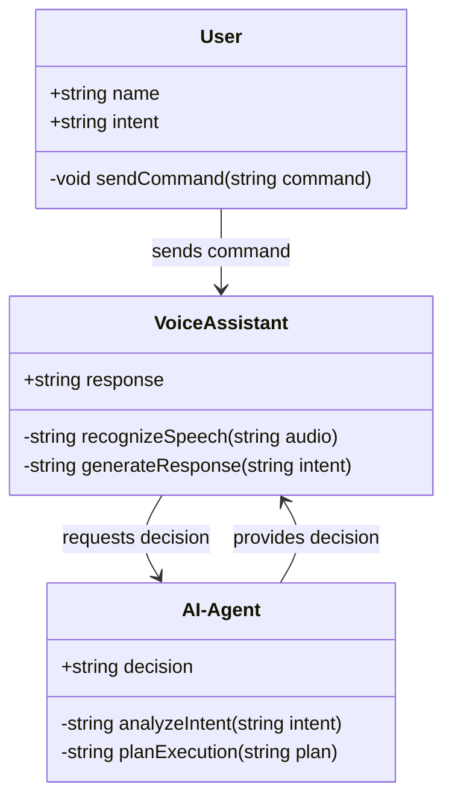
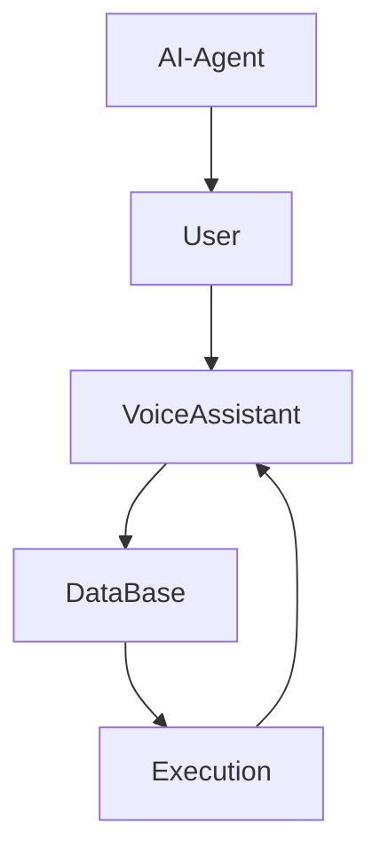
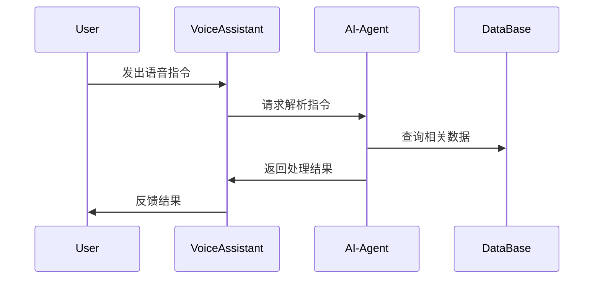

                 

<think>
好的，我将按照您的要求，逐步分析并撰写关于《开发AI Agent支持的智能语音助手》的文章。让我们从背景介绍开始。

---

# 开发AI Agent支持的智能语音助手

## 关键词：AI Agent, 智能语音助手, 语音识别, 自然语言理解, 多智能体协作, 人工智能

## 摘要：
本文详细探讨了AI Agent与智能语音助手的结合与开发。通过分析AI Agent的核心概念、算法原理及系统架构，结合智能语音助手的技术实现，展示了如何通过两者协同实现更智能的语音交互系统。文章从背景介绍、核心概念、算法原理到系统设计、项目实战，最后总结了开发中的注意事项和未来方向，为开发者提供全面的技术指导。

---

## 第1章: AI Agent与智能语音助手的背景介绍

### 1.1 AI Agent的基本概念
#### 1.1.1 什么是AI Agent
AI Agent（人工智能代理）是能够感知环境并采取行动以实现目标的智能体。它可以自主决策、学习和适应新的环境，广泛应用于推荐系统、自动驾驶和机器人等领域。

#### 1.1.2 AI Agent的核心属性与特征
AI Agent具有以下核心属性：
- **自主性**：无需外部干预，自主决策。
- **反应性**：能实时感知环境并做出反应。
- **目标导向性**：所有行动都围绕目标展开。
- **学习能力**：通过数据和经验不断优化性能。

#### 1.1.3 AI Agent的分类与应用场景
AI Agent主要分为基于规则的和基于学习的两种类型。应用场景包括智能推荐、智能家居控制和医疗辅助诊断等。

### 1.2 智能语音助手的发展历程
#### 1.2.1 语音助手的历史演变
语音助手经历了从简单的语音识别到复杂语义理解的演变，早期的产品包括IBM的ViaVoice，而现在以Siri、Alexa为代表。

#### 1.2.2 当前主流语音助手的特点
现代语音助手具备以下特点：
- **实时交互**：支持连续对话。
- **多语言支持**：覆盖多种语言和方言。
- **云端计算**：依赖强大的后端计算能力。

#### 1.2.3 语音助手的市场规模与发展趋势
市场规模持续增长，预计未来几年将保持年均20%以上的增长率，主要得益于5G和AI技术的进步。

### 1.3 AI Agent与智能语音助手的结合
#### 1.3.1 结合的必要性与优势
AI Agent的智能决策能力与语音助手的交互能力结合，可实现更复杂的任务处理。

#### 1.3.2 结合的技术挑战与解决方案
- **技术挑战**：需要解决多智能体协作和实时数据处理的问题。
- **解决方案**：采用分布式计算和边缘计算技术。

#### 1.3.3 结合的未来发展方向
未来的AI Agent支持的语音助手将更加智能化、个性化和场景化。

---

## 第2章: AI Agent与智能语音助手的核心概念与联系

### 2.1 AI Agent的核心原理
#### 2.1.1 知识表示与推理
通过符号逻辑和概率推理，AI Agent能够理解和推理复杂的信息。

#### 2.1.2 行为决策与规划
基于目标，AI Agent通过路径规划和决策树算法选择最优行动方案。

#### 2.1.3 通信与协作机制
通过异构网络和API网关实现不同智能体之间的通信与协作。

### 2.2 智能语音助手的核心原理
#### 2.2.1 语音识别与合成
使用深度学习模型如Transformer进行语音识别和合成，提升准确性和自然度。

#### 2.2.2 自然语言理解与生成
基于预训练模型如BERT和GPT，实现对用户意图的理解和生成自然的回复。

#### 2.2.3 用户意图识别与反馈机制
通过上下文理解和情感分析，准确识别用户的意图并实时反馈。

### 2.3 AI Agent与智能语音助手的关联与区别
#### 2.3.1 核心功能对比分析
| 核心功能 | AI Agent | 智能语音助手 |
|----------|-----------|--------------|
| 交互方式 | 主动或被动 | 主动交互为主 |
| 决策能力 | 强大 | 较弱 |
| 智能水平 | 高 | 中等 |

#### 2.3.2 技术实现上的异同点
AI Agent的决策算法与语音助手的自然语言处理技术在实现上有明显区别，但都依赖于强大的AI算法。

#### 2.3.3 应用场景的互补性与协同性
AI Agent负责制定决策，语音助手负责执行和反馈，两者协同完成复杂任务。

---

## 第3章: AI Agent与智能语音助手的算法原理

### 3.1 AI Agent的算法原理
#### 3.1.1 知识表示与推理
使用逻辑推理和概率推理方法，如一阶逻辑和马尔可夫决策过程。

#### 3.1.2 行为决策与规划
基于DQN算法进行强化学习，实现最优路径规划。

#### 3.1.3 多智能体协作算法
采用分布式多智能体强化学习算法，解决协作中的通信和同步问题。

### 3.2 智能语音助手的算法原理
#### 3.2.1 语音识别算法
采用Transformer模型，通过自注意力机制提升识别准确率。

#### 3.2.2 自然语言理解算法
基于BERT模型，通过预训练和微调实现意图识别。

#### 3.2.3 用户意图识别算法
利用SVM和LSTM进行分类和序列建模，提升识别精度。

### 3.3 算法实现的数学模型与公式
#### 3.3.1 知识表示与推理的数学模型
使用一阶逻辑表示知识，推理过程基于逻辑演算。

#### 3.3.2 行为决策算法的数学推导
DQN算法通过Q-learning更新价值函数：

$$ Q(s, a) \leftarrow Q(s, a) + \alpha \left(r + \gamma \max Q(s', a') - Q(s, a)\right) $$

#### 3.3.3 语音识别的数学公式
Transformer模型的自注意力机制公式：

$$ \text{Attention}(Q, K, V) = \text{softmax}\left(\frac{QK^T}{\sqrt{d_k}}\right)V $$

---

## 第4章: AI Agent与智能语音助手的系统分析与架构设计

### 4.1 问题场景介绍
用户通过语音指令，AI Agent分析并执行任务，如查询信息、控制智能家居设备。

### 4.2 系统功能设计
- **语音输入**：用户发出语音指令。
- **意图识别**：系统分析用户的意图。
- **任务执行**：AI Agent根据意图执行相应任务。
- **反馈输出**：系统返回执行结果。

### 4.3 系统架构设计
#### 4.3.1 领域模型类图


#### 4.3.2 系统架构图


#### 4.3.3 接口设计与交互流程


---

## 第5章: 项目实战——开发AI Agent支持的智能语音助手

### 5.1 环境安装
- **工具安装**：安装Python、TensorFlow、Keras和Flask框架。
- **依赖管理**：使用pip安装所需库。

### 5.2 核心代码实现
#### 5.2.1 语音识别模块
```python
import tensorflow as tf
def speech_to_text(audio):
    model = tf.keras.Model.load_model('model.h5')
    prediction = model.predict(audio)
    return prediction
```

#### 5.2.2 意图识别模块
```python
from transformers import BertTokenizer, TFBertModel
tokenizer = BertTokenizer.from_pretrained('bert-base')
model = TFBertModel.from_pretrained('bert-base')
def get_intent(text):
    inputs = tokenizer(text, return_tensors='tf')
    outputs = model(**inputs)[0]
    return outputs
```

#### 5.2.3 AI Agent决策模块
```python
class AI-Agent:
    def __init__(self):
        self.data = {}
    
    def analyze_intent(self, intent):
        # 分析意图并返回决策
        pass
```

### 5.3 代码应用解读与分析
- **语音识别模块**：使用预训练模型进行语音转文本。
- **意图识别模块**：基于BERT模型进行语义理解。
- **AI Agent决策模块**：根据意图生成决策并执行任务。

### 5.4 实际案例分析
案例：用户说“打开空调”，系统识别意图后，AI Agent发送指令至智能家居系统，执行操作。

### 5.5 项目小结
通过本项目，我们实现了AI Agent与智能语音助手的结合，验证了技术可行性，为后续优化奠定了基础。

---

## 第6章: 开发中的注意事项与最佳实践

### 6.1 注意事项
- **数据隐私**：确保用户数据的安全性。
- **系统稳定性**：保障服务的高可用性。
- **用户体验**：优化交互流程，提升用户体验。

### 6.2 小结
本文详细介绍了AI Agent支持的智能语音助手的开发过程，从理论到实践，为开发者提供了全面的指导。

### 6.3 拓展阅读
建议进一步研究多智能体协作、强化学习和自然语言处理领域的最新进展。

---

## 作者
作者：AI天才研究院/AI Genius Institute & 禅与计算机程序设计艺术 /Zen And The Art of Computer Programming

