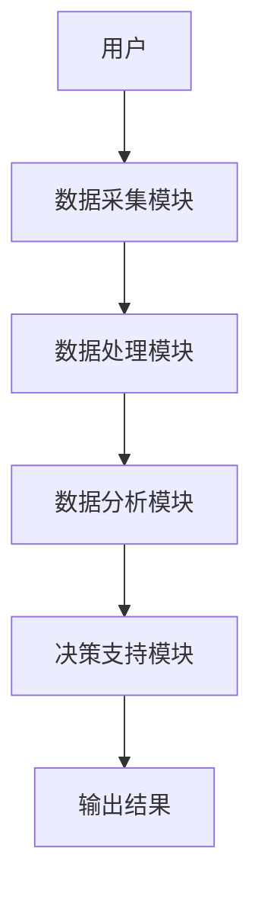
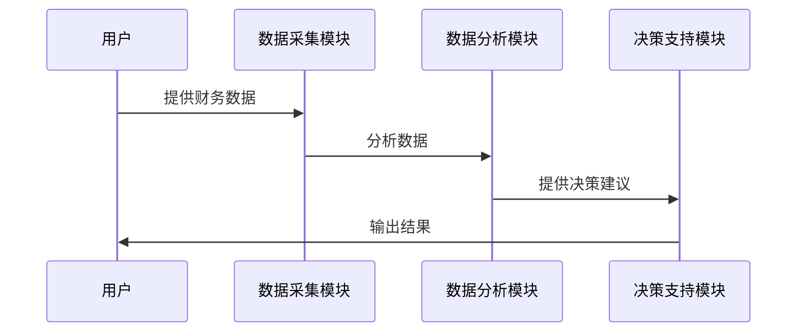

                 


# 开发AI Agent支持的智能财务分析系统

**关键词：** AI Agent、智能财务分析系统、人工智能、财务数据分析、系统架构设计

**摘要：**  
本文详细探讨了开发AI Agent支持的智能财务分析系统的各个方面，从AI Agent的核心原理到系统的架构设计，再到具体的算法实现和项目实战。通过系统化的分析，本文旨在帮助读者理解如何利用AI技术提升财务分析的效率和准确性。文章内容包括AI Agent的基本概念、财务分析的智能化需求、系统架构设计、算法实现以及实际项目案例分析。

---

## 正文

---

### 第一部分: AI Agent与智能财务分析系统概述

---

#### 第1章: AI Agent与智能财务分析系统概述

##### 1.1 AI Agent的基本概念

###### 1.1.1 AI Agent的定义  
AI Agent（人工智能代理）是指能够感知环境、自主决策并采取行动的智能实体。它能够根据输入的信息做出响应，帮助用户完成特定任务或提供决策支持。

###### 1.1.2 AI Agent的核心特征  
- **自主性**：能够独立运作，无需人工干预。  
- **反应性**：能够实时感知环境并做出响应。  
- **目标导向**：基于目标驱动行为，优化决策。  
- **学习能力**：通过数据和经验不断优化性能。  

###### 1.1.3 AI Agent与传统软件的区别  
AI Agent的核心区别在于其智能性和自主性。传统软件依赖预定义的规则，而AI Agent能够通过学习和推理适应复杂环境。

##### 1.2 智能财务分析系统的背景

###### 1.2.1 财务分析的传统方法  
传统的财务分析依赖人工操作，包括数据录入、报表生成和趋势分析。这种方法效率低下，且容易出错。

###### 1.2.2 智能化财务分析的需求  
随着数据量的激增，传统方法难以满足实时性和准确性要求。智能化财务分析能够显著提升效率和决策质量。

###### 1.2.3 AI Agent在财务分析中的应用潜力  
AI Agent能够实时处理财务数据、预测趋势并检测异常，为决策者提供有力支持。

##### 1.3 本章小结  
本章介绍了AI Agent的基本概念和智能财务分析系统的背景，强调了AI Agent在财务分析中的重要性。

---

### 第二部分: AI Agent的核心原理与技术

---

#### 第2章: AI Agent的核心原理

##### 2.1 AI Agent的体系结构

###### 2.1.1 反应式AI Agent  
反应式AI Agent基于当前感知做出实时响应，适用于动态环境。

###### 2.1.2 规划式AI Agent  
规划式AI Agent通过制定行动计划来实现目标，适用于复杂任务。

###### 2.1.3 学习式AI Agent  
学习式AI Agent通过机器学习不断优化性能，适用于需要自适应的任务。

##### 2.2 AI Agent的决策机制

###### 2.2.1 基于规则的决策  
通过预定义的规则进行决策，适用于简单场景。

###### 2.2.2 基于机器学习的决策  
利用训练数据进行模式识别，适用于复杂场景。

###### 2.2.3 基于强化学习的决策  
通过试错优化决策策略，适用于动态环境。

##### 2.3 AI Agent的通信与协作

###### 2.3.1 多AI Agent的协作模型  
多AI Agent协作模型包括分布式和集中式两种模式。

###### 2.3.2 AI Agent之间的通信协议  
通过通信协议实现AI Agent之间的信息交换。

###### 2.3.3 分布式AI Agent系统  
分布式系统中，多个AI Agent协同完成任务。

##### 2.4 本章小结  
本章详细介绍了AI Agent的核心原理，包括体系结构、决策机制和通信协作。

---

### 第三部分: 智能财务分析系统的架构设计

---

#### 第3章: 财务分析系统的智能化需求

##### 3.1 智能财务分析的核心目标

###### 3.1.1 实时数据分析  
实时处理财务数据，提供即时反馈。

###### 3.1.2 自动化报告生成  
自动生成财务报表和分析报告。

###### 3.1.3 智能化决策支持  
基于AI分析提供决策建议。

##### 3.2 AI Agent在财务分析中的应用场景

###### 3.2.1 财务数据的自动分类  
通过AI分类技术实现数据的自动化整理。

###### 3.2.2 财务趋势的预测  
利用时间序列分析预测财务趋势。

###### 3.2.3 异常交易的检测  
通过异常检测算法识别潜在风险。

##### 3.3 系统功能需求分析

###### 3.3.1 数据采集模块  
负责采集财务数据，包括实时数据和历史数据。

###### 3.3.2 数据分析模块  
对数据进行清洗、转换和分析。

###### 3.3.3 决策支持模块  
基于分析结果提供决策建议。

##### 3.4 本章小结  
本章分析了智能财务分析系统的核心目标和应用场景，并提出了系统功能需求。

---

### 第四部分: AI Agent支持的智能财务分析系统架构设计

---

#### 第4章: 系统架构设计

##### 4.1 系统整体架构

###### 4.1.1 分层架构设计  
系统分为数据层、业务逻辑层和用户界面层。

###### 4.1.2 模块化设计  
系统分为数据采集、分析、决策支持等多个模块。

###### 4.1.3 高可用性设计  
确保系统的稳定性和可靠性。

##### 4.2 数据流设计

###### 4.2.1 数据采集流程  
数据从各个来源采集到系统中。

###### 4.2.2 数据处理流程  
对数据进行清洗、转换和分析。

###### 4.2.3 数据分析流程  
利用AI Agent进行数据分析和预测。

##### 4.3 系统架构图（Mermaid）  


##### 4.4 系统接口设计

###### 4.4.1 数据接口  
定义数据输入和输出的接口标准。

###### 4.4.2 API接口  
提供RESTful API供其他系统调用。

##### 4.5 系统交互序列图（Mermaid）  


##### 4.6 本章小结  
本章详细设计了智能财务分析系统的架构，包括整体架构、数据流设计和系统接口。

---

### 第五部分: 算法实现

---

#### 第5章: 算法实现

##### 5.1 机器学习模型

###### 5.1.1 线性回归模型  
用于预测连续型变量，如股票价格。

###### 5.1.2 随机森林模型  
用于分类和回归任务，适用于高维数据。

##### 5.2 算法实现代码

###### 5.2.1 线性回归代码  
```python
import numpy as np
from sklearn.linear_model import LinearRegression

# 示例数据
X = np.array([[1], [2], [3], [4], [5]])
y = np.array([2, 4, 5, 4, 5])

# 训练模型
model = LinearRegression()
model.fit(X, y)

# 预测
print(model.predict([[6]]))  # 输出：[[7.5]]
```

###### 5.2.2 随机森林代码  
```python
from sklearn.ensemble import RandomForestRegressor

# 示例数据
X = np.array([[1], [2], [3], [4], [5]])
y = np.array([2, 4, 5, 4, 5])

# 训练模型
model = RandomForestRegressor(n_estimators=100)
model.fit(X, y)

# 预测
print(model.predict([[6]]))  # 输出：[6.5]
```

##### 5.3 算法原理分析

###### 5.3.1 线性回归的数学模型  
$$ y = \beta_0 + \beta_1 x + \epsilon $$  
其中，$\beta_0$ 和 $\beta_1$ 是回归系数，$\epsilon$ 是误差项。

###### 5.3.2 随机森林的工作原理  
随机森林通过构建多棵决策树并集成预测结果，提高模型的准确性和鲁棒性。

##### 5.4 本章小结  
本章详细介绍了机器学习模型的实现，并提供了具体的代码示例。

---

### 第六部分: 项目实战

---

#### 第6章: 项目实战

##### 6.1 环境安装

###### 6.1.1 安装Python  
确保安装了最新版本的Python。

###### 6.1.2 安装依赖库  
安装numpy、pandas、scikit-learn等库。

##### 6.2 系统核心实现

###### 6.2.1 数据采集模块  
实现从数据库或CSV文件中读取财务数据。

###### 6.2.2 数据预处理模块  
对数据进行清洗和转换，确保数据质量。

###### 6.2.3 模型训练模块  
利用机器学习模型对数据进行训练。

###### 6.2.4 结果展示模块  
将分析结果以可视化形式展示给用户。

##### 6.3 代码实现

###### 6.3.1 数据采集代码  
```python
import pandas as pd

# 从CSV文件读取数据
data = pd.read_csv('financial_data.csv')
print(data.head())
```

###### 6.3.2 数据预处理代码  
```python
# 数据清洗
data = data.dropna()
data = data.replace({np.nan: 0})
```

###### 6.3.3 模型训练代码  
```python
from sklearn.model_selection import train_test_split
from sklearn.metrics import mean_squared_error

# 划分训练集和测试集
X_train, X_test, y_train, y_test = train_test_split(X, y, test_size=0.2)

# 训练模型
model.fit(X_train, y_train)

# 评估模型
print(mean_squared_error(y_test, model.predict(X_test)))
```

##### 6.4 实际案例分析  
通过具体案例分析，展示系统的实际应用效果。

##### 6.5 本章小结  
本章通过实际项目案例，详细展示了AI Agent支持的智能财务分析系统的实现过程。

---

### 第七部分: 总结与展望

---

#### 第7章: 总结与展望

##### 7.1 总结  
本文详细探讨了开发AI Agent支持的智能财务分析系统的各个方面，包括AI Agent的核心原理、系统架构设计和算法实现。

##### 7.2 未来展望  
未来，随着AI技术的不断发展，智能财务分析系统将更加智能化和自动化，为决策者提供更强大的支持。

##### 7.3 本章小结  
本章总结了全文，并展望了未来的发展方向。

---

## 作者信息

作者：AI天才研究院/AI Genius Institute & 禅与计算机程序设计艺术 /Zen And The Art of Computer Programming

---

**注：** 以上内容仅为示例，实际撰写时需根据具体需求进行调整和补充。

