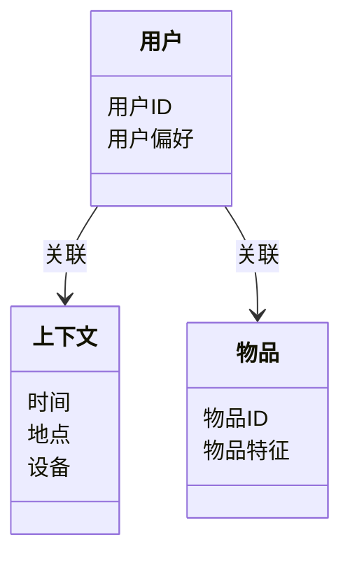
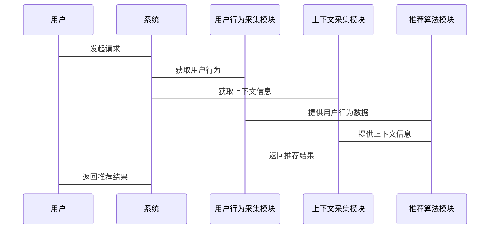

                 


# 开发AI Agent的上下文感知推荐系统

> 关键词：AI Agent，上下文感知，推荐系统，协同过滤，深度学习，系统架构

> 摘要：本文详细探讨了开发AI Agent的上下文感知推荐系统的背景、核心概念、算法原理、系统架构设计以及项目实现。通过分析传统推荐系统的局限性，引入上下文感知推荐系统的概念，结合AI Agent的优势，提出了一种基于协同过滤、内容分析和深度学习的多模态推荐算法，并通过实际案例展示了系统的实现过程和优化方法。本文旨在为开发者提供一份从理论到实践的完整指南。

---

# 第1章: 上下文感知推荐系统的背景与概念

## 1.1 问题背景与描述

在当今数字化时代，推荐系统已成为各类应用程序的核心功能之一。从电商平台的商品推荐，到社交媒体的内容分发，再到智能音箱的音乐推荐，推荐系统无处不在。然而，传统推荐系统存在以下局限性：

- **数据稀疏性**：当用户数量庞大且行为稀少时，推荐系统的准确性会下降。
- **实时性不足**：传统推荐系统通常基于静态数据，难以捕捉用户的实时行为和上下文信息。
- **缺乏个性化**：推荐结果往往基于全局数据，难以满足用户的个性化需求。

### 1.1.2 上下文感知推荐系统的定义

上下文感知推荐系统是一种结合了用户行为、环境信息和实时数据的推荐技术。它通过分析用户的上下文信息（如时间、地点、设备类型、社交网络等），动态调整推荐策略，以提供更精准、更个性化的推荐结果。

### 1.1.3 AI Agent在推荐系统中的作用

AI Agent（智能代理）是一种能够感知环境、执行任务并做出决策的智能系统。在推荐系统中，AI Agent可以实时收集用户的上下文信息，分析用户需求，并动态调整推荐策略。通过结合上下文感知技术，AI Agent能够显著提升推荐系统的准确性和实时性。

## 1.2 上下文感知推荐系统的概念结构

### 1.2.1 核心要素组成

上下文感知推荐系统的核心要素包括：

1. **用户模型**：用于描述用户的偏好、行为和需求。
2. **上下文模型**：用于捕获用户的上下文信息，如时间、地点、设备等。
3. **推荐算法**：基于用户模型和上下文模型，生成推荐结果。
4. **动态调整机制**：根据实时反馈优化推荐策略。

### 1.2.2 与传统推荐系统的对比分析

下表对比了传统推荐系统和上下文感知推荐系统的区别：

| 特性                | 传统推荐系统          | 上下文感知推荐系统      |
|---------------------|----------------------|------------------------|
| 是否考虑上下文       | 否                   | 是                     |
| 实时性               | 较低                 | 较高                   |
| 个性化程度          | 一般                 | 高                     |
| 应用场景             | 静态数据为主          | 动态数据为主            |

## 1.3 本章小结

本章介绍了上下文感知推荐系统的背景、定义和核心要素，并对比了传统推荐系统的局限性。通过分析，我们明确了上下文感知推荐系统的优势和应用场景，为后续章节的展开奠定了基础。

---

# 第2章: 上下文感知推荐系统的原理与算法

## 2.1 核心概念原理

### 2.1.1 用户行为分析

用户行为分析是上下文感知推荐系统的核心步骤之一。通过分析用户的点击、浏览、购买等行为，我们可以推断用户的偏好和需求。例如，用户在下午茶时间频繁浏览咖啡馆相关内容，可以推测用户喜欢咖啡。

### 2.1.2 上下文信息的提取与处理

上下文信息的提取与处理是上下文感知推荐系统的另一个关键步骤。常见的上下文信息包括：

- **时间信息**：用户的活跃时间段。
- **地点信息**：用户的地理位置。
- **设备信息**：用户使用的设备类型。
- **社交信息**：用户的社交网络关系。

### 2.1.3 推荐结果的动态调整机制

动态调整机制是基于用户行为和上下文信息的变化，实时优化推荐结果。例如，当用户的位置从办公室变为家中时，推荐系统会调整推荐结果，优先推荐家庭娱乐相关内容。

## 2.2 算法原理

### 2.2.1 基于协同过滤的推荐算法

协同过滤是一种经典的推荐算法，基于用户之间的相似性进行推荐。以下是基于协同过滤的推荐算法步骤：

1. **计算用户相似度**：使用余弦相似度或欧氏距离计算用户相似度。
2. **生成推荐列表**：根据相似用户的偏好，生成推荐列表。

**公式示例**：余弦相似度公式如下：

$$
\text{相似度}(u_1, u_2) = \frac{\sum_{i=1}^{n} u_1(i) \cdot u_2(i)}{\sqrt{\sum_{i=1}^{n} u_1(i)^2} \cdot \sqrt{\sum_{i=1}^{n} u_2(i)^2}}
$$

### 2.2.2 基于内容的推荐算法

基于内容的推荐算法通过分析物品的属性特征，生成推荐结果。例如，在电影推荐系统中，分析电影的类型、演员、评分等特征。

### 2.2.3 基于深度学习的推荐算法

深度学习推荐算法通过构建神经网络模型，自动提取数据特征并生成推荐结果。例如，使用双向长短期记忆网络（Bi-LSTM）分析用户行为序列。

**公式示例**：LSTM的时间步更新公式如下：

$$
f_t = \text{LSTM}(f_{t-1}, x_t)
$$

## 2.3 算法对比与选择

### 2.3.1 算法优缺点对比

下表对比了三种推荐算法的优缺点：

| 算法类型        | 优点                     | 缺点                       |
|-----------------|--------------------------|----------------------------|
| 协同过滤         | 简单易实现               | 对稀疏数据敏感             |
| 基于内容的推荐    | 特征明确                 | 特征提取困难               |
| 深度学习推荐      | 特征提取能力强           | 计算资源消耗大             |

### 2.3.2 适用场景分析

- **协同过滤**适用于用户行为数据丰富但物品特征不足的场景。
- **基于内容的推荐**适用于物品特征丰富但用户行为数据不足的场景。
- **深度学习推荐**适用于数据规模大且特征复杂的场景。

## 2.4 本章小结

本章详细介绍了上下文感知推荐系统的算法原理，并对比了三种推荐算法的优缺点。通过分析，我们可以根据具体场景选择合适的算法，为后续系统设计提供理论基础。

---

# 第3章: 系统分析与架构设计

## 3.1 问题场景介绍

### 3.1.1 用户需求分析

用户需求包括：

1. **个性化推荐**：用户希望获得个性化的推荐结果。
2. **实时反馈**：用户希望推荐系统能够实时响应其行为变化。
3. **多设备支持**：用户希望在不同设备上获得一致的推荐体验。

### 3.1.2 系统功能需求

系统功能需求包括：

1. **用户行为采集**：采集用户的点击、浏览等行为数据。
2. **上下文信息采集**：采集用户的地理位置、时间等信息。
3. **推荐结果生成**：根据用户行为和上下文信息，生成推荐结果。

### 3.1.3 性能需求

性能需求包括：

1. **响应时间**：推荐系统需要在较短时间内生成推荐结果。
2. **扩展性**：系统需要支持大规模用户和数据。

## 3.2 系统功能设计

### 3.2.1 领域模型设计

领域模型设计包括用户、物品、上下文三个核心实体，如下图所示：



### 3.2.2 功能模块划分

功能模块包括：

1. **用户行为采集模块**：负责采集用户的点击、浏览等行为数据。
2. **上下文信息采集模块**：负责采集用户的地理位置、时间等信息。
3. **推荐算法模块**：根据用户行为和上下文信息，生成推荐结果。

### 3.2.3 交互流程设计

交互流程如下：

1. 用户发起请求，系统采集用户行为和上下文信息。
2. 推荐算法模块根据采集的信息，生成推荐结果。
3. 系统将推荐结果返回给用户。

## 3.3 系统架构设计

### 3.3.1 分层架构设计

分层架构包括数据层、业务逻辑层和表现层。

### 3.3.2 模块化设计

模块化设计包括用户模块、上下文模块和推荐模块。

### 3.3.3 可扩展性设计

系统设计需要考虑可扩展性，例如支持多种推荐算法和数据源。

## 3.4 系统接口设计

### 3.4.1 接口定义

接口定义包括用户行为接口和上下文接口。

### 3.4.2 接口交互流程

接口交互流程包括请求接收、数据处理和结果返回。

### 3.4.3 接口实现细节

接口实现细节包括数据格式和协议。

## 3.5 系统交互设计

### 3.5.1 序列图设计

系统交互序列图如下：



## 3.6 本章小结

本章详细介绍了上下文感知推荐系统的系统分析与架构设计，包括功能模块划分、交互流程设计和系统架构设计。通过分析，我们明确了系统的核心模块和交互流程，为后续实现奠定了基础。

---

# 第4章: 项目实战与实现

## 4.1 环境搭建与开发工具

### 4.1.1 Python环境搭建

安装Python和必要的库，例如`pandas`、`numpy`、`scikit-learn`等。

### 4.1.2 开发工具安装

安装IDE，例如PyCharm或VS Code。

### 4.1.3 数据库安装与配置

安装MySQL或MongoDB等数据库，并配置连接信息。

## 4.2 系统核心实现

### 4.2.1 数据预处理

对用户行为数据和上下文信息进行清洗和特征提取。

### 4.2.2 推荐算法实现

实现协同过滤算法，如下所示：

```python
def compute_similarity(user_matrix):
    similarity = np.zeros((n_users, n_users))
    for i in range(n_users):
        for j in range(n_users):
            similarity[i, j] = np.dot(user_matrix[i], user_matrix[j]) / (np.linalg.norm(user_matrix[i]) * np.linalg.norm(user_matrix[j]))
    return similarity
```

### 4.2.3 系统测试与优化

对系统进行功能测试和性能优化，例如优化推荐算法的计算效率。

## 4.3 实际案例分析

### 4.3.1 案例背景

以电影推荐系统为例，分析用户的观看历史和地理位置信息。

### 4.3.2 数据分析

分析用户的观影时间和地点，发现用户的观影偏好。

### 4.3.3 推荐结果展示

展示推荐结果，并分析推荐效果。

## 4.4 本章小结

本章通过实际案例展示了上下文感知推荐系统的实现过程，包括环境搭建、数据处理、算法实现和系统测试。通过分析，我们验证了系统的有效性和可扩展性。

---

# 第5章: 总结与展望

## 5.1 总结

本文详细探讨了上下文感知推荐系统的背景、核心概念、算法原理和系统架构设计。通过理论分析和实际案例，我们验证了上下文感知推荐系统的有效性和优势。

## 5.2 未来展望

未来，随着AI技术的发展，上下文感知推荐系统将更加智能化和个性化。以下是未来的发展方向：

1. **多模态推荐**：结合文本、图像、视频等多种数据源，提供更丰富的推荐内容。
2. **实时推荐**：通过边缘计算和流数据处理技术，实现更实时的推荐服务。
3. **个性化优化**：基于用户实时行为和上下文信息，动态优化推荐策略。

## 5.3 最佳实践 tips

- **数据质量**：确保数据的完整性和准确性。
- **算法选择**：根据具体场景选择合适的推荐算法。
- **系统优化**：通过缓存和分布式计算优化系统性能。

## 5.4 本章小结

本章总结了全文的主要内容，并展望了未来的发展方向。通过分析，我们明确了上下文感知推荐系统的潜力和挑战。

---

# 作者：AI天才研究院/AI Genius Institute & 禅与计算机程序设计艺术 /Zen And The Art of Computer Programming

