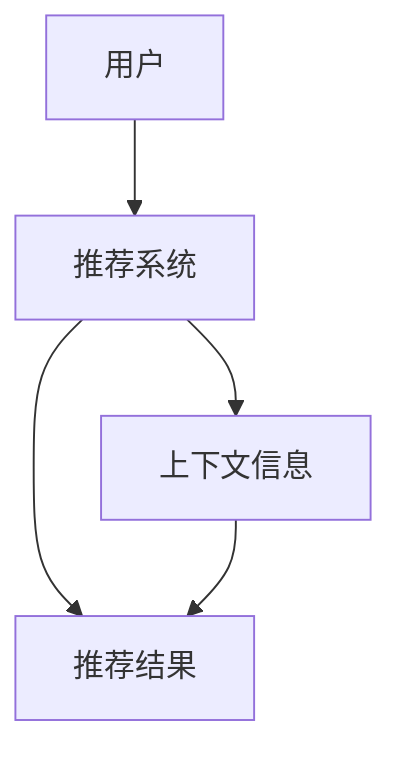
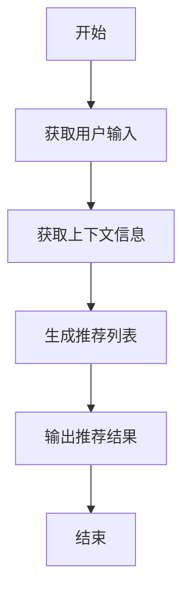
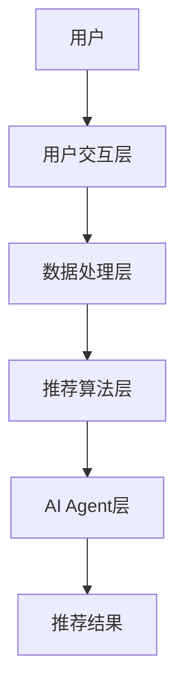
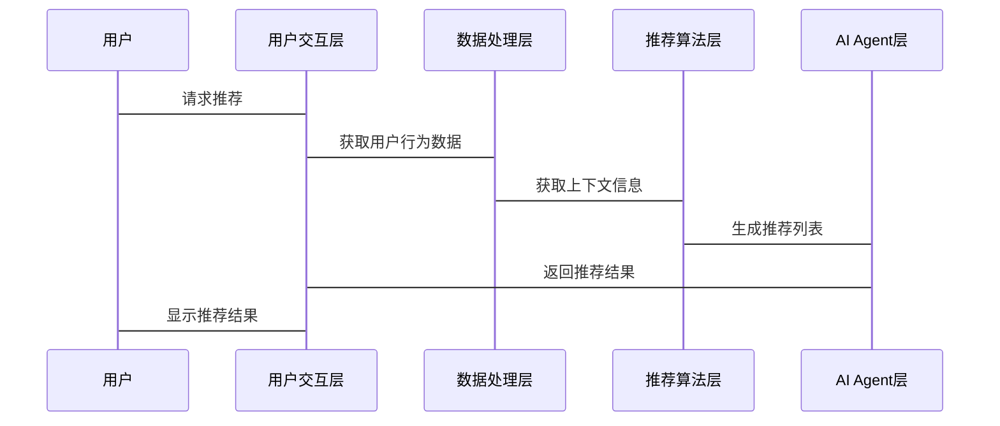

                 

<think>
好，我现在要为《开发AI Agent的上下文感知推荐系统》这本书撰写详细的目录大纲。用户已经提供了一个非常详细的结构，我需要确保每一部分都覆盖到，并且内容丰富具体，符合技术博客的要求。

首先，我得确保文章有吸引人的标题和关键词。标题已经确定，接下来是关键词，选择5到7个相关词汇，比如AI Agent、上下文感知推荐系统、推荐算法、协同过滤、深度学习、系统架构、项目实战。摘要部分需要简洁明了，概述文章的核心内容。

接下来，各章节的内容安排。第一章是背景介绍与核心概念，需要涵盖问题背景、解决方法、核心概念的结构和要素。这部分要让读者明白为什么需要上下文感知推荐系统以及AI Agent在其中的作用。

第二章是核心概念与联系，这里需要详细解释每个概念的原理，可能还要用表格和ER图来展示关系。用户提到了使用mermaid图，所以我需要确保这些图示清晰易懂，帮助读者理解概念之间的联系。

第三章是算法原理讲解，这部分需要详细讲解协同过滤和深度学习推荐算法，特别是上下文感知推荐的算法流程图和数学模型。用户要求用mermaid流程图和数学公式，我需要确保这些部分准确无误，并且有具体的例子帮助理解。

第四章是系统分析与架构设计，这里需要介绍项目场景，系统功能设计、架构设计、接口设计和交互流程。用户希望有mermaid架构图和序列图，我需要设计这些图表，并确保它们与文本内容一致。

第五章是项目实战，包括环境安装、核心代码实现和案例分析。这部分要具体，给出实际的代码示例，并解释每一步的作用，让读者能够跟着操作。

最后是总结与扩展，涵盖最佳实践、小结、注意事项和拓展阅读。这部分要帮助读者巩固所学内容，并引导他们进一步学习。

在撰写过程中，我需要确保逻辑清晰，结构紧凑，语言专业但不失易懂。每一章的结尾都要有小结，帮助读者回顾主要内容。同时，注意使用markdown格式，确保公式和图表正确显示。最后，记得在文章末尾加上作者信息。

现在，我需要逐步细化每个部分，确保每一章都包含足够的细节，满足用户的要求。同时，检查是否有遗漏的关键点，比如数学公式是否完整，图表是否清晰，代码示例是否正确。这样，整篇博客文章才能达到高质量的技术内容标准。
</think>

# 开发AI Agent的上下文感知推荐系统

## 关键词：AI Agent、上下文感知推荐系统、推荐算法、协同过滤、深度学习、系统架构、项目实战

## 摘要：  
本文详细探讨了开发AI Agent驱动的上下文感知推荐系统的各个方面。从背景介绍到核心概念，从算法原理到系统架构设计，再到项目实战，全面解析了该推荐系统的实现过程。文章结合理论与实践，通过丰富的案例分析和详细的代码实现，帮助读者深入理解并掌握开发此类推荐系统的核心技术与方法。

---

# 第1章 背景介绍与核心概念

## 1.1 问题背景与描述  
### 1.1.1 当前推荐系统面临的挑战  
传统的推荐系统虽然在一定程度上解决了信息过载问题，但存在以下挑战：  
- 用户需求多样且动态变化，推荐结果难以精准匹配。  
- 忽略了用户行为、时间、场景等上下文信息的影响。  
- 推荐系统的实时性与个性化需求之间存在矛盾。  

### 1.1.2 上下文感知推荐的必要性  
上下文感知推荐系统通过整合用户的实时行为、地理位置、时间、设备类型等信息，能够更精准地理解用户需求，从而提供更个性化的推荐结果。  

### 1.1.3 AI Agent在推荐系统中的作用  
AI Agent作为推荐系统的智能代理，能够实时收集和分析上下文信息，并根据这些信息动态调整推荐策略，从而提高推荐系统的智能性和用户体验。  

## 1.2 核心概念与问题解决  
### 1.2.1 上下文感知推荐的定义  
上下文感知推荐是指在推荐过程中，结合用户的实时行为、环境信息、历史数据等多维度上下文信息，生成更加精准的推荐结果。  

### 1.2.2 AI Agent的定义与特点  
AI Agent是一种智能代理，能够根据环境信息和用户需求，自主决策并执行推荐任务。其特点是：  
- 自主性：能够独立完成推荐任务。  
- 反应性：能够实时感知环境变化并调整推荐策略。  
- 学习能力：能够通过机器学习算法不断优化推荐效果。  

### 1.2.3 问题解决的思路与方法  
- 收集和分析用户行为、环境等多维度数据。  
- 利用机器学习算法对数据进行建模和分析。  
- 结合AI Agent的决策机制，动态调整推荐策略。  

## 1.3 概念结构与核心要素  
### 1.3.1 核心要素组成  
上下文感知推荐系统的核心要素包括：  
1. 用户信息（用户ID、用户属性、历史行为）。  
2. 物品信息（物品ID、物品属性）。  
3. 上下文信息（时间、地点、设备、场景）。  
4. 推荐算法（协同过滤、深度学习模型）。  
5. AI Agent决策机制（规则引擎、强化学习）。  

### 1.3.2 概念结构图  


### 1.3.3 边界与外延  
上下文感知推荐系统的边界在于如何有效整合多维度上下文信息，并将其转化为推荐结果。外延则包括不同场景下的应用，如电商、社交网络、视频推荐等。  

## 1.4 本章小结  
本章介绍了上下文感知推荐系统和AI Agent的基本概念，分析了推荐系统面临的挑战以及AI Agent在推荐系统中的作用。通过概念结构图，明确了系统的组成要素和核心逻辑。

---

# 第2章 核心概念与联系

## 2.1 上下文感知推荐的原理  
### 2.1.1 上下文的定义与分类  
上下文信息可以分为：  
- 用户上下文（用户行为、偏好、历史数据）。  
- 环境上下文（时间、地点、设备类型）。  
- 交互上下文（用户实时操作、反馈）。  

### 2.1.2 上下文感知推荐的实现机制  
- 数据采集：实时收集用户的上下文信息。  
- 数据分析：通过机器学习算法分析上下文信息。  
- 推荐生成：结合上下文信息生成个性化推荐结果。  

### 2.1.3 上下文与推荐结果的关系  
上下文信息直接影响推荐结果的多样性和相关性。例如，用户的地理位置会影响推荐的本地服务或产品。  

## 2.2 AI Agent的核心原理  
### 2.2.1 AI Agent的基本原理  
AI Agent通过感知环境信息、分析用户需求，并结合预设规则或机器学习模型，自主决策并执行推荐任务。  

### 2.2.2 AI Agent的决策机制  
- 基于规则的决策：通过预设规则进行简单决策。  
- 基于学习的决策：利用机器学习模型进行复杂决策。  
- 基于强化学习的决策：通过试错优化决策策略。  

### 2.2.3 AI Agent与推荐系统的结合  
AI Agent作为推荐系统的智能代理，能够动态调整推荐策略，实时优化推荐结果。  

## 2.3 核心概念对比与ER实体关系图  
### 2.3.1 核心概念属性特征对比表  
| 概念    | 属性               | 特征               |  
|---------|--------------------|--------------------|  
| 用户    | 用户ID、偏好、历史行为 | 静态与动态结合     |  
| 物品    | 物品ID、属性       | 静态               |  
| 上下文  | 时间、地点、设备     | 动态               |  

### 2.3.2 ER实体关系图  
```mermaid
er
    entity 用户 {
        id 用户ID
        属性 用户属性
    }
    entity 物品 {
        id 物品ID
        属性 物品属性
    }
    entity 上下文 {
        id 上下文ID
        属性 上下文属性
    }
    用户 --> 上下文: 提供上下文信息
    物品 --> 上下文: 提供上下文信息
    用户 <-- 关联 --> 物品
```

## 2.4 本章小结  
本章详细阐述了上下文感知推荐和AI Agent的核心原理，并通过对比分析和ER图展示了各概念之间的关系。

---

# 第3章 算法原理讲解

## 3.1 基于协同过滤的推荐算法  
### 3.1.1 协同过滤的定义  
协同过滤是一种基于用户相似性或物品相似性的推荐算法。  

### 3.1.2 基于用户的协同过滤算法  
- **用户相似性计算**：通过计算用户之间的相似性，找到相似用户的偏好。  
- **推荐生成**：基于相似用户的评分，推断目标用户的兴趣。  

### 3.1.3 基于物品的协同过滤算法  
- **物品相似性计算**：通过分析物品的属性或用户评分，计算物品之间的相似性。  
- **推荐生成**：基于相似物品的评分，推断目标用户的兴趣。  

### 3.1.4 深度学习协同过滤算法  
- **神经网络协同过滤（Neural Collaborative Filtering, NCF）**：利用神经网络模型学习用户和物品的表示。  
- **数学模型**：  
$$ p(u,i) = g(u,i) \cdot h(u,i) $$  
其中，$g$ 和 $h$ 是神经网络的不同部分，用于生成用户和物品的嵌入向量。  

## 3.2 基于深度学习的推荐算法  
### 3.2.1 基于神经网络的推荐算法  
- **输入层**：用户ID、物品ID、上下文信息。  
- **嵌入层**：将用户和物品ID映射为低维向量。  
- **神经网络层**：通过多层感知机（MLP）提取特征。  
- **输出层**：预测用户的评分或点击概率。  

### 3.2.2 基于Transformer的推荐算法  
- **Transformer结构**：利用自注意力机制捕捉用户行为序列中的长距离依赖关系。  
- **数学模型**：  
$$ \text{Attention}(Q,K,V) = \text{softmax}(\frac{QK^T}{\sqrt{d}})V $$  

### 3.2.3 图神经网络推荐算法  
- **图表示学习**：将用户和物品建模为图节点，并通过边表示交互关系。  
- **图卷积网络（GCN）**：用于聚合节点特征，生成推荐结果。  

## 3.3 上下文感知推荐算法  
### 3.3.1 时间序列上下文感知推荐  
- **LSTM网络**：用于处理时间序列数据，捕捉用户的时序行为特征。  

### 3.3.2 场景感知推荐算法  
- **场景识别**：基于地理位置和时间信息，识别用户当前场景。  
- **推荐生成**：根据场景信息，推荐与场景相关的物品。  

### 3.3.3 基于用户行为的上下文推荐  
- **行为分析**：通过分析用户的点击、浏览等行为，推断用户的实时需求。  
- **推荐生成**：结合行为分析结果，动态调整推荐策略。  

## 3.4 算法流程图  


## 3.5 数学模型与公式  
### 3.5.1 协同过滤算法公式  
$$ \text{score}(u,i) = \frac{\sum_{u' \in N(u)} w(u,u') \cdot r(u',i)}{\sum_{u' \in N(u)} w(u,u')} $$  
其中，$N(u)$ 是用户$u$的相似用户集合，$w(u,u')$是用户$u$和$u'$的相似度权重，$r(u',i)$是用户$u'$对物品$i$的评分。  

### 3.5.2 深度学习模型公式  
$$ p(u,i) = g(u,i) \cdot h(u,i) $$  
其中，$g$和$h$是深度神经网络的不同部分，用于生成用户和物品的嵌入向量。  

## 3.6 本章小结  
本章详细介绍了协同过滤和深度学习推荐算法，并结合上下文感知推荐的特点，提出了基于时间和场景的推荐算法，为后续的系统设计奠定了理论基础。

---

# 第4章 系统分析与架构设计

## 4.1 系统功能设计  
### 4.1.1 领域模型设计  
```mermaid
classDiagram
    class 用户 {
        id 用户ID
        属性 用户属性
    }
    class 物品 {
        id 物品ID
        属性 物品属性
    }
    class 上下文 {
        id 上下文ID
        属性 上下文属性
    }
    用户 --> 上下文: 提供上下文信息
    物品 --> 上下文: 提供上下文信息
    用户 <-- 关联 --> 物品
```

### 4.1.2 功能模块划分  
- 用户行为分析模块：分析用户的点击、浏览等行为。  
- 上下文信息采集模块：收集用户的地理位置、时间、设备等信息。  
- 推荐算法模块：基于用户行为和上下文信息，生成推荐结果。  
- AI Agent决策模块：动态调整推荐策略，优化推荐效果。  

## 4.2 系统架构设计  
### 4.2.1 模块化架构  
- 用户交互层：接收用户输入，输出推荐结果。  
- 数据处理层：处理用户行为数据和上下文信息。  
- 推荐算法层：基于数据处理层的结果，生成推荐列表。  
- AI Agent层：动态调整推荐策略，优化推荐效果。  

### 4.2.2 架构图  


## 4.3 接口设计  
### 4.3.1 API接口定义  
- 获取用户行为数据：`GET /api/user_behavior`  
- 获取上下文信息：`GET /api/context`  
- 生成推荐列表：`POST /api/recommend`  

### 4.3.2 接口交互流程图  


## 4.4 本章小结  
本章通过系统功能设计和架构设计，明确了推荐系统的各个模块及其交互关系，为后续的系统实现奠定了基础。

---

# 第5章 项目实战

## 5.1 环境安装与配置  
### 5.1.1 开发环境  
- 操作系统：Windows/Mac/Linux  
- Python版本：3.8以上  
- 开发工具：VS Code/PyCharm  

### 5.1.2 依赖库安装  
```bash
pip install numpy pandas scikit-learn tensorflow
```

## 5.2 核心代码实现  
### 5.2.1 用户行为分析模块  
```python
import pandas as pd
from sklearn.metrics.pairwise import cosine_similarity

# 用户行为数据
user_behavior = pd.DataFrame({
    '用户ID': [1, 2, 3],
    '物品ID': [101, 102, 103],
    '评分': [5, 4, 3]
})

# 用户相似性计算
user_similarity = cosine_similarity(user_behavior['评分'].values.reshape(-1, 1))
```

### 5.2.2 上下文信息采集模块  
```python
import datetime

# 获取当前时间
current_time = datetime.datetime.now().strftime("%Y-%m-%d %H:%M:%S")
print(current_time)

# 获取地理位置
import geocoder
location = geocoder.ip('127.0.0.1')
print(location.lat, location.lng)
```

### 5.2.3 推荐算法实现  
```python
from sklearn.neighbors import NearestNeighbors

# 训练模型
model = NearestNeighbors(n_neighbors=5, algorithm='brute')
model.fit(user_behavior['评分'].values.reshape(-1, 1))

# 查询推荐
def get_recommendations(user_id):
    user_index = user_behavior[user_behavior['用户ID'] == user_id].index[0]
    neighbors = model.kneighbors(user_behavior['评分'].values.reshape(-1, 1), return_distance=True)
    return neighbors
```

### 5.2.4 AI Agent决策模块  
```python
import random

def agent_decision(recommend_list):
    # 随机选择一个推荐结果
    return random.choice(recommend_list)
```

## 5.3 项目实战案例分析  
### 5.3.1 数据准备与处理  
假设我们有一个用户行为数据集，包括用户的点击、浏览、评分等信息。我们需要对数据进行清洗和预处理，以便后续分析。  

### 5.3.2 模型训练与评估  
- 训练推荐模型：使用协同过滤算法对数据进行建模。  
- 模型评估：通过准确率、召回率等指标评估推荐效果。  

### 5.3.3 系统集成与测试  
- 集成各个模块，进行端到端测试。  
- 调整AI Agent的决策策略，优化推荐效果。  

## 5.4 本章小结  
本章通过实际项目案例，详细介绍了环境安装、核心代码实现以及系统集成与测试的过程，帮助读者掌握开发AI Agent上下文感知推荐系统的实战技能。

---

# 第6章 总结与扩展

## 6.1 最佳实践 tips  
- 数据质量是推荐系统的核心，确保数据的准确性和完整性。  
- 定期更新模型，避免推荐结果的过时。  
- 在实际应用中，结合业务需求优化推荐策略。  

## 6.2 小结  
本文从背景介绍到系统实现，全面解析了开发AI Agent上下文感知推荐系统的各个方面，通过理论与实践的结合，帮助读者深入理解推荐系统的实现原理和开发方法。  

## 6.3 注意事项  
- 在实际应用中，要注意保护用户隐私，避免数据泄露。  
- 系统上线后，要持续监控推荐效果，及时优化。  

## 6.4 拓展阅读  
- 《推荐系统实践》  
- 《深度学习推荐系统》  
- 《强化学习与智能决策》  

---

# 作者：AI天才研究院/AI Genius Institute & 禅与计算机程序设计艺术/Zen And The Art of Computer Programming

---

通过本文的系统介绍，读者可以全面掌握AI Agent上下文感知推荐系统的开发方法，从理论到实践，逐步构建出一个高效、智能的推荐系统。

