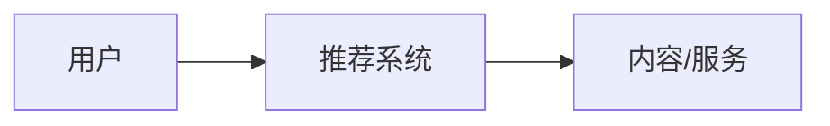
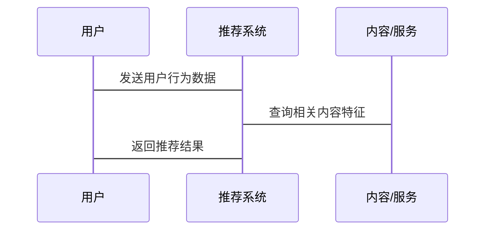

                 


# 开发AI Agent的个性化推荐系统

> 关键词：AI Agent，个性化推荐系统，协同过滤，深度学习，推荐算法

> 摘要：个性化推荐系统是人工智能领域的重要应用之一，而AI Agent作为智能体，在推荐系统中扮演着关键角色。本文将从AI Agent的核心概念出发，详细阐述个性化推荐系统的算法原理、系统架构设计、项目实战以及最佳实践。通过深入分析和具体案例，帮助读者掌握AI Agent驱动的个性化推荐系统的开发方法。

---

# 第一部分: AI Agent与个性化推荐系统概述

## 第1章: 背景介绍与核心概念

### 1.1 问题背景与问题描述

个性化推荐系统的核心目标是通过分析用户行为、偏好和需求，为用户提供高度个性化的推荐内容或服务。在当今数据驱动的时代，个性化推荐已经成为许多应用的核心功能，例如电商推荐、视频推荐、新闻推荐等。

AI Agent（人工智能代理）是一种能够感知环境、自主决策并执行任务的智能体。在推荐系统中，AI Agent可以通过分析用户行为数据、内容特征以及上下文信息，生成更精准的推荐结果。

**问题背景：**
- 用户需求多样化：不同用户有不同的兴趣和偏好，传统的通用推荐系统难以满足个性化需求。
- 数据量庞大：现代推荐系统需要处理海量数据，对计算能力和算法效率提出更高要求。
- 竞争加剧：推荐系统的性能直接影响用户体验和业务转化率，成为企业竞争的关键因素。

**问题描述：**
个性化推荐系统需要解决的核心问题是：如何根据用户的历史行为、实时需求和上下文信息，生成符合用户偏好的推荐结果。AI Agent通过感知和学习能力，能够动态调整推荐策略，提高推荐的准确性和实时性。

### 1.2 核心概念与联系

#### 1.2.1 AI Agent的核心原理
AI Agent的核心原理包括：
1. **感知环境**：通过数据采集和分析，获取用户行为、内容特征等信息。
2. **学习与推理**：利用机器学习算法，分析数据中的模式和关联。
3. **决策与执行**：根据学习结果，生成推荐策略并执行推荐操作。

#### 1.2.2 个性化推荐系统的概念结构
个性化推荐系统的概念结构包括以下核心要素：
1. **用户模型**：描述用户的兴趣、偏好和行为特征。
2. **内容模型**：描述推荐内容的特征和属性。
3. **推荐算法**：用于生成推荐结果的核心算法。
4. **推荐策略**：根据具体场景调整推荐结果的规则和策略。

#### 1.2.3 AI Agent与个性化推荐系统的实体关系图
```mermaid
er
actor(AI Agent, id, name, description)
actor(推荐系统, id, name, description)
actor(用户, id, name, description)
actor(内容/服务, id, name, description)
```

### 1.3 本章小结

本章主要介绍了AI Agent和个性化推荐系统的核心概念和背景。通过分析问题背景和核心概念，我们明确了AI Agent在推荐系统中的重要角色和推荐系统的核心要素。接下来，我们将深入探讨推荐系统的算法原理。

---

## 第2章: AI Agent与个性化推荐系统的算法原理

### 2.1 协同过滤算法

协同过滤是一种基于用户相似性或物品相似性的推荐算法。AI Agent可以通过协同过滤算法，为用户推荐与他们兴趣相似的用户或物品。

#### 2.1.1 基于用户的协同过滤
- **原理**：通过计算用户之间的相似性，将目标用户的推荐结果与相似用户的偏好进行匹配。
- **公式**：
  $$相似度计算公式：sim(i,j) = \frac{\sum_{k} w_{ik}w_{jk}}{\sqrt{\sum_{k}w_{ik}^2} \sqrt{\sum_{k}w_{jk}^2}}$$

#### 2.1.2 基于物品的协同过滤
- **原理**：通过计算物品之间的相似性，将目标用户的推荐结果与相似物品的特征进行匹配。

#### 2.1.3 混合协同过滤
- **优缺点**：混合协同过滤结合了基于用户和基于物品的推荐方法，能够同时考虑用户和内容的特征，但计算复杂度较高。

### 2.2 基于内容的推荐算法

基于内容的推荐算法通过分析推荐内容的特征，生成与用户兴趣匹配的推荐结果。

#### 2.2.1 基于内容特征的推荐
- **原理**：提取推荐内容的特征向量，计算用户偏好与内容特征的相似性。

#### 2.2.2 基于深度学习的内容推荐
- **原理**：利用深度学习模型（如卷积神经网络或循环神经网络）提取内容的高层次特征，生成推荐结果。

### 2.3 基于深度学习的推荐算法

深度学习推荐算法通过神经网络模型，自动学习数据中的复杂模式。

#### 2.3.1 神经网络在推荐系统中的应用
- **原理**：通过神经网络模型对用户行为和内容特征进行建模，生成推荐结果。

#### 2.3.2 Transformer模型在推荐系统中的应用
- **原理**：利用Transformer模型的自注意力机制，捕捉用户行为和内容特征之间的长距离依赖关系。

#### 2.3.3 深度学习推荐模型的优缺点
- **优点**：能够捕捉复杂的数据模式，推荐效果更精准。
- **缺点**：计算复杂度高，需要大量训练数据。

### 2.4 本章小结

本章详细介绍了协同过滤、基于内容的推荐和深度学习推荐算法的原理和优缺点。AI Agent可以通过这些算法，生成更精准的推荐结果。接下来，我们将探讨推荐系统的系统架构设计。

---

## 第3章: 系统分析与架构设计方案

### 3.1 项目背景与需求分析

#### 3.1.1 项目背景介绍
- **项目目标**：开发一个基于AI Agent的个性化推荐系统，为用户提供精准的推荐服务。
- **项目范围**：覆盖电商、视频、新闻等领域。

#### 3.1.2 用户需求分析
- **用户类型**：普通用户、付费用户、VIP用户。
- **用户需求**：个性化推荐、实时推荐、多设备支持。

### 3.2 系统功能设计

#### 3.2.1 领域模型设计
```mermaid
classDiagram
class 用户 {
    id: int
    name: string
    preferences: list
}
class 内容/服务 

```

#### 3.2.2 系统架构设计


### 3.3 系统接口设计

#### 3.3.1 接口定义
- **输入接口**：用户行为数据、内容特征数据。
- **输出接口**：推荐结果、推荐理由。

### 3.4 系统交互流程

#### 3.4.1 交互流程


### 3.5 本章小结

本章详细介绍了推荐系统的系统架构设计和接口设计。通过系统化的架构设计，AI Agent能够更高效地实现个性化推荐功能。接下来，我们将通过项目实战，进一步探讨推荐系统的实现细节。

---

## 第4章: 项目实战

### 4.1 环境配置

#### 4.1.1 技术栈选择
- **编程语言**：Python
- **深度学习框架**：TensorFlow/PyTorch
- **数据存储**：MySQL/Redis

### 4.2 核心代码实现

#### 4.2.1 协同过滤算法实现
```python
def collaborative_filtering(user_id, user_similarity_matrix):
    similar_users = user_similarity_matrix[user_id]
    recommended_items = []
    for user in similar_users:
        recommended_items.extend(users[user]['recommended_items'])
    return recommended_items
```

#### 4.2.2 深度学习模型实现
```python
import tensorflow as tf

model = tf.keras.Sequential([
    tf.keras.layers.Dense(64, activation='relu'),
    tf.keras.layers.Dense(1, activation='sigmoid')
])

model.compile(optimizer='adam', loss='binary_crossentropy', metrics=['accuracy'])
```

### 4.3 实际案例分析

#### 4.3.1 案例背景
- **案例名称**：电商推荐系统
- **案例目标**：为用户提供个性化商品推荐。

#### 4.3.2 数据分析
- **数据来源**：用户行为数据、商品特征数据。
- **数据预处理**：数据清洗、特征提取。

### 4.4 项目总结

通过项目实战，我们详细探讨了推荐系统的实现过程，包括环境配置、算法实现和案例分析。AI Agent在推荐系统中的应用，显著提高了推荐的准确性和实时性。

---

## 第5章: 最佳实践与总结

### 5.1 最佳实践

#### 5.1.1 数据质量
- **数据清洗**：确保数据的完整性和准确性。
- **特征工程**：提取有意义的特征，提升模型性能。

#### 5.1.2 模型选择
- **选择合适的算法**：根据场景选择协同过滤、基于内容的推荐或深度学习推荐。
- **模型调优**：通过参数调整和模型优化，提升推荐效果。

### 5.2 小结

本文从AI Agent的核心概念出发，详细探讨了个性化推荐系统的算法原理、系统架构设计和项目实战。通过理论与实践相结合，帮助读者掌握AI Agent驱动的个性化推荐系统的开发方法。

### 5.3 注意事项

- **数据隐私**：确保用户数据的安全性和隐私性。
- **模型解释性**：提升推荐系统的透明度和可解释性。
- **性能优化**：优化算法和系统架构，提升推荐效率。

### 5.4 拓展阅读

- **推荐系统经典论文**：深入理解推荐系统的理论基础。
- **AI Agent相关书籍**：进一步学习AI Agent的核心技术。

---

# 作者：AI天才研究院/AI Genius Institute & 禅与计算机程序设计艺术 /Zen And The Art of Computer Programming

