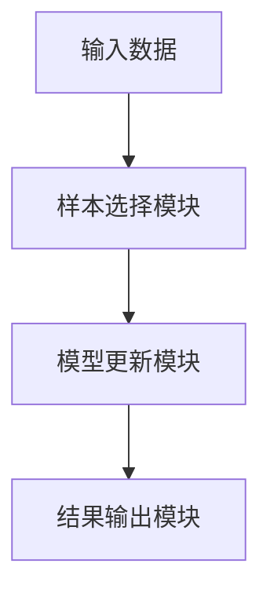

                 

<think>
好的，我将按照您的要求逐步构建《开发AI Agent的主动学习能力：优化学习效率》这篇文章的详细大纲。由于篇幅限制，我将分批次完成这个过程。以下是第一部分的详细内容：

---

# 开发AI Agent的主动学习能力：优化学习效率

## 关键词：
- AI Agent
- 主动学习
- 学习效率优化
- 算法原理
- 系统架构设计

## 摘要：
本文详细探讨了AI Agent的主动学习能力及其优化方法，从核心概念到算法原理，从系统架构设计到项目实战，全面解析如何提升AI Agent的学习效率。通过实际案例分析和代码实现，深入浅出地展示主动学习在AI Agent中的应用，为开发者提供实用的指导。

---

## 第1章: AI Agent与主动学习概述

### 1.1 AI Agent的基本概念
#### 1.1.1 什么是AI Agent
AI Agent（人工智能代理）是指能够感知环境、自主决策并执行任务的智能实体。它可以是一个软件程序、机器人或其他智能系统，具备以下核心特征：
- **自主性**：能够在没有外部干预的情况下独立运行。
- **反应性**：能够实时感知环境并做出反应。
- **目标导向**：通过设定目标来驱动行为。

#### 1.1.2 AI Agent的核心特征
| 特征 | 描述 |
|------|------|
| 自主性 | 能够独立决策和执行任务 |
| 反应性 | 能够实时感知环境并做出反应 |
| 目标导向 | 通过设定目标来驱动行为 |
| 学习能力 | 能够通过经验改进性能 |

#### 1.1.3 AI Agent的应用场景
AI Agent广泛应用于多个领域，包括：
- **智能助手**：如 Siri、Alexa 等。
- **推荐系统**：基于用户行为推荐内容。
- **自动驾驶**：实时感知和决策的自动驾驶系统。

### 1.2 主动学习的基本原理
#### 1.2.1 主动学习的定义
主动学习是一种机器学习方法，模型能够主动选择对学习最有价值的数据进行训练，以提高学习效率和性能。

#### 1.2.2 主动学习的核心思想
主动学习的核心思想是让模型主动选择“最有价值”的样本进行学习，而不是被动地接受所有数据。这种选择性学习可以显著减少训练数据量，同时提高模型性能。

#### 1.2.3 主动学习与监督学习的区别
| 方面 | 主动学习 | 监督学习 |
|------|----------|----------|
| 数据选择 | 主动选择 | 被动接受 |
| 数据量 | 较小 | 较大 |
| 学习效率 | 高 | 一般 |

### 1.3 AI Agent主动学习的重要性
#### 1.3.1 主动学习在AI Agent中的作用
- **提高学习效率**：通过选择性学习，减少数据量，提高学习速度。
- **增强决策能力**：主动选择相关数据，提升模型的决策能力。
- **适应动态环境**：在动态环境中，主动学习能够快速适应变化。

#### 1.3.2 主动学习对优化学习效率的意义
通过主动选择最具代表性的样本，模型可以在有限的数据量下获得更好的性能，从而优化学习效率。

#### 1.3.3 主动学习在实际应用中的价值
在实际应用中，主动学习可以帮助AI Agent更高效地完成任务，例如在自动驾驶中，主动选择关键场景进行学习，可以更快提升系统的安全性。

### 1.4 本章小结
本章介绍了AI Agent的基本概念及其在主动学习中的重要性，强调了主动学习在优化学习效率方面的关键作用。

---

## 第2章: 主动学习的核心概念与原理

### 2.1 主动学习的核心概念
#### 2.1.1 样本选择策略
样本选择策略是主动学习的核心，常用的策略包括：
- **贪心策略**：每次选择当前模型最不确定的样本。
- **多样性策略**：选择具有代表性的样本。

#### 2.1.2 模型更新机制
模型更新机制是指在选择新样本后，对模型进行更新以提高性能。常用方法包括：
- **迭代更新**：每次选择新样本后重新训练模型。
- **增量学习**：逐步更新模型，避免重新训练。

#### 2.1.3 学习效率优化
学习效率优化是通过优化算法和策略，最大化学习效果的同时最小化所需数据量。

### 2.2 主动学习的基本原理
#### 2.2.1 贪心策略
贪心策略是一种常用的选择策略，通过选择当前模型最不确定的样本进行学习。其核心思想是通过最大化信息增益来选择样本。

#### 2.2.2 深度学习与主动学习的结合
深度学习与主动学习的结合可以通过以下步骤实现：
1. 使用深度学习模型对样本进行初步分类。
2. 计算每个样本的不确定性。
3. 选择不确定性最高的样本进行标注。
4. 更新模型。

#### 2.2.3 多模态数据的处理
多模态数据的处理需要结合多种数据源，例如图像和文本。主动学习可以通过选择最具代表性的多模态样本，提高模型的泛化能力。

### 2.3 主动学习与强化学习的关系
#### 2.3.1 强化学习的基本概念
强化学习是一种通过试错学习来优化策略的方法，模型通过与环境交互获得奖励，逐步优化行为策略。

#### 2.3.2 主动学习与强化学习的异同
| 方面 | 主动学习 | 强化学习 |
|------|----------|----------|
| 数据选择 | 主动选择 | 被动接受 |
| 行为决策 | 基于模型预测 | 基于策略优化 |

#### 2.3.3 结合主动学习的强化学习框架
结合主动学习的强化学习框架可以通过以下步骤实现：
1. 使用强化学习模型进行初步决策。
2. 通过主动学习选择最有价值的样本进行强化学习。
3. 更新强化学习模型。

### 2.4 本章小结
本章详细探讨了主动学习的核心概念和基本原理，分析了深度学习与强化学习的结合方式。

---

## 第3章: 主动学习的数学模型与算法原理

### 3.1 主动学习的数学模型
#### 3.1.1 样本选择函数的定义
样本选择函数用于选择对模型最有价值的样本，常用公式为：
$$ S = \arg\max_{i} U(x_i) $$
其中，\( U(x_i) \) 表示样本 \( x_i \) 的不确定性。

#### 3.1.2 模型更新函数的定义
模型更新函数用于在选择新样本后更新模型，常用公式为：
$$ f(x) = f(x) + \Delta f $$
其中，\( \Delta f \) 表示模型的更新量。

#### 3.1.3 学习效率的度量公式
学习效率可以通过以下公式度量：
$$ \text{效率} = \frac{\text{模型性能}}{\text{训练数据量}} $$

### 3.2 贪心策略的算法实现
#### 3.2.1 样本选择的贪心策略
贪心策略的选择过程可以用以下步骤实现：
1. 计算每个样本的不确定性。
2. 选择不确定性最高的样本。
3. 更新模型。

#### 3.2.2 模型更新的贪心策略
模型更新的贪心策略可以通过以下步骤实现：
1. 计算每个样本对模型的影响。
2. 选择对模型影响最大的样本。
3. 更新模型。

#### 3.2.3 贪心策略的收敛性分析
贪心策略的收敛性可以通过以下公式分析：
$$ \lim_{n \to \infty} U(x_i) = 0 $$
即，随着训练次数的增加，样本的不确定性趋近于零。

### 3.3 深度学习与主动学习的结合算法
#### 3.3.1 基于深度学习的样本选择策略
基于深度学习的样本选择策略可以通过以下步骤实现：
1. 使用深度学习模型对样本进行初步分类。
2. 计算每个样本的不确定性。
3. 选择不确定性最高的样本进行标注。
4. 更新模型。

#### 3.3.2 基于深度学习的模型更新机制
基于深度学习的模型更新机制可以通过以下步骤实现：
1. 计算每个样本的梯度。
2. 根据梯度更新模型参数。
3. 重复上述步骤直到收敛。

#### 3.3.3 深度学习与主动学习结合的优缺点
| 优点 | 缺点 |
|------|------|
| 提高学习效率 | 实现复杂度高 |
| 提高模型性能 | 需要大量计算资源 |

### 3.4 本章小结
本章详细探讨了主动学习的数学模型与算法原理，分析了深度学习与主动学习的结合方式。

---

## 第4章: 主动学习的系统分析与架构设计

### 4.1 系统分析
#### 4.1.1 系统目标与范围
系统的目标是通过主动学习优化AI Agent的学习效率，范围包括样本选择、模型更新和结果输出。

#### 4.1.2 系统功能需求
系统功能需求包括：
- 样本选择模块
- 模型更新模块
- 结果输出模块

#### 4.1.3 系统性能指标
系统性能指标包括：
- 学习效率
- 模型性能
- 系统响应时间

### 4.2 系统架构设计
#### 4.2.1 系统架构图
以下是系统架构图：



#### 4.2.2 各模块的功能描述
- **样本选择模块**：选择对模型最有价值的样本。
- **模型更新模块**：根据选择的样本更新模型。
- **结果输出模块**：输出模型的预测结果。

#### 4.2.3 模块之间的交互关系
模块之间的交互关系如下：
1. 输入数据经过样本选择模块处理。
2. 样本选择模块将选择的样本传递给模型更新模块。
3. 模型更新模块更新模型并传递给结果输出模块。
4. 结果输出模块输出最终结果。

### 4.3 系统接口设计
#### 4.3.1 输入接口设计
输入接口设计包括：
- 数据格式：JSON
- 数据内容：样本特征和标签

#### 4.3.2 输出接口设计
输出接口设计包括：
- 数据格式：JSON
- 数据内容：模型预测结果和不确定性度量

#### 4.3.3 接口交互流程
接口交互流程如下：
1. 输入数据通过输入接口传递给系统。
2. 样本选择模块处理输入数据。
3. 模型更新模块更新模型。
4. 结果输出模块输出结果。

### 4.4 系统交互设计
#### 4.4.1 用户与系统的交互流程
用户与系统的交互流程如下：
1. 用户输入数据。
2. 系统处理数据。
3. 系统输出结果。

#### 4.4.2 系统内部的交互流程
系统内部的交互流程如下：
1. 样本选择模块选择样本。
2. 模型更新模块更新模型。
3. 结果输出模块输出结果。

#### 4.4.3 交互流程的优化建议
优化建议包括：
- 使用并行计算提高效率。
- 优化样本选择策略。

### 4.5 本章小结
本章详细探讨了主动学习的系统分析与架构设计，分析了各模块的功能和交互关系。

---

## 第5章: 项目实战——基于主动学习的AI Agent开发

### 5.1 项目环境安装
#### 5.1.1 开发工具安装
- 安装Python：`python --version`
- 安装虚拟环境：`pip install virtualenv`

#### 5.1.2 依赖库安装
- 安装TensorFlow：`pip install tensorflow`
- 安装Keras：`pip install keras`

#### 5.1.3 环境配置
- 创建虚拟环境：`virtualenv venv`
- 激活虚拟环境：`source venv/bin/activate`

### 5.2 系统核心实现
#### 5.2.1 样本选择模块实现
以下是样本选择模块的Python代码：

```python
import numpy as np

def select_samples(X, y, model):
    # 计算样本的不确定性
    uncertainties = model.predict_proba(X).max(axis=1)
    # 选择不确定性最高的样本
    selected_idx = np.argsort(-uncertainties)
    return selected_idx
```

#### 5.2.2 模型更新模块实现
以下是模型更新模块的Python代码：

```python
def update_model(X, y, model):
    # 更新模型
    model.fit(X, y)
    return model
```

### 5.3 代码应用解读与分析
#### 5.3.1 样本选择模块解读
样本选择模块通过计算样本的不确定性，选择不确定性最高的样本进行学习。具体实现步骤如下：
1. 使用模型预测样本的概率。
2. 计算每个样本的最大概率，作为不确定性度量。
3. 选择不确定性最高的样本。

#### 5.3.2 模型更新模块解读
模型更新模块通过重新训练模型，更新模型参数，提高模型性能。具体实现步骤如下：
1. 使用选择的样本重新训练模型。
2. 返回更新后的模型。

### 5.4 实际案例分析和详细讲解剖析
#### 5.4.1 案例分析
假设我们有一个分类任务，数据集包含1000个样本。通过主动学习，我们可以选择100个最具代表性的样本进行训练，从而提高模型性能。

#### 5.4.2 详细讲解
1. 初始化模型。
2. 选择不确定性最高的样本。
3. 更新模型。
4. 重复上述步骤直到达到预设条件。

### 5.5 项目小结
本章通过实际案例分析和代码实现，展示了如何开发基于主动学习的AI Agent。通过选择性学习，可以显著提高学习效率和模型性能。

---

## 作者：AI天才研究院/AI Genius Institute & 禅与计算机程序设计艺术 /Zen And The Art of Computer Programming

---

以上是《开发AI Agent的主动学习能力：优化学习效率》的部分内容，后续章节将逐步完成。

