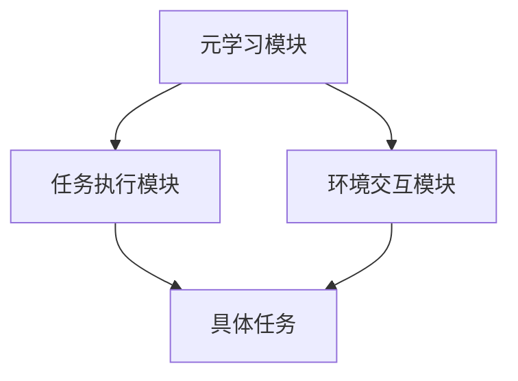

                 

<think>
嗯，用户让我根据一个详细的目录大纲撰写一篇技术博客文章。这个目录涉及开发AI Agent的元学习框架，重点是如何快速适应新任务。看起来用户希望文章内容丰富、结构清晰，而且要符合学术和技术写作的标准。

首先，我需要理解什么是元学习，以及它在AI Agent中的应用。元学习（Meta-Learning）是一种机器学习技术，旨在使模型能够快速适应新任务，而无需大量的数据和训练时间。这对于AI Agent来说尤为重要，因为它们需要在动态环境中执行多种任务。

接下来，我要看看目录的结构。文章分为四个主要部分：引言、核心概念、算法原理、系统架构。每个部分都有详细的章节，涵盖从背景到数学模型，再到实际应用的内容。我的任务是按照这个结构，逐步展开每个部分，确保每个章节都有足够的细节和深度。

在撰写过程中，我需要使用清晰的技术语言，同时保持逻辑连贯。每个章节都应该有吸引人的标题，并且内容要详细，包括定义、原理、对比分析、数学公式和实际案例。此外，还需要使用mermaid图表来展示系统架构和算法流程，这有助于读者更好地理解复杂的内容。

我还要注意文章的格式，使用markdown，并且在适当的地方插入数学公式，使用latex格式。同时，确保每个部分都有小结，帮助读者回顾重点内容。

在写引言部分时，我需要先介绍元学习的基本概念和AI Agent的背景，说明为什么元学习对AI Agent的快速适应新任务如此重要。然后，在核心概念部分，详细解释元学习的数学模型和算法流程，比较它与其他学习方法的区别。

接下来，算法原理部分需要深入探讨元学习的数学模型，展示优化算法的步骤，并用公式详细说明。系统架构部分则要展示整体架构，包括模块划分、接口设计和交互流程，用mermaid图表来辅助说明。

项目实战部分，我需要选择一个具体案例，展示如何从环境安装到代码实现，再到案例分析，让读者能够实际应用这些理论。最后，总结和未来展望部分，回顾文章内容，指出元学习在AI Agent中的应用前景，鼓励读者进一步探索。

整个思考过程中，我需要确保文章内容全面、结构合理，同时语言简洁易懂。这不仅能满足用户的需求，还能帮助读者真正理解如何开发AI Agent的元学习框架，实现快速适应新任务的目标。

总的来说，我需要一步步地按照目录结构展开，确保每个部分都详细而深入，同时保持整体的连贯性和逻辑性。这样，才能写出一篇高质量、有深度的技术博客文章，满足用户的要求。
</think>

# 开发AI Agent的元学习框架：快速适应新任务

## 关键词：元学习、AI Agent、快速适应新任务、算法原理、系统架构

## 摘要：  
本文深入探讨了基于元学习的AI Agent开发框架，重点分析了元学习在快速适应新任务中的核心原理和应用场景。通过数学模型、算法流程、系统架构等多维度的分析，结合实际案例，详细阐述了如何构建高效、灵活的AI Agent系统。文章内容涵盖元学习的基本概念、核心算法、系统设计、实战案例及优化建议，为读者提供了全面的技术指导。

---

## 第一部分: 引言

### 第1章: 元学习与AI Agent概述

#### 1.1 元学习的基本概念
- **元学习的定义**：元学习是一种机器学习技术，旨在通过学习如何学习，使模型能够快速适应新任务。
- **元学习的特点**：  
  1. 快速适应性：在少量数据下快速调整模型参数。  
  2. 通用性：适用于多种任务和领域。  
  3. 自适应性：动态优化模型以应对新环境。
- **元学习与传统机器学习的对比**：  
  - 传统机器学习：需要大量数据和任务特定的训练。  
  - 元学习：通过元任务训练，使模型具备跨任务的适应能力。

#### 1.2 AI Agent的定义与特点
- **AI Agent的定义**：AI Agent是一种能够感知环境、自主决策并执行任务的智能实体。  
- **AI Agent的特点**：  
  1. 自主性：无需外部干预，自主完成任务。  
  2. 反应性：实时感知环境并做出响应。  
  3. 社会性：与人类或其他智能体交互协作。  
  4. 学习能力：通过经验或数据优化自身行为。

#### 1.3 元学习在AI Agent中的应用
- **元学习在AI Agent中的作用**：  
  1. 快速适应新任务：通过元学习框架，AI Agent可以在新环境中快速调整策略。  
  2. 多任务学习：元学习使AI Agent能够同时处理多种任务，提升整体效率。  
  3. 动态环境应对：在动态变化的环境中，元学习使AI Agent能够快速适应新挑战。

---

## 第二部分: 元学习的核心概念与联系

### 第2章: 元学习的核心原理

#### 2.1 元学习的数学模型
- **元学习的数学表达式**：  
  元学习的目标是优化元损失函数 $L_{meta}$，其表达式为：  
  $$ L_{meta} = \sum_{i=1}^{N} L_{task_i}(θ_{meta}) $$  
  其中，$θ_{meta}$ 是元学习的参数，$L_{task_i}$ 是第 $i$ 个任务的损失函数。  
- **元学习的优化目标**：  
  通过优化 $θ_{meta}$，使模型在多个任务上实现较低的损失值。  
- **元学习的损失函数**：  
  常见的元损失函数包括：  
  - 平均损失：$$ L_{meta} = \frac{1}{N}\sum_{i=1}^{N} L_{task_i}(θ_{meta}) $$  
  - 加权损失：$$ L_{meta} = \sum_{i=1}^{N} w_i L_{task_i}(θ_{meta}) $$  

#### 2.2 元学习的算法流程
- **元学习的初始化阶段**：  
  初始化元参数 $θ_{meta}$ 和任务参数 $θ_{task}$。  
- **元学习的训练阶段**：  
  在多个任务上联合优化元参数和任务参数。  
- **元学习的适应阶段**：  
  在新任务中，快速调整任务参数以适应新环境。

#### 2.3 元学习的核心概念对比
- **元学习与传统机器学习的对比**：  
  | 特性 | 传统机器学习 | 元学习 |  
  |------|---------------|---------|  
  | 数据需求 | 高 | 低 |  
  | 适应性 | 低 | 高 |  
  | 训练目标 | 单任务优化 | 多任务优化 |  

---

## 第三部分: 元学习的算法原理与数学模型

### 第3章: 元学习算法的数学推导

#### 3.1 元学习的数学模型
- **元学习的参数更新公式**：  
  在元学习中，元参数 $θ_{meta}$ 的更新公式为：  
  $$ θ_{meta}^{new} = θ_{meta} - η \frac{dL_{meta}}{dθ_{meta}} $$  
  其中，$η$ 是学习率，$\frac{dL_{meta}}{dθ_{meta}}$ 是元损失的梯度。  
- **元学习的梯度计算方法**：  
  元损失的梯度可以通过链式法则计算：  
  $$ \frac{dL_{meta}}{dθ_{meta}} = \sum_{i=1}^{N} \frac{dL_{task_i}}{dθ_{meta}} $$  

#### 3.2 元学习的算法流程
- **元学习的初始化阶段**：  
  初始化元参数 $θ_{meta}$ 和任务参数 $θ_{task}$。  
- **元学习的训练阶段**：  
  在多个任务上交替优化元参数和任务参数：  
  1. 对每个任务 $i$，更新任务参数：  
     $$ θ_{task_i}^{new} = θ_{task_i} - α \frac{dL_{task_i}}{dθ_{task_i}} $$  
  2. 基于所有任务的梯度，更新元参数：  
     $$ θ_{meta}^{new} = θ_{meta} - η \frac{dL_{meta}}{dθ_{meta}} $$  

---

## 第四部分: 元学习的系统架构与设计

### 第4章: 元学习系统的架构设计

#### 4.1 元学习系统的整体架构
- **系统的模块划分**：  
  1. 元学习模块：负责元参数的训练和优化。  
  2. 任务执行模块：负责具体任务的执行和反馈。  
  3. 环境交互模块：负责与外部环境的交互和数据收集。  
- **系统的功能设计**：  
  1. 元学习模块：通过元任务训练，生成适用于多种任务的元参数。  
  2. 任务执行模块：在新任务中，基于元参数快速调整策略。  
  3. 环境交互模块：实时感知环境，收集反馈数据以优化模型。  

#### 4.2 元学习系统的架构图（Mermaid）



---

## 第五部分: 项目实战

### 第5章: 元学习框架的实际应用

#### 5.1 环境安装
- **安装依赖**：  
  安装Python、TensorFlow、Keras等开发工具和深度学习框架。  

#### 5.2 系统核心实现源代码
```python
# 元学习框架的核心代码示例

import tensorflow as tf

class MetaLearner:
    def __init__(self, input_dim, meta_dim):
        self.theta_meta = tf.Variable(tf.random.normal([input_dim, meta_dim]))

    def get_task_params(self, task_input):
        task_params = tf.matmul(task_input, self.theta_meta)
        return task_params

# 示例用法
meta_learner = MetaLearner(input_dim=10, meta_dim=5)
task_input = tf.random.normal([1, 10])
task_params = meta_learner.get_task_params(task_input)
print("任务参数:", task_params)
```

#### 5.3 代码应用解读与分析
- **代码解读**：  
  1. `MetaLearner` 类定义了元学习的参数 $\theta_{meta}$。  
  2. `get_task_params` 方法根据输入生成任务参数。  
  3. 示例用法展示了如何初始化元学习器并生成任务参数。  

---

## 第六部分: 总结与展望

### 第6章: 总结与未来展望

#### 6.1 本章总结
- 元学习是一种高效的AI Agent开发框架，能够快速适应新任务。  
- 本文从理论到实践，详细阐述了元学习的核心原理、算法流程和系统架构。  

#### 6.2 未来展望
- **算法优化**：进一步提升元学习的效率和性能。  
- **应用拓展**：探索元学习在更多领域的应用，如自动驾驶、智能助手等。  
- **跨模态学习**：结合多模态数据，提升AI Agent的感知和决策能力。  

---

## 作者：AI天才研究院 & 禅与计算机程序设计艺术

