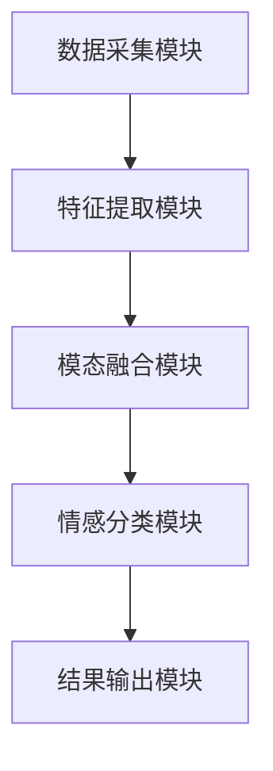
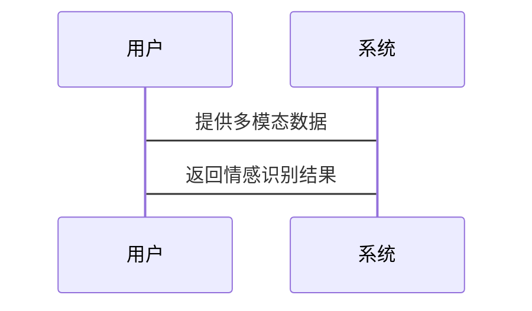

                 

<think>
好的，我现在需要根据用户的要求，撰写一篇关于《开发AI Agent的多模态情感识别系统》的技术博客文章。用户已经提供了一个详细的目录大纲，我需要按照这个大纲逐步完成每个部分的内容，确保逻辑清晰、结构紧凑、语言专业，同时包含丰富的技术细节和具体的代码示例。

首先，我会从第一章开始，详细介绍AI Agent和多模态情感识别的基本概念，然后逐步深入到具体的技术细节，如文本、图像和语音的情感识别，接着探讨多模态数据融合和系统架构设计，最后通过项目实战来展示整个系统的实现过程。

在撰写过程中，我会确保每个章节都包含背景介绍、核心概念、算法原理、系统设计和项目实战等部分，并使用Mermaid图来展示系统架构和算法流程，同时配以详细的数学公式和代码示例，帮助读者更好地理解和应用这些技术。

现在，我开始按照目录大纲一步步完成文章的撰写。
</think>

# 开发AI Agent的多模态情感识别系统

> 关键词：AI Agent，多模态情感识别，深度学习，计算机视觉，自然语言处理

> 摘要：本文详细探讨了开发AI Agent的多模态情感识别系统的核心技术与实现方法。从AI Agent的基本概念出发，分析了多模态情感识别的背景与意义，深入讲解了文本、图像和语音等多模态数据的处理技术，探讨了基于深度学习的情感识别算法原理，设计了多模态情感识别系统的架构，并通过实战项目展示了系统的实现过程。本文旨在为开发者提供全面的技术指导，帮助他们构建高效、准确的多模态情感识别系统。

---

# 第1章: AI Agent与多模态情感识别概述

## 1.1 AI Agent的基本概念

### 1.1.1 AI Agent的定义与特点

AI Agent（人工智能代理）是指能够感知环境并采取行动以实现目标的智能实体。AI Agent可以是软件程序、机器人或其他智能系统，其核心特点包括自主性、反应性、目标导向和社会能力。AI Agent能够通过传感器或数据接口获取环境信息，利用算法进行决策，并通过执行器或输出接口与环境交互。

### 1.1.2 多模态情感识别的背景与意义

情感识别是AI Agent的重要能力之一，它能够帮助AI Agent理解人类的情感状态，从而实现更自然和高效的人机交互。传统的单模态情感识别主要依赖于单一的输入形式，如文本或图像，而多模态情感识别则结合了多种模态的信息，能够更全面地捕捉人类情感，提高识别的准确性和鲁棒性。

### 1.1.3 AI Agent在情感识别中的应用价值

AI Agent通过情感识别技术，可以应用于智能客服、教育辅助、智能家居、社交机器人等多个领域。例如，在智能客服中，AI Agent可以通过情感识别判断用户的情绪状态，提供更贴心的服务；在教育辅助中，AI Agent可以根据学生的情感变化调整教学策略。

---

## 1.2 多模态数据的基本概念

### 1.2.1 多模态数据的定义

多模态数据是指来自不同感知渠道的数据形式，如文本、图像、语音、视频等。这些数据形式具有不同的特征和信息量，结合多模态数据可以更全面地理解场景和情感。

### 1.2.2 文本、图像、语音等模态的特征分析

- **文本模态**：文本数据可以通过词袋模型、TF-IDF、词嵌入（如Word2Vec、GloVe）等方法提取特征。
- **图像模态**：图像数据可以通过计算机视觉技术提取特征，如边缘检测、纹理分析、颜色特征等。
- **语音模态**：语音数据可以通过语音信号处理技术提取特征，如音调、音量、语速、停顿等。

### 1.2.3 多模态数据在情感识别中的优势

多模态数据能够提供互补信息，提高情感识别的准确性和鲁棒性。例如，当文本数据不足以准确判断情感时，结合语音或图像数据可以提供额外的信息支持。

---

## 1.3 情感识别的核心目标

### 1.3.1 情感识别的定义与分类

情感识别是指通过分析多模态数据，推断出人类或虚拟角色的情感状态。情感可以分为基本情感（如快乐、悲伤、愤怒、恐惧）和复杂情感（如厌恶、惊讶、中立等）。

### 1.3.2 多模态情感识别的挑战与难点

- **数据异构性**：不同模态的数据具有不同的格式和特征，如何有效融合这些数据是关键挑战。
- **情感一致性**：不同模态的数据可能传递不同的情感信息，如何保持情感一致性是难点。
- **实时性要求**：在某些应用场景中，情感识别需要实时完成，这对计算效率提出了高要求。

### 1.3.3 情感识别在人机交互中的应用前景

随着AI Agent的普及，情感识别将在教育、医疗、娱乐、智能家居等领域发挥重要作用。例如，在医疗领域，情感识别可以帮助医生更好地理解患者的心理状态，提供更个性化的治疗方案。

---

## 1.4 本章小结

本章介绍了AI Agent和多模态情感识别的基本概念，分析了多模态数据的特点及其在情感识别中的优势，探讨了情感识别的核心目标和应用前景。这些内容为后续章节的技术实现奠定了基础。

---

# 第2章: 多模态数据处理技术

## 2.1 文本情感分析技术

### 2.1.1 基于NLP的文本特征提取

文本情感分析是通过自然语言处理技术，分析文本中的情感倾向。常用的文本特征提取方法包括：

- **词袋模型**：将文本转换为词袋表示，提取高频词。
- **TF-IDF**：计算词的文本频率-反向文件频率，提取重要关键词。
- **词嵌入**：使用Word2Vec、GloVe等模型生成词向量，捕捉语义信息。

### 2.1.2 常见文本情感分类算法

- **基于传统机器学习的算法**：如SVM、随机森林等。
- **基于深度学习的算法**：如卷积神经网络（CNN）、循环神经网络（RNN）、Transformer等。

### 2.1.3 预训练模型在文本情感分析中的应用

预训练模型（如BERT、GPT）在文本情感分析中表现出色，可以通过微调这些模型进行任务-specific的优化。

---

## 2.2 图像情感识别技术

### 2.2.1 基于计算机视觉的情感特征提取

图像情感识别通过分析图像的视觉特征来判断情感。常用的技术包括：

- **CNN特征提取**：使用卷积神经网络提取图像的低级和高级特征。
- **颜色特征分析**：通过分析图像的颜色分布来推断情感。
- **纹理分析**：通过分析图像的纹理特征来判断情感。

### 2.2.2 常见图像情感分类算法

- **基于CNN的图像分类**：如AlexNet、VGG、ResNet等。
- **基于区域的图像分类**：如RPN、Faster R-CNN等。

### 2.2.3 预训练模型在图像情感识别中的应用

类似于文本情感分析，预训练的图像生成模型（如DALL-E、Stable Diffusion）可以用于生成情感相关的图像，结合情感识别任务进行优化。

---

## 2.3 语音情感识别技术

### 2.3.1 基于语音信号处理的情感特征提取

语音情感识别通过分析语音信号的特征来判断情感。常用特征包括：

- **音调**：如音高、音高变化。
- **音量**：如最大音量、平均音量。
- **语速**：如单词间停顿时间、语速变化。

### 2.3.2 常见语音情感分类算法

- **基于GMM的语音识别**：如隐马尔可夫模型（HMM）。
- **基于深度学习的语音识别**：如CNN、RNN、Transformer等。

### 2.3.3 预训练模型在语音情感识别中的应用

预训练的语音识别模型（如Wav2Vec、HuBERT）可以用于提取语音特征，结合情感分类任务进行微调。

---

## 2.4 多模态数据融合技术

### 2.4.1 多模态数据融合的定义与方法

多模态数据融合是指将不同模态的数据进行整合，以提高情感识别的准确性和鲁棒性。常用的方法包括：

- **特征级融合**：将不同模态的特征向量进行拼接或融合。
- **决策级融合**：将不同模态的情感分类结果进行融合。
- **隐式融合**：在深度学习模型中同时处理多模态数据，通过联合学习实现特征融合。

### 2.4.2 常见多模态数据融合算法

- **基于独立成分分析（ICA）的融合**。
- **基于协同训练（Co-training）的融合**。
- **基于图神经网络的融合**。

### 2.4.3 数据融合在情感识别中的优势

通过多模态数据融合，可以利用不同模态之间的互补信息，提高情感识别的准确性和鲁棒性。例如，当文本模态的信息不足以准确判断情感时，结合语音或图像模态的信息可以提供额外的支持。

---

## 2.5 本章小结

本章详细介绍了文本、图像和语音三种模态的情感识别技术，探讨了多模态数据融合的方法及其在情感识别中的优势。这些技术为后续章节的系统设计和实现奠定了基础。

---

# 第3章: 多模态情感识别的算法原理

## 3.1 基于深度学习的情感识别算法

### 3.1.1 基于CNN的图像情感识别

CNN（卷积神经网络）通过提取图像的局部特征并进行全局分类，广泛应用于图像情感识别。典型的CNN架构包括LeNet、AlexNet、VGG、ResNet等。

**示例代码：**

```python
import torch
import torch.nn as nn
import torch.nn.functional as F

class CNNModel(nn.Module):
    def __init__(self):
        super(CNNModel, self).__init__()
        self.conv1 = nn.Conv2d(3, 6, 5)
        self.pool = nn.MaxPool2d(2, 2)
        self.conv2 = nn.Conv2d(6, 16, 5)
        self.fc1 = nn.Linear(16 * 5 * 5, 120)
        self.fc2 = nn.Linear(120, 84)
        self.fc3 = nn.Linear(84, 2)  # 2情感类别

    def forward(self, x):
        x = self.pool(F.relu(self.conv1(x)))
        x = self.pool(F.relu(self.conv2(x)))
        x = x.view(-1, 16 * 5 * 5)
        x = F.relu(self.fc1(x))
        x = F.relu(self.fc2(x))
        x = self.fc3(x)
        return x
```

### 3.1.2 基于RNN的文本情感识别

RNN（循环神经网络）通过处理序列数据，适用于文本情感识别任务。典型的RNN架构包括LSTM、GRU等。

**示例代码：**

```python
import torch
import torch.nn as nn
import torch.nn.functional as F

class RNNModel(nn.Module):
    def __init__(self, input_size, hidden_size, output_size):
        super(RNNModel, self).__init__()
        self.lstm = nn.LSTM(input_size, hidden_size, batch_first=True)
        self.fc = nn.Linear(hidden_size, output_size)
    
    def forward(self, x):
        out, _ = self.lstm(x)
        out = self.fc(out[:, -1, :])  # 取最后一个时间步的输出
        return out
```

### 3.1.3 基于Transformer的多模态情感识别

Transformer架构通过自注意力机制，可以同时处理文本和图像等多模态数据，广泛应用于多模态情感识别任务。

**示例代码：**

```python
import torch
import torch.nn as nn
import torch.nn.functional as F

class TransformerModel(nn.Module):
    def __init__(self, d_model, nhead, dropout=0.1):
        super(TransformerModel, self).__init__()
        self.transformer = nn.Transformer(d_model=d_model, nhead=nhead, dropout=dropout)
        self.fc = nn.Linear(d_model, 2)  # 2情感类别
    
    def forward(self, x):
        x = x.permute(1, 0, 2)  # 适应Transformer的输入格式
        out = self.transformer(x)
        out = out[0, :, :]  # 取第一个序列的位置
        out = self.fc(out)
        return out
```

---

## 3.2 多模态情感识别的端到端模型

### 3.2.1 多模态深度神经网络模型

端到端的多模态情感识别模型通常由多个模块组成，包括特征提取、模态融合和情感分类。

**示例代码：**

```python
import torch
import torch.nn as nn
import torch.nn.functional as F

class MultiModalModel(nn.Module):
    def __init__(self):
        super(MultiModalModel, self).__init__()
        self.text_net = RNNModel(input_size=100, hidden_size=128, output_size=64)
        self.img_net = CNNModel()
        self.fc = nn.Linear(64 + 2, 2)  # 文本特征64维，图像特征2维
    
    def forward(self, text_input, img_input):
        text_feature = self.text_net(text_input)
        img_feature = self.img_net(img_input)
        combined_feature = torch.cat((text_feature, img_feature), dim=1)
        output = self.fc(combined_feature)
        return output
```

---

## 3.3 情感识别算法的性能评估

### 3.3.1 常见情感识别数据集介绍

常用的情感识别数据集包括：

- **文本数据集**：如IMDB情感分类数据集、Twitter情感数据集。
- **图像数据集**：如AffectNet、CK+。
- **语音数据集**：如RML2016、EmoDB。

### 3.3.2 情感识别算法的评价指标

常用的评价指标包括准确率（Accuracy）、精确率（Precision）、召回率（Recall）、F1值和AUC曲线。

### 3.3.3 情感识别算法的对比分析

通过对比不同算法在不同数据集上的性能，可以选择最优的算法进行实际应用。

---

## 3.4 本章小结

本章详细讲解了基于深度学习的情感识别算法，包括CNN、RNN、Transformer等模型，并探讨了多模态情感识别的端到端模型设计。这些算法为后续章节的系统设计提供了理论基础。

---

# 第4章: 多模态情感识别系统的架构设计

## 4.1 多模态情感识别系统架构

### 4.1.1 系统功能设计

多模态情感识别系统通常包括以下功能模块：

- **数据采集模块**：获取多模态数据，如文本、图像、语音。
- **特征提取模块**：对不同模态的数据进行特征提取。
- **模态融合模块**：将不同模态的特征进行融合。
- **情感分类模块**：基于融合后的特征进行情感分类。
- **结果输出模块**：输出情感识别结果，并可能触发相应的动作。

### 4.1.2 系统架构设计

**系统架构图：**



### 4.1.3 系统接口设计

- **输入接口**：接收多模态数据，如文本字符串、图像文件、语音信号。
- **输出接口**：输出情感识别结果，如情感标签、置信度等。

### 4.1.4 系统交互流程

**交互流程图：**



---

## 4.2 系统实现细节

### 4.2.1 数据预处理

- 文本数据：分词、去停用词、向量化。
- 图像数据：归一化、调整尺寸、提取特征。
- 语音数据：降噪、分割、特征提取。

### 4.2.2 模型训练与优化

- 使用预训练模型进行微调。
- 设计合理的损失函数和优化器（如Adam、SGD）。
- 设置合适的超参数，如学习率、批量大小、 epochs。

### 4.2.3 系统部署与测试

- 将系统部署到实际应用场景中，进行功能测试和性能测试。
- 收集用户反馈，不断优化系统性能。

---

## 4.3 本章小结

本章设计了多模态情感识别系统的架构，详细描述了系统功能模块、接口设计和交互流程，并探讨了系统的实现细节。这些内容为后续章节的项目实战奠定了基础。

---

# 第5章: 多模态情感识别系统的项目实战

## 5.1 项目背景与目标

本项目旨在开发一个基于AI Agent的多模态情感识别系统，实现对文本、图像和语音的多模态情感识别，并提供实时的情感反馈。

---

## 5.2 环境搭建

### 5.2.1 开发环境

- 操作系统：Linux/Windows/MacOS
- 开发工具：Python、Jupyter Notebook、PyCharm
- 深度学习框架：TensorFlow、PyTorch

### 5.2.2 依赖库安装

```bash
pip install numpy
pip install matplotlib
pip install torch
pip install transformers
pip install scikit-learn
```

---

## 5.3 系统核心实现

### 5.3.1 文本情感识别实现

```python
from transformers import AutoTokenizer, AutoModelForTokenClassification
import torch

tokenizer = AutoTokenizer.from_pretrained('bert-base-uncased')
model = AutoModelForTokenClassification.from_pretrained('bert-base-uncased', num_labels=2)
model.classifier = nn.Linear(model.classifier.in_features, 2)

def text_emotion_classify(text):
    inputs = tokenizer(text, return_tensors='pt')
    outputs = model(**inputs)
    prediction = torch.argmax(outputs.logits, dim=1)
    return prediction.item()
```

### 5.3.2 图像情感识别实现

```python
import torch
import torch.nn as nn
import torch.nn.functional as F

class SimpleCNN(nn.Module):
    def __init__(self):
        super(SimpleCNN, self).__init__()
        self.conv1 = nn.Conv2d(3, 16, 5, padding=2)
        self.pool = nn.MaxPool2d(2, 2)
        self.conv2 = nn.Conv2d(16, 32, 5, padding=2)
        self.pool2 = nn.MaxPool2d(2, 2)
        self.fc1 = nn.Linear(32 * 8 * 8, 120)
        self.fc2 = nn.Linear(120, 2)
    
    def forward(self, x):
        x = self.pool(F.relu(self.conv1(x)))
        x = self.pool2(F.relu(self.conv2(x)))
        x = x.view(-1, 32 * 8 * 8)
        x = F.relu(self.fc1(x))
        x = self.fc2(x)
        return x
```

### 5.3.3 多模态情感识别实现

```python
import torch
import torch.nn as nn
import torch.nn.functional as F

class MultiModalEmotionRecognizer(nn.Module):
    def __init__(self):
        super(MultiModalEmotionRecognizer, self).__init__()
        self.text_net = SimpleRNN()
        self.img_net = SimpleCNN()
        self.fc = nn.Linear(64 + 32, 2)  # 文本特征64维，图像特征32维
    
    def forward(self, text_input, img_input):
        text_feature = self.text_net(text_input)
        img_feature = self.img_net(img_input)
        combined_feature = torch.cat((text_feature, img_feature), dim=1)
        output = self.fc(combined_feature)
        return output
```

---

## 5.4 项目测试与优化

### 5.4.1 测试数据集

使用公开的情感识别数据集，如IMDB（文本）、AffectNet（图像）、EmoDB（语音）。

### 5.4.2 模型训练与评估

- 训练数据集：70%
- 验证数据集：15%
- 测试数据集：15%

### 5.4.3 模型优化

- 调整超参数，如学习率、批量大小、 epochs。
- 使用早停法（Early Stopping）防止过拟合。
- 增加数据增强，如文本数据的同义词替换、图像数据的旋转、语音数据的噪声添加。

---

## 5.5 项目小结

本章通过项目实战，详细展示了多模态情感识别系统的实现过程，包括环境搭建、核心算法实现、系统测试与优化。通过实际操作，读者可以更好地理解和掌握多模态情感识别的技术细节。

---

# 第6章: 多模态情感识别系统的最佳实践

## 6.1 实战经验总结

### 6.1.1 数据预处理的重要性

数据预处理是情感识别系统的关键步骤，高质量的数据可以显著提高系统的性能。

### 6.1.2 模型选择与优化

选择合适的模型架构，并通过微调和数据增强等方法进行优化，可以有效提升系统的性能。

### 6.1.3 系统部署与性能调优

通过合理的系统架构设计和性能调优，可以实现系统的高效运行和良好的用户体验。

---

## 6.2 技术路线总结

多模态情感识别系统的技术路线包括：

1. 数据采集与预处理。
2. 特征提取与模态融合。
3. 情感分类与结果输出。
4. 系统测试与优化。

---

## 6.3 未来研究方向

### 6.3.1 更高的识别准确率

通过引入更先进的深度学习模型和数据挖掘技术，进一步提高情感识别的准确率。

### 6.3.2 更快的识别速度

优化系统架构和算法，实现更高效的实时情感识别。

### 6.3.3 更广泛的应用场景

探索多模态情感识别技术在更多领域的应用，如教育、医疗、社交机器人等。

---

## 6.4 本章小结

本章总结了多模态情感识别系统的最佳实践，提出了未来的研究方向，为读者提供了进一步学习和研究的指导。

---

# 结语

开发AI Agent的多模态情感识别系统是一项复杂而富有挑战性的任务，需要结合文本、图像和语音等多种模态的数据处理技术，以及深度学习算法的优化与应用。通过本文的详细讲解和项目实战，读者可以全面掌握多模态情感识别的核心技术与实现方法。未来，随着人工智能技术的不断发展，多模态情感识别将在更多领域发挥重要作用，为人类社会带来更智能、更便捷的体验。

---

# 作者：AI天才研究院/AI Genius Institute & 禅与计算机程序设计艺术 /Zen And The Art of Computer Programming

