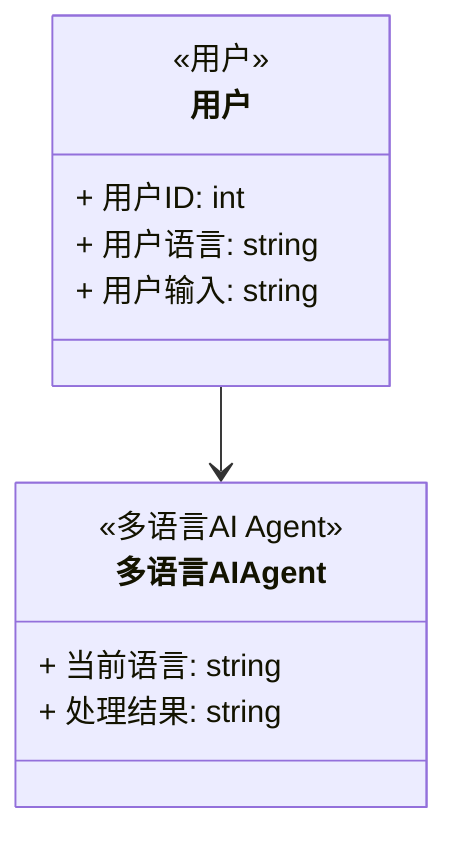

                 

<think>
好，我现在需要帮用户撰写一篇关于《开发AI Agent的多语言切换能力：无缝国际化》的技术博客文章。首先，我要理解用户的需求。他是一位技术专家，希望写出一篇结构清晰、内容详实的技术博客，涵盖多语言AI Agent的各个方面，包括背景、原理、算法、系统设计、实战等。

我得先梳理一下文章的大纲，确保覆盖所有必要的部分。用户已经给出了一个详细的大纲，包括六个主要部分，每个部分下还有多个小节。我需要按照这个大纲来展开写作，同时确保每个部分都有足够的深度和细节。

首先，摘要部分需要简明扼要地概括全文，让用户了解文章的核心内容。然后是关键词，列出5-7个相关术语，方便读者搜索。

接下来是背景介绍，我需要解释为什么多语言切换对AI Agent重要，当前的挑战，以及解决这些问题的方法。这部分要让读者明白问题的背景和重要性。

核心概念与联系部分，我需要用表格和图示来对比不同的概念，帮助读者理解多语言切换的原理和相关技术之间的关系。

算法原理部分，我需要详细讲解多任务学习和迁移学习，使用流程图和代码示例来说明，确保读者能够理解这些算法的工作方式。

系统分析与架构设计部分，我需要描述项目的场景，设计系统的功能，包括领域模型和架构图，展示系统的整体结构。

项目实战部分，我需要提供具体的代码示例，指导读者如何安装环境和实现功能，同时分析实际案例。

最后，最佳实践部分，分享开发中的经验和优化技巧，帮助读者在实际项目中避免常见错误。

在写作过程中，我需要确保使用专业且易懂的技术语言，避免过于复杂的术语，同时保持逻辑清晰，结构紧凑。每个部分都要详细展开，确保读者能够逐步理解并掌握相关知识。

现在，我开始按照大纲逐步撰写每个部分，确保每个章节都包含足够的细节和实例，帮助读者全面掌握开发AI Agent多语言切换能力所需的知识和技能。
</think>

# 开发AI Agent的多语言切换能力：无缝国际化

> 关键词：AI Agent, 多语言切换, 国际化, 自然语言处理, 机器学习, 多语言模型

> 摘要：本文详细探讨了开发具备多语言切换能力的AI Agent的关键技术，包括背景分析、核心概念、算法原理、系统设计、项目实战以及优化建议，旨在帮助读者掌握实现无缝国际化的技术细节和实践方法。

---

## 第一部分: 背景介绍

### 第1章: 问题背景

#### 1.1 多语言AI Agent的需求
随着全球化进程的加速，AI Agent需要能够处理多种语言，以满足全球用户的需求。用户可能需要与AI Agent进行跨语言交互，例如在多语言环境中提供客服支持或信息查询。

#### 1.2 当前AI Agent的局限性
现有的AI Agent往往只能处理单一语言，无法在不同语言间无缝切换。这种限制使得AI Agent的应用场景受到极大限制，尤其是在国际化市场中。

#### 1.3 多语言切换的必要性
为了满足全球用户的需求，提升用户体验，AI Agent必须具备多语言切换能力。这不仅是技术上的挑战，也是市场扩展的必然要求。

### 第2章: 问题描述

#### 2.1 多语言切换的核心问题
AI Agent需要能够理解输入语言，并输出对应语言的结果。这涉及到语言识别、语言切换机制以及跨语言处理能力。

#### 2.2 AI Agent在多语言环境中的挑战
跨语言数据处理、模型训练和推理的复杂性，以及多语言环境下的语境理解等问题，都是开发多语言AI Agent的主要挑战。

#### 2.3 用户需求与技术实现的差距
用户期望AI Agent能够无缝切换语言，而当前技术在多语言处理上的准确性和实时性仍有不足。

### 第3章: 问题解决

#### 3.1 多语言切换的技术路径
通过多语言模型训练、语言识别技术和动态切换机制，解决AI Agent的多语言处理问题。

#### 3.2 基于AI的多语言处理方法
利用自然语言处理技术，结合多语言模型，实现AI Agent的多语言交互能力。

#### 3.3 解决方案的可行性分析
通过现有的技术手段，多语言AI Agent的实现是可行的，但仍需解决模型训练和优化的问题。

### 第4章: 边界与外延

#### 4.1 多语言切换的边界条件
定义AI Agent支持的语言种类、处理任务的范围以及切换的触发条件。

#### 4.2 相关技术的外延影响
分析多语言处理对其他技术领域的影响，如跨语言信息检索和机器翻译。

#### 4.3 解决方案的适用范围
明确多语言AI Agent的适用场景，如客服、教育和电子商务等领域。

### 第5章: 概念结构与核心要素

#### 5.1 多语言切换的核心概念
包括语言识别、多语言模型、语言切换机制等关键概念。

#### 5.2 相关技术的关联性
分析多语言处理与其他技术如机器翻译和语音识别的关系。

#### 5.3 系统架构的核心要素
包括数据输入、语言识别、模型处理、结果输出和用户反馈等核心组件。

---

## 第二部分: 核心概念与联系

### 第6章: 核心概念

#### 6.1 多语言切换的原理
通过语言识别确定输入语言，调用相应的语言模型进行处理，并将结果转换为目标语言。

#### 6.2 多语言模型的基本原理
多语言模型通过共享跨语言特征，同时学习多种语言的语法和语义，实现对多种语言的理解和生成。

#### 6.3 AI Agent的多语言处理机制
AI Agent通过语言识别模块确定输入语言，选择对应的模型进行处理，并输出结果。

### 第7章: 概念对比

#### 7.1 语言模型的属性特征对比
| 概念 | 输入 | 输出 | 处理方式 |
|------|------|------|----------|
| 单语言模型 | 单一语言文本 | 相关任务输出 | 单一语言处理 |
| 多语言模型 | 多种语言文本 | 统一任务输出 | 跨语言处理 |

#### 7.2 实体关系图


---

## 第三部分: 算法原理

### 第8章: 多语言切换算法

#### 8.1 多任务学习
通过共享特征和任务，同时训练多种语言的任务模型。


#### 8.2 迁移学习
利用一种语言的预训练模型，迁移到其他语言任务中。

### 第9章: 算法实现

#### 9.1 算法步骤
1. 数据预处理：整理多语言数据集。
2. 模型训练：使用多任务学习或迁移学习训练多语言模型。
3. 语言识别：确定输入语言。
4. 多语言处理：调用相应语言模型处理任务。
5. 结果转换：将结果转换为目标语言。

#### 9.2 代码示例
```python
def transfer_learning(source_lang, target_lang):
    # 加载预训练模型
    model = load_pretrained_model(source_lang)
    # 迁移学习训练
    model.fine_tune(target_lang)
    return model
```

---

## 第四部分: 系统分析与架构设计

### 第10章: 项目场景介绍

#### 10.1 项目背景
开发一个多语言AI Agent，支持多种语言的交互和任务处理。

#### 10.2 项目目标
实现AI Agent的多语言切换能力，提升用户体验。

### 第11章: 系统功能设计

#### 11.1 领域模型


#### 11.2 系统架构


---

## 第五部分: 项目实战

### 第12章: 环境安装

#### 12.1 安装Python和相关库
安装Python和如TensorFlow、PyTorch等深度学习框架。

### 第13章: 核心功能实现

#### 13.1 多语言模型训练
训练一个多语言模型，支持多种语言的处理。

#### 13.2 语言识别实现
通过语言检测库确定输入语言。

### 第14章: 代码实现

#### 14.1 语言识别代码
```python
from langdetect import detect

def detect_language(text):
    return detect(text)
```

#### 14.2 多语言处理代码
```python
def process_text(text, language):
    model = get_model(language)
    return model.process(text)
```

---

## 第六部分: 最佳实践与优化

### 第15章: 开发经验分享

#### 15.1 性能优化
通过模型压缩和量化技术，提升多语言模型的处理效率。

### 第16章: 测试策略

#### 16.1 测试方法
采用单元测试、集成测试和用户测试等多种方法，确保多语言处理的准确性。

### 第17章: 小结

#### 17.1 开发总结
开发多语言AI Agent是一个复杂但可行的任务，需要综合运用多种技术手段。

---

## 作者：AI天才研究院/AI Genius Institute & 禅与计算机程序设计艺术 /Zen And The Art of Computer Programming

---

通过以上详细的内容，您可以逐步了解和掌握开发AI Agent的多语言切换能力所需的技术和方法。

