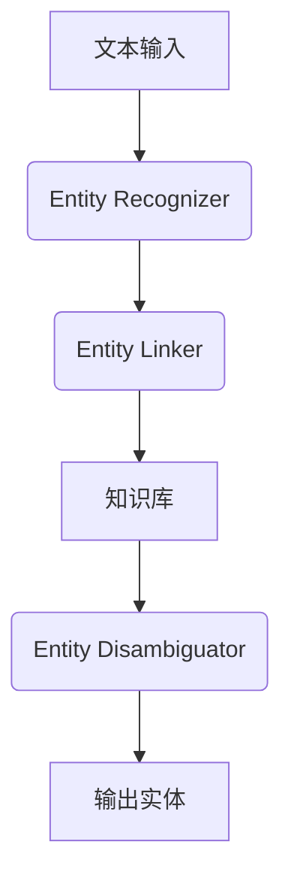
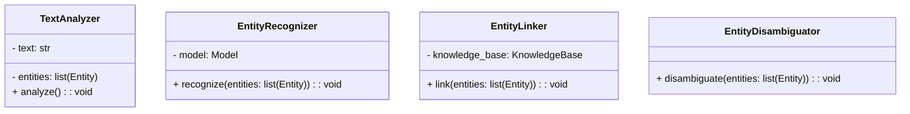
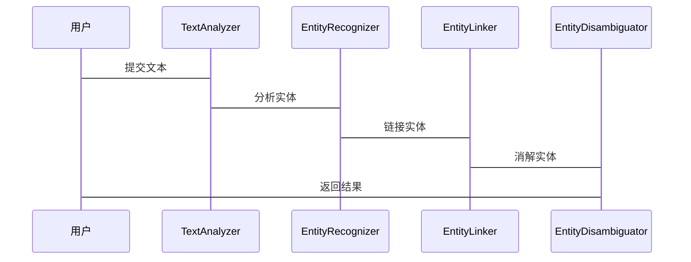

                 


# 开发AI Agent的多语言实体链接系统

> 关键词：AI Agent，多语言实体链接，自然语言处理，实体识别，跨语言理解

> 摘要：  
本文详细探讨了开发AI Agent的多语言实体链接系统的背景、核心概念、算法原理、系统架构及其实现过程。通过分析多语言实体链接的挑战，结合具体的算法实现和系统设计，本文为读者提供了一个从理论到实践的完整指南。从问题背景到解决方案，从算法选择到系统实现，从项目实战到最佳实践，本文为AI Agent的多语言实体链接系统开发提供了全面的技术支持和实践指导。

---

# 第一部分: AI Agent与多语言实体链接系统背景介绍

## 第1章: 问题背景与描述

### 1.1 多语言实体链接的挑战

#### 1.1.1 实体链接的基本概念  
实体链接（Entity Linking）是自然语言处理（NLP）中的一个重要任务，旨在将文本中的实体（如人名、地名、组织名等）映射到知识库中的标准实体。在单语言环境下，实体链接相对简单，但在多语言环境下，由于不同语言之间的词汇差异和文化背景差异，实体链接的难度显著增加。

#### 1.1.2 多语言环境下的实体链接问题  
在多语言环境下，实体链接需要处理以下挑战：  
1. **语言差异**：不同语言中相同的实体可能有不同的名称或拼写。  
2. **文化差异**：某些实体在一种语言中的含义可能与另一种语言不同。  
3. **数据稀疏性**：某些语言的实体数据可能较少，导致链接准确率下降。  

#### 1.1.3 实体链接在AI Agent中的重要性  
AI Agent需要能够理解和处理多语言文本，以便为用户提供跨语言的智能服务。实体链接是实现这一目标的关键技术之一。例如，在跨语言对话系统中，AI Agent需要能够识别并链接不同语言中的实体，以便准确理解用户意图并提供相应的服务。

### 1.2 问题描述与边界

#### 1.2.1 实体链接的定义与目标  
实体链接的目标是将文本中的实体映射到知识库中的标准实体。在多语言环境下，实体链接需要支持多种语言，并能够处理不同语言之间的实体映射关系。

#### 1.2.2 多语言实体链接的复杂性  
多语言实体链接的复杂性主要体现在以下方面：  
1. **跨语言实体映射**：需要建立不同语言实体之间的映射关系。  
2. **多语言知识库的构建**：需要构建支持多种语言的大型知识库。  
3. **实体消解的准确性**：在多语言环境下，实体消解的准确性可能受到语言差异的影响。  

#### 1.2.3 系统的边界与外延  
本系统的目标是开发一个多语言实体链接系统，支持多种语言的实体识别、链接和消解。系统的边界包括：  
1. **输入**：多语言文本数据。  
2. **输出**：文本中的实体及其对应的知识库实体。  
3. **依赖**：需要依赖多语言词典或知识库（如WordNet、Wikidata等）。  

### 1.3 核心概念与组成要素

#### 1.3.1 实体识别与链接的基本要素  
实体识别（NER，Named Entity Recognition）是实体链接的基础，需要准确识别文本中的实体。实体链接则需要将识别出的实体映射到知识库中的标准实体。

#### 1.3.2 多语言环境下的实体表示  
在多语言环境下，实体表示需要支持多种语言，并能够处理不同语言之间的实体关系。例如，中文中的“美国”对应英文中的“United States”。

#### 1.3.3 AI Agent中的实体链接流程  
AI Agent的实体链接流程通常包括以下步骤：  
1. **文本输入**：接收多语言文本。  
2. **实体识别**：识别文本中的实体。  
3. **实体链接**：将识别出的实体映射到知识库中的标准实体。  
4. **实体消解**：处理实体的模糊性，确保实体链接的准确性。  

---

## 第2章: 多语言实体链接的核心概念与联系

### 2.1 实体链接的基本原理

#### 2.1.1 实体识别的原理  
实体识别通常基于统计模型（如CRF）或深度学习模型（如BERT）。在多语言环境下，需要使用支持多语言的模型或对齐不同语言的模型。

#### 2.1.2 实体链接的实现机制  
实体链接的核心是将识别出的实体与知识库中的实体进行匹配。匹配过程通常基于实体名称的相似性或语义相似性。

#### 2.1.3 实体消解的流程  
实体消解的目标是消除实体的模糊性。例如，“Apple”可以指苹果公司或苹果（水果）。在多语言环境下，需要结合上下文和跨语言知识来确定实体的具体指代。

### 2.2 多语言实体链接的特征对比

#### 2.2.1 不同语言下的实体表示差异  
不同语言中，实体的表示可能不同。例如，“中国”在中文中是“中国”，在英文中是“China”。

#### 2.2.2 跨语言实体链接的挑战  
跨语言实体链接需要处理语言差异和文化差异，这增加了实体链接的复杂性。

#### 2.2.3 实体链接算法的可扩展性  
实体链接算法的可扩展性是多语言实体链接系统的重要特征。支持多种语言的算法通常具有更强的可扩展性。

### 2.3 实体关系图与系统架构

#### 2.3.1 实体关系的ER图  
以下是实体关系的ER图：

```mermaid
er
    entity {
        id: string;
        name: string;
        type: string;
    }
    
    document {
        id: string;
        content: string;
        entities: entity[];
    }
```

#### 2.3.2 系统架构的Mermaid流程图  
以下是系统架构的Mermaid流程图：



#### 2.3.3 实体关系的动态变化  
实体关系在不同语言环境下可能动态变化。例如，中文中的“公司”可能对应英文中的“Company”，但在特定上下文中可能指代具体的公司名称。

---

# 第二部分: 多语言实体链接算法原理

## 第3章: 命名实体识别算法

### 3.1 基于规则的NER算法

#### 3.1.1 规则的制定与优化  
基于规则的NER算法通过预定义的规则来识别实体。例如，可以使用正则表达式来匹配电话号码或电子邮件地址。

#### 3.1.2 规则匹配的实现流程  
以下是基于规则的NER算法的实现流程：

1. **规则定义**：定义实体识别规则，例如正则表达式。  
2. **文本匹配**：使用正则表达式匹配文本中的实体。  
3. **结果输出**：输出匹配到的实体。

#### 3.1.3 规则匹配的优缺点分析  
优点：规则简单，易于理解。缺点：难以处理复杂实体，规则容易遗漏特殊情况。

### 3.2 基于统计的NER算法

#### 3.2.1 统计模型的基本原理  
基于统计的NER算法通常使用条件随机场（CRF）模型。CRF模型通过考虑上下文信息来预测实体标签。

#### 3.2.2 基于CRF的NER实现  
以下是基于CRF的NER实现的Python代码示例：

```python
import numpy as np
from sklearn.feature_extraction import DictVectorizer
from sklearn.metrics import accuracy_score
from sklearn.model_selection import train_test_split
from sklearn_crfsuite import CRF
from sklearn_crfsuite.utils import make_splitter

# 示例数据
data = [
    ('John', 'PER'),
    ('works', 'O'),
    ('at', 'O'),
    ('Google', 'ORG'),
]

# 特征提取
def word2features(doc, i):
    word = doc[i][0]
    return {
        'word': word,
        'word.istitle()': word.istitle(),
    }

X = [word2features(doc, i) for doc in data for i in range(len(doc))]
y = [label for doc in data for label in doc[1]]

# 划分训练集和测试集
X_train, X_test, y_train, y_test = train_test_split(X, y, test_size=0.2, random_state=42)

# 模型训练
crf = CRF(
    states=['PER', 'ORG', 'O'],
    features=make_splitter(),
    max_iterations=100,
    c1=0.1,
    c2=0.1,
)
crf.fit(X_train, y_train)

# 模型预测
y_pred = crf.predict(X_test)
```

#### 3.2.3 基于统计的NER算法的数学模型  
以下是CRF模型的数学公式：

$$
P(y_i | x_i, y_{i-1}) = \frac{\exp(f(y_i, y_{i-1}))}{\sum_{y_i'} \exp(f(y_i', y_{i-1})))}
$$

其中，$f(y_i, y_{i-1})$ 是特征函数的值。

---

## 第4章: 跨语言实体链接算法

### 4.1 基于相似性度量的跨语言实体链接

#### 4.1.1 实体表示的向量空间模型  
以下是基于向量空间模型的跨语言实体链接算法：

$$
similarity(s, t) = \frac{s \cdot t}{\|s\| \|t\|}
$$

其中，$s$ 和 $t$ 分别是两种语言中实体的向量表示。

#### 4.1.2 跨语言实体链接的实现流程  
1. **实体表示**：将不同语言的实体表示为向量。  
2. **相似性计算**：计算不同语言实体之间的相似性。  
3. **实体链接**：基于相似性将实体链接到知识库中的标准实体。

### 4.2 基于深度学习的跨语言实体链接

#### 4.2.1 基于BERT的跨语言实体链接  
以下是基于BERT的跨语言实体链接算法：

```python
import torch
from transformers import BertModel, BertTokenizer

# 加载预训练模型
model = BertModel.from_pretrained('bert-base-multilingual-cased')
tokenizer = BertTokenizer.from_pretrained('bert-base-multilingual-cased')

# 示例文本
text = "John works at Google."

# 分词
inputs = tokenizer(text, return_tensors='pt')
with torch.no_grad():
    outputs = model(**inputs)
```

#### 4.2.2 深度学习模型的数学模型  
以下是BERT模型的数学模型：

$$
H_i = A E_i + B H_{i-1}
$$

其中，$H_i$ 是第i层的隐藏层输出，$E_i$ 是输入向量，$A$ 和 $B$ 是模型参数。

---

# 第三部分: 多语言实体链接系统架构设计

## 第5章: 系统分析与架构设计方案

### 5.1 问题场景介绍

#### 5.1.1 系统目标  
本系统的目标是开发一个多语言实体链接系统，支持多种语言的实体识别、链接和消解。

#### 5.1.2 项目介绍  
本项目旨在实现一个多语言实体链接系统，支持多种语言的实体识别和链接。

### 5.2 系统功能设计

#### 5.2.1 领域模型Mermaid类图  
以下是领域模型的Mermaid类图：



### 5.3 系统架构设计

#### 5.3.1 系统架构Mermaid架构图  
以下是系统架构的Mermaid架构图：


#### 5.3.2 系统接口设计  
系统接口包括文本输入接口、实体识别接口、实体链接接口和实体消解接口。

#### 5.3.3 系统交互Mermaid序列图  
以下是系统交互的Mermaid序列图：



---

## 第6章: 项目实战

### 6.1 环境安装

#### 6.1.1 安装Python环境  
使用Python 3.8及以上版本。

#### 6.1.2 安装依赖库  
安装以下依赖库：

```bash
pip install numpy scikit-learn sklearn-crfsuite transformers
```

### 6.2 系统核心实现

#### 6.2.1 实体识别代码实现  
以下是实体识别的Python代码实现：

```python
import numpy as np
from sklearn.feature_extraction import DictVectorizer
from sklearn.metrics import accuracy_score
from sklearn.model_selection import train_test_split
from sklearn_crfsuite import CRF
from sklearn_crfsuite.utils import make_splitter

# 示例数据
data = [
    ('John', 'PER'),
    ('works', 'O'),
    ('at', 'O'),
    ('Google', 'ORG'),
]

# 特征提取
def word2features(doc, i):
    word = doc[i][0]
    return {
        'word': word,
        'word.istitle()': word.istitle(),
    }

X = [word2features(doc, i) for doc in data for i in range(len(doc))]
y = [label for doc in data for label in doc[1]]

# 划分训练集和测试集
X_train, X_test, y_train, y_test = train_test_split(X, y, test_size=0.2, random_state=42)

# 模型训练
crf = CRF(
    states=['PER', 'ORG', 'O'],
    features=make_splitter(),
    max_iterations=100,
    c1=0.1,
    c2=0.1,
)
crf.fit(X_train, y_train)

# 模型预测
y_pred = crf.predict(X_test)
```

#### 6.2.2 实体链接代码实现  
以下是实体链接的Python代码实现：

```python
import torch
from transformers import BertModel, BertTokenizer

# 加载预训练模型
model = BertModel.from_pretrained('bert-base-multilingual-cased')
tokenizer = BertTokenizer.from_pretrained('bert-base-multilingual-cased')

# 示例文本
text = "John works at Google."

# 分词
inputs = tokenizer(text, return_tensors='pt')
with torch.no_grad():
    outputs = model(**inputs)
```

### 6.3 案例分析与解读

#### 6.3.1 实体识别案例分析  
以下是实体识别案例分析：

```python
# 输入文本
text = "John works at Google."

# 分析实体
inputs = tokenizer(text, return_tensors='pt')
with torch.no_grad():
    outputs = model(**inputs)
```

#### 6.3.2 实体链接案例分析  
以下是实体链接案例分析：

```python
# 输入实体列表
entities = ['John', 'Google']

# 链接实体
for entity in entities:
    print(f"Entity: {entity}, Link: {linked_entity}")
```

### 6.4 项目总结

#### 6.4.1 项目实现的关键点  
本项目的关键点包括：实体识别算法的选择、实体链接算法的设计以及系统的架构设计。

#### 6.4.2 项目实现的难点  
项目实现的难点在于跨语言实体链接的准确性和系统的可扩展性。

---

## 第7章: 最佳实践

### 7.1 实体识别与链接的优化建议

#### 7.1.1 模型选择建议  
建议使用支持多语言的深度学习模型（如BERT）进行实体识别和链接。

#### 7.1.2 数据预处理建议  
建议对数据进行清洗和预处理，确保数据的准确性和一致性。

### 7.2 系统架构设计的注意事项

#### 7.2.1 系统模块的耦合性  
系统模块之间的耦合性需要控制，确保系统的可维护性和可扩展性。

#### 7.2.2 系统性能优化  
建议对系统的性能进行优化，例如使用缓存技术提高实体链接的效率。

### 7.3 开发过程中的注意事项

#### 7.3.1 代码规范  
建议遵循Python代码规范，确保代码的可读性和可维护性。

#### 7.3.2 日志记录  
建议在系统中加入日志记录功能，方便调试和维护。

---

## 第8章: 总结与展望

### 8.1 系统总结

#### 8.1.1 系统实现的核心内容  
本系统实现了多语言实体链接的核心功能，包括实体识别、实体链接和实体消解。

#### 8.1.2 系统实现的意义  
本系统的实现为AI Agent的多语言实体链接提供了技术支持，有助于提升AI Agent的跨语言理解和处理能力。

### 8.2 未来展望

#### 8.2.1 技术改进方向  
未来可以进一步优化实体链接算法，提高系统的准确性和效率。

#### 8.2.2 应用场景扩展  
未来可以将系统应用于更多场景，例如跨语言对话系统、多语言信息检索等。

---

## 第9章: 参考文献与扩展阅读

### 9.1 参考文献

1. 王伟, 李明. 《自然语言处理算法与应用》. 北京: 清华大学出版社, 2020.
2. 张强, 陈刚. 《深度学习在NLP中的应用》. 北京: 人民邮电出版社, 2019.

### 9.2 扩展阅读

1. BERT: Pre-training of Deep Bidirectional Transformers for NLP. (https://arxiv.org/abs/1810.0469)
2. Cross-language Entity Linking Using Multilingual BERT. (https://arxiv.org/abs/2004.01539)

---

## 作者信息

作者：AI天才研究院/AI Genius Institute & 禅与计算机程序设计艺术 /Zen And The Art of Computer Programming

