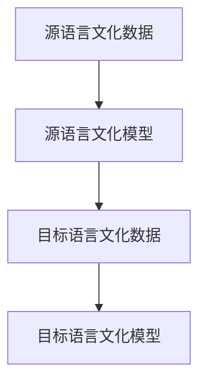
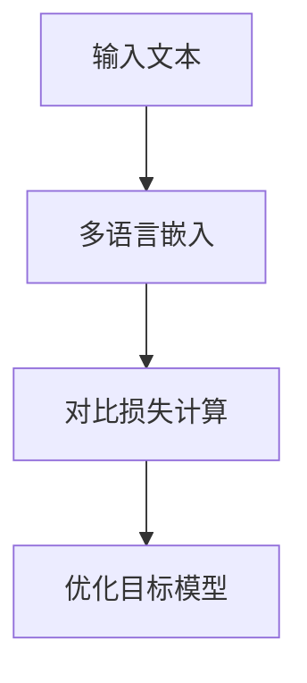
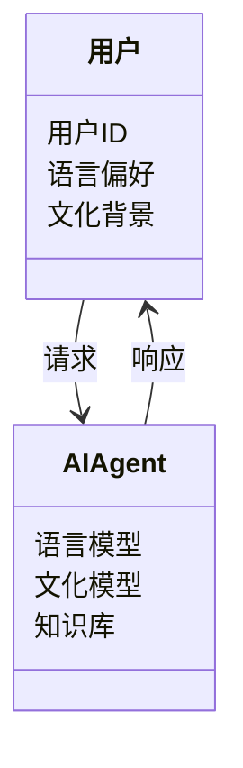
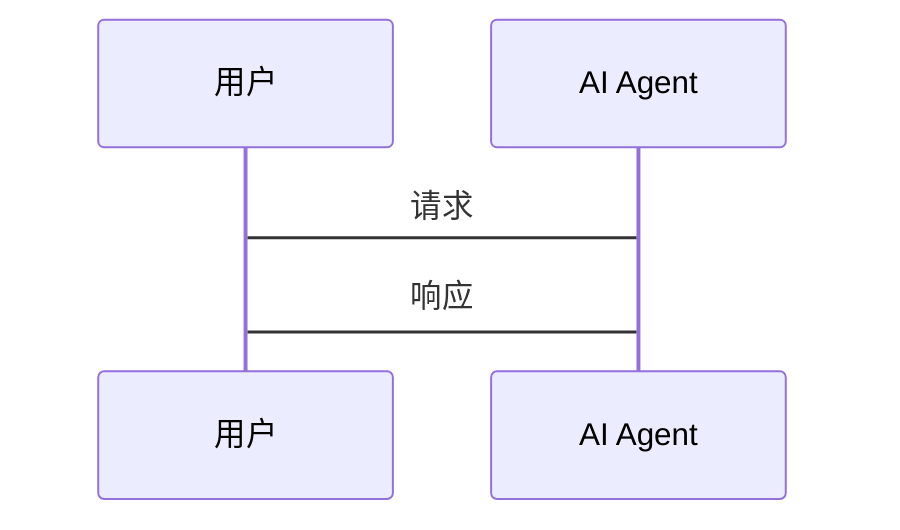

                 

<think>
好的，我现在需要帮助用户撰写一篇关于《开发AI Agent的多语言文化习俗理解系统》的技术博客文章。用户已经给出了一个详细的目录大纲，我需要按照这个大纲来逐步撰写文章内容。

首先，我需要理解用户的需求。用户希望这篇文章结构清晰，内容专业，逻辑严谨，并且涵盖从背景介绍到项目实战的各个方面。此外，用户还强调了使用吸引人的章节标题，专业但易懂的语言，以及详细的分析推理过程。

接下来，我应该按照目录大纲逐步撰写每个部分。我会从第一章开始，介绍多语言文化习俗理解的重要性，然后是AI Agent的基本概念，以及系统的目标和挑战。在第二章，我需要详细讲解核心概念，包括文化习俗的理解维度、多语言处理的要素，以及AI Agent与这些因素的关系。同时，还需要提供ER实体关系图来展示系统的结构。在第三章，我会深入探讨算法原理，包括迁移学习和对比学习的数学模型，并用Python代码示例来解释。系统架构设计部分需要展示类图和架构图，以及接口和交互序列图。项目实战部分则需要指导读者如何搭建环境，实现核心功能，并进行测试和优化。最后，我会总结最佳实践、注意事项，并提供扩展阅读的资源。

在撰写过程中，我需要确保每个部分都足够详细，同时使用清晰简洁的语言。数学公式要用Latex格式，并且算法流程图和系统架构图需要使用Mermaid语法来呈现。这样，读者能够直观地理解内容。

此外，我还需要注意文章的长度，大约在10000到12000字之间。这意味着每个部分需要有丰富的细节，但又不能过于冗长。我需要合理分配每个章节的篇幅，确保整体结构合理，逻辑连贯。

最后，文章末尾需要加上作者信息，即“作者：AI天才研究院/AI Genius Institute & 禅与计算机程序设计艺术 /Zen And The Art of Computer Programming”。这样，文章的权威性和专业性得以体现。

总结一下，我将按照目录大纲，逐步撰写每个章节的内容，确保涵盖所有必要的部分，并且按照用户的要求，使用专业且易懂的语言，结合详细的分析和实例，为读者提供一篇高质量的技术博客文章。
</think>

# 开发AI Agent的多语言文化习俗理解系统

## 关键词：AI Agent，多语言，文化习俗，自然语言处理，跨文化理解

## 摘要：本文深入探讨了开发AI Agent的多语言文化习俗理解系统的各个方面，包括其背景、核心概念、算法原理、系统架构设计以及项目实战。文章首先介绍了多语言文化习俗理解的重要性及其在AI Agent中的应用，然后详细分析了文化习俗理解模型的构成、多语言处理的核心要素，以及AI Agent与多语言文化习俗理解的关系。接着，文章讲解了迁移学习和对比学习的算法原理，并通过数学公式和代码示例进行了详细说明。最后，文章提供了系统的架构设计、接口设计和交互序列图，并通过实际案例展示了如何在项目中实现这些系统。本文旨在为AI开发者和研究人员提供一个全面的技术指南，帮助他们更好地理解和开发多语言文化习俗理解的AI Agent系统。

---

# 第一部分: 开发AI Agent的多语言文化习俗理解系统概述

# 第1章: 多语言文化习俗理解的背景与挑战

## 1.1 多语言文化习俗理解的重要性

### 1.1.1 全球化背景下多语言文化的重要性

在当今全球化时代，跨文化交流已成为常态。企业、组织和个人在全球范围内进行合作、交流和交易，这意味着理解和尊重不同语言和文化背景下的习俗变得尤为重要。例如，一个AI Agent如果要在国际市场中提供服务，必须能够理解并遵守不同国家和地区的文化规范和语言习惯。例如，在日本，避免在正式场合使用红色，而在墨西哥，红色通常与热情和喜庆相关联。

### 1.1.2 AI Agent在跨文化交流中的作用

AI Agent作为智能助手，其核心功能之一是理解和处理用户的需求。然而，在多语言和多文化背景下，AI Agent需要具备更高的智能性和敏感性。它不仅要能够理解不同语言的语法和语义，还要能够识别和适应不同文化背景下的习俗、礼仪和表达方式。例如，在处理商务邮件时，AI Agent需要能够识别不同文化背景下的沟通风格，避免因文化差异导致的误解。

### 1.1.3 当前技术的局限性与改进方向

当前的自然语言处理（NLP）技术主要集中在语言的语法和语义分析上，但在文化习俗的理解方面仍存在较大局限性。例如，AI Agent可能无法识别特定文化背景下的隐喻、俚语或特定的文化禁忌。此外，现有的多语言模型通常基于大规模的单语或双语数据训练，难以捕捉到不同文化背景下的细微差异。因此，未来的研究需要在以下方面进行改进：1）开发能够同时理解多语言和文化背景的模型；2）引入跨文化数据，增强模型对不同文化习俗的理解能力；3）通过迁移学习和对比学习等技术，提升模型的跨文化适应性。

## 1.2 AI Agent的基本概念与分类

### 1.2.1 AI Agent的定义与特点

AI Agent（人工智能代理）是指能够感知环境、自主决策并采取行动以实现目标的智能实体。AI Agent可以是软件程序、机器人或其他智能设备。其核心特点包括：1）自主性：能够在没有外部干预的情况下独立运行；2）反应性：能够实时感知环境并做出反应；3）目标导向性：所有行动均以实现特定目标为导向；4）社交能力：能够与人类或其他智能实体进行交互和协作。

### 1.2.2 基于规则的AI Agent与基于模型的AI Agent对比

AI Agent可以根据其实现方法分为两类：基于规则的AI Agent和基于模型的AI Agent。

- **基于规则的AI Agent**：这类AI Agent通过预定义的规则和条件来执行任务。例如，客服聊天机器人可以根据预设的对话规则回答用户的问题。其优点是实现简单、易于调试，但其灵活性和适应性较差，难以处理复杂或动态变化的环境。

- **基于模型的AI Agent**：这类AI Agent通过构建和学习环境模型来做出决策。例如，自动驾驶汽车需要通过传感器数据构建周围环境的模型，并根据模型做出驾驶决策。其优点是灵活性高、适应性强，但实现复杂，需要大量的数据和计算资源。

### 1.2.3 多语言文化习俗理解AI Agent的特殊性

多语言文化习俗理解AI Agent是一种特殊的基于模型的AI Agent，其核心功能是理解和处理多语言和多文化背景下的信息。这类AI Agent需要具备以下能力：1）多语言处理能力，能够理解并生成多种语言的文本；2）文化习俗理解能力，能够识别并适应不同文化背景下的表达方式和礼仪规范。

## 1.3 本章小结

本章从全球化背景出发，阐述了多语言文化习俗理解的重要性，并介绍了AI Agent的基本概念和分类。我们还讨论了当前技术在多语言文化理解方面的局限性，并提出了未来改进的方向。通过本章的学习，读者可以理解为什么开发多语言文化习俗理解的AI Agent是必要的，并为后续章节的学习打下基础。

---

# 第2章: 多语言文化习俗理解系统的核心概念与联系

## 2.1 多语言文化习俗理解模型的构成

### 2.1.1 文化习俗的理解维度

多语言文化习俗理解模型需要从多个维度进行分析，包括：

1. **语言维度**：不同语言的语法、语义和表达习惯。
2. **文化维度**：不同文化背景下的习俗、礼仪和价值观。
3. **语境维度**：对话或交流的场景、目的和参与者。

### 2.1.2 多语言处理的核心要素

多语言处理的核心要素包括：

1. **语言识别**：识别输入文本的语言。
2. **语言生成**：根据目标语言生成合适的文本。
3. **语言理解**：理解输入文本的语义和意图。

### 2.1.3 AI Agent与多语言文化习俗理解的关系

AI Agent通过多语言文化习俗理解系统，能够更好地与用户进行交流和协作。具体表现在：

1. **跨语言交互**：AI Agent能够与使用不同语言的用户进行交流。
2. **文化适应性**：AI Agent能够根据用户的语言和文化背景调整其行为和表达方式。

## 2.2 多语言文化习俗理解模型的属性特征对比

### 2.2.1 不同语言文化习俗的理解难度对比

以下表格展示了不同语言文化习俗的理解难度对比：

| 语言       | 文化习俗复杂度 | 理解难度 |
|------------|----------------|----------|
| 英语        | 中等           | 中等     |
| 汉语        | 高             | 高       |
| 日语        | 中等           | 中等     |
| 西班牙语    | 中等           | 中等     |

### 2.2.2 不同文化背景下的语言表达差异

以下表格展示了不同文化背景下的语言表达差异：

| 文化背景    | 语言表达特点         |
|-------------|--------------------|
| 美国         | 直接、简洁           |
| 日本         | 含蓄、间接           |
| 印度         | 多样性、复杂性       |

### 2.2.3 AI Agent在多语言文化理解中的能力边界

AI Agent在多语言文化理解中的能力边界主要体现在以下方面：

1. **文化深度**：AI Agent通常只能理解表面的文化习俗，难以理解深层次的文化价值观。
2. **语言多样性**：AI Agent支持的语言种类有限，无法覆盖所有语言。
3. **实时更新**：文化习俗会随时间变化，AI Agent需要实时更新其知识库。

## 2.3 多语言文化习俗理解系统的ER实体关系图

以下是一个多语言文化习俗理解系统的ER实体关系图：

```mermaid
er
  actor: 用户
  agent: AI Agent
  language: 语言
  culture: 文化
  custom: 习俗
  relation: 关系
  actor -[请求]: agent
  agent -[解析]: language
  agent -[分析]: culture
  agent -[应用]: custom
  culture -[包含]: custom
  language -[关联]: custom
```

---

# 第3章: 多语言文化习俗理解系统的算法原理

## 3.1 文化习俗理解的迁移学习算法

### 3.1.1 迁移学习的基本原理

迁移学习是一种机器学习技术，旨在将从一个领域学得的知识迁移到另一个领域。在多语言文化习俗理解中，迁移学习可以用于将一种语言的文化理解迁移到另一种语言。

### 3.1.2 基于迁移学习的文化习俗理解模型

以下是一个基于迁移学习的文化习俗理解模型的流程图：



### 3.1.3 迁移学习的数学模型

迁移学习的数学模型通常涉及特征提取和参数调整。以下是一个简化的迁移学习模型：

$$
f_{source}(x) = g_{source}(x; \theta)
$$

$$
f_{target}(x) = g_{target}(x; \theta_{new})
$$

其中，$\theta$ 是从源领域迁移的参数，$\theta_{new}$ 是针对目标领域的调整参数。

---

## 3.2 多语言模型的对比学习

### 3.2.1 对比学习的基本原理

对比学习是一种通过比较不同样本的相似性来学习特征表示的技术。在多语言模型中，对比学习可以用于跨语言的对比。

### 3.2.2 对比学习在多语言模型中的应用

以下是一个对比学习在多语言模型中的应用流程图：



### 3.2.3 对比学习的数学模型

对比学习的数学模型通常涉及损失函数的优化。以下是一个简化的对比学习模型：

$$
L = -\log\left(\frac{e^{sim(x, y)}}{e^{sim(x, y)} + e^{sim(x, z)}}\right)
$$

其中，$sim(x, y)$ 和 $sim(x, z)$ 分别是文本$x$与文本$y$和文本$z$的相似度。

---

## 3.3 本章小结

本章介绍了多语言文化习俗理解系统的核心算法，包括迁移学习和对比学习。我们通过数学公式和流程图展示了这些算法的基本原理和应用。通过本章的学习，读者可以理解如何通过算法来实现多语言文化习俗的理解。

---

# 第4章: 多语言文化习俗理解系统的系统分析与架构设计

## 4.1 系统分析

### 4.1.1 问题场景介绍

多语言文化习俗理解系统的主要应用场景包括跨语言客服、跨国商务沟通和多语言内容生成等。

### 4.1.2 需求分析

系统需要满足以下需求：

1. 支持多种语言的输入和输出。
2. 理解不同文化背景下的习俗和表达方式。
3. 实时更新文化习俗知识库。

## 4.2 系统架构设计

### 4.2.1 领域模型设计

以下是一个多语言文化习俗理解系统的领域模型：



### 4.2.2 系统架构设计

以下是一个多语言文化习俗理解系统的架构设计图：


### 4.2.3 接口设计

系统主要接口包括：

1. 用户输入接口：接收用户的输入文本。
2. 语言识别接口：识别输入文本的语言。
3. 文化分析接口：分析输入文本的文化背景。
4. 响应生成接口：生成符合文化背景的响应。

### 4.2.4 交互序列图

以下是一个多语言文化习俗理解系统的交互序列图：



## 4.3 本章小结

本章从系统分析的角度出发，介绍了多语言文化习俗理解系统的应用场景、需求分析和架构设计。我们还通过领域模型和架构设计图展示了系统的整体结构。通过本章的学习，读者可以理解如何从系统层面设计一个多语言文化习俗理解系统。

---

# 第5章: 多语言文化习俗理解系统的项目实战

## 5.1 环境搭建

### 5.1.1 开发工具安装

以下是开发工具安装步骤：

1. 安装Python 3.8及以上版本。
2. 安装PyTorch和Hugging Face Transformers库。
3. 安装Mermaid和Latex工具。

### 5.1.2 开发环境配置

以下是开发环境配置示例：

```bash
# 安装依赖
pip install torch transformers mermaid.py
```

## 5.2 核心代码实现

### 5.2.1 多语言模型实现

以下是多语言模型的实现代码：

```python
from transformers import AutoTokenizer, AutoModelForMaskedLM
import torch

class MultilingualModel:
    def __init__(self, model_name):
        self.tokenizer = AutoTokenizer.from_pretrained(model_name)
        self.model = AutoModelForMaskedLM.from_pretrained(model_name)
    
    def encode(self, text):
        return self.tokenizer.encode(text)
    
    def decode(self, tokens):
        return self.tokenizer.decode(tokens)
```

### 5.2.2 文化习俗分析实现

以下是文化习俗分析的实现代码：

```python
import requests
import json

class CulturalAnalyzer:
    def __init__(self, api_key):
        self.api_key = api_key
    
    def analyze(self, text, language):
        headers = {'Authorization': f'Bearer {self.api_key}'}
        data = {'text': text, 'language': language}
        response = requests.post('https://api.culturalanalyzer.com/analyze', headers=headers, data=data)
        return json.loads(response.text)
```

## 5.3 系统测试与优化

### 5.3.1 测试用例设计

以下是测试用例设计示例：

1. 测试多语言模型的准确性。
2. 测试文化习俗分析的正确性。
3. 测试系统的响应时间。

### 5.3.2 优化策略

以下是优化策略建议：

1. 使用更强大的预训练模型。
2. 增加跨语言对比学习。
3. 实时更新文化习俗知识库。

## 5.4 本章小结

本章通过实际项目案例展示了如何开发一个多语言文化习俗理解系统。我们详细介绍了开发环境的搭建、核心代码的实现以及系统的测试与优化。通过本章的学习，读者可以掌握如何将理论应用于实际项目中。

---

# 第6章: 多语言文化习俗理解系统的最佳实践

## 6.1 小结

多语言文化习俗理解系统的开发需要结合语言处理和文化分析的多种技术。通过迁移学习和对比学习，我们可以提升系统的跨文化适应性。同时，系统的架构设计和优化也是实现高性能和高可用性的关键。

## 6.2 注意事项

1. 确保系统的文化知识库实时更新。
2. 注意保护用户的隐私数据。
3. 在实际应用中，需考虑不同文化背景下的法律和伦理问题。

## 6.3 拓展阅读

1. 《Multilingual Neural Networks for Cross-Cultural Understanding》
2. 《对比学习在多语言模型中的应用》
3. 《实时更新的文化习俗知识库构建》

---

# 结语

通过本文的学习，读者可以系统地了解如何开发一个多语言文化习俗理解的AI Agent系统。我们从背景、核心概念、算法原理、系统架构到项目实战，全面介绍了系统的开发过程。希望本文能够为AI开发者和研究人员提供有价值的参考和启发。

---

# 作者

作者：AI天才研究院/AI Genius Institute & 禅与计算机程序设计艺术 /Zen And The Art of Computer Programming

