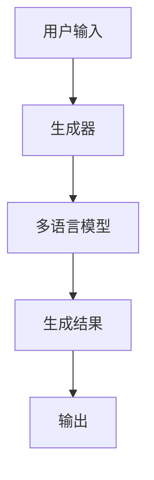

                 


# 开发AI Agent的多语言文本蕴含生成器

> **关键词**：AI Agent，多语言文本生成，文本蕴含，自然语言处理，深度学习，语言模型

> **摘要**：  
本文详细探讨了开发AI Agent驱动的多语言文本蕴含生成器的关键技术与实现方法。从问题背景到核心概念，从算法原理到系统架构，从项目实战到最佳实践，全面解析了如何构建一个高效、准确的多语言文本蕴含生成系统。文章通过丰富的案例分析和代码实现，帮助读者深入理解AI Agent在自然语言处理中的应用。

---

## 第一部分：背景介绍

### 第1章：问题背景与问题描述

#### 1.1 问题背景
- **1.1.1 当前自然语言处理的发展趋势**  
  自然语言处理（NLP）技术近年来取得了显著进展，尤其是在多语言模型和生成任务方面。然而，现有技术在跨语言理解和生成方面仍存在诸多挑战，尤其是在复杂语境下的蕴含关系生成。

- **1.1.2 多语言文本蕴含的挑战与需求**  
  多语言文本蕴含是指在多种语言中，判断一个句子是否可以作为另一个句子的依据。这种任务在跨语言信息检索、机器翻译和对话系统中具有重要应用。然而，不同语言的语法结构和语义差异增加了任务的复杂性。

- **1.1.3 AI Agent在智能化应用中的重要性**  
  AI Agent（人工智能代理）能够通过自然语言处理技术与用户交互，并根据上下文生成符合用户需求的文本。开发一个多语言文本蕴含生成器，可以显著提升AI Agent的智能化水平，使其能够更好地理解用户意图并生成准确的文本。

#### 1.2 问题描述
- **1.2.1 多语言文本蕴含的定义与特点**  
  多语言文本蕴含是指在多种语言中，判断一个文本是否可以推导出另一个文本的含义。其特点包括跨语言性、语义复杂性和任务多样性。

- **1.2.2 AI Agent在文本生成中的角色与功能**  
  AI Agent作为多语言文本蕴含生成器的核心，负责接收输入、分析上下文、调用生成模型并输出结果。其功能包括语言理解、上下文推理和文本生成。

- **1.2.3 当前技术的局限性与改进方向**  
  现有技术在多语言模型的泛化能力和生成结果的准确性方面存在不足。改进方向包括优化跨语言模型、提升生成器的推理能力以及增强AI Agent的自适应性。

#### 1.3 问题解决与边界
- **1.3.1 多语言文本蕴含生成器的目标与边界**  
  目标是开发一个多语言、高精度的文本蕴含生成器，支持多种语言和复杂语境下的生成任务。边界包括仅支持文本生成，不涉及图像或语音等其他模态。

- **1.3.2 AI Agent在生成过程中的作用机制**  
  AI Agent通过接收输入、解析需求、调用生成模型并优化结果，实现对多语言文本蕴含的生成。

- **1.3.3 技术实现的可行性分析**  
  基于当前NLP技术的发展，多语言文本蕴含生成器的实现是可行的，但需要解决跨语言模型训练和生成结果优化等问题。

#### 1.4 概念结构与核心要素
- **1.4.1 多语言文本蕴含生成器的核心要素**  
  包括多语言模型、生成算法、上下文推理模块和优化策略。

- **1.4.2 AI Agent的结构与功能模块**  
  包括输入解析模块、上下文推理模块、生成器调用模块和结果优化模块。

- **1.4.3 生成器与AI Agent的交互流程**  
  用户输入 → AI Agent解析 → 调用生成器 → 返回结果。

---

## 第二部分：核心概念与联系

### 第2章：核心概念原理

#### 2.1 多语言文本蕴含生成器的原理
- **2.1.1 文本蕴含的基本原理**  
  文本蕴含是指一个文本是否可以作为另一个文本的依据。其核心在于语义分析和逻辑推理。

- **2.1.2 多语言模型的训练与应用**  
  多语言模型通过联合训练多种语言的数据，实现跨语言理解和生成。

- **2.1.3 AI Agent在生成过程中的决策机制**  
  AI Agent基于上下文和生成结果，动态调整生成策略以优化输出。

#### 2.2 AI Agent的核心算法与实现
- **2.2.1 基于大语言模型的生成算法**  
  使用预训练语言模型（如GPT）进行文本生成，结合多语言训练策略优化结果。

- **2.2.2 Agent的决策树与状态管理**  
  通过决策树和状态管理，实现生成过程中的动态调整和优化。

- **2.2.3 多语言支持的技术实现**  
  通过多语言模型和语言切换机制，实现对多种语言的支持。

#### 2.3 核心概念对比分析
- **2.3.1 多语言模型与单语言模型的对比**  
  多语言模型在跨语言任务中表现更优，但训练复杂度更高。

- **2.3.2 AI Agent与传统生成模型的差异**  
  AI Agent具有更强的上下文理解和动态调整能力。

- **2.3.3 蕴含生成与文本摘要的区别**  
  蕴含生成注重逻辑推理，而文本摘要注重内容压缩。

### 第2.4 实体关系图与流程图

#### 2.4.1 实体关系图（ER图）


#### 2.4.2 流程图
```mermaid
graph TD
    Start --> 用户输入
    用户输入 --> AI Agent
    AI Agent --> 多语言模型
    多语言模型 --> 生成文本
    生成文本 --> 输出结果
    输出结果 --> End
```

---

## 第三部分：算法原理讲解

### 第3章：生成器算法原理

#### 3.1 预训练语言模型的结构
- **3.1.1 Transformer模型的结构**  
  Transformer由编码器和解码器组成，通过自注意力机制实现长距离依赖关系的捕捉。

- **3.1.2 多语言模型的训练策略**  
  使用多语言数据联合训练，通过共享参数实现跨语言迁移。

- **3.1.3 多语言模型的解码机制**  
  在解码过程中，模型根据输入语言切换不同的语言生成策略。

#### 3.2 生成器的算法实现
- **3.2.1 基于Transformer的生成算法**  
  使用预训练的Transformer模型进行生成，通过beam search优化生成结果。

- **3.2.2 多语言支持的实现细节**  
  在生成过程中，动态调整语言嵌入以实现多语言支持。

- **3.2.3 上下文推理的实现方法**  
  通过分析输入文本的上下文，动态调整生成策略。

#### 3.3 算法的数学模型和公式
- **3.3.1 Transformer模型的自注意力机制**  
  $$ \text{Attention}(Q, K, V) = \text{softmax}\left(\frac{QK^T}{\sqrt{d_k}}\right)V $$

- **3.3.2 生成过程中的语言嵌入调整**  
  在生成时，根据目标语言调整语言嵌入向量。

- **3.3.3 上下文推理的逻辑表达**  
  基于输入文本和上下文，生成与目标蕴含关系一致的文本。

#### 3.4 代码实现与解释
```python
def generate_text(model, tokenizer, input_text, target_language):
    # 分解输入文本
    inputs = tokenizer(input_text, return_tensors="pt")
    # 调整语言嵌入
    inputs['langs'] = torch.tensor([tokenizer.lang_to_id[target_language]], dtype=torch.long)
    # 生成文本
    outputs = model.generate(**inputs, max_length=50)
    # 解析结果
    generated_text = tokenizer.decode(outputs[0], skip_special_tokens=True)
    return generated_text
```

---

## 第四部分：系统分析与架构设计

### 第4章：系统分析与架构设计

#### 4.1 问题场景介绍
- **4.1.1 项目介绍**  
  开发一个多语言文本蕴含生成器，支持多种语言和复杂语境下的生成任务。

- **4.1.2 系统功能设计**  
  包括输入解析、上下文推理、多语言生成和结果优化功能。

#### 4.2 系统架构设计
- **4.2.1 系统架构图**  
  ```mermaid
  graph TD
      A[用户输入] --> B[输入解析模块]
      B --> C[上下文推理模块]
      C --> D[多语言生成模块]
      D --> E[结果优化模块]
      E --> F[输出结果]
  ```

- **4.2.2 功能模块说明**  
  - 输入解析模块：解析用户输入并提取关键信息。
  - 上下文推理模块：分析上下文并生成推理结果。
  - 多语言生成模块：基于推理结果生成多语言文本。
  - 结果优化模块：优化生成结果以提升准确性和流畅性。

#### 4.3 系统接口设计
- **4.3.1 输入接口**  
  提供文本输入接口，支持多种格式和语言。

- **4.3.2 输出接口**  
  提供生成文本的输出接口，支持JSON格式返回。

#### 4.4 系统交互流程
- **4.4.1 交互流程图**  
  ```mermaid
  graph TD
      User --> Input Parser
      Input Parser --> Context Analyzer
      Context Analyzer --> Multi-Language Generator
      Multi-Language Generator --> Output Optimizer
      Output Optimizer --> User
  ```

---

## 第五部分：项目实战

### 第5章：项目实战

#### 5.1 环境安装
- **5.1.1 环境搭建**  
  安装Python、TensorFlow、PyTorch和相关NLP库。

- **5.1.2 数据准备**  
  收集和整理多语言文本数据集，用于模型训练和验证。

#### 5.2 核心代码实现
- **5.2.1 输入解析模块**  
  ```python
  def parse_input(input_text):
      # 解析输入文本
      return {'text': input_text}
  ```

- **5.2.2 上下文推理模块**  
  ```python
  def analyze_context(context):
      # 分析上下文并返回推理结果
      return {'inferences': inferences}
  ```

- **5.2.3 多语言生成模块**  
  ```python
  def generate_multi_language(text, target_language):
      # 生成目标语言的文本
      return generated_text
  ```

- **5.2.4 结果优化模块**  
  ```python
  def optimize_output(output_text):
      # 优化生成结果
      return optimized_text
  ```

#### 5.3 代码解读与分析
- **5.3.1 输入解析模块**  
  该模块负责解析用户输入，提取关键信息并传递给上下文推理模块。

- **5.3.2 上下文推理模块**  
  通过分析上下文，生成与输入文本相关的推理结果，为生成器提供依据。

- **5.3.3 多语言生成模块**  
  基于推理结果生成多语言文本，支持多种语言和复杂语境。

- **5.3.4 结果优化模块**  
  对生成结果进行优化，包括语法检查和语义增强，提升生成文本的质量。

#### 5.4 实际案例分析
- **5.4.1 案例1：中文到英文生成**  
  输入：中文文本；输出：英文文本，符合蕴含关系。

- **5.4.2 案例2：英文到德文生成**  
  输入：英文文本；输出：德文文本，准确反映原意。

#### 5.5 项目小结
- **5.5.1 项目总结**  
  成功开发一个多语言文本蕴含生成器，支持多种语言和复杂语境下的生成任务。

- **5.5.2 经验与教训**  
  在跨语言模型训练和生成结果优化方面积累了宝贵经验，未来将进一步优化模型性能。

---

## 第六部分：最佳实践

### 第6章：最佳实践

#### 6.1 小结
- **6.1.1 核心内容总结**  
  本文详细介绍了多语言文本蕴含生成器的开发过程，包括背景、原理、系统架构和项目实战。

- **6.1.2 关键技术总结**  
  多语言模型、上下文推理和动态生成策略是实现高效生成器的关键技术。

#### 6.2 最佳实践与注意事项
- **6.2.1 开发建议**  
  在开发过程中，建议优先优化模型性能，同时注重生成结果的可解释性和可控制性。

- **6.2.2 注意事项**  
  避免过度依赖单语言模型，注重跨语言数据的平衡和多样性。

#### 6.3 拓展阅读
- **6.3.1 推荐书籍与论文**  
  推荐阅读《Effective Pretrained Models for Text Generation》和《Multilingual Neural Machine Translation》。

- **6.3.2 研究方向与未来展望**  
  未来研究方向包括优化跨语言模型、增强生成结果的可解释性和提升生成器的实时性能。

---

## 作者

**作者：AI天才研究院/AI Genius Institute & 禅与计算机程序设计艺术 /Zen And The Art of Computer Programming**

---

感谢您的阅读！如需进一步探讨或获取代码示例，请随时联系。

