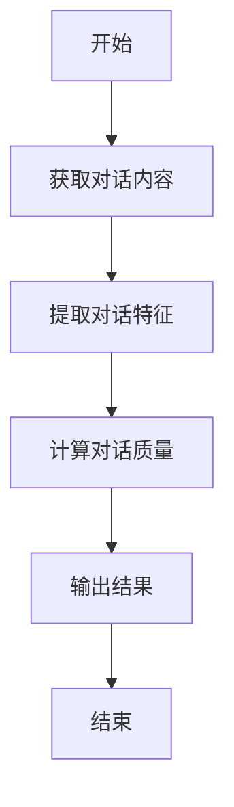
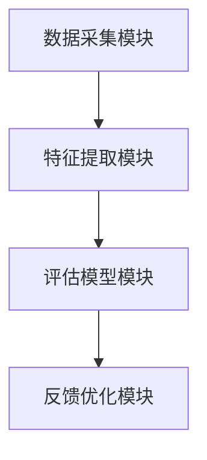

                 


# 开发AI Agent的对话质量评估指标体系

## 关键词：AI Agent, 对话质量评估, 对话质量指标体系, 对话质量评估算法, 对话质量系统架构

## 摘要：  
本文旨在构建一个全面的对话质量评估指标体系，用于评估AI Agent在对话中的表现。通过对对话质量的核心要素、算法原理、系统架构的深入分析，结合实际案例和最佳实践，为开发者提供一套系统化的对话质量评估解决方案。

---

# 第一部分: AI Agent对话质量评估背景与核心概念

## 第1章: 背景介绍

### 1.1 问题背景
#### 1.1.1 AI Agent的定义与作用
AI Agent（人工智能代理）是指能够感知环境、自主决策并执行任务的智能实体。在对话场景中，AI Agent通常表现为聊天机器人，通过自然语言处理技术与用户进行交互。

#### 1.1.2 对话质量评估的必要性
随着AI Agent在客服、教育、医疗等领域的广泛应用，对话质量直接关系到用户体验和业务效果。如何量化对话质量成为一项重要挑战。

#### 1.1.3 当前对话质量评估的挑战
- 对话场景多样，难以统一评估标准。
- 对话内容复杂，需要结合语义和情感进行分析。
- 实时评估对计算效率要求高。

### 1.2 问题描述
#### 1.2.1 对话质量评估的目标
通过量化指标评估AI Agent的对话表现，包括准确性、流畅性、相关性和情感一致性。

#### 1.2.2 对话质量评估的关键维度
- **准确性**：对话内容是否符合事实和逻辑。
- **流畅性**：对话是否自然、连贯。
- **相关性**：对话内容是否与用户需求匹配。
- **情感一致性**：对话是否符合情感预期。

#### 1.2.3 对话质量评估的边界与外延
对话质量评估不关注技术实现细节，而是聚焦于对话结果的优劣。

### 1.3 问题解决
#### 1.3.1 对话质量评估的核心要素
- 对话内容分析。
- 对话逻辑推理。
- 用户反馈收集。

#### 1.3.2 对话质量评估的实现路径
1. 数据收集与预处理。
2. 指标体系构建。
3. 评估模型训练。
4. 实时评估与优化。

#### 1.3.3 对话质量评估的指标体系构建
通过多维度指标量化对话质量，构建层次化的评估模型。

### 1.4 概念结构与核心要素组成
#### 1.4.1 对话质量评估的层次模型
- **输入层**：对话内容、用户需求。
- **处理层**：特征提取、语义分析。
- **输出层**：质量评分、优化建议。

#### 1.4.2 核心要素的特征分析
- 对话内容：关键词、句式结构。
- 对话逻辑：上下文连贯性。
- 用户反馈：满意度评分、情感倾向。

#### 1.4.3 指标体系的逻辑关系
指标体系通过层次化结构，将多维度特征整合为整体质量评分。

### 1.5 本章小结
本章介绍了AI Agent对话质量评估的背景、目标和挑战，明确了核心概念和实现路径，为后续章节奠定了基础。

---

## 第2章: 核心概念与联系

### 2.1 对话质量评估的原理
#### 2.1.1 对话质量评估的基本原理
通过对对话内容的特征提取和语义分析，量化对话质量。

#### 2.1.2 对话质量评估的数学模型
对话质量评估可以转化为一个回归或分类问题，通过机器学习算法进行建模。

#### 2.1.3 对话质量评估的实现步骤
1. 数据预处理：清洗、标注。
2. 特征提取：关键词提取、情感分析。
3. 模型训练：训练对话质量评估模型。
4. 评估与优化：实时评估、反馈优化。

### 2.2 对话质量评估的核心概念对比
#### 2.2.1 对话质量与对话内容的对比
对话质量是内容的综合评价，而内容是质量的载体。

#### 2.2.2 对话质量与对话参与者的对比
质量与参与者的表达能力和意图密切相关。

#### 2.2.3 对话质量与对话场景的对比
场景影响质量评估的标准和权重。

### 2.3 对话质量评估的ER实体关系图
```mermaid
er
actor: 用户
agent: AI Agent
message: 对话内容
quality: 对话质量
```

---

## 第3章: 对话质量评估的算法原理

### 3.1 对话质量评估的算法概述
#### 3.1.1 基于规则的对话质量评估
通过预设规则匹配对话内容，评估其质量。

#### 3.1.2 基于统计的对话质量评估
利用统计方法分析对话数据，评估其质量。

#### 3.1.3 基于深度学习的对话质量评估
使用神经网络模型学习对话特征，评估其质量。

### 3.2 对话质量评估的算法流程图


### 3.3 对话质量评估的数学模型
#### 3.3.1 对话质量评估的损失函数
$$L = \sum_{i=1}^{n} (y_i - \hat{y}_i)^2$$

#### 3.3.2 对话质量评估的评估指标
- 均方误差（MSE）：衡量预测值与真实值的差异。
- 准确率：分类任务中的正确预测比例。

---

## 第4章: 系统分析与架构设计

### 4.1 问题场景介绍
AI Agent对话质量评估系统需要实时处理大量对话数据，提供高质量的评估结果。

### 4.2 系统功能设计
- 数据采集模块：收集对话内容。
- 特征提取模块：提取对话特征。
- 评估模型模块：计算对话质量。
- 反馈优化模块：根据评估结果优化对话策略。

### 4.3 系统架构设计


### 4.4 系统接口设计
- 输入接口：接收对话内容。
- 输出接口：返回质量评分。

### 4.5 系统交互流程图
```mermaid
sequenceDiagram
actor 用户
agent AI Agent
用户->AI Agent: 发起对话
activate AI Agent
AI Agent->用户: 响应对话
deactivate AI Agent
```

---

## 第5章: 项目实战

### 5.1 环境安装
- Python 3.8+
- numpy、pandas、scikit-learn

### 5.2 系统核心实现
```python
import numpy as np
from sklearn.metrics import mean_squared_error

def calculate_quality_score(actual, predicted):
    return mean_squared_error(actual, predicted)

# 示例数据
actual = np.array([0.8, 0.6, 0.7])
predicted = np.array([0.7, 0.6, 0.8])

score = calculate_quality_score(actual, predicted)
print("对话质量评分:", score)
```

### 5.3 案例分析
分析一个具体的对话案例，计算其质量评分，并提出优化建议。

### 5.4 项目小结
总结项目实现的关键点和经验教训。

---

## 第6章: 最佳实践与注意事项

### 6.1 最佳实践
- 数据清洗：确保数据质量。
- 模型优化：选择合适的算法和参数。
- 实时反馈：及时优化对话策略。

### 6.2 小结
总结全文，强调对话质量评估的重要性。

### 6.3 注意事项
- 数据隐私保护。
- 算法可解释性。
- 系统性能优化。

### 6.4 拓展阅读
推荐相关领域的书籍和论文。

---

## 作者：AI天才研究院/AI Genius Institute & 禅与计算机程序设计艺术 /Zen And The Art of Computer Programming

