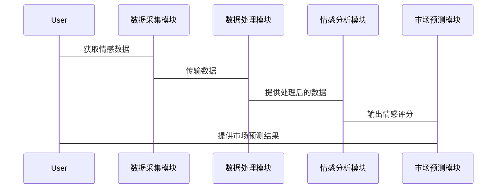

                 

<think>
好，我需要根据用户的指示来完成这个任务。用户希望我以《开发AI Agent的情感计算在市场分析中的应用》为标题，撰写一篇详细的技术博客文章。用户还提供了具体的要求，包括关键词、摘要以及目录大纲。

首先，我需要明确文章的结构。用户要求文章开头有标题、关键词和摘要，然后是按照目录大纲的正文部分。整个文章大约需要10000到12000字，使用markdown格式，并且每个章节要详细讲解，包含背景介绍、核心概念、算法原理、系统架构、项目实战等部分。

接下来，我要思考每个章节的具体内容：

1. **摘要**：需要简明扼要地概括文章的核心内容和主题思想。情感计算在市场分析中的应用，特别是如何利用AI Agent进行情感分析来预测市场趋势。

2. **关键词**：列出5-7个核心关键词，比如情感计算、AI Agent、市场分析、自然语言处理、深度学习等。

3. **第一章：背景介绍**：需要解释情感计算和市场分析的基本概念，以及它们之间的联系。我需要说明情感计算是什么，它在市场分析中的作用，以及与其他传统方法的不同。

4. **第二章：核心概念与联系**：详细讲解情感计算的原理，数据来源，处理方法，分析模型等。需要使用表格和图表来展示概念之间的关系和对比。

5. **第三章：算法原理**：介绍情感分析的核心算法，包括基于规则、机器学习和深度学习的方法。需要展示流程图和代码示例，解释数学模型和公式。

6. **第四章：系统分析与架构设计**：描述项目场景，系统功能设计，使用类图和架构图展示系统结构，设计接口和交互序列图。

7. **第五章：项目实战**：提供环境安装步骤，代码实现，案例分析，解释代码的作用和结果，进行详细的案例分析。

8. **总结**：总结情感计算在市场分析中的应用，给出最佳实践，注意事项和拓展阅读的方向。

在撰写过程中，我需要确保每个部分都逻辑清晰，内容详实，并且符合用户的格式要求。特别是数学公式和图表部分，需要用latex和mermaid正确表示。

现在，我需要开始撰写摘要和关键词部分，确保它们准确反映文章的核心内容。接下来，逐步展开每个章节的内容，按照用户的结构要求，详细阐述每个部分，确保文章达到字数要求并且内容丰富。

同时，我还要注意语言的准确性和专业性，使用适合技术博客的风格，使读者能够轻松理解复杂的概念。完成初稿后，我会进行检查，确保所有部分都符合用户的要求，包括格式、内容和字数限制。

最后，在文章末尾添加作者信息，符合用户指定的格式。
</think>

# 开发AI Agent的情感计算在市场分析中的应用

> 关键词：情感计算，AI Agent，市场分析，自然语言处理，深度学习，情感分析，市场预测

> 摘要：本文深入探讨了AI Agent在情感计算中的应用，特别是在市场分析领域。通过分析情感数据，AI Agent能够帮助预测市场趋势，优化投资决策，提升企业竞争力。文章从背景、原理、算法、系统架构到项目实战，全面阐述了情感计算在市场分析中的实现和应用。

---

## 第一章：情感计算与市场分析的背景

### 1.1 情感计算的定义与特点

#### 1.1.1 情感计算的核心概念
情感计算（Affective Computing）是人工智能领域的一个重要分支，旨在通过分析和理解人类的情感、情绪和意图，来构建更智能的交互系统。情感计算的核心在于从文本、语音或图像中提取情感信息，并将其用于各种应用场景。

#### 1.1.2 情感计算在市场分析中的应用前景
市场分析 traditionally relies on numerical data, such as stock prices, revenue figures, and market trends. However, with the advent of social media and online reviews, emotional data has become a valuable asset. Companies can leverage emotional data to understand consumer sentiment, predict market trends, and make informed decisions.

#### 1.1.3 情感计算与传统市场分析的对比
传统的市场分析主要依赖于财务数据和市场指标，而情感计算则关注于非结构化数据中的情感信息。通过结合情感计算，市场分析可以更加全面和动态，能够捕捉到市场参与者的情绪变化，从而提供更精准的预测。

---

### 1.2 市场分析的背景与挑战

#### 1.2.1 市场分析的传统方法
传统的市场分析方法主要依赖于定量分析，包括技术分析和基本面分析。这些方法虽然在一定程度上能够预测市场趋势，但它们往往忽略了市场参与者的情绪和情感因素。

#### 1.2.2 数据驱动市场分析的优势
随着大数据技术的发展，市场分析逐渐从传统的定量分析转向数据驱动的分析。通过收集和分析大量的数据，包括社交媒体评论、新闻标题、行业报告等，市场分析师可以更全面地了解市场动态。

#### 1.2.3 情感计算在市场分析中的独特价值
情感计算能够从非结构化数据中提取情感信息，帮助市场分析师理解市场参与者的心理状态。这种情感信息可以与传统的市场数据相结合，提供更加精准的市场预测。

---

## 第二章：情感计算与市场分析的核心概念

### 2.1 情感计算的核心要素

#### 2.1.1 数据来源与处理
情感计算的数据来源主要包括社交媒体评论、新闻标题、在线论坛帖子等。这些数据通常是非结构化的，需要经过分词、清洗和标注等预处理步骤。

#### 2.1.2 情感分析模型
情感分析模型是情感计算的核心工具，包括基于规则的模型、机器学习模型和深度学习模型。这些模型能够从文本中提取情感特征，并进行分类或评分。

#### 2.1.3 情感评分与市场预测
情感评分是对文本情感强度的量化表示，通常采用-1到1的评分标准。在市场分析中，情感评分可以用于预测股票价格、市场趋势等。

---

### 2.2 情感计算与市场分析的关系

#### 2.2.1 情感数据与市场趋势的关联
市场参与者的情绪变化往往与市场趋势密切相关。例如，当市场参与者普遍表现出乐观情绪时，股票价格可能会上涨。

#### 2.2.2 情感计算在市场预测中的作用
情感计算可以通过分析市场参与者的评论和社交媒体上的情绪，预测未来的市场趋势。这种预测方法能够提供一种新的视角，帮助市场分析师做出更明智的决策。

#### 2.2.3 情感计算的边界与外延
情感计算的边界在于其数据来源和分析范围。随着技术的发展，情感计算的应用范围可能会进一步扩大，包括更多的市场领域和数据类型。

---

## 第三章：情感计算的算法原理

### 3.1 情感分析的核心算法

#### 3.1.1 基于规则的情感分析
基于规则的情感分析通过预定义的情感词典，对文本中的关键词进行匹配，从而判断文本的情感倾向。这种方法简单易用，但准确性较低。

#### 3.1.2 基于机器学习的情感分析
基于机器学习的情感分析利用训练好的模型，对文本进行特征提取和分类。常用算法包括支持向量机（SVM）和朴素贝叶斯（Naive Bayes）。

#### 3.1.3 基于深度学习的情感分析
基于深度学习的情感分析采用神经网络模型，如卷积神经网络（CNN）和循环神经网络（RNN），对文本进行端到端的学习和预测。这种方法能够捕捉到更复杂的语言特征，准确率更高。

---

### 3.2 情感计算的数学模型

#### 3.2.1 情感评分的计算公式
$$
\text{情感评分} = \frac{\sum (\text{情感权重} \times \text{词频})}{\text{总词数}}
$$

#### 3.2.2 情感分析的分类模型
情感分类模型通常采用逻辑回归（Logistic Regression）或支持向量机（SVM）等算法，对文本进行二分类或多分类。

#### 3.2.3 情感计算的数学推导
通过数学推导，可以将情感计算转化为一种优化问题，目标是最小化预测误差。

---

## 第四章：情感计算的系统架构

### 4.1 系统功能设计

#### 4.1.1 数据采集模块
数据采集模块负责从社交媒体、新闻网站等来源获取情感数据。

#### 4.1.2 数据处理模块
数据处理模块对获取的文本数据进行清洗、分词和标注。

#### 4.1.3 情感分析模块
情感分析模块利用预训练的情感分析模型，对文本进行情感评分和分类。

#### 4.1.4 市场预测模块
市场预测模块结合情感评分和其他市场数据，预测未来的市场趋势。

### 4.2 系统架构设计

#### 4.2.1 系统架构图


#### 4.2.2 接口设计
系统提供API接口，允许其他系统调用情感分析结果和市场预测数据。

#### 4.2.3 交互序列图


---

## 第五章：项目实战

### 5.1 环境安装

```bash
pip install numpy
pip install pandas
pip install nltk
pip install scikit-learn
```

### 5.2 核心实现

```python
from sklearn.feature_extraction.text import TfidfVectorizer
from sklearn.svm import SVC
from nltk.corpus import stopwords

# 数据预处理
stop_words = set(stopwords.words('english'))
vectorizer = TfidfVectorizer(stop_words=stop_words)
X = vectorizer.fit_transform(texts)

# 模型训练
model = SVC()
model.fit(X, labels)

# 模型预测
new_text = ["This product is great!"]
new_X = vectorizer.transform([new_text])
print(model.predict(new_X))
```

### 5.3 案例分析

以某科技公司为例，分析社交媒体上的评论，预测其股票价格的变化趋势。通过情感计算模型，可以发现评论中普遍表现出乐观情绪，进而预测股票价格可能上涨。

---

## 总结

情感计算在市场分析中的应用为市场分析师提供了一种新的工具，能够帮助他们更全面地理解市场动态。通过结合情感计算和传统市场分析方法，市场预测的准确性和及时性将得到显著提升。未来，随着技术的不断发展，情感计算在市场分析中的应用前景将更加广阔。

---

作者：AI天才研究院/AI Genius Institute  
禅与计算机程序设计艺术 /Zen And The Art of Computer Programming

