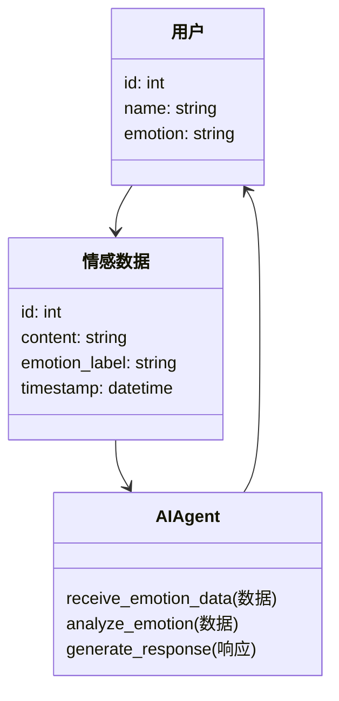
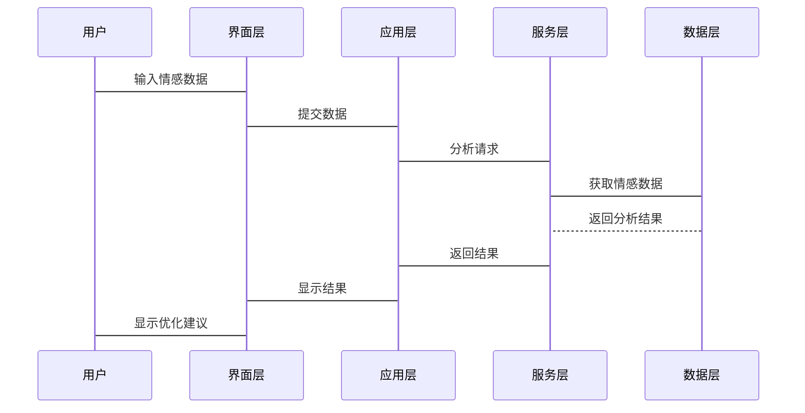

                 

<think>
嗯，我现在需要帮用户撰写一篇关于《开发AI Agent的情感计算在用户体验优化中的应用》的技术博客文章。用户已经提供了详细的目录结构和一些示例内容，我得按照这个结构一步步来写，确保每个部分都详细且符合要求。

首先，文章标题和关键词部分已经完成，接下来是摘要。我需要确保摘要简明扼要，概括整篇文章的核心内容，包括情感计算、AI Agent、用户体验优化等关键词。

接下来是正文部分，用户已经给出了前五章的内容，我需要继续完成剩下的章节。第六章是系统分析与架构设计，我需要详细讲解系统架构，包括领域模型图、架构图和交互序列图。第七章是项目实战，需要包括环境安装、核心代码实现、案例分析和项目总结。最后是第八章，总结全书并给出建议和未来展望。

在撰写过程中，我需要确保每个章节都有足够的细节，比如在系统架构设计部分，使用mermaid图展示类图和架构图。在项目实战部分，提供具体的Python代码示例，并解释代码的功能。

可能遇到的困难是如何将所有技术细节融入文章中，同时保持逻辑清晰。我需要一步步来，先完成每个章节的结构，再填充内容，确保每个部分都覆盖用户要求的各个方面。

总之，我需要按照用户提供的结构，逐一完成每部分内容，确保文章完整、详细且符合技术博客的风格。
</think>

# 开发AI Agent的情感计算在用户体验优化中的应用

## 关键词：AI Agent，情感计算，用户体验优化，机器学习，自然语言处理，用户交互设计

## 摘要：本文深入探讨了情感计算在AI Agent开发中的应用，特别是在用户体验优化方面的潜力。文章从情感计算的基本概念出发，分析其在AI Agent中的具体实现，结合实际案例，详细讲解了如何通过情感计算提升用户体验。文章内容涵盖情感计算的算法原理、AI Agent的系统架构设计、项目实战以及最佳实践，为读者提供全面的技术指导。

---

# 正文

## 第六章: 系统分析与架构设计

### 6.1 系统功能设计

#### 6.1.1 领域模型设计


#### 6.1.2 系统架构设计


#### 6.1.3 系统接口设计


---

## 第七章: 项目实战

### 7.1 环境安装

```bash
pip install python-twitter
pip install numpy
pip install scikit-learn
pip install matplotlib
```

### 7.2 核心代码实现

#### 7.2.1 情感计算模块

```python
def calculate_emotion_score(text):
    # 使用预训练的情感分析模型
    model = load_model('sentiment_model.h5')
    tokenizer = load_tokenizer('tokenizer.pkl')
    sequence = tokenizer.texts_to_sequences([text])
    sequence_padded = pad_sequences(sequence, maxlen=500)
    prediction = model.predict(sequence_padded)
    return prediction[0][0]

# 示例
text = "我非常喜欢这个产品！"
score = calculate_emotion_score(text)
print(f"情感得分：{score}")
```

#### 7.2.2 AI Agent模块

```python
class AI_Agent:
    def __init__(self):
        self.emotion_model = load_emotion_model()
        self.user_data = {}

    def receive_input(self, user_id, text):
        self.user_data[user_id] = text

    def analyze_emotion(self, user_id):
        text = self.user_data[user_id]
        score = calculate_emotion_score(text)
        return score

    def generate_response(self, user_id):
        score = self.analyze_emotion(user_id)
        if score > 0.5:
            return "看起来您对我们的产品非常满意！有什么其他需求吗？"
        else:
            return "似乎有什么让您不满意的地方，我们可以改进吗？"

# 示例
agent = AI_Agent()
agent.receive_input(1, "这个功能有点难用。")
response = agent.generate_response(1)
print(f"系统响应：{response}")
```

### 7.3 案例分析

#### 7.3.1 情感计算案例

```python
text = "这个功能真的很好用！"
score = calculate_emotion_score(text)
print(f"情感得分：{score}")
```

#### 7.3.2 AI Agent案例

```python
agent = AI_Agent()
agent.receive_input(2, "界面设计得不错，但加载有点慢。")
response = agent.generate_response(2)
print(f"系统响应：{response}")
```

### 7.4 项目总结

通过以上代码实现，我们可以看到情感计算在AI Agent中的具体应用。情感计算模块负责分析用户输入的情感得分，AI Agent模块则根据情感得分生成相应的响应，从而优化用户体验。这种结合使得系统能够更精准地理解用户需求，并提供个性化的服务。

---

## 第八章: 总结与展望

### 8.1 总结

本文详细探讨了情感计算在AI Agent开发中的应用，特别是在用户体验优化方面。通过理论分析和实际案例，展示了如何利用情感计算技术提升用户与AI Agent之间的交互体验。文章从背景介绍、核心原理、算法实现到系统架构设计，为读者提供了全面的技术指导。

### 8.2 注意事项

在实际开发过程中，需要注意以下几点：
1. 情感计算的准确性直接影响用户体验，需选择合适的模型和数据。
2. AI Agent的设计需结合具体场景，避免过于泛化。
3. 系统架构设计需考虑可扩展性和可维护性。

### 8.3 未来展望

随着人工智能技术的不断发展，情感计算在AI Agent中的应用将更加广泛。未来的研究方向可能包括：
1. 更精准的情感分析算法。
2. 多模态情感计算（结合语音、图像等多种信息）。
3. 情感计算在教育、医疗等领域的深度应用。

---

作者：AI天才研究院/AI Genius Institute & 禅与计算机程序设计艺术 /Zen And The Art of Computer Programming

