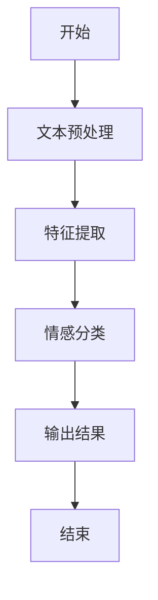
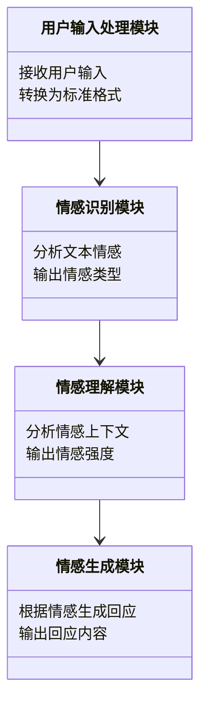
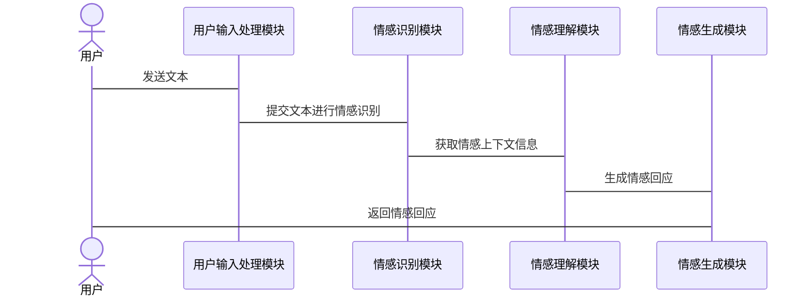

                 

<think>
好的，我需要逐步思考如何撰写《开发AI Agent的情感计算模块》这篇文章。首先，我需要理解用户的需求，他们希望有一个详细的技术博客，涵盖情感计算模块的开发背景、核心概念、算法原理、系统设计、项目实战以及最佳实践等内容。

我应该从背景开始，介绍情感计算和AI Agent的基本概念，以及它们如何结合。接下来，详细讲解情感计算的核心概念，包括识别、理解和生成，并使用Mermaid图来展示实体关系。然后，我需要解释算法原理，包括文本预处理、特征提取和分类算法，并提供Python代码示例。

在数学模型部分，我需要介绍常用的算法，如SVM和LSTM，并使用LaTeX公式展示。接着，系统分析与架构设计部分，我需要描述系统功能，设计类图和架构图，展示系统结构。项目实战部分，我需要指导读者如何安装环境，编写核心代码，并分析实际案例。

最后，我需要总结最佳实践，提醒注意事项，并提供进一步学习的资源。整个过程需要逻辑清晰，结构紧凑，语言专业，同时使用丰富的图表和代码示例来增强可读性。

现在，我准备开始撰写这篇文章，确保每个部分都符合用户的要求，并且内容详实，结构合理。
</think>

# 开发AI Agent的情感计算模块

## 关键词
- AI Agent, 情感计算, 情感识别, 情感生成, 情感理解

## 摘要
本文详细探讨了开发AI Agent情感计算模块的核心概念、算法原理和系统设计。从背景介绍到项目实战，系统性地分析了情感计算在AI Agent中的应用，结合实际案例和代码示例，帮助读者掌握情感计算模块的开发技能。

---

## 第一部分: 情感计算模块开发背景与核心概念

### 第1章: 情感计算与AI Agent概述

#### 1.1 情感计算的定义与背景
- **1.1.1 情感计算的定义**：情感计算（Affective Computing）是研究如何识别、理解、处理和模拟人类情感的计算科学分支。
- **1.1.2 情感计算的发展历程**：从简单的情绪识别到复杂的上下文理解，情感计算经历了从规则驱动到数据驱动的转变。
- **1.1.3 情感计算在AI Agent中的作用**：情感计算使AI Agent能够理解用户的情感状态，从而提供更个性化的服务。

#### 1.2 AI Agent的基本概念
- **1.2.1 AI Agent的定义**：AI Agent是一种智能实体，能够感知环境、自主决策并执行任务。
- **1.2.2 AI Agent的核心特征**：自主性、反应性、目标导向和社会能力。
- **1.2.3 AI Agent与传统程序的区别**：AI Agent能够主动感知和适应环境，而传统程序仅根据预设规则运行。

#### 1.3 情感计算与AI Agent的结合
- **1.3.1 情感计算在AI Agent中的应用场景**：情感识别、情感理解、情感生成。
- **1.3.2 情感计算与AI Agent的核心关联**：情感计算使AI Agent具备情感交互能力，提升用户体验。
- **1.3.3 情感计算在AI Agent中的实现方式**：通过自然语言处理、机器学习等技术实现情感识别和生成。

### 第2章: 情感计算的核心概念与联系

#### 2.1 情感计算的核心概念
- **2.1.1 情感识别**：通过文本、语音或面部表情识别用户的情感状态。
- **2.1.2 情感理解**：理解情感的上下文和语境，分析情感背后的原因。
- **2.1.3 情感生成**：根据理解的情感生成适当的回应或行为。

#### 2.2 情感计算的核心属性对比
| 情感属性 | 定义 | 示例 |
|---------|------|------|
| 情感强度 | 情感的程度 | 高度高兴、稍微生气 |
| 情感类型 | 情感的种类 | 开心、悲伤、愤怒 |
| 情感上下文 | 情感发生的背景 | 会议中感到压力 |

#### 2.3 情感计算的ER实体关系图
```mermaid
er
  actor: 用户
  agent: AI Agent
  emotion: 情感数据
  relation: 关系
  actor -[发出请求]-> agent
  agent -[分析]-> emotion
  emotion -[生成]-> response
  response -[反馈]-> actor
```

### 第3章: 情感计算的算法原理与数学模型

#### 3.1 情感计算的算法原理
- **3.1.1 文本预处理**：去除停用词、分词、词干提取。
- **3.1.2 特征提取**：使用TF-IDF提取关键词，或使用词嵌入模型（如Word2Vec）生成词向量。
- **3.1.3 情感分类**：基于机器学习（如SVM）或深度学习（如LSTM）进行分类。

#### 3.2 情感计算的数学模型
- **3.2.1 基于支持向量机(SVM)的情感分类**
  $$ SVM: y = sign(w \cdot x + b) $$
  示例：判断文本是正面还是负面情感。
- **3.2.2 基于深度学习的情感分类**
  $$ LSTM: h_t = \sigma(W_{hh}h_{t-1} + W_{xh}x_t) $$
  示例：使用LSTM处理长文本的情感分析。

#### 3.3 情感计算的算法流程图


---

## 第二部分: 情感计算模块的系统设计与实现

### 第4章: 情感计算模块的系统分析与架构设计

#### 4.1 系统分析与需求分析
- **项目背景**：开发一个能够识别和生成情感的AI Agent模块，提升用户体验。
- **系统功能设计**：
  - 用户输入处理模块
  - 情感识别模块
  - 情感理解模块
  - 情感生成模块

#### 4.2 系统架构设计


#### 4.3 系统交互设计


---

## 第三部分: 情感计算模块的项目实战

### 第5章: 情感计算模块的实现

#### 5.1 环境安装与配置
- 安装Python和相关库：`pip install numpy scikit-learn tensorflow`

#### 5.2 核心代码实现
```python
import numpy as np
from sklearn.svm import SVC

# 示例：使用SVM进行情感分类
def preprocess(text):
    # 文本预处理代码
    pass

def extract_features(text):
    # 特征提取代码
    pass

def train_model(X_train, y_train):
    model = SVC()
    model.fit(X_train, y_train)
    return model

def predict_emotion(model, X_test):
    return model.predict(X_test)

# 使用LSTM进行情感分类
import tensorflow as tf
from tensorflow.keras import layers

def build_lstm_model(input_shape):
    model = tf.keras.Sequential()
    model.add(layers.Embedding(input_dim=..., output_dim=...))
    model.add(layers.LSTM(units=64))
    model.add(layers.Dense(2, activation='softmax'))
    return model
```

#### 5.3 代码功能解读
- **preprocess**：文本预处理函数，处理输入文本。
- **extract_features**：特征提取函数，生成模型输入。
- **train_model**：训练SVM模型。
- **predict_emotion**：使用训练好的模型进行情感预测。
- **build_lstm_model**：构建LSTM情感分类模型。

#### 5.4 案例分析与实现
- 示例案例：识别用户评论的情感。
  ```python
  text = "This product is terrible!"
  processed_text = preprocess(text)
  features = extract_features(processed_text)
  model = train_model(X_train, y_train)
  prediction = predict_emotion(model, features)
  ```

---

## 第四部分: 情感计算模块的优化与扩展

### 第6章: 情感计算模块的优化

#### 6.1 模型优化
- 使用更复杂的深度学习模型（如BERT）提升情感识别的准确性。
- 调整模型超参数，优化分类性能。

#### 6.2 系统优化
- 异步处理用户请求，提升系统性能。
- 使用缓存技术，减少重复计算。

### 第7章: 情感计算模块的扩展

#### 7.1 扩展功能
- 实现实时情感监控。
- 支持多语言情感计算。

#### 7.2 拓展阅读
- 推荐相关书籍和论文，深入学习情感计算和AI Agent的知识。

---

## 结论

开发AI Agent的情感计算模块是一个复杂但充满潜力的任务。通过本文的系统分析和详细讲解，读者可以掌握情感计算的核心概念、算法原理和系统设计。未来，随着技术的进步，情感计算将在AI Agent中发挥更大的作用，为用户提供更智能化的服务。

---

## 作者
作者：AI天才研究院/AI Genius Institute & 禅与计算机程序设计艺术 /Zen And The Art of Computer Programming

