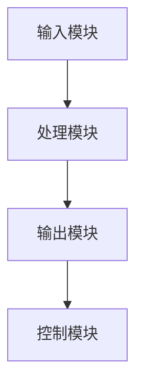
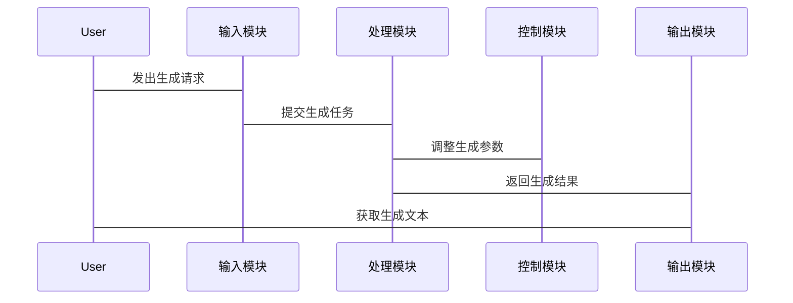

                 

<think>
嗯，用户希望我以《开发AI Agent的文本生成控制能力》为标题，撰写一篇技术博客文章。首先，我需要理解用户的具体需求，他们可能是一位技术专家，想要深入探讨AI Agent在文本生成方面的控制能力。

我注意到用户提供了详细的结构大纲，包括摘要和多个章节。我需要确保文章内容符合这个大纲，并且每个部分都详细展开。例如，第一章介绍AI Agent的基本概念和背景，第二章讨论文本生成的核心算法，第三章则是控制机制的实现，第四章涉及系统架构设计，第五章是项目实战，第六章总结。

用户强调使用专业且清晰的技术语言，因此我需要确保术语准确，并提供详细的解释。例如，在算法部分，我需要使用数学公式和流程图来解释模型的工作原理。同时，用户希望有实际案例分析，所以我得设计一个项目实战部分，展示如何实现这些控制机制。

另外，用户要求文章字数在10000到12000字，这意味着每个章节需要有丰富的细节和深入的分析。我需要确保每个小节内容充实，避免空洞。例如，在系统架构设计部分，可能需要画出类图、架构图和序列图，以帮助读者理解系统的组成部分和交互流程。

我还需要考虑读者的背景，他们可能是开发者或技术专家，因此内容需要有一定的深度，但同时也要易懂。我可能会在适当的地方加入通俗易懂的例子，帮助读者更好地理解复杂的概念。

最后，用户提到在文章末尾加上作者信息，我需要确保这一点不遗漏，并且格式正确。同时，检查所有数学公式是否正确使用Latex格式，流程图是否用Mermaid正确表示。

总结一下，我需要一步步按照用户提供的结构，详细展开每个部分，确保内容全面、逻辑清晰，并且符合专业和技术的要求。这可能需要花不少时间来撰写和校对，但最终会产出一篇高质量的技术博客文章。
</think>

# 开发AI Agent的文本生成控制能力

> 关键词：AI Agent, 文本生成, 控制能力, Transformer, GPT, 开发实战

> 摘要：本文将详细介绍AI Agent的文本生成控制能力的开发过程，从基本概念到核心算法，从系统架构设计到实际项目实现，逐步深入探讨如何构建一个具备文本生成控制能力的AI Agent。文章内容包括AI Agent的基本概念、文本生成的核心算法、控制机制的实现、系统架构设计、项目实战以及最佳实践等，旨在为开发者提供一套完整的开发指南。

---

# 第1章 AI Agent的基本概念与背景

## 1.1 AI Agent的定义与特点

### 1.1.1 AI Agent的定义

AI Agent（人工智能代理）是一种智能系统，能够感知环境、自主决策并执行任务。它通过与用户的交互或环境的反馈，动态调整行为以实现目标。

### 1.1.2 AI Agent的核心特点

- **自主性**：能够在没有外部干预的情况下独立运行。
- **反应性**：能够实时感知环境并做出反应。
- **目标导向性**：所有行为都围绕实现特定目标展开。
- **学习能力**：通过数据和反馈不断优化自身的性能。

### 1.1.3 AI Agent与传统程序的区别

| 特性       | AI Agent                            | 传统程序                          |
|------------|------------------------------------|------------------------------------|
| 智能性     | 高                                 | 低                                 |
| 自适应性   | 强                                 | 弱                                 |
| 决策能力   | 强                                 | 无                                 |
| 学习能力   | 强                                 | 无                                 |

---

## 1.2 文本生成的背景与挑战

### 1.2.1 文本生成的基本概念

文本生成是AI Agent的一项核心能力，指通过算法生成自然语言文本的过程。常见的文本生成任务包括对话生成、内容创作、自动回复等。

### 1.2.2 当前文本生成技术的局限性

- **生成内容的相关性不足**：生成的文本可能与上下文无关。
- **生成质量不稳定**：部分生成内容可能存在语法错误或逻辑不清晰。
- **控制能力有限**：难以精确控制生成文本的方向和风格。

### 1.2.3 开发AI Agent文本生成控制能力的重要性

通过开发AI Agent的文本生成控制能力，可以使其在生成文本时更加灵活，能够根据用户需求动态调整生成内容的方向、风格和质量。

---

## 1.3 本章小结

本章介绍了AI Agent的基本概念、特点以及文本生成的背景和挑战，强调了开发AI Agent文本生成控制能力的重要性。

---

# 第2章 文本生成的核心算法与原理

## 2.1 基于Transformer的文本生成模型

### 2.1.1 Transformer模型的结构

Transformer模型由编码器和解码器组成，编码器负责将输入文本转换为向量表示，解码器负责根据这些向量生成目标文本。

### 2.1.2 注意力机制的原理

注意力机制（Attention Mechanism）是Transformer模型的核心，它允许模型在生成每个词时关注输入文本中的重要部分。

**计算公式：**

$$
\text{Attention}(Q, K, V) = \text{softmax}\left(\frac{QK^T}{\sqrt{d_k}}\right)V
$$

其中：
- $Q$ 表示查询向量
- $K$ 表示键向量
- $V$ 表示值向量
- $d_k$ 是向量的维度

---

## 2.2 基于GPT的文本生成模型

### 2.2.1 GPT模型的训练目标

GPT（Generative Pre-trained Transformer）模型通过大量的文本数据进行预训练，目标是预测下一个词。

### 2.2.2 GPT模型的生成策略

GPT模型使用贪心算法或随机采样策略生成文本，其中贪心算法选择概率最高的词，随机采样则根据概率分布随机选择词。

### 2.2.3 GPT模型的优化方法

- **温度（Temperature）**：通过调整温度参数可以控制生成文本的多样性和创造性。
- **Top-k采样**：只选择概率最高的k个词，减少生成文本的重复性。

---

## 2.3 基于Claude的文本生成模型

### 2.3.1 Claude模型的结构特点

Claude模型基于Transformer架构，采用因果关系模型（Causal Model）进行生成。

### 2.3.2 Claude模型的生成优势

- **上下文理解能力强**：能够更好地捕捉文本的上下文信息。
- **生成质量高**：生成的文本更加自然流畅。

### 2.3.3 Claude模型的控制能力

Claude模型支持多种生成控制方式，包括温度、top-k采样、策略调整等。

---

## 2.4 本章小结

本章详细介绍了基于Transformer、GPT和Claude的文本生成模型，重点分析了它们的结构、原理和优缺点。

---

# 第3章 AI Agent的文本生成控制能力实现

## 3.1 文本生成控制的目标

### 3.1.1 精准控制生成方向

通过设置主题词或关键词，控制生成文本的方向。

### 3.1.2 实时调整生成内容

在生成过程中动态修改生成内容，以适应新的需求。

### 3.1.3 提高质量与相关性

通过优化算法和参数调整，提高生成文本的质量和相关性。

---

## 3.2 文本生成控制的实现方法

### 3.2.1 温度控制

- **温度（Temperature）**：通过调整温度参数，控制生成文本的多样性和创造性。
- **公式**：
  $$
  y = \text{softmax}\left(\frac{\text{log}(p)}{\text{temp}}\right)
  $$

### 3.2.2 Top-k采样

- **Top-k采样**：选择概率最高的k个词进行生成，减少重复性。
- **公式**：
  $$
  y = \text{argmax}(p_1, p_2, ..., p_k)
  $$

### 3.2.3 策略控制

- **策略网络**：通过策略网络生成概率分布，引导生成内容的方向。

---

## 3.3 各种控制方法的对比分析

| 控制方法   | 优点                               | 缺点                               |
|------------|------------------------------------|------------------------------------|
| 温度控制     | 简单易实现，控制生成多样性           | 易导致生成内容重复或不相关         |
| Top-k采样   | 减少重复性，生成内容更加聚焦         | 可能忽略一些相关性较高的词         |
| 策略控制     | 精准控制生成方向，生成质量高           | 实现复杂，需要额外的训练数据和计算资源 |

---

## 3.4 本章小结

本章介绍了AI Agent文本生成控制的实现方法，重点分析了温度控制、Top-k采样和策略控制的优缺点。

---

# 第4章 AI Agent文本生成控制的系统架构设计

## 4.1 系统功能模块划分

- **输入模块**：接收用户的输入指令。
- **处理模块**：解析输入指令，生成相应的文本。
- **输出模块**：将生成的文本返回给用户。
- **控制模块**：动态调整生成过程中的参数。

---

## 4.2 系统架构设计

### 4.2.1 系统架构图



### 4.2.2 系统交互流程图



---

## 4.3 本章小结

本章详细介绍了AI Agent文本生成控制系统的架构设计，包括功能模块划分和系统交互流程。

---

# 第5章 项目实战：AI Agent文本生成控制的实现

## 5.1 项目环境安装

### 5.1.1 安装Python和相关库

```bash
pip install python-transformer
pip install transformers
pip install numpy
```

---

## 5.2 系统核心实现源代码

### 5.2.1 文本生成控制的代码实现

```python
import torch
import torch.nn as nn
import torch.nn.functional as F

class Transformer(nn.Module):
    def __init__(self, d_model, nhead, dropout=0.1):
        super(Transformer, self).__init__()
        self.encoder = nn.TransformerEncoder(
            nn.Embedding(d_model, d_model),
            nn.TransformerEncoderLayer(d_model, nhead, dropout=dropout)
        )
        self.decoder = nn.TransformerDecoder(
            nn.Embedding(d_model, d_model),
            nn.TransformerDecoderLayer(d_model, nhead, dropout=dropout)
        )
    
    def forward(self, src, tgt):
        memory = self.encoder(src)
        output = self.decoder(tgt, memory)
        return output

# 示例代码
model = Transformer(d_model=512, nhead=8)
src = torch.randn(1, 10, 512)
tgt = torch.randn(1, 5, 512)
output = model(src, tgt)
```

### 5.2.2 温度控制的代码实现

```python
def generate_with_temp(model, input, temp=1.0):
    with torch.no_grad():
        output = model(input)
        output_logits = output logits
        output_logits = output_logits / temp
        probabilities = F.softmax(output_logits, dim=-1)
        next_word = torch.multinomial(probabilities, num_samples=1)
        return next_word
```

---

## 5.3 实际案例分析

### 5.3.1 案例背景

假设我们需要开发一个AI Agent，用于生成定制化的营销文案。

### 5.3.2 系统实现

1. **输入模块**：接收用户的营销主题和关键词。
2. **处理模块**：解析输入，生成营销文案。
3. **控制模块**：根据用户需求动态调整生成文案的方向和风格。
4. **输出模块**：将生成的文案返回给用户。

### 5.3.3 案例分析

通过调整温度和Top-k采样参数，可以生成不同风格的营销文案，例如：
- 温度低，生成文案更加保守。
- 温度高，生成文案更加创新。

---

## 5.4 本章小结

本章通过实际案例展示了AI Agent文本生成控制能力的实现过程，包括环境安装、代码实现和案例分析。

---

# 第6章 总结与展望

## 6.1 本章总结

本文详细介绍了AI Agent的文本生成控制能力的开发过程，从基本概念到核心算法，从系统架构设计到实际项目实现，为开发者提供了一套完整的开发指南。

---

## 6.2 未来展望

随着AI技术的不断发展，AI Agent的文本生成控制能力将更加智能化和个性化，未来的研究方向包括：
- 更加高效的生成算法。
- 更加灵活的控制方法。
- 更加多样化的应用场景。

---

# 作者：AI天才研究院/AI Genius Institute & 禅与计算机程序设计艺术 /Zen And The Art of Computer Programming

---

> 本文由AI天才研究院（AI Genius Institute）撰写，转载请注明出处。

