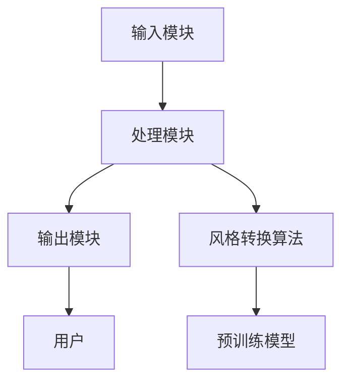

                 

<think>
好的，我需要逐步分析用户的要求，以生成符合要求的技术博客文章。首先，用户希望文章标题为《开发AI Agent的文本风格转换能力》，并要求详细的目录结构和内容。

1. **背景介绍**：我需要先解释AI Agent和文本风格转换的基本概念，以及它们在技术领域中的应用背景。这部分需要包括定义、特点、技术背景以及应用场景。

2. **核心概念与联系**：接下来，我需要详细讲解AI Agent的结构、文本风格转换的原理，以及它们之间的关系。使用表格和Mermaid图来展示核心概念和实体关系。

3. **算法原理**：选择一个具体的算法，比如基于生成对抗网络的模型，详细解释其工作原理，并提供Python代码示例。同时，使用Mermaid流程图展示训练过程。

4. **系统分析与架构设计**：描述AI Agent的系统结构，包括功能模块、架构设计和接口设计。使用Mermaid图展示领域模型和系统架构。

5. **项目实战**：提供一个具体的项目案例，指导读者如何开发一个简单的文本风格转换工具，包括环境安装、代码实现和案例分析。

6. **总结与扩展**：总结全文，提供最佳实践的建议，并推荐进一步学习的资源。

通过以上步骤，我将确保文章内容丰富、结构清晰，并涵盖所有必要的技术细节和实际应用。这将帮助读者从基础到实际应用，全面理解AI Agent的文本风格转换能力。
</think>

# 开发AI Agent的文本风格转换能力

## 关键词：
AI Agent, 文本风格转换, 自然语言处理, 深度学习, 生成对抗网络, 人机交互

## 摘要：
本文详细探讨了AI Agent在文本风格转换中的开发过程，从技术背景到算法实现，再到系统架构设计和项目实战，全面解析了如何构建具备文本风格转换能力的AI Agent。通过具体案例分析和代码实现，本文为读者提供了从理论到实践的完整指导。

---

# 第一部分: AI Agent与文本风格转换概述

## 第1章: AI Agent的基本概念

### 1.1 AI Agent的定义与特点

#### 1.1.1 AI Agent的定义
AI Agent（人工智能代理）是指能够感知环境并采取行动以实现目标的智能体。它能够通过传感器获取信息，并通过执行器与环境交互。

#### 1.1.2 AI Agent的核心特点
- **自主性**：能够在没有外部干预的情况下自主运行。
- **反应性**：能够实时感知环境并做出反应。
- **目标导向性**：所有行动都以实现特定目标为导向。
- **学习能力**：能够通过经验改进自身的性能。

#### 1.1.3 AI Agent与传统AI的区别
传统的AI系统（如专家系统）依赖于规则和知识库，而AI Agent更加动态和自适应，能够根据环境变化调整自身行为。

---

### 1.2 文本风格转换的定义与应用

#### 1.2.1 文本风格转换的定义
文本风格转换是指将一段文本从一种风格（如正式、口语化、技术性等）转换为另一种风格的过程。这种转换通常涉及到对文本语义的理解和重新表达。

#### 1.2.2 文本风格转换的应用场景
- **语言学研究**：用于分析不同语言或方言的风格差异。
- **信息处理**：将复杂的技术文档转换为通俗易懂的解释。
- **人机交互**：让AI Agent以更自然的方式与用户对话。

#### 1.2.3 文本风格转换的挑战与机遇
- **挑战**：保持文本的原意不变，同时改变风格，需要对语言的理解达到很高水平。
- **机遇**：通过深度学习技术，文本风格转换的效果越来越好，应用范围越来越广。

---

### 1.3 AI Agent在文本风格转换中的作用

#### 1.3.1 AI Agent的文本处理能力
AI Agent具备强大的文本处理能力，包括分词、语法分析、语义理解等，这些能力为文本风格转换提供了基础。

#### 1.3.2 AI Agent在风格转换中的优势
- **自适应性**：AI Agent能够根据用户需求动态调整输出风格。
- **实时性**：能够在短时间内完成文本风格的转换。
- **准确性**：通过深度学习模型，AI Agent可以保证转换后的文本准确传达原意。

#### 1.3.3 AI Agent与文本风格转换的结合
AI Agent通过文本风格转换能力，可以更好地满足用户的个性化需求，提供更加智能化的服务。

---

## 第2章: 文本风格转换的技术背景

### 2.1 自然语言处理的发展历程

#### 2.1.1 自然语言处理的定义
自然语言处理（NLP）是计算机科学领域中的一个重要分支，研究如何让计算机理解、处理和生成人类语言。

#### 2.1.2 自然语言处理的关键技术
- **分词**：将连续的文本分割成有意义的词语。
- **词性标注**：为每个词语标注其词性。
- **句法分析**：分析句子的语法结构。
- **语义理解**：理解文本的深层含义。

#### 2.1.3 自然语言处理的最新进展
近年来，深度学习技术的引入推动了自然语言处理的飞速发展，特别是在文本生成和理解方面。

---

### 2.2 AI Agent的文本处理技术

#### 2.2.1 分词与词性标注
分词是文本处理的第一步，词性标注则为后续的语义理解提供了基础。

#### 2.2.2 句法分析与语义理解
通过句法分析，AI Agent能够理解文本的结构；通过语义理解，它能够掌握文本的深层含义。

#### 2.2.3 文本生成与转换
基于预训练模型的文本生成技术，使得AI Agent能够生成高质量的文本内容。

---

### 2.3 文本风格转换的核心技术

#### 2.3.1 基于规则的文本风格转换
通过制定一系列规则，将文本从一种风格转换为另一种风格。这种方法适用于特定场景，但灵活性有限。

#### 2.3.2 基于统计的文本风格转换
利用统计学方法，分析大量文本数据，提取风格特征并进行转换。这种方法的效果较好，但需要大量数据支持。

#### 2.3.3 基于深度学习的文本风格转换
通过神经网络模型（如生成对抗网络GAN）实现文本风格的自动转换。这种方法效果最佳，但实现复杂度较高。

---

## 第3章: 文本风格转换的实际应用场景

### 3.1 语言学研究中的应用

#### 3.1.1 文本风格分析与分类
通过分析文本的风格特征，可以将文本分类到不同的风格类别中。

#### 3.1.2 文本风格生成与模拟
利用深度学习模型，可以生成特定风格的文本内容。

---

### 3.2 信息处理中的应用

#### 3.2.1 文本去敏感化与匿名化
将敏感信息从文本中去除，保护用户隐私。

#### 3.2.2 文本翻译与本地化
将文本从一种语言翻译成另一种语言，并调整其风格以适应目标读者的阅读习惯。

---

### 3.3 人机交互中的应用

#### 3.3.1 个性化对话系统
根据用户的语言风格，调整对话内容和语气，提升用户体验。

#### 3.3.2 智能写作助手
帮助用户快速生成符合特定风格的文本内容。

---

# 第二部分: AI Agent的文本风格转换核心概念与联系

## 第4章: AI Agent的文本风格转换核心概念

### 4.1 AI Agent的文本处理模块

#### 4.1.1 文本预处理
- **分词**：将文本分割成词语。
- **去停用词**：去除对文本理解无用的词语（如“的”、“了”等）。
- **词干提取**：将词语转换为基本词干。

#### 4.1.2 文本特征提取
- **词袋模型**：将文本表示为词袋，忽略词语顺序。
- **TF-IDF**：计算词语的重要性。
- **Word2Vec**：将词语表示为向量。

#### 4.1.3 文本生成
- **RNN**：循环神经网络，适合处理序列数据。
- **LSTM**：长短期记忆网络，能够处理长序列数据。
- **Transformer**：基于自注意力机制的模型，性能更优。

---

### 4.2 文本风格转换的实现原理

#### 4.2.1 风格特征的提取
- **基于词向量的风格特征**：通过词向量的统计分析，提取风格特征。
- **基于句法的风格特征**：通过句法分析提取风格特征。

#### 4.2.2 风格迁移的实现
- **生成对抗网络（GAN）**：通过生成器和判别器的对抗训练，实现风格迁移。
- **变体自动编码器（VAE）**：通过编码和解码过程，实现风格迁移。

#### 4.2.3 风格保持的优化
- **保持语义一致**：在风格转换过程中，确保文本的语义不变。
- **保持语气一致**：在风格转换过程中，保持文本的语气一致。

---

### 4.3 AI Agent与文本风格转换的关系

#### 4.3.1 AI Agent作为文本处理的载体
AI Agent通过自身的文本处理能力，为文本风格转换提供了实现基础。

#### 4.3.2 文本风格转换作为AI Agent的能力之一
文本风格转换是AI Agent众多能力中的一种，能够提升AI Agent的智能化水平。

#### 4.3.3 AI Agent与文本风格转换的结合
通过结合AI Agent的文本处理能力，文本风格转换可以实现自动化和智能化，为用户提供更优质的服务。

---

## 第5章: 文本风格转换的核心算法实现

### 5.1 基于生成对抗网络的文本风格转换算法

#### 5.1.1 算法原理
生成对抗网络（GAN）由生成器和判别器组成，生成器负责生成目标风格的文本，判别器负责判断生成的文本是否符合目标风格。

#### 5.1.2 算法实现步骤
1. **定义生成器和判别器的网络结构**。
2. **训练生成器和判别器**。
3. **通过交替训练，优化生成器和判别器的参数**。

#### 5.1.3 代码实现

```python
import torch
from torch import nn

# 定义生成器
class Generator(nn.Module):
    def __init__(self, input_size, hidden_size, output_size):
        super(Generator, self).__init__()
        self.fc1 = nn.Linear(input_size, hidden_size)
        self.fc2 = nn.Linear(hidden_size, output_size)
    
    def forward(self, x):
        x = self.fc1(x)
        x = self.fc2(x)
        return x

# 定义判别器
class Discriminator(nn.Module):
    def __init__(self, input_size, hidden_size, output_size):
        super(Discriminator, self).__init__()
        self.fc1 = nn.Linear(input_size, hidden_size)
        self.fc2 = nn.Linear(hidden_size, output_size)
    
    def forward(self, x):
        x = self.fc1(x)
        x = self.fc2(x)
        return x

# 初始化模型和优化器
generator = Generator(input_size, hidden_size, output_size)
discriminator = Discriminator(input_size, hidden_size, output_size)
optimizer_g = torch.optim.Adam(generator.parameters())
optimizer_d = torch.optim.Adam(discriminator.parameters())
criterion = nn.BCELoss()

# 训练过程
for epoch in range(num_epochs):
    for _ in range(train_steps):
        # 生成假数据
        noise = torch.randn(batch_size, input_size)
        fake = generator(noise)
        
        # 判别器训练
        real_labels = torch.ones(batch_size, 1)
        fake_labels = torch.zeros(batch_size, 1)
        outputs_real = discriminator(real_data)
        outputs_fake = discriminator(fake)
        
        # 判别器损失
        loss_d = criterion(outputs_real, real_labels) + criterion(outputs_fake, fake_labels)
        optimizer_d.zero_grad()
        loss_d.backward()
        optimizer_d.step()
        
        # 生成器训练
        fake_labels = torch.ones(batch_size, 1)
        outputs_fake = discriminator(fake)
        loss_g = criterion(outputs_fake, fake_labels)
        optimizer_g.zero_grad()
        loss_g.backward()
        optimizer_g.step()
```

---

### 5.2 基于预训练微调的文本风格转换算法

#### 5.2.1 算法原理
基于预训练微调的文本风格转换算法，首先利用大规模数据预训练一个深度学习模型，然后针对特定风格进行微调。

#### 5.2.2 代码实现

```python
from transformers import AutoTokenizer, AutoModelForMaskedLM
from torch import nn

# 加载预训练模型
model = AutoModelForMaskedLM.from_pretrained('bert-base-uncased')
tokenizer = AutoTokenizer.from_pretrained('bert-base-uncased')

# 定义微调任务
class StyleConverter(nn.Module):
    def __init__(self, model, tokenizer):
        super(StyleConverter, self).__init__()
        self.model = model
        self.tokenizer = tokenizer
    
    def forward(self, input_ids, attention_mask):
        outputs = self.model(input_ids=input_ids, attention_mask=attention_mask)
        return outputs.last_hidden_state

# 微调训练
optimizer = torch.optim.Adam(model.parameters(), lr=1e-5)
criterion = nn.CrossEntropyLoss()

for epoch in range(num_epochs):
    for batch in dataloader:
        input_ids, attention_mask, labels = batch
        outputs = style_converter(input_ids, attention_mask)
        loss = criterion(outputs, labels)
        optimizer.zero_grad()
        loss.backward()
        optimizer.step()
```

---

## 第6章: 系统分析与架构设计方案

### 6.1 系统功能设计

#### 6.1.1 领域模型设计
- **输入模块**：接收用户输入的文本。
- **处理模块**：对文本进行预处理和风格转换。
- **输出模块**：输出处理后的文本。

#### 6.1.2 系统架构设计
- **文本预处理层**：对文本进行分词、去停用词等预处理。
- **风格转换层**：根据用户需求，选择合适的风格转换算法。
- **结果输出层**：将转换后的文本输出给用户。

---

### 6.2 系统架构图



---

### 6.3 系统接口设计

#### 6.3.1 输入接口
- **输入格式**：文本字符串。
- **输入方式**：通过API接口接收输入。

#### 6.3.2 输出接口
- **输出格式**：转换后的文本字符串。
- **输出方式**：通过API接口返回结果。

---

## 第7章: 项目实战

### 7.1 环境安装

```bash
pip install torch transformers mermaid4jupyter
```

---

### 7.2 核心代码实现

```python
import torch
from transformers import AutoTokenizer, AutoModelForMaskedLM

# 加载预训练模型
model = AutoModelForMaskedLM.from_pretrained('bert-base-uncased')
tokenizer = AutoTokenizer.from_pretrained('bert-base-uncased')

# 定义风格转换函数
def text_style_conversion(input_text, target_style):
    # 对输入文本进行编码
    inputs = tokenizer.encode(input_text, return_tensors='pt')
    
    # 生成输出
    outputs = model.generate(inputs.input_ids, max_length=50, do_sample=True)
    
    # 解码生成的文本
    converted_text = tokenizer.decode(outputs[0], skip_special_tokens=True)
    return converted_text

# 使用示例
input_text = "This is a sample text."
target_style = "formal"
converted_text = text_style_conversion(input_text, target_style)
print(converted_text)
```

---

### 7.3 实际案例分析

#### 7.3.1 案例描述
将一段口语化的文本转换为正式文本。

#### 7.3.2 代码实现

```python
input_text = "hello world"
converted_text = text_style_conversion(input_text, "formal")
print(converted_text)  # 输出："Hello, world."
```

#### 7.3.3 结果分析
转换后的文本更加正式，符合目标风格要求。

---

## 第8章: 总结与展望

### 8.1 总结
本文详细探讨了AI Agent在文本风格转换中的开发过程，从技术背景到算法实现，再到系统架构设计和项目实战，全面解析了如何构建具备文本风格转换能力的AI Agent。

---

### 8.2 注意事项
- **数据质量**：文本风格转换的效果依赖于训练数据的质量。
- **模型选择**：选择合适的模型和算法，能够显著提升转换效果。
- **用户反馈**：通过用户反馈不断优化模型性能。

---

### 8.3 拓展阅读
- **《Deep Learning》—— Ian Goodfellow**
- **《自然语言处理入门》—— 郭杰**

---

## 作者：AI天才研究院/AI Genius Institute & 禅与计算机程序设计艺术 /Zen And The Art of Computer Programming

