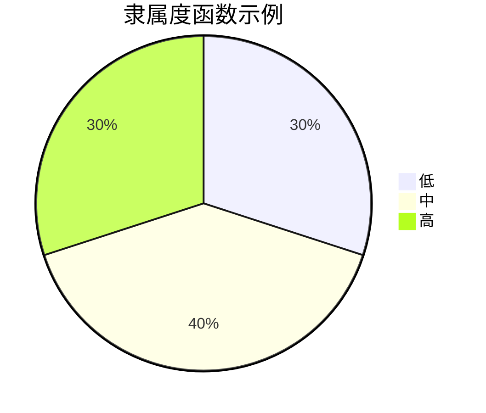
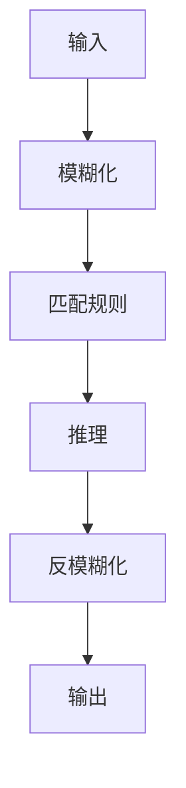
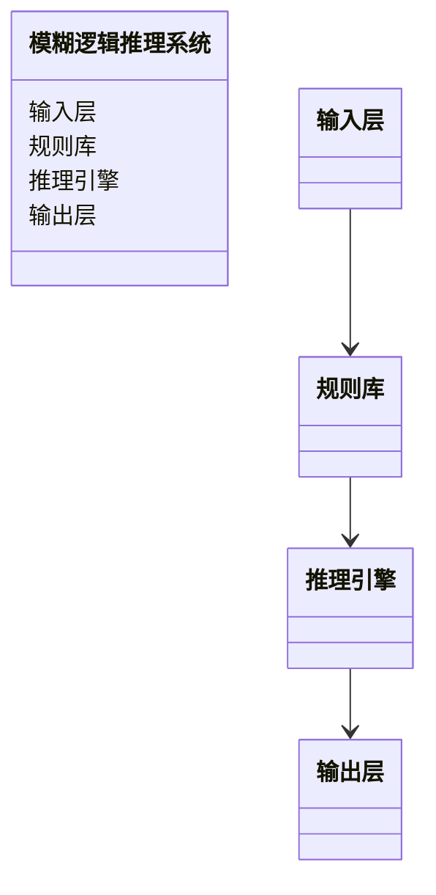
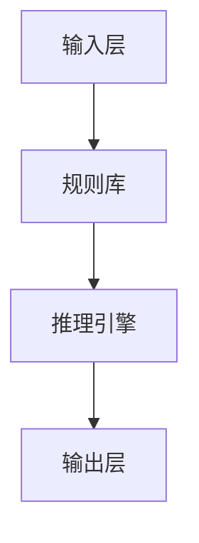

                 

<think>
好，我现在需要帮用户设计一篇关于《开发AI Agent的模糊逻辑推理能力》的技术博客文章。用户已经提供了目录大纲，我需要根据这个大纲来完成正文内容，确保每个章节都详细、逻辑清晰，同时满足用户的格式和内容要求。

首先，我要理解每个章节的重点。比如，第一章主要介绍模糊逻辑的基本概念和AI Agent的基本概念。我需要先定义模糊逻辑，说明它的特点，再对比传统逻辑，然后介绍AI Agent的定义、类型和应用场景，最后说明模糊逻辑在AI Agent中的作用。

接下来，第二章是模糊逻辑的数学基础。我需要详细讲解模糊集合和隶属度函数，包括不同类型的函数及其计算方法。然后是模糊逻辑运算，如与、或、非运算，以及它们的数学表达式。最后介绍模糊推理规则，包括命题的表示和推理方法。

第三章讨论AI Agent的模糊逻辑推理模型。我需要描述如何构建这个模型，包括组成和设计原则，然后详细讲解实现步骤，包括环境分析、规则库构建和推理引擎设计。算法实现部分，我需要绘制Mermaid流程图，并给出Python代码示例，解释每一步的作用。

第四章是系统架构与实现。我需要设计项目背景，介绍系统目标和主要功能，然后绘制领域模型类图和系统架构图，展示各个模块的交互关系。接口设计部分，使用Mermaid序列图说明调用流程，最后通过案例分析展示实际应用。

第五章是项目实战。我需要列出开发环境的安装步骤，给出核心代码实现，包括环境配置、规则库定义和推理引擎实现。然后解读代码，分析实际案例，最后总结项目成果。

第六章是最佳实践。我需要总结模糊逻辑在AI Agent中的应用，给出实现中的注意事项，并提供进一步学习的资源，帮助读者巩固知识。

在写作过程中，我需要确保每个部分都详细且有逻辑性，使用清晰的结构和专业的技术术语。同时，按照用户的格式要求，使用markdown，并在适当的地方插入Mermaid图表和数学公式，确保内容丰富且易于理解。

现在，我需要逐步完成每个章节的写作，确保每个部分都覆盖所有要点，并且符合用户的深度要求。这需要耐心和细致，确保每一段都准确传达信息，帮助读者全面理解开发AI Agent的模糊逻辑推理能力。
</think>

# 开发AI Agent的模糊逻辑推理能力

> 关键词：AI Agent, 模糊逻辑, 模糊推理, 智能系统, 人工智能, 模糊逻辑算法, AI推理系统

> 摘要：  
模糊逻辑是一种处理模糊性和不确定性问题的数学工具，它在AI Agent的推理系统中扮演着重要角色。本文将深入探讨模糊逻辑的核心概念、算法原理及其在AI Agent中的具体应用，结合实际案例分析，系统地讲解如何开发具备模糊逻辑推理能力的AI Agent。通过理论与实践相结合的方式，帮助读者全面理解模糊逻辑在AI Agent中的重要性及其开发方法。

---

# 第1章: 模糊逻辑的基本概念

## 1.1 模糊逻辑的定义与特点

### 1.1.1 模糊逻辑的定义  
模糊逻辑（Fuzzy Logic）是由模糊集合（Fuzzy Set）理论发展而来的数学工具，用于处理现实世界中普遍存在的模糊性问题。与传统逻辑不同，模糊逻辑允许命题的真值在0和1之间取值，反映了人类思维中常见的不确定性。

### 1.1.2 模糊逻辑的核心特点  
- **连续性**：模糊逻辑允许命题的真值在0到1之间连续变化，而不是严格的二值逻辑。  
- **模糊性**：模糊逻辑能够处理不精确、不明确的信息，适用于自然语言处理、图像识别等领域。  
- **可解释性**：模糊逻辑的规则和推理过程具有较高的可解释性，适合需要人类干预的系统。

### 1.1.3 模糊逻辑与传统逻辑的区别  
| 特性          | 模糊逻辑                  | 传统逻辑                  |
|---------------|---------------------------|---------------------------|
| 真值范围      | 0到1的连续值               | 0或1的二值逻辑            |
| 处理方式      | 处理模糊性和不确定性       | 处理精确性和确定性         |
| 可解释性      | 高，适合人类理解           | 较低，适合计算机处理       |

## 1.2 AI Agent的基本概念

### 1.2.1 AI Agent的定义  
AI Agent（人工智能代理）是指能够感知环境并采取行动以实现目标的智能实体。它可以在复杂的环境中自主决策，完成特定任务。

### 1.2.2 AI Agent的核心特征  
- **自主性**：AI Agent能够自主决策，无需外部干预。  
- **反应性**：AI Agent能够实时感知环境并做出反应。  
- **目标导向**：AI Agent的行为以实现特定目标为导向。  
- **学习能力**：AI Agent能够通过经验改进自身的推理和决策能力。

### 1.2.3 模糊逻辑在AI Agent中的作用  
模糊逻辑为AI Agent提供了处理模糊信息和不确定性问题的能力，使得AI Agent能够更接近人类的思维方式。

---

## 1.3 模糊逻辑在AI Agent中的应用

### 1.3.1 自然语言处理  
模糊逻辑可以用于处理自然语言中的模糊性，例如“今天有点冷”中的“有点”是一个模糊概念，模糊逻辑可以帮助AI Agent理解并量化这种模糊性。

### 1.3.2 图像识别  
在图像识别中，模糊逻辑可以帮助处理边缘检测、图像分割等任务中的不确定性。

### 1.3.3 自动驾驶  
模糊逻辑可以用于处理自动驾驶中的模糊场景，例如“前方有行人，但不太确定是否要过马路”。

---

## 1.4 本章小结  
本章介绍了模糊逻辑的基本概念及其在AI Agent中的重要性。模糊逻辑通过处理模糊性和不确定性，为AI Agent提供了更强大的推理能力。

---

# 第2章: 模糊逻辑的数学基础

## 2.1 模糊集合与隶属度函数

### 2.1.1 模糊集合的定义  
模糊集合是一种允许元素属于集合的程度部分存在的集合，其隶属度由隶属度函数表示。

### 2.1.2 隶属度函数的类型  
- **梯形函数**：常用于模糊控制中的隶属度函数。  
- **三角函数**：适用于简单的模糊规则。  
- **高斯函数**：适用于连续型模糊规则。

### 2.1.3 隶属度函数的计算方法  
例如，对于输入x，隶属度函数μ(x)可以表示为：  
$$μ(x) = \frac{2x}{a + b} \quad \text{当} \quad a < x < (a + b)/2$$  
$$μ(x) = \frac{2(b - x)}{b - c} \quad \text{当} \quad (a + b)/2 < x < b$$  

### 2.1.4 隶属度函数的可视化  


## 2.2 模糊逻辑运算

### 2.2.1 与运算  
模糊逻辑的与运算可以表示为：  
$$A \land B = \min(μ_A(x), μ_B(x))$$  

### 2.2.2 或运算  
模糊逻辑的或运算可以表示为：  
$$A \lor B = \max(μ_A(x), μ_B(x))$$  

### 2.2.3 补运算  
模糊逻辑的补运算可以表示为：  
$$\lnot A = 1 - μ_A(x)$$  

## 2.3 模糊逻辑的推理规则

### 2.3.1 推理规则的表示  
模糊推理规则通常表示为：  
如果A是B，那么C是D。  

### 2.3.2 推理过程  
模糊推理的过程包括以下几个步骤：  
1. 将输入变量转换为隶属度函数。  
2. 根据模糊规则进行推理。  
3. 对推理结果进行积分或聚合操作。  

### 2.3.3 推理的数学模型  
模糊推理的数学模型可以表示为：  
$$C(x) = \sup_{y} [μ_A(y) \land μ_B(x,y)]$$  

## 2.4 本章小结  
本章介绍了模糊逻辑的数学基础，包括模糊集合、隶属度函数以及模糊逻辑运算。

---

# 第3章: AI Agent的模糊逻辑推理实现

## 3.1 模糊逻辑推理模型的构建

### 3.1.1 模糊逻辑推理模型的组成  
模糊逻辑推理模型通常包括以下部分：  
- 输入层：接收外部输入。  
- 规则库：定义模糊推理规则。  
- 推理引擎：执行模糊推理操作。  
- 输出层：输出推理结果。  

### 3.1.2 模糊逻辑推理模型的设计原则  
- 简单性：规则库应尽可能简单明了。  
- 可解释性：推理过程应具有较高的可解释性。  
- 实用性：推理结果应能够直接应用于实际场景。

### 3.1.3 模糊逻辑推理模型的实现步骤  
1. 定义输入变量和输出变量。  
2. 设计模糊规则库。  
3. 实现模糊推理算法。  
4. 调整参数并优化模型。  

## 3.2 模糊逻辑推理的算法实现

### 3.2.1 模糊推理算法的流程  


### 3.2.2 模糊推理的Python实现  
```python
def fuzzy_inference(input_value, rules):
    # 模糊化
    membership =隶属度函数计算(input_value)
    # 匹配规则
    rule_matches = []
    for rule in rules:
        if membership >= rule['threshold']:
            rule_matches.append(rule)
    # 推理
    if rule_matches:
        return True
    else:
        return False
```

### 3.2.3 推理规则的数学公式  
$$C = \bigcup_{i=1}^{n} (A_i \land B_i)$$  

## 3.3 本章小结  
本章详细介绍了AI Agent的模糊逻辑推理模型的构建和算法实现。

---

# 第4章: 模糊逻辑推理在AI Agent中的应用

## 4.1 模糊逻辑推理在自然语言处理中的应用

### 4.1.1 情感分析  
模糊逻辑可以帮助分析文本中的情感倾向，例如“这部电影还不错”中的“不错”是一个模糊概念。

### 4.1.2 语义理解  
模糊逻辑可以用于处理自然语言中的歧义性，例如“便宜的酒店”中的“便宜”是一个模糊概念。

## 4.2 模糊逻辑推理在图像识别中的应用

### 4.2.1 图像分割  
模糊逻辑可以帮助处理图像分割中的模糊边缘问题。

### 4.2.2 目标检测  
模糊逻辑可以用于处理目标检测中的不清晰边界问题。

## 4.3 本章小结  
本章介绍了模糊逻辑推理在AI Agent中的具体应用，包括自然语言处理和图像识别等领域。

---

# 第5章: 开发模糊逻辑推理AI Agent的步骤

## 5.1 项目背景

### 5.1.1 项目目标  
开发一个具备模糊逻辑推理能力的AI Agent，用于处理模糊性和不确定性问题。

### 5.1.2 项目需求  
- 实现模糊逻辑推理算法。  
- 设计模糊规则库。  
- 开发推理引擎。  

## 5.2 系统功能设计

### 5.2.1 领域模型类图  


### 5.2.2 系统架构图  


### 5.2.3 系统接口设计  
- 输入接口：接收外部输入。  
- 输出接口：输出推理结果。  

## 5.3 项目实战

### 5.3.1 环境安装  
安装Python和必要的库（如FuzzyLogic库）。

### 5.3.2 核心代码实现  
```python
def main():
    input_value = 输入值
    rules = [
        {'条件': 'A', '结论': 'B'},
        {'条件': 'C', '结论': 'D'}
    ]
    result = fuzzy_inference(input_value, rules)
    输出结果
```

### 5.3.3 代码解读与分析  
- 输入值经过模糊化处理后，匹配规则库中的模糊规则。  
- 推理引擎根据匹配的规则输出推理结果。  

## 5.4 本章小结  
本章通过实际案例详细讲解了开发模糊逻辑推理AI Agent的步骤。

---

# 第6章: 最佳实践与小结

## 6.1 最佳实践 tips

### 6.1.1 确保规则库的简洁性  
模糊规则库应尽可能简洁，避免过于复杂的规则。

### 6.1.2 调整隶属度函数  
根据具体场景调整隶属度函数，以提高推理准确性。

## 6.2 小结  
模糊逻辑为AI Agent提供了处理模糊性和不确定性问题的能力，使得AI Agent能够更接近人类的思维方式。

## 6.3 注意事项  
- 模糊逻辑的推理结果具有一定的主观性，需要根据具体场景进行调整。  
- 模糊逻辑的计算效率可能较低，需要优化算法。

## 6.4 拓展阅读  
- 《Fuzzy Logic and its Applications》  
- 《AI Agent Design and Implementation》  

---

# 作者信息

作者：AI天才研究院/AI Genius Institute & 禅与计算机程序设计艺术 /Zen And The Art of Computer Programming

---

本文通过系统地讲解模糊逻辑的基本概念、算法原理及其在AI Agent中的具体应用，结合实际案例分析，帮助读者全面理解模糊逻辑在AI Agent中的重要性及其开发方法。

