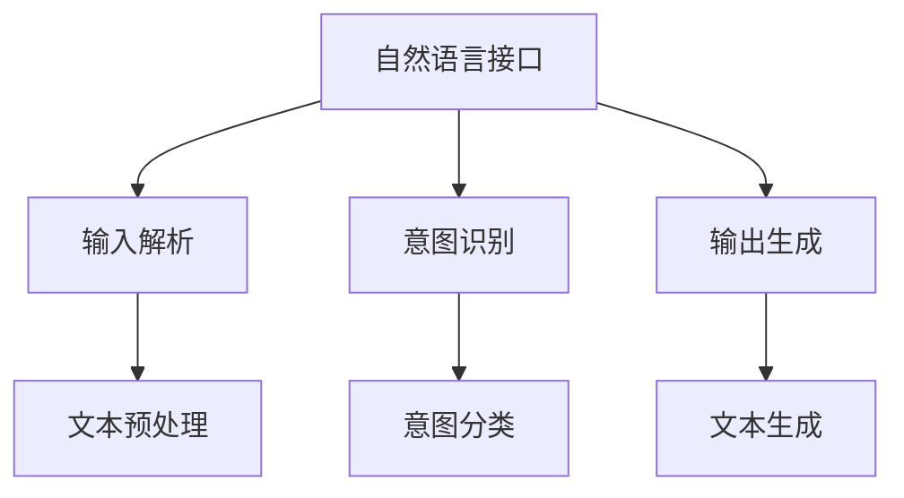
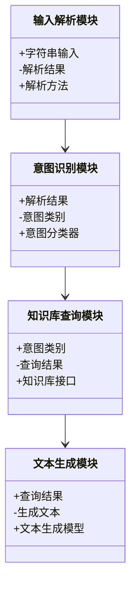
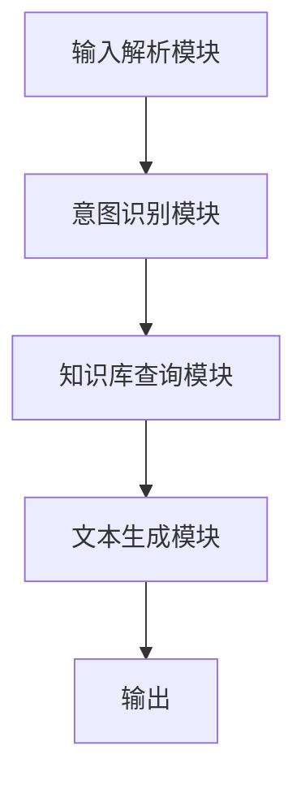
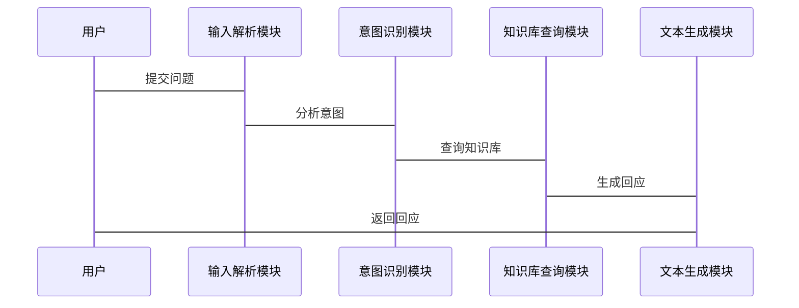

                 

<think>
嗯，我现在需要帮用户撰写一篇关于《开发AI Agent的自然语言接口设计》的技术博客文章。用户已经提供了一个详细的目录大纲，我需要按照这个大纲逐步完成每个部分的内容。首先，我应该从引言开始，介绍AI Agent和自然语言接口的基本概念，然后逐步深入到核心概念、算法原理、系统架构设计、项目实战以及最佳实践。

首先，引言部分需要吸引读者，说明为什么自然语言接口在AI Agent中的设计如此重要，以及它在当前技术趋势中的地位。接着，背景介绍中需要详细解释AI Agent和NLP的基本概念，以及它们如何结合。这部分可能需要一些简单的例子来帮助读者理解。

接下来是核心概念与联系，这部分需要详细分析自然语言理解（NLU）和自然语言生成（NLG）的原理，以及它们在AI Agent中的具体应用。可能需要用ER图来展示实体关系，确保读者能够清晰理解各部分之间的联系。

然后是算法原理部分，这里需要深入讲解分词、词性标注等NLP算法。可能需要使用Mermaid流程图来展示算法步骤，并提供Python代码示例，解释每个步骤的作用和实现细节。同时，数学公式也需要用Latex来呈现，确保内容准确且易于理解。

在系统分析与架构设计章节，需要介绍如何将理论应用到实际系统中。这部分可能需要绘制类图、架构图和序列图，展示系统的整体结构和交互流程。项目实战部分则需要提供一个具体的案例，包括环境安装、代码实现、案例分析等，让读者能够动手实践。

最后是最佳实践部分，总结开发过程中需要注意的事项，提供一些实用的建议，并引导读者进一步学习。这可能包括一些代码优化技巧、测试方法以及性能调优策略。

在撰写过程中，我需要确保每个部分都详细且条理清晰，同时使用专业的技术术语，但又要通俗易懂。可能需要多次修改和调整，确保内容准确无误，结构合理。

总体来说，我需要按照用户提供的目录大纲，逐步完成每个部分的内容，确保涵盖所有关键点，并提供足够的细节和例子，帮助读者全面理解AI Agent的自然语言接口设计。
</think>

# 开发AI Agent的自然语言接口设计

> 关键词：AI Agent, 自然语言接口, NLP, NLU, NLG, 人工智能

> 摘要：本文详细探讨了AI Agent的自然语言接口设计的核心概念、算法原理、系统架构和项目实战。通过逐步分析，帮助读者掌握自然语言处理在AI Agent中的应用，从理论到实践，全面解析自然语言接口的设计与实现。

---

## 第1章: AI Agent与自然语言接口的背景介绍

### 1.1 AI Agent的基本概念
AI Agent（人工智能代理）是指能够感知环境并采取行动以实现目标的智能实体。它可以是一个软件程序、机器人或其他智能系统。AI Agent的核心能力在于它能够理解用户的需求，并通过执行一系列操作来满足这些需求。自然语言接口是AI Agent与用户进行交互的主要方式，它使用户能够以自然语言（如中文、英文）与AI Agent进行对话。

#### 1.1.1 AI Agent的定义与分类
- **定义**：AI Agent是一种智能实体，能够通过感知环境并采取行动来实现特定目标。
- **分类**：
  - **简单反射型**：基于规则直接响应输入。
  - **基于模型的反应型**：使用内部模型理解和响应输入。
  - **目标驱动型**：根据目标选择行动。
  - **实用驱动型**：通过效用函数优化行动。

#### 1.1.2 自然语言处理（NLP）的定义与作用
- **定义**：NLP是研究如何让计算机理解和生成人类语言的科学。
- **作用**：使AI Agent能够理解用户输入的自然语言，并生成符合用户需求的自然语言输出。

#### 1.1.3 AI Agent与NLP的结合意义
AI Agent通过自然语言接口，能够更自然、更高效地与用户交互，提升用户体验。NLP技术的进步使得AI Agent能够更准确地理解用户意图并生成相应的回应。

---

### 1.2 自然语言接口的发展历程
自然语言接口的发展经历了多个阶段，从早期的基于规则的系统到现代的深度学习模型，技术不断进步。

#### 1.2.1 自然语言处理技术的历史演变
- **基于规则的系统**：依赖手动编写的规则，如专家系统。
- **统计学习方法**：基于概率模型，如袋模型（Bag-of-Words）。
- **深度学习模型**：基于神经网络，如循环神经网络（RNN）、Transformer架构。

#### 1.2.2 AI Agent技术的演进与应用
- **早期阶段**：简单的基于规则的对话系统。
- **发展阶段**：结合NLP技术的智能助手，如 Siri、Alexa。
- **当前阶段**：基于大语言模型（LLM）的AI Agent，如 ChatGPT。

#### 1.2.3 当前自然语言接口的现状与趋势
- **现状**：自然语言接口广泛应用于智能客服、智能家居、虚拟助手等领域。
- **趋势**：向更智能、更自然的交互方向发展，支持多模态输入输出。

---

### 1.3 本书的核心目标与内容框架
本书旨在帮助读者掌握AI Agent自然语言接口的设计与实现，从基础概念到实际应用进行全面解析。

#### 1.3.1 本书的核心目标
- 掌握自然语言接口的核心概念与原理。
- 学习AI Agent的系统架构设计与实现方法。
- 掌握自然语言接口的算法实现与优化技巧。

#### 1.3.2 本书的主要内容框架
- 第1章：背景介绍。
- 第2章：核心概念与联系。
- 第3章：算法原理。
- 第4章：系统分析与架构设计。
- 第5章：项目实战。
- 第6章：最佳实践与优化。
- 第7章：总结与展望。

#### 1.3.3 本书的读者群体与适用场景
- **读者群体**：AI开发人员、NLP工程师、软件架构师。
- **适用场景**：AI Agent开发、智能系统设计、自然语言处理应用。

---

## 第2章: 自然语言接口的核心概念与联系

### 2.1 自然语言接口的核心概念
自然语言接口由自然语言理解（NLU）和自然语言生成（NLG）两部分组成。

#### 2.1.1 自然语言理解（NLU）的原理与特点
- **原理**：将用户输入的自然语言转换为计算机可理解的结构化数据。
- **特点**：
  - **输入解析**：分词、词性标注、句法分析。
  - **意图识别**：识别用户的意图和需求。
  - **实体识别**：提取文本中的实体信息。

#### 2.1.2 自然语言生成（NLG）的原理与特点
- **原理**：将结构化数据转换为自然语言输出。
- **特点**：
  - **输出生成**：文本生成、语音合成。
  - **风格控制**：生成符合特定风格的文本。

#### 2.1.3 NLU与NLG的结合与应用
NLU负责理解用户输入，NLG负责生成输出，两者结合使AI Agent能够实现自然的双向交互。

---

### 2.2 AI Agent与自然语言接口的关系
AI Agent通过自然语言接口实现与用户的交互，自然语言接口是AI Agent的核心组成部分。

#### 2.2.1 AI Agent的输入输出模型
- **输入模型**：用户输入的自然语言文本。
- **输出模型**：AI Agent生成的自然语言回应。

#### 2.2.2 自然语言接口在AI Agent中的角色
- **输入解析**：将用户输入转换为系统可理解的结构。
- **输出生成**：将系统输出转换为用户可理解的自然语言。

#### 2.2.3 自然语言接口的边界与外延
- **边界**：自然语言接口仅处理语言相关的问题，不涉及其他功能。
- **外延**：自然语言接口可以与其他模块（如知识库、推理引擎）结合使用。

---

### 2.3 核心概念的实体关系图
以下是一个展示核心概念的ER图：



---

## 第3章: 自然语言接口的算法原理

### 3.1 自然语言处理的核心算法
自然语言处理的核心算法包括分词、词性标注、句法分析、意图识别等。

#### 3.1.1 分词算法（Tokenization）
分词是将连续的字符分割成有意义的词语的过程。

##### 3.1.1.1 分词算法的实现步骤
1. **文本预处理**：去除停用词、标点符号。
2. **分词**：使用分词工具（如jieba）进行分词。
3. **结果输出**：输出分词后的词语列表。

##### 3.1.1.2 分词算法的Python代码实现
```python
import jieba

text = "我爱自然语言处理"
words = jieba.lcut(text)
print(words)  # 输出: ['我', '爱', '自然语言处理']
```

#### 3.1.2 词性标注（POS Tagging）
词性标注是对分词后的词语进行词性标注的过程。

##### 3.1.2.1 词性标注的实现步骤
1. **分词**：将文本分割成词语。
2. **标注**：使用词性标注工具（如NLTK）进行标注。
3. **结果输出**：输出每个词语的词性。

##### 3.1.2.2 词性标注的Python代码实现
```python
from nltk import word_tokenize, pos_tag

text = "I love natural language processing"
words = word_tokenize(text)
tags = pos_tag(words)
print(tags)  # 输出: [('I', 'PRP'), ('love', 'VB'), ('natural', 'JJ'), ('language', 'NN'), ('processing', 'NN')]
```

---

### 3.2 自然语言生成的核心算法
自然语言生成的核心算法包括文本生成、语音合成等。

#### 3.2.1 文本生成算法
文本生成算法包括基于规则的生成和基于模型的生成。

##### 3.2.1.1 基于规则的文本生成
- **实现步骤**：
  1. **定义规则**：根据预定义的规则生成文本。
  2. **生成文本**：根据输入生成符合规则的文本。

##### 3.2.1.2 基于模型的文本生成
- **实现步骤**：
  1. **训练模型**：使用深度学习模型（如GPT）进行训练。
  2. **生成文本**：通过模型生成文本。

##### 3.2.1.3 基于模型的文本生成Python代码实现
```python
import torch
from transformers import GPT2LMHeadModel, GPT2Tokenizer

tokenizer = GPT2Tokenizer.from_pretrained('gpt2')
model = GPT2LMHeadModel.from_pretrained('gpt2')

input_text = "请告诉我自然语言处理的基本概念"
inputs = tokenizer.encode(input_text, return_tensors='pt')
outputs = model.generate(inputs, max_length=50)
generated_text = tokenizer.decode(outputs[0], skip_special_tokens=True)
print(generated_text)  # 输出: "自然语言处理是指..."
```

---

## 第4章: 系统分析与架构设计

### 4.1 项目背景介绍
本项目旨在开发一个基于自然语言接口的AI Agent，用于提供智能客服服务。

#### 4.1.1 项目介绍
- **项目名称**：智能客服AI Agent。
- **项目目标**：通过自然语言接口为用户提供智能客服服务。

#### 4.1.2 系统功能设计
- **功能模块**：
  - **输入解析模块**：解析用户的自然语言输入。
  - **意图识别模块**：识别用户的意图。
  - **知识库查询模块**：查询知识库获取信息。
  - **文本生成模块**：生成自然语言回应。

#### 4.1.3 领域模型设计


---

### 4.2 系统架构设计

#### 4.2.1 系统架构图


#### 4.2.2 系统接口设计
- **输入接口**：接收用户的自然语言输入。
- **输出接口**：输出自然语言回应。

#### 4.2.3 系统交互流程


---

## 第5章: 项目实战

### 5.1 环境安装
开发环境：Python 3.8及以上版本，安装以下库：
- `jieba`：中文分词工具。
- `transformers`：自然语言处理库。
- `torch`：深度学习框架。

#### 5.1.1 安装步骤
```bash
pip install jieba transformers torch
```

---

### 5.2 系统核心实现源代码
以下是一个简单的AI Agent实现：

#### 5.2.1 输入解析模块
```python
import jieba

def text_preprocess(text):
    # 分词
    words = jieba.lcut(text)
    return words
```

#### 5.2.2 意图识别模块
```python
from transformers import BertTokenizer, BertForTokenClassification
import torch

tokenizer = BertTokenizer.from_pretrained('bert-base-chinese')
model = BertForTokenClassification.from_pretrained('bert-base-chinese')

def intent_recognition(text):
    inputs = tokenizer.encode(text, return_tensors='pt')
    outputs = model(inputs)
    return outputs
```

#### 5.2.3 文本生成模块
```python
from transformers import GPT2LMHeadModel, GPT2Tokenizer

tokenizer = GPT2Tokenizer.from_pretrained('gpt2')
model = GPT2LMHeadModel.from_pretrained('gpt2')

def text_generation(prompt):
    inputs = tokenizer.encode(prompt, return_tensors='pt')
    outputs = model.generate(inputs, max_length=50)
    return tokenizer.decode(outputs[0], skip_special_tokens=True)
```

---

## 第6章: 最佳实践与优化

### 6.1 最佳实践
- **模型优化**：使用更先进的模型（如GPT-3）提升生成质量。
- **数据增强**：通过数据增强技术提升模型的鲁棒性。
- **性能调优**：优化代码和算法提升系统性能。

#### 6.1.1 小结
通过以上方法，可以显著提升AI Agent自然语言接口的性能和用户体验。

---

## 第7章: 总结与展望

### 7.1 总结
本文详细探讨了AI Agent自然语言接口的设计与实现，从核心概念到系统架构，再到项目实战，为读者提供了全面的指导。

### 7.2 展望
随着NLP技术的不断进步，AI Agent的自然语言接口将更加智能和自然，未来的研究方向包括多模态交互、情感理解、个性化生成等。

---

## 作者

作者：AI天才研究院/AI Genius Institute & 禅与计算机程序设计艺术 /Zen And The Art of Computer Programming

---

通过以上目录和内容，您可以开始撰写完整的文章。每个章节和小节都需要详细展开，确保内容丰富且易于理解。

