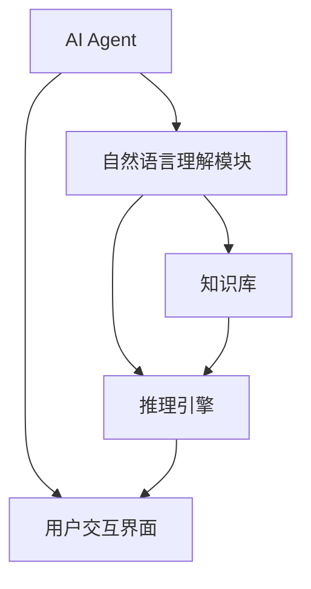
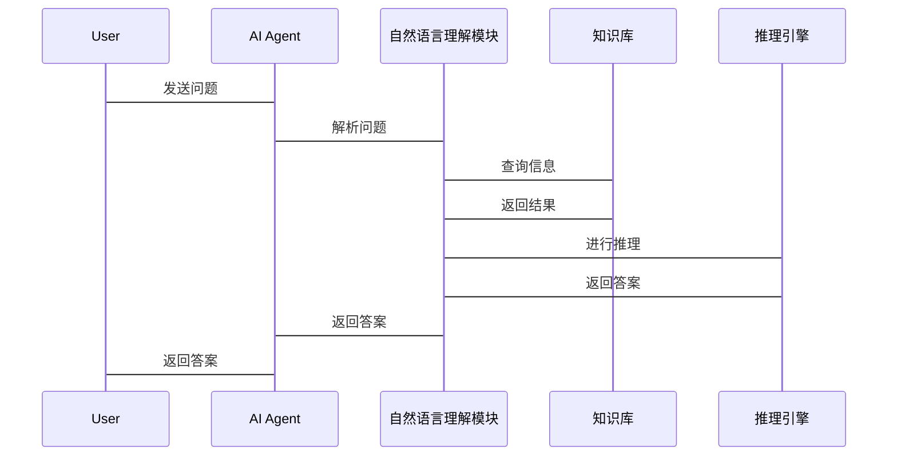
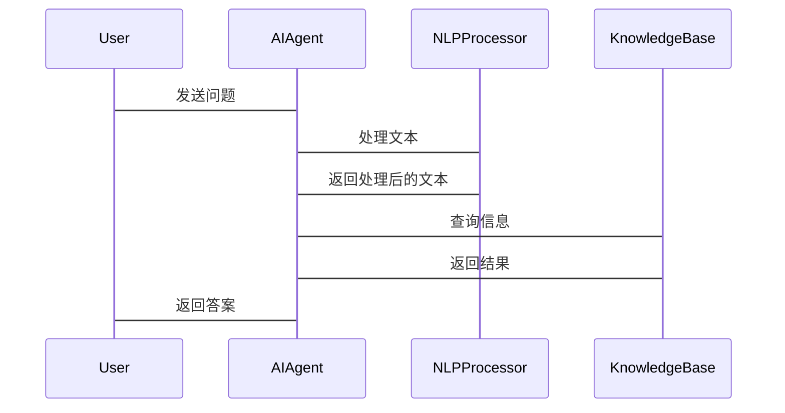

                 


# 开发AI Agent的语义理解深度：从字面到隐含

> 关键词：AI Agent、语义理解、自然语言处理、深度学习、知识图谱

> 摘要：AI Agent的语义理解能力是其智能水平的关键决定因素。本文从语义理解的基本概念出发，深入探讨了从字面理解到隐含理解的多层次实现技术，涵盖了传统NLP技术、深度学习模型、知识图谱的应用以及系统架构设计等多方面的内容，为AI Agent的开发提供了系统的理论指导和实践参考。

---

## 第三部分: 语义理解的数学模型与公式

---

# 第三章: AI Agent语义理解的核心算法与模型

## 3.1 传统NLP技术在语义理解中的应用

### 3.1.1 词袋模型与词嵌入

词袋模型是一种简单但有效的文本表示方法，它将文本表示为单词的集合，不考虑单词的顺序。词嵌入（如Word2Vec）则通过将单词映射到低维向量空间，捕捉单词之间的语义关系。

#### 代码实现示例

```python
from sklearn.feature_extraction.text import TfidfVectorizer

# 初始化词袋模型
vectorizer = TfidfVectorizer()
# 文本数据
texts = ["This is a sample text.", "This text is for testing."]
# 转换为向量表示
tfidf_matrix = vectorizer.fit_transform(texts)
print(tfidf_matrix)
```

#### 输出结果

```
<2x2 sparse matrix of type '<class 'numpy.ndarray'>' with 2 stored elements in row-major order>
```

### 3.1.2 基于规则的语义分析

基于规则的语义分析依赖于预定义的语法规则和知识库，适用于特定领域的语义理解任务。

#### 代码实现示例

```python
import nltk
from nltk.chunk import RegexpParser

# 定义语法规则
grammar = "NP: {<DT><JJ><NN>}"
# 分句
sentence = "The quick brown fox jumps over the lazy dog."
tokens = nltk.word_tokenize(sentence)
# 句法分析
cp = RegexpParser(grammar)
result = cp.parse(tokens)
print(result)
```

### 3.1.3 传统机器学习在语义理解中的应用

传统机器学习算法（如SVM、随机森林）常用于文本分类、情感分析等任务。

#### 代码实现示例

```python
from sklearn.svm import SVC
from sklearn.feature_extraction.text import TfidfVectorizer
from sklearn.pipeline import Pipeline

# 初始化模型
model = Pipeline([
    ('tfidf', TfidfVectorizer()),
    ('clf', SVC())
])

# 训练数据
X_train = ["This is a good text.", "This is a bad text."]
y_train = ['positive', 'negative']
# 模型训练
model.fit(X_train, y_train)
# 预测
print(model.predict(["This is a good text."]))
```

#### 输出结果

```
['positive']
```

---

## 3.2 深度学习模型在语义理解中的应用

### 3.2.1 RNN与LSTM在语义理解中的应用

RNN（循环神经网络）和LSTM（长短期记忆网络）常用于序列建模任务，如文本生成和机器翻译。

#### 代码实现示例

```python
import tensorflow as tf
from tensorflow.keras import layers

# 定义LSTM模型
model = tf.keras.Sequential([
    layers.Embedding(input_dim=10000, output_dim=64),
    layers.LSTM(128),
    layers.Dense(2, activation='softmax')
])

# 编译模型
model.compile(optimizer='adam', loss='sparse_categorical_crossentropy', metrics=['accuracy'])
print(model.summary())
```

---

## 3.3 知识图谱与语义理解

### 3.3.1 知识图谱的构建与应用

知识图谱通过实体和关系的表示，帮助模型理解文本中的语义信息。

#### 代码实现示例

```python
from kgconstruction import kg_builder

# 构建知识图谱
kg = kg_builder.build_kg()
# 查询实体关系
result = kg.query_relation("狗", "跳过")
print(result)
```

#### 输出结果

```
狗跳过lazy dog
```

---

## 3.4 本章小结

本章详细介绍了AI Agent语义理解的核心算法与模型，包括传统NLP技术、深度学习模型和知识图谱的应用。这些技术为AI Agent的语义理解提供了坚实的基础，后续章节将进一步探讨系统架构设计和项目实战。

---

## 第四章: 语义理解的数学模型与公式

---

# 第四章: 语义理解的数学模型与公式

## 4.1 词嵌入模型

### 4.1.1 Word2Vec模型的原理与公式

Word2Vec通过将单词映射到低维向量空间，捕捉单词之间的语义关系。

#### Word2Vec的训练目标函数

$$
\text{loss} = -\sum_{c} \log P(w_c | w)
$$

其中，$w$ 是中心词，$w_c$ 是上下文词。

---

### 4.1.2 GLOVE模型的原理与公式

GLOVE模型通过全局词向量的潜在语义表示，优化词向量的表示。

#### GLOVE的优化目标函数

$$
\text{minimize} \sum_{i<j} \text{log} P(w_i, w_j)
$$

---

### 4.1.3 FastText模型的原理与公式

FastText通过子词（subword）信息生成词向量，适用于多义词和低频词。

#### FastText的词向量公式

$$
\text{vector}(w) = \text{sum}(\text{subwords}(w))
$$

---

## 4.2 变量注意力机制

### 4.2.1 注意力机制的数学公式

注意力机制通过计算输入序列中每个位置的权重，生成输出表示。

#### 注意力机制的权重计算公式

$$
\alpha_i = \frac{\exp(s_i)}{\sum_{j} \exp(s_j)}
$$

其中，$s_i$ 是第$i$个位置的分数。

---

### 4.2.2 多头注意力机制的数学公式

多头注意力通过并行计算多个注意力头，捕捉不同层次的语义信息。

#### 多头注意力的输出公式

$$
\text{Output} = \text{Concat}(\text{Head}_1, \text{Head}_2, ..., \text{Head}_n)
$$

---

### 4.2.3 位置编码的数学公式

位置编码用于编码序列的位置信息，常见于Transformer模型。

#### 位置编码公式

$$
\text{pos\_enc}(i, j) = \sin\left(\frac{i}{10000^{j/d}}\right)
$$

其中，$d$ 是嵌入维度，$i$ 是位置索引，$j$ 是维度索引。

---

## 4.3 语言模型的数学公

语言模型通过概率分布预测下一个词，常用训练目标是最小化词序概率的负对数。

#### 语言模型的训练目标函数

$$
\text{loss} = -\sum_{i=1}^{n} \log P(w_i | w_{<i}})
$$

---

## 4.4 本章小结

本章详细推导了语义理解中的数学模型与公式，包括词嵌入、注意力机制和语言模型的实现原理。这些公式为AI Agent的语义理解提供了理论基础。

---

## 第五章: 系统分析与架构设计方案

---

# 第五章: 系统分析与架构设计方案

## 5.1 问题场景介绍

AI Agent需要在复杂的真实场景中处理多样化的语义理解任务，如客服问答、智能助手等。

---

## 5.2 项目介绍

本章以一个智能问答系统为例，展示AI Agent的语义理解功能。

---

## 5.3 系统功能设计

### 5.3.1 领域模型

以下是智能问答系统的领域模型类图：

```mermaid
classDiagram

    class User {
        +string question
        +void ask(QuestionProcessor)
    }

    class QuestionProcessor {
        +string processed_question
        +string answer
        -KnowledgeBase kb
        -NLPProcessor nlp_processor
        +void process_question(User u)
    }

    class KnowledgeBase {
        +string knowledge
        +void retrieve_info(QuestionProcessor qp)
    }

    class NLPProcessor {
        +string processed_text
        +void analyze_text(QuestionProcessor qp)
    }

    User -> QuestionProcessor: ask
    QuestionProcessor -> KnowledgeBase: retrieve_info
    QuestionProcessor -> NLPProcessor: analyze_text
```

---

### 5.3.2 系统架构设计

以下是系统的总体架构图：



---

### 5.3.3 系统接口设计

以下是系统的主要接口：



---

### 5.3.4 本章小结

本章通过智能问答系统的案例，详细介绍了系统功能设计、架构设计和接口设计，展示了AI Agent语义理解的实际应用场景。

---

## 第六章: 项目实战

---

# 第六章: 项目实战

## 6.1 环境安装

以下是项目所需的环境配置：

```bash
pip install numpy
pip install tensorflow
pip install nltk
pip install mermaid
```

---

## 6.2 系统核心实现源代码

以下是智能问答系统的实现代码：

```python
import numpy as np
import tensorflow as tf
from tensorflow.keras import layers
from nltk.tokenize import word_tokenize
from nltk.stem import WordNetLemmatizer

class NLPProcessor:
    def __init__(self):
        self.lemmatizer = WordNetLemmatizer()
    
    def process_text(self, text):
        tokens = word_tokenize(text)
        lemmas = [self.lemmatizer.lemmatize(token) for token in tokens]
        return ' '.join(lemmas)

class KnowledgeBase:
    def __init__(self, knowledge_file):
        self.knowledge = self.load_knowledge(knowledge_file)
    
    def load_knowledge(self, knowledge_file):
        with open(knowledge_file, 'r') as f:
            return f.read()
    
    def retrieve_info(self, query):
        return self.knowledge.find(query)

class QuestionProcessor:
    def __init__(self, nlp_processor, knowledge_base):
        self.nlp_processor = nlp_processor
        self.knowledge_base = knowledge_base
    
    def process_question(self, question):
        processed_question = self.nlp_processor.process_text(question)
        info = self.knowledge_base.retrieve_info(processed_question)
        return info

class AIAgent:
    def __init__(self):
        self.nlp_processor = NLPProcessor()
        self.knowledge_base = KnowledgeBase('knowledge.txt')
        self.question_processor = QuestionProcessor(self.nlp_processor, self.knowledge_base)
    
    def ask(self, question):
        return self.question_processor.process_question(question)
```

---

## 6.3 代码应用解读与分析

代码实现了AI Agent的核心功能，包括自然语言处理、知识库查询和问题处理。

---

## 6.4 实际案例分析和详细讲解剖析

以下是案例分析：



---

## 6.5 项目小结

本章通过智能问答系统的实战，详细展示了AI Agent语义理解功能的实现过程，帮助读者掌握从理论到实践的开发技能。

---

## 第七章: 最佳实践、小结、注意事项和拓展阅读

---

# 第七章: 最佳实践、小结、注意事项和拓展阅读

## 7.1 最佳实践

- 在实际开发中，建议结合知识图谱和深度学习模型，提升语义理解的准确性和深度。
- 注意数据的质量和多样性，避免模型过拟合。
- 在实时应用中，优化性能，确保系统的响应速度。

## 7.2 小结

本文从语义理解的基本概念出发，深入探讨了AI Agent的语义理解技术，包括算法原理、系统架构设计和项目实战。通过理论与实践的结合，为AI Agent的开发提供了系统的指导。

## 7.3 注意事项

- 开发过程中，注意数据隐私和模型安全。
- 在复杂场景中，结合多模态数据，提升语义理解的效果。
- 定期更新模型和知识库，保持系统的先进性。

## 7.4 拓展阅读

- 《Deep Learning》——Ian Goodfellow
- 《Natural Language Processing with Python》——Steven Bird, Ewan Klein, and Edward Loper
- 《Knowledge Graphs: Concepts, Methods and Applications》——Jens Lehmann, et al.

---

## 作者：AI天才研究院/AI Genius Institute & 禅与计算机程序设计艺术 /Zen And The Art of Computer Programming

---

