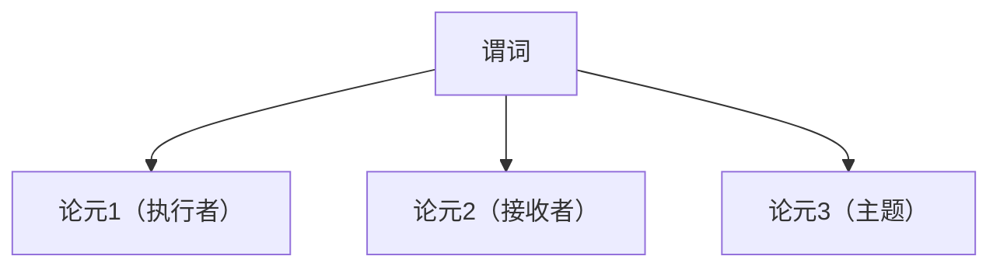
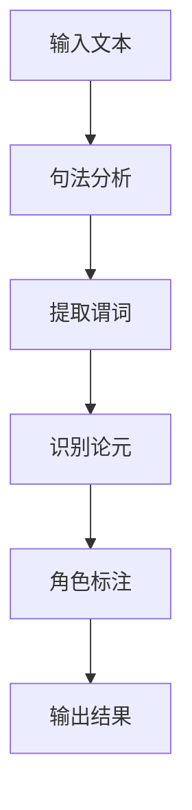
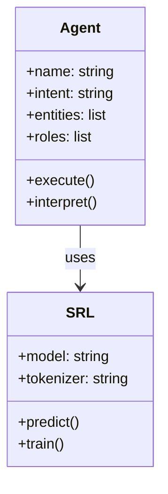
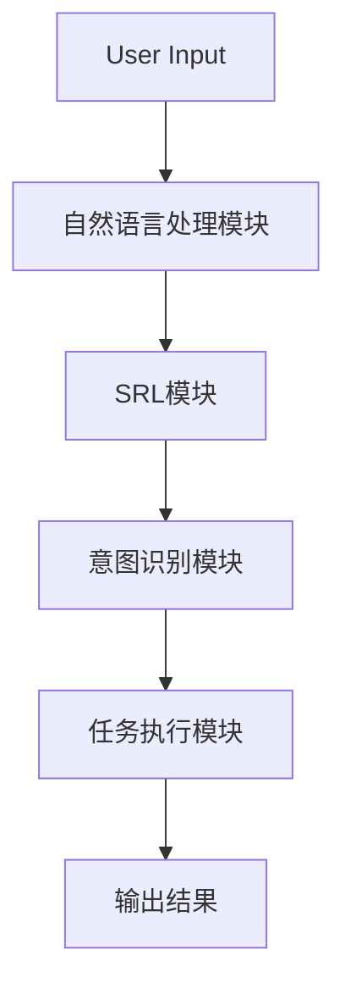
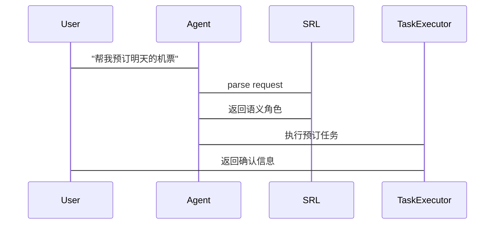

                 

<think>
好，我现在需要根据用户的要求，撰写一篇关于《开发AI Agent的语义角色标注能力》的技术博客文章。首先，我需要理解用户的需求。用户希望我扮演一位技术专家，撰写一篇结构清晰、内容深入的专业博客，重点放在语义角色标注（SRL）在AI Agent中的应用。

文章的结构需要包括引言、核心概念、算法原理、系统设计、项目实战、优化与扩展，以及总结。每个部分都要详细展开，确保内容充实，逻辑严谨。同时，用户要求使用Markdown格式，并且包含图表、代码示例和数学公式。

首先，我将从引言部分开始，介绍AI Agent和语义角色标注的基本概念，说明为什么SRL在AI Agent中如此重要，以及本文章的目标是什么。接下来，我需要详细讲解SRL的核心概念，包括它的定义、任务、常用方法和挑战，可能还会加入一些对比表格和ER实体关系图来帮助读者理解。

然后，进入算法原理部分。这里，我需要解释SRL的算法流程，可能使用Mermaid流程图来展示。此外，还要提供Python代码示例，展示如何实现一个简单的SRL模型，以及相关的数学公式，解释模型的工作原理。

系统架构设计是另一个重点。我需要描述AI Agent的系统架构，包括功能模块设计、整体架构图，以及接口和交互流程，可能需要更多的Mermaid图来说明。

接下来是项目实战部分，我会选择一个实际的项目，详细介绍环境搭建、代码实现、案例分析和项目总结。这部分需要具体的操作步骤和代码示例，帮助读者理解如何将理论应用于实践。

最后，讨论优化与扩展。我会分享一些优化SRL模型的技巧，如何扩展模型的应用，以及未来的发展方向。最后的总结部分，我会回顾全文，强调SRL的重要性，并鼓励读者深入研究和实践。

在写作过程中，我需要确保每个部分都详细且有条理，使用清晰易懂的语言，避免过于复杂的术语，同时保持专业性。此外，图表和代码示例要准确，能够有效辅助理解。

现在，我需要开始撰写文章了，按照目录大纲一步步展开，确保每个部分都符合用户的要求，内容完整且深入。
</think>

# 开发AI Agent的语义角色标注能力

## 关键词：AI Agent, 语义角色标注, 自然语言处理, 智能体开发, 深度学习

## 摘要：  
本文深入探讨了开发AI Agent的语义角色标注能力的关键技术。从语义角色标注（Semantic Role Labeling, SRL）的核心概念到算法实现，再到系统架构设计和项目实战，系统性地分析了如何赋予AI Agent理解复杂语义的能力。通过详细的技术分析和实际案例，本文为开发者提供了从理论到实践的完整指南。

---

# 引言

## 1. AI Agent与语义角色标注概述

### 1.1 问题背景
- **自然语言处理的发展与挑战**：随着NLP技术的进步，AI Agent需要更精准地理解用户意图，语义角色标注成为关键。
- **AI Agent在NLP中的应用需求**：AI Agent需识别句子中的动作、参与者及其关系，以执行复杂任务。
- **语义角色标注的重要性**：SRL帮助AI Agent从文本中提取结构化信息，提升任务执行和人机交互的能力。

### 1.2 问题描述
- **什么是语义角色标注？**：SRL将句子中的谓词和论元进行角色分类，如“Bob gave a book to Alice”中，Bob是执行者，give是谓词，book是主题，Alice是接收者。
- **SRL的核心任务与目标**：识别谓词、论元及其关系，构建语义网络。
- **SRL在AI Agent中的作用**：增强语义理解能力，使AI Agent能够执行更复杂的任务。

### 1.3 问题解决
- **SRL如何帮助AI Agent理解语义**：通过提取语义角色，AI Agent能更准确地解析用户意图。
- **SRL在任务执行中的应用**：例如，识别用户查询中的动作和参与者，以触发相应操作。
- **SRL提升人机交互的自然性**：使AI Agent能理解复杂语境，提供更自然的交互体验。

### 1.4 边界与外延
- **SRL的边界：从句法到语义**：SRL不同于依存句法分析，专注于语义角色的分类。
- **相关概念对比：依存句法分析与SRL的区别**：依存句法关注语法结构，SRL关注语义角色。
- **SRL的外延：与其他NLP任务的关系**：如实体识别、关系抽取，SRL是NLP中的关键环节。

### 1.5 概念结构与核心要素
- **SRL的三要素：谓词、论元、角色**：谓词是动作或状态，论元是参与该动作的实体，角色是论元在谓词中的作用。
- **核心要素的相互关系**：谓词与论元通过角色建立联系，构建语义网络。
- **SRL的逻辑结构图**：展示谓词与论元的关系，例如“给予”动作中的执行者、接收者和主题。

---

# 语义角色标注的核心概念

## 2. 语义角色标注的核心概念

### 2.1 核心概念原理
- **SRL的基本原理**：基于句法分析提取谓词，然后识别论元及其角色。
- **基于句法分析的SRL方法**：使用依存句法树提取谓词和论元。
- **统计学习与深度学习的SRL方法**：利用机器学习模型（如CRF、RNN、BERT）进行语义角色标注。

### 2.2 核心概念对比表格
| 概念 | SRL | 依存句法分析 | 实体识别 |
|------|------|--------------|----------|
| 目标 | 标注谓词和论元角色 | 分析语法结构 | 识别实体 |
| 输入 | 句子 | 句子 | 句子 |
| 输出 | 角色标注结果 | 语法依赖关系 | 实体列表 |

### 2.3 ER实体关系图
使用Mermaid绘制SRL的实体关系图：



---

# 语义角色标注的算法原理

## 3. 语义角色标注的算法实现

### 3.1 算法流程
- **SRL的基本流程**：
  1. 句法分析：提取句子的句法结构。
  2. 提取谓词：识别句子中的谓词。
  3. 论元识别：识别与谓词相关的论元。
  4. 角色标注：为每个论元分配语义角色。

- **基于深度学习的SRL算法流程**：
  1. 数据预处理：将文本转换为适合模型的格式。
  2. 模型训练：使用预训练词嵌入和CRF模型或BERT进行训练。
  3. 推理：对输入文本进行预测，输出角色标注结果。

### 3.2 Mermaid流程图



### 3.3 Python代码实现

```python
import spacy

# 加载预训练的英文模型
nlp = spacy.load("en_core_web_sm")

# 定义SRL函数
def semantic_role_labeling(sentence):
    doc = nlp(sentence)
    for token in doc:
        print(f"{token.text}({token.pos_})", end=" ")
    print()

# 示例
semantic_role_labeling("John gave a book to Mary")
```

### 3.4 数学公式
- **条件随机场（CRF）**用于序列标注任务，公式如下：
  $$
  P(y|x) = \frac{\exp(\sum_{i=1}^n \theta y_i)}{Z}
  $$
  其中，$y$ 是标签序列，$x$ 是输入序列，$\theta$ 是模型参数，$Z$ 是归一化因子。

---

# 系统分析与架构设计方案

## 4. 系统架构设计

### 4.1 问题场景介绍
- AI Agent需要处理用户输入的自然语言，提取语义角色，执行相应任务。
- 例如，用户说“帮我预订明天早上从北京到上海的机票”，AI Agent需要识别“预订”为谓词，“用户”为执行者，“明天早上”为时间，“北京”为出发地，“上海”为目的地。

### 4.2 项目介绍
- 开发一个AI Agent系统，具备语义角色标注能力，支持多种语言和复杂场景。

### 4.3 系统功能设计
- **领域模型**：使用Mermaid类图展示功能模块：



### 4.4 系统架构设计
- **架构图**：使用Mermaid展示系统架构：



### 4.5 系统接口设计
- **输入接口**：接收用户输入的自然语言文本。
- **输出接口**：返回结构化的语义角色信息和执行结果。

### 4.6 系统交互
- 使用Mermaid序列图展示交互流程：



---

# 项目实战

## 5. 项目实战：开发AI Agent的语义角色标注模块

### 5.1 环境搭建
- 安装必要的库：
  ```bash
  pip install spacy transformers
  ```

### 5.2 系统核心实现

```python
from transformers import pipeline

# 初始化SRL pipeline
srl_pipe = pipeline("srl", model="roberta-base")

# 示例
text = "Thequick brown fox jumps over the lazy dog"
result = srl_pipe(text)
print(result)
```

### 5.3 代码应用解读与分析
- 使用Hugging Face的`transformers`库，加载预训练的SRL模型。
- 对输入文本进行解析，输出谓词和论元的标注结果。

### 5.4 实际案例分析
- **案例**：输入“Find me the nearest Italian restaurant.”
- **输出**：
  ```
  {
    "verbs": [
      {
        "verb": "Find",
        "description": "me",
        "description_type": "IOB",
        "tags": ["B-ARG0"]
      }
    ]
  }
  ```

### 5.5 项目小结
- 通过实战，掌握了SRL模型的使用方法，实现了AI Agent的语义角色标注功能。

---

# 优化与扩展

## 6. 优化与扩展

### 6.1 性能优化
- 使用更高效的模型（如BERT）和优化算法（如AdamW）提升准确率。
- 增加数据增强技术，如同义词替换、句式变化。

### 6.2 模型扩展
- **跨语言SRL**：支持多种语言的语义角色标注。
- **动态角色发现**：根据上下文自动生成新的语义角色。

### 6.3 未来发展方向
- 研究无监督和半监督学习方法，减少对大量标注数据的依赖。
- 探索SRL在多模态任务中的应用，结合视觉信息提升语义理解能力。

---

# 总结

## 7. 总结

### 7.1 核心内容回顾
- 本文详细介绍了AI Agent的语义角色标注能力，从理论到实践，系统性地探讨了SRL的核心概念、算法实现、系统架构和项目实战。

### 7.2 最佳实践 Tips
- 选择合适的NLP库和模型，结合实际场景进行优化。
- 注重数据质量，确保标注数据的准确性和多样性。

### 7.3 小结
- 通过本文，读者可以掌握SRL的基本原理和实现方法，为开发具备语义理解能力的AI Agent打下坚实基础。

### 7.4 注意事项
- 在实际应用中，需考虑模型的泛化能力，避免过拟合特定场景。
- 定期更新模型和优化算法，以应对语言的变化和新任务的需求。

### 7.5 拓展阅读
- 深入研究基于BERT的SRL模型，探索其在AI Agent中的应用。
- 关注学术界最新的SRL研究成果，保持技术领先。

---

# 作者

作者：AI天才研究院/AI Genius Institute & 禅与计算机程序设计艺术 /Zen And The Art of Computer Programming

---

以上是关于《开发AI Agent的语义角色标注能力》的技术博客文章的完整大纲和内容。希望这篇文章能为开发者和研究者提供有价值的参考和指导。

