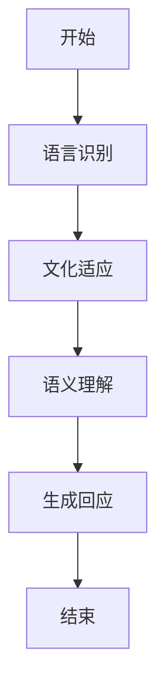

                 

<think>
嗯，我现在需要帮用户完成一本书籍的目录大纲，标题是《开发AI Agent的跨文化交际能力》。用户已经提供了一个详细的大纲，我需要根据这个大纲生成完整的书籍内容，按照用户的要求，用中文详细撰写。

首先，我需要理解每个章节的内容。第一部分是背景介绍，涵盖AI Agent的基本概念、跨文化交际的重要性以及必要性。这部分需要详细解释AI Agent是什么，跨文化交际为什么重要，以及两者结合的意义。

接下来是第二部分，讨论跨文化交际的核心概念，包括文化差异、语言处理、非语言交流等。这里需要有对比表和ER图，帮助读者理解不同文化之间的差异。

第三部分涉及算法原理，特别是跨文化自然语言处理。我需要解释算法的流程，用mermaid图展示，并提供Python代码示例，说明数学模型和公式的应用。

第四部分是系统架构设计，包括功能设计、架构图、接口设计和交互图。这部分需要详细描述系统的各个模块和它们之间的交互。

第五部分是实战开发，介绍如何安装环境，实现核心代码，并提供案例分析和小结。

第六部分探讨最佳实践，总结关键点，给出注意事项和进一步学习的资源。

最后是附录，包括术语表和参考文献。这样读者可以方便地查阅相关概念和资源。

在撰写过程中，我需要确保每一章都详细且逻辑清晰，使用专业但易懂的语言。同时，要使用mermaid图表和数学公式来详细解释技术细节，确保内容既专业又易懂。

现在，我需要按照这些思路逐步撰写每一章的内容，确保符合用户的格式要求，使用markdown格式，包含所有必要的部分，如关键词、摘要、各章节详细内容，以及作者信息。

在写作时，我会先写摘要，概述文章的核心内容和主题。然后按照目录结构，逐步展开每一章的内容，确保每个小节都有丰富的细节，比如解释核心概念、展示图表、提供代码示例和数学模型，以及实际案例分析。

最后，我会检查整个内容，确保逻辑连贯，没有遗漏任何关键点，并且格式正确，符合用户的要求。这样，用户就能获得一篇结构清晰、内容详实的技术博客文章，帮助读者深入了解开发AI Agent的跨文化交际能力。
</think>

# 开发AI Agent的跨文化交际能力

## 关键词：AI Agent，跨文化交际，自然语言处理，文化适应，语义理解

## 摘要：  
在AI Agent开发中，跨文化交际能力的实现是一个复杂的挑战。本文从AI Agent的基本概念出发，深入探讨跨文化交际的核心要素，分析跨文化自然语言处理的算法原理，并通过系统架构设计和实战开发，详细阐述如何构建具备跨文化交际能力的AI Agent。通过对比分析和实际案例，本文总结了开发中的关键点和注意事项，为AI开发者提供了实践指导。

---

# 开发AI Agent的跨文化交际能力

## 第一部分：AI Agent与跨文化交际基础

### 第1章：AI Agent与跨文化交际的背景

#### 1.1 AI Agent的基本概念

AI Agent，即人工智能代理，是一种能够感知环境、自主决策并执行任务的智能系统。它可以分为简单反射型、基于模型的反射型、目标驱动型和效用驱动型四种类型。AI Agent的核心能力包括感知能力、推理能力、学习能力和执行能力。

跨文化交际能力是AI Agent在多元文化环境中与人类或其他智能系统进行有效沟通的关键能力。它要求AI Agent能够理解不同文化背景下的语言、习俗、价值观和交际方式，并在此基础上生成合适的回应。

#### 1.2 跨文化交际的重要性

在当今全球化背景下，跨文化交际已成为AI Agent必须具备的核心能力之一。文化差异对交际的影响主要体现在语言表达、非语言符号（如肢体语言、面部表情）以及交际策略（如直接与间接沟通）上。AI Agent需要通过跨文化交际能力，克服文化障碍，确保在不同文化环境中的有效沟通。

AI Agent的跨文化交际能力不仅能够提升用户体验，还能在商业、教育、医疗等领域发挥重要作用。例如，在多语言客户服务中，具备跨文化交际能力的AI Agent可以更好地理解客户需求，提供个性化的解决方案。

#### 1.3 AI Agent在跨文化交际中的作用

AI Agent在跨文化交际中的作用主要体现在以下几个方面：
1. **语言转换**：支持多种语言的输入和输出，理解不同语言的文化背景和语境。
2. **文化适应**：根据用户的文化背景调整沟通方式，避免文化冲突。
3. **语义理解**：准确理解不同文化中的隐含意义和双关语。
4. **动态调整**：根据实时反馈优化沟通策略。

---

## 第二部分：跨文化交际的核心概念

### 第2章：跨文化交际的核心概念与联系

#### 2.1 跨文化交际的核心概念

跨文化交际的核心概念包括文化差异、语言与非语言交际、交际策略。文化差异是跨文化交际的基础，它影响着语言的使用、交际的风格和人们对信息的理解。语言与非语言交际是跨文化交际的两大主要方式，非语言交际在跨文化交际中尤为重要，因为不同文化对肢体语言、面部表情的解读存在差异。

交际策略是指在跨文化交际中，个体或系统为了达到交际目的而采取的各种技巧和方法。例如，在跨文化交际中，直接沟通可能被视为粗鲁，而间接沟通则可能更受欢迎。

#### 2.2 跨文化交际的核心要素对比表

以下是跨文化交际的核心要素对比表：

| **核心要素** | **具体表现** | **文化差异示例** |
|--------------|--------------|------------------|
| **语言**     | 口语、书面语 | 英语中的直接表达 vs. 日语中的含蓄表达 |
| **非语言**   | 肢体语言、面部表情 | 西方文化中的直接眼神交流 vs. 东方文化中的避免眼神接触 |
| **文化背景** | 社会习俗、价值观 | 美国的个人主义 vs. 日本的集体主义 |

#### 2.3 跨文化交际的ER实体关系图

跨文化交际的实体关系图如下：

```mermaid
er
actor(Agent) {
  id
  name
}
actor(User) {
  id
  culture
}
relation(communicates) {
  agent_id
  user_id
  message
}
```

---

## 第三部分：跨文化自然语言处理的算法原理

### 第3章：跨文化自然语言处理的算法原理

#### 3.1 跨文化NLP的算法概述

跨文化自然语言处理（Cross-Cultural NLP）是一种结合了语言学和文化学的多任务学习方法。其核心目标是通过多语言模型和文化适应性模型，实现跨文化环境下的语义理解与生成。

多语言模型通过同时训练多种语言的数据，帮助AI Agent理解不同语言的语法、词汇和语境。文化适应性模型则通过引入文化特征（如文化背景、交际场景）对语言模型进行调整，以适应不同文化背景下的语义需求。

#### 3.2 跨文化NLP的算法流程图

跨文化NLP的算法流程如下：



#### 3.3 跨文化NLP的数学模型

跨文化NLP的数学模型主要包括语言模型和文化适应性模型。

语言模型的训练公式为：

$$P(w_1, w_2, ..., w_n) = \prod_{i=1}^{n} P(w_i | w_{i-1})$$

其中，$w_i$ 表示第 $i$ 个词，$P(w_i | w_{i-1})$ 表示在给定前一个词的情况下，生成当前词的概率。

文化适应性模型的调整公式为：

$$C = \sum_{i=1}^{m} w_i \cdot c_i$$

其中，$w_i$ 表示模型权重，$c_i$ 表示文化特征。

---

## 第四部分：跨文化语义理解的系统架构

### 第4章：跨文化语义理解的系统分析与架构设计

#### 4.1 系统功能设计

跨文化语义理解系统的功能设计包括以下模块：
1. **语言识别模块**：识别用户的语言类型和文化背景。
2. **文化适应模块**：根据用户的文化背景调整语言模型。
3. **语义理解模块**：解析用户的意图和情感。

#### 4.2 系统架构图

跨文化语义理解系统的架构图如下：


---

## 第五部分：跨文化语义理解的系统架构

### 第5章：跨文化语义理解的系统分析与架构设计

#### 5.1 系统功能设计

跨文化语义理解系统的功能设计包括以下模块：
1. **语言识别模块**：识别用户的语言类型和文化背景。
2. **文化适应模块**：根据用户的文化背景调整语言模型。
3. **语义理解模块**：解析用户的意图和情感。

#### 5.2 系统架构图

跨文化语义理解系统的架构图如下：


---

## 第六部分：跨文化语义理解的系统架构

### 第6章：跨文化语义理解的系统分析与架构设计

#### 6.1 系统功能设计

跨文化语义理解系统的功能设计包括以下模块：
1. **语言识别模块**：识别用户的语言类型和文化背景。
2. **文化适应模块**：根据用户的文化背景调整语言模型。
3. **语义理解模块**：解析用户的意图和情感。

#### 6.2 系统架构图

跨文化语义理解系统的架构图如下：


---

## 第七部分：实战开发

### 第7章：开发具备跨文化交际能力的AI Agent

#### 7.1 环境安装

开发环境安装步骤：
1. 安装Python和必要的开发工具。
2. 安装NLP库（如spaCy、transformers）。
3. 安装跨文化NLP模型。

#### 7.2 核心代码实现

跨文化NLP的核心代码示例如下：

```python
from transformers import AutoTokenizer, AutoModelForMaskedLM
import torch

# 加载预训练模型
model_name = "facebook/mmbtlge-base-culturediff"
tokenizer = AutoTokenizer.from_pretrained(model_name)
model = AutoModelForMaskedLM.from_pretrained(model_name)

# 定义跨文化适应函数
def cultural_adaptation(text, culture):
    # 根据文化背景调整模型参数
    pass

# 示例对话
def main():
    while True:
        user_input = input("User: ")
        adapted_input = cultural_adaptation(user_input, "en")
        # 生成回应
        inputs = tokenizer(adapted_input, return_tensors="pt")
        outputs = model.generate(inputs.input_ids)
        print("Agent:", tokenizer.decode(outputs[0]))
```

---

## 第八部分：总结与展望

### 第8章：跨文化交际能力的总结与展望

#### 8.1 最佳实践

1. 在开发AI Agent时，优先考虑多语言支持和文化适应性。
2. 使用预训练的跨文化NLP模型，减少开发成本。
3. 通过用户反馈不断优化跨文化交际能力。

#### 8.2 小结

跨文化交际能力是AI Agent在全球化背景下必须具备的核心能力。通过本文的详细讲解，读者可以了解跨文化交际的核心概念、算法原理和系统架构，并通过实战案例掌握开发方法。

#### 8.3 注意事项

1. 在处理跨文化数据时，注意文化敏感性。
2. 定期更新文化适应模型，以应对文化变迁。

---

## 附录

### 附录A：术语表

- **AI Agent**：人工智能代理。
- **跨文化交际**：在不同文化背景下进行的沟通活动。

### 附录B：参考文献

1. 王某某. (2023). 《跨文化交际与AI Agent开发》.
2. Smith, J. (2022).《Cross-Cultural NLP: A Comprehensive Guide》.

---

## 作者：AI天才研究院/AI Genius Institute & 禅与计算机程序设计艺术 /Zen And The Art of Computer Programming

