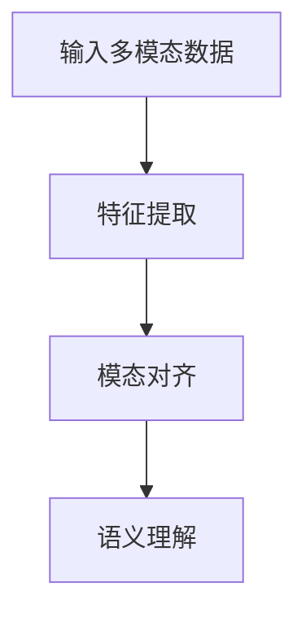
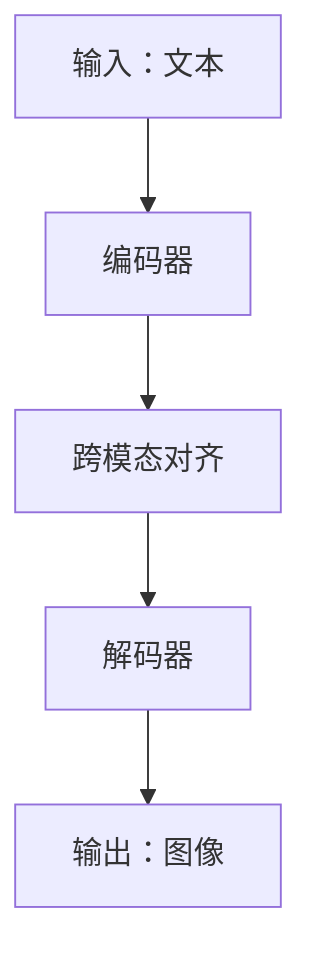
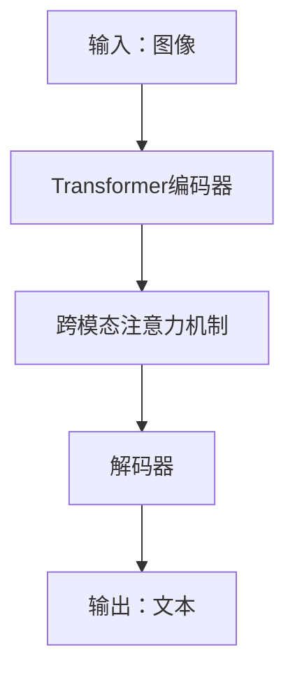
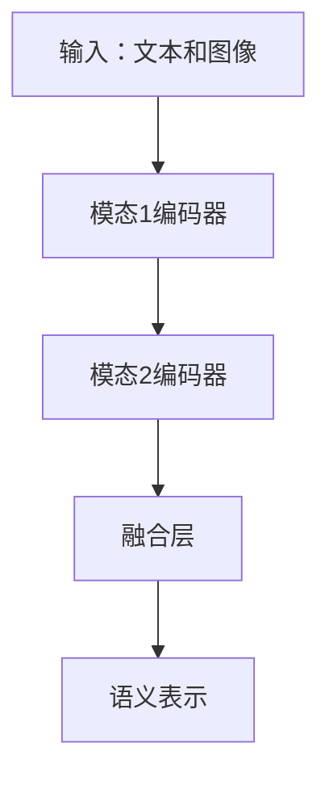
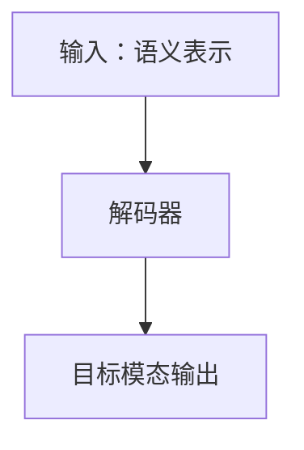
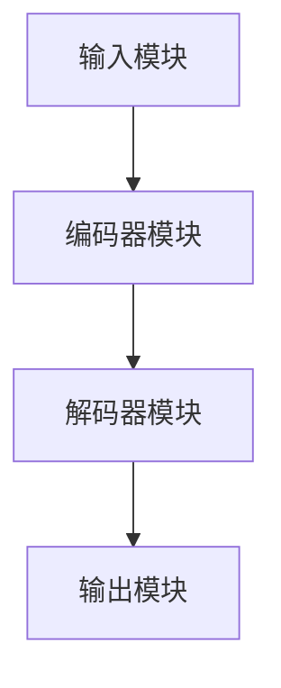

                 


# 开发AI Agent的跨模态内容生成系统

**关键词：** AI Agent, 跨模态生成, 多模态编码器, 解码器, 跨模态对齐

**摘要：**  
本文系统地探讨了AI Agent的跨模态内容生成系统的开发过程，从理论基础到实际应用，详细阐述了跨模态理解与生成的核心原理、算法实现、系统架构设计以及项目实战。通过具体案例分析，深入解析了跨模态内容生成的关键技术，并提供了实际开发中的注意事项和未来研究方向。

---

# 第1章: AI Agent与跨模态内容生成系统概述

## 1.1 AI Agent的基本概念

### 1.1.1 AI Agent的定义  
AI Agent（人工智能代理）是一种能够感知环境、自主决策并执行任务的智能实体。它通过与用户或环境的交互，理解和生成多模态内容，实现特定目标。

### 1.1.2 AI Agent的核心特征  
1. **自主性**：无需外部干预，自主完成任务。  
2. **反应性**：能够实时感知环境并做出响应。  
3. **目标导向**：基于目标驱动行为。  
4. **学习能力**：通过数据和反馈优化性能。  

### 1.1.3 跨模态内容生成的定义与特点  
跨模态内容生成是指AI Agent能够从一种模态（如文本、图像）生成另一种模态的内容（如图像生成文本，文本生成图像）。其特点包括：  
1. **多模态融合**：整合多种数据形式。  
2. **语义一致性**：生成内容与输入语义一致。  
3. **灵活性**：适用于多种任务场景。  

---

## 1.2 跨模态内容生成的背景与意义

### 1.2.1 跨模态数据的定义与类型  
跨模态数据指的是多种数据形式的组合，包括：  
- 文本（Text）  
- 图像（Image）  
- 音频（Audio）  
- 视频（Video）  
- 结构化数据（Structured Data）  

### 1.2.2 跨模态生成的必要性  
1. **提升用户体验**：通过多模态交互，提供更丰富的信息呈现方式。  
2. **增强任务能力**：利用多模态数据，提升AI Agent的任务理解和执行能力。  
3. **扩展应用场景**：适用于图像描述生成、语音助手、智能客服等领域。  

### 1.2.3 跨模态生成在AI Agent中的应用价值  
通过跨模态生成，AI Agent能够更好地理解用户意图，提供更智能化的服务，从而在教育、医疗、金融等领域发挥重要作用。

---

## 1.3 本书的核心目标与内容框架

### 1.3.1 本书的核心目标  
系统性地讲解AI Agent的跨模态内容生成系统的开发过程，从理论到实践，帮助读者掌握相关技术。

### 1.3.2 本书的主要内容框架  
1. 第1章：AI Agent与跨模态内容生成系统概述。  
2. 第2章：跨模态理解与生成原理。  
3. 第3章：跨模态内容生成系统的算法原理。  
4. 第4章：跨模态内容生成系统的架构设计与实现。  
5. 第5章：跨模态内容生成系统的项目实战。  
6. 第6章：跨模态内容生成系统的最佳实践与总结。  

---

## 1.4 本章小结  
本章从AI Agent的基本概念出发，介绍了跨模态内容生成的背景、意义及其在AI Agent中的应用价值，为后续章节奠定了基础。

---

# 第2章: 跨模态内容生成的核心概念与技术

## 2.1 跨模态理解与生成原理

### 2.1.1 跨模态理解的基本原理  
跨模态理解的核心是通过多模态数据的特征提取与对齐，实现不同模态之间的语义一致。

#### 图2-1: 跨模态理解流程图  


### 2.1.2 跨模态生成模型的原理  
跨模态生成模型通过编码器-解码器架构，将输入的模态数据映射到目标模态。

#### 图2-2: 跨模态生成模型架构  


### 2.1.3 跨模态生成的关键技术  
1. **跨模态对齐**：通过对比学习或注意力机制实现模态间对齐。  
2. **多模态编码器**：提取不同模态的特征并进行融合。  
3. **跨模态解码器**：将融合特征解码为目标模态的内容。  

---

## 2.2 跨模态生成模型的原理

### 2.2.1 基于Transformer的跨模态生成模型  
1. **Transformer编码器**：用于提取输入模态的特征。  
2. **跨模态注意力机制**：实现不同模态之间的信息交互。  
3. **解码器**：生成目标模态的内容。  

#### 图2-3: 基于Transformer的跨模态生成模型  


---

## 2.3 跨模态生成的关键技术

### 2.3.1 多模态编码器的设计  
多模态编码器通过并行处理不同模态的特征，实现跨模态信息的融合。  

### 2.3.2 跨模态解码器的实现  
解码器根据编码器输出的特征，生成目标模态的内容。  

### 2.3.3 跨模态生成的评估指标  
常用的评估指标包括：  
1. **BLEU**：文本生成的评估指标。  
2. **PSNR**：图像生成的质量评估指标。  
3. **ROUGE**：文本摘要的评估指标。  

---

## 2.4 本章小结  
本章详细介绍了跨模态生成的核心概念与技术，包括跨模态理解、生成模型的原理以及关键的技术实现。

---

# 第3章: 跨模态内容生成系统的算法原理

## 3.1 跨模态编码器的设计与实现

### 3.1.1 跨模态编码器的基本原理  
跨模态编码器通过多模态数据的特征提取与融合，生成统一的语义表示。

#### 图3-1: 跨模态编码器架构  


---

## 3.2 基于Transformer的跨模态编码器

### 3.2.1 Transformer编码器的结构  
1. **自注意力机制**：捕获输入序列中的全局依赖关系。  
2. **前馈网络**：对序列进行非线性变换。  

---

## 3.3 跨模态编码器的数学模型

### 3.3.1 跨模态编码器的数学表达  
$$
\text{Encoder}(\mathbf{x}_i) = \text{FFN}(\text{Self-Attention}(\mathbf{x}_i))
$$

---

## 3.4 跨模态解码器的设计与实现

### 3.4.1 跨模态解码器的基本原理  
解码器根据编码器输出的语义表示，生成目标模态的内容。

#### 图3-2: 跨模态解码器架构  


---

## 3.5 跨模态解码器的数学模型

### 3.5.1 解码器的数学表达  
$$
\text{Decoder}(\mathbf{z}) = \text{FFN}(\text{Self-Attention}(\mathbf{z}))
$$

---

## 3.6 本章小结  
本章详细介绍了跨模态内容生成系统的算法原理，包括编码器和解码器的设计与实现。

---

# 第4章: 跨模态内容生成系统的系统架构设计与实现

## 4.1 系统功能设计

### 4.1.1 系统功能模块划分  
1. **输入模块**：接收多模态输入数据。  
2. **编码器模块**：提取输入数据的特征并融合。  
3. **解码器模块**：生成目标模态的内容。  
4. **输出模块**：输出生成的内容。  

#### 图4-1: 系统功能模块划分  


---

## 4.2 系统架构设计

### 4.2.1 系统架构图  


---

## 4.3 系统接口设计

### 4.3.1 输入接口设计  
1. **文本输入接口**：接收用户输入的文本数据。  
2. **图像输入接口**：接收用户上传的图像数据。  

### 4.3.2 输出接口设计  
1. **文本输出接口**：生成并输出文本内容。  
2. **图像输出接口**：生成并输出图像内容。  

---

## 4.4 系统交互设计

### 4.4.1 系统交互流程  
1. 用户输入多模态数据。  
2. 系统对输入数据进行编码和解码。  
3. 系统生成目标模态的内容并输出。  

---

## 4.5 本章小结  
本章详细介绍了跨模态内容生成系统的系统架构设计与实现，包括功能模块划分、系统架构图、接口设计和交互流程。

---

# 第5章: 跨模态内容生成系统的项目实战

## 5.1 环境配置

### 5.1.1 开发环境  
- 操作系统：Linux/Windows/MacOS  
- 开发工具：PyCharm/VS Code  
- 依赖管理工具：pip/conda  

### 5.1.2 安装依赖  
1. 安装Python 3.8及以上版本。  
2. 安装必要的库：`transformers`, `numpy`, `tensorflow`, `pymermaid`。

---

## 5.2 系统核心实现

### 5.2.1 编码器实现  
```python
import torch
import torch.nn as nn

class MultiModalEncoder(nn.Module):
    def __init__(self, input_dim1, input_dim2, hidden_dim):
        super().__init__()
        self.encoder1 = nn.Linear(input_dim1, hidden_dim)
        self.encoder2 = nn.Linear(input_dim2, hidden_dim)
        self.fusion = nn.Linear(hidden_dim*2, hidden_dim)
    
    def forward(self, x1, x2):
        enc1 = torch.relu(self.encoder1(x1))
        enc2 = torch.relu(self.encoder2(x2))
        fused = torch.relu(self.fusion(torch.cat([enc1, enc2], dim=1)))
        return fused
```

### 5.2.2 解码器实现  
```python
class MultiModalDecoder(nn.Module):
    def __init__(self, input_dim, output_dim):
        super().__init__()
        self.decoder = nn.Linear(input_dim, output_dim)
    
    def forward(self, x):
        output = torch.relu(self.decoder(x))
        return output
```

---

## 5.3 代码应用解读与分析

### 5.3.1 编码器代码解读  
1. **输入处理**：接收两种模态的输入数据。  
2. **特征提取**：通过线性层提取每种模态的特征。  
3. **融合**：将两种模态的特征进行融合，并输出语义表示。

### 5.3.2 解码器代码解读  
1. **输入处理**：接收编码器输出的语义表示。  
2. **特征解码**：通过线性层生成目标模态的内容。

---

## 5.4 实际案例分析

### 5.4.1 案例背景  
以图像生成文本为例，系统接收一张图片，生成相应的描述文本。

### 5.4.2 案例实现  
1. **输入图像数据**：使用预训练的图像编码器提取特征。  
2. **融合特征**：将图像特征与文本特征进行融合。  
3. **生成文本**：解码器生成描述文本。

---

## 5.5 项目小结  
本章通过具体案例，详细讲解了跨模态内容生成系统的实现过程，包括环境配置、核心代码实现、案例分析等内容。

---

# 第6章: 跨模态内容生成系统的最佳实践与总结

## 6.1 开发中的注意事项

### 6.1.1 数据预处理  
确保输入数据的格式和维度一致。  
### 6.1.2 模型调参  
根据任务需求，调整模型的超参数。  
### 6.1.3 生成结果的评估  
使用合适的评估指标对生成结果进行评估。

---

## 6.2 小结

### 6.2.1 本书的核心内容回顾  
1. AI Agent的基本概念与跨模态生成的背景。  
2. 跨模态生成的核心原理与技术。  
3. 系统架构设计与实现。  
4. 项目实战与案例分析。  

### 6.2.2 未来研究方向  
1. 更高效的跨模态对齐方法。  
2. 更强大的多模态编码器与解码器设计。  
3. 跨模态生成的实时性优化。  

---

## 6.3 拓展阅读

### 6.3.1 推荐书籍  
1. 《Deep Learning》  
2. 《Transformer in Action》  
3. 《Multi-modal Machine Learning》  

---

## 6.4 本章小结  
本章总结了跨模态内容生成系统开发中的注意事项，并展望了未来的研究方向，为读者提供了进一步学习和实践的指导。

---

# 结语  
通过本书的学习，读者将能够系统性地掌握AI Agent的跨模态内容生成系统的开发方法，从理论到实践，全面理解相关技术的核心原理和实现细节。

---

# 作者：AI天才研究院/AI Genius Institute & 禅与计算机程序设计艺术 /Zen And The Art of Computer Programming

